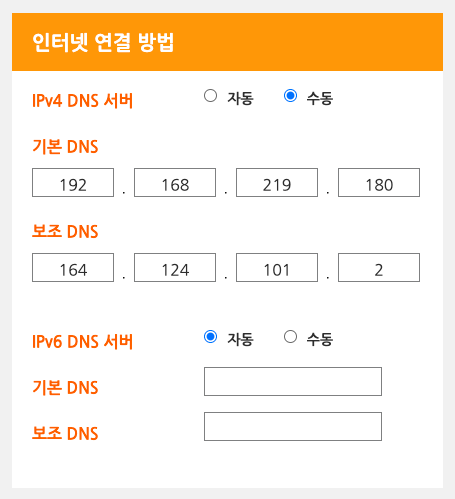
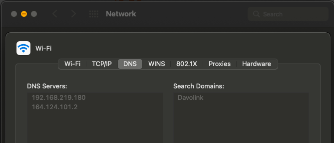

## 시작하며

“반려 서버 키우기”라는 건전한 취미 생활을 본격적으로 시작하기 전에 그 사전 작업 중 하나로 Core DNS를 찍먹해보려한다.

현재 나의 홈랩 상황은 다음과 같다.

- (서버 및 장난감) 라즈베리파이 4대
- (서버 및 장난감) 랩탑 1대
- (서버 관리용) PC 2대
- 핸드폰 2개

즉 나의 반려 서버는 5대, 반려 서버에 접속하는 장비는 4대(PC + 핸드폰) 정도라고 볼 수 있다.

기존에는 매번 사용하는 PC의 `/etc/hosts` 를 편집해서 도메인 네임을 이용하곤 했는데 한 대의 PC로만 접속하는 게 아니라 여러 장비로 서버에 접속하게 될 수 있다보니 매번 /etc/hosts를 편집하는 것이 그닥 유쾌하진 않았고, 심지어 모바일에서는 `/etc/hosts` 를 제어할 수 없어 IP로 직접 접근해야했다.

이에 대해 고민하던 차에 지인으로부터 Core DNS가 그렇게 사용하기 편하다는 얘기를 듣고 한 번 Core DNS를 통해 홈랩에서 사용할 프라이빗한 DNS 서버를 구축해보려한다.

## Core DNS가 그렇게 편한지 Getting Started

Core DNS는 간단히 컨테이너로 띄울 수 있었다.

아무런 Corefile 설정을 정의하지 않는 경우 기본적으로는 [whoami](https://coredns.io/plugins/whoami/) 플러그인을 통해 아주 간단한 fake dns server처럼 동작하는 듯하다. 다음과 같이 정말 간단하게 coredns를 띄울 수 있고, dig를 통해 직접 띄운 core dns가 fake dns server로라도 동작은 하는지 확인해볼 수 있다.

fake dns server는 DNS 질의에 대해 단순히 자기 IP로만 응답하는 그런 dns server라는 의미로 사용한 명칭이다.

```shell
docker run --rm --name coredns -p 53:53/udp coredns/coredns
```

```shell
$ dig @127.0.0.1 -p 53 jinsu.com | grep -C 2 'jinsu\.com'

; <<>> DiG 9.18.1-1ubuntu1.2-Ubuntu <<>> @127.0.0.1 -p 53 jinsu.com
; (1 server found)
;; global options: +cmd
--
; COOKIE: c79167ab937cb4d2 (echoed)
;; QUESTION SECTION:
;jinsu.com.			IN	A

;; ADDITIONAL SECTION:
jinsu.com.		0	IN	A	172.17.0.1
_udp.jinsu.com.		0	IN	SRV	0 0 46738 .

;; Query time: 4 msec
```

docker을 통해 기본 옵션으로 컨테이너를 실행하면 아무 hostname(e.g. [jinsu.com](http://jinsu.com))으로든 쿼리하면 위와 같이 `172.17.0.1` 이 조회된다. `jinsu.com` 을 조회하든 `jinsu.me`를 조회하든 `foo.bar`을 조회하든 결과는 똑같다. whoami plugin만 활성화된 fake dns server이기 때문이다.

(그냥 추가적으로 적어보는 내용) `172.17.0.1` 라는 IP가 낯이 익을 수 있다. 이는 Docker의 bridge network interface의 IP이다.

```shell
$ ifconfig docker0 | grep inet
        inet 172.17.0.1  netmask 255.255.0.0  broadcast 172.17.255.255
        inet6 fe80::42:b9ff:feb4:d995  prefixlen 64  scopeid 0x20<link>
```

```shell
$ docker inspect coredns | jq '.[0]["NetworkSettings"]["Networks"]'
{
  "bridge": {
    "Gateway": "172.17.0.1",
    "IPAddress": "172.17.0.3",
    ...(생략)
  }
}
```

위와 같이 `172.17.0.1` 은 docker의 brige network interface의 IP임을 확인해볼 수 있다. 그리고 `$ docker run` 명령어에 `--net host` 인자를 전달해 bridge network가 아닌 host network을 이용하면 DNS 질의 시 `172.17.0.1` 이 아닌 `127.0.0.1` 를 응답으로 받을 수 있을 것이다. (OSX에서는 동일하게 브릿지 IP인듯 함.)

## configuration을 정의해보기

우선 나의 홈랩 상황과 목표는 다음과 같다.

- 보유한 공유기: LG U+에서 임대해준 평범한 공유기. `192.168.219.0/24` 네트워크를 이용.
- `me.` Zone에 Raspberry Pi 4대, DNS 서버로 사용할 Laptop 1대에 대한 A 레코드를 생성할 것임.
    - 공유기에 연결된 장비로 [laptop.me](http://laptop.me) 혹은 pi20[0-3]\.me (regex) 에 접속했을 때 올바르게 해당하는 장비에 접속할 수 있도록하기.
    - [laptop.me](http://laptop.me) - 192.168.219.180
    - [pi200.me](https://www.notion.so/3a7d41a0b980428a9fef195def5b3b75) - 192.168.219.201
    - …
    - [pi203.me](https://www.notion.so/3a7d41a0b980428a9fef195def5b3b75) - 192.168.219.203
- 코드를 통해 직관적이고 수월하고 멱등적이게 작업할 수 있도록 하기.
    - 추후에 장비가 추가될 때에도 손쉽게 레코드를 추가할 수 있기를 바람.

그럼. Core DNS 설정을 한 번 시작해보겠다.

```shell
mkdir -p ${HOME}/coredns-config
```

`${HOME}/coredns-config` 에 core dns에 대한 설정을 담을 directory를 생성해준다.

```shell
cat <<EOF > ${HOME}/coredns-config/Corefile
.:53 {
  forward . 8.8.8.8
  log
}

me.:53 {
  file /etc/coredns/config/me
  forward . 8.8.8.8
  log
}
EOF
```

Core DNS은 `Corefile` 을 통해 설정해줄 수 있다.

구글의 DNS 서버인 8.8.8.8을 기본적으로 이용하도록 한다.

`me.` Zone은 `/etc/coredns/config/me` 에 정의된 레코드들을 참고하고 거기에 원하는 찾는 도메인 네임이 정의되어있지 않다면 8.8.8.8로 포워드하도록 한다. 완전히 프라이빗한 나만의 TLD를 이용하는 것이 아니라 널리 쓰이는 TLD 중 하나인 `.me` 를 이용하는 이유는 그냥 브라우저 주소창에서 `http://` 혹은 `https://` 를 사용하기 귀찮아서이다. (널리 쓰이는 TLD는 http:// 혹은 https://를 적어주지 않아도 알아서 도메인으로 접속을 시도하는데 나만의 TLD는 구글 검색을 해버림)

```bash
cat <<EOF > ${HOME}/coredns-config/me
\$ORIGIN me.
@       60 IN SOA dns.jinsulab.me dev.umijs.gmail.com. 1 60 60 60 60
@ 60 IN A 192.168.219.180 ; Laptop
laptop 60 IN A 192.168.219.180 ; Laptop
EOF
```

`me.` Zone에 대한 파일을 `${HOME}/coredns-config/me` 경로에 기본적인 내용과 함께 생성했다.

```bash
me_zone_file=${HOME}/coredns-config/me
for id in {200..203}; do
  cat ${me_zone_file} | grep "pi${id}"
  if [[ $? -eq 0 ]]; then
    echo "Record about pi${id} has already exists."
  else
    echo "pi${id} 60 IN A 192.168.219.${id} ; Raspberry Pi (id=${id})" >> ${me_zone_file} && \
    echo "Added a record about pi${id}."
  fi
done; 
```

200~203번 raspberry Pi에 대한 레코드도 zone file에 추가해줬다.

```shell
docker run --rm --name coredns -p 53:53/udp \
  -v ${HOME}/coredns-config:/etc/coredns/config coredns/coredns \
  -conf /etc/coredns/config/Corefile
```

위에서 작성한 설정들을 bind mount 해서 coredns를 실행시켜보자.

```bash
echo -n "laptop.me: "
dig +short @127.0.0.1 -p 53 laptop.me

for id in {200..203}; do
  echo -n "pi${id}.me: "
  dig +short @127.0.0.1 -p 53 pi${id}.me
done;

# Expected output:
laptop.me: 192.168.219.180
pi200.me: 192.168.219.200
pi201.me: 192.168.219.201
pi202.me: 192.168.219.202
pi203.me: 192.168.219.203
```

dig를 통해 조회했을 때 잘 조회되는지 확인해봤다.

위와 같이 응답이 온다면 결과적으로 coredns 서버가 제대로 뜬 것이다!

오호라. 녀석 쓸만하다~ 편하다~!

그럼 이제 우리 공유기를 이용하는 경우 기본적으로 랩탑에 띄운 DNS 서버를 이용하도록 설정해보도록 하겠다.

```shell
docker run --name coredns -p 53:53/udp \
  --restart always -d \
  -v ${HOME}/coredns-config:/etc/coredns/config coredns/coredns \
  -conf /etc/coredns/config/Corefile
```

이제는 계속 이 컨테이너를 홈랩의 DNS 서버로 이용할 것이므로 `--rm` 인자를 지우고 `--restart always -d` 인자를 추가적으로 전달해줬다.

이제 공유기의 설정에서 DNS 서버를 설정해주자. 주 DNS 서버는 랩탑의 core dns 서버로, 부 DNS 서버는 기존에 통신사가 제공해주던 DNS 서버를 이용하려한다.



나는 LG U+가 제공해준 공유기를 그대로 사용중이기 때문에 공유기의 관리자 페이지인 [http://192.168.219.1](http://192.168.219.1) 에 들어가서 설정을 해줘야한다. 앞서 말한대로 랩탑의 주소인 `192.168.219.180` 과 U+의 보조 DNS 주소인 `164.124.101.2` 를 적어줬다. 이상하게도 “유선 네트워크 설정” 탭에만 DNS 설정이 있던데 이 설정이 무선 네트워크에도 동일하게 적용되는 듯하다. (다행..)



끝으로 PC에서는 자신의 DNS 설정이 공유기가 전달해주는 값으로 잘 사용 중인지 확인해본다. 이전에 내가 내 맥북에게 `8.8.8.8` 을 강제한 적이 있었는지 8.8.8.8으로 설정이 고정되어있었고 `/etc/hosts` 에서 레코드 설정을 지웠을 때 도메인 네임을 원활히 이용할 수 없었다. 위와 같이 고정값을 제거해주니 도메인 네임을 잘 이용할 수 있었다.

```bash
for domain in "laptop.me" "pi"{200..204}".me"; do
  ping $domain -c 1
  echo ''
done;

# Expected output:
PING laptop.me (192.168.219.180): 56 data bytes
64 bytes from 192.168.219.180: icmp_seq=0 ttl=64 time=6.245 ms

--- laptop.me ping statistics ---
1 packets transmitted, 1 packets received, 0.0% packet loss
round-trip min/avg/max/stddev = 6.245/6.245/6.245/0.000 ms

PING pi200.me (192.168.219.200): 56 data bytes
64 bytes from 192.168.219.200: icmp_seq=0 ttl=64 time=5.037 ms

--- pi200.me ping statistics ---
1 packets transmitted, 1 packets received, 0.0% packet loss
round-trip min/avg/max/stddev = 5.037/5.037/5.037/0.000 ms

...(생략)

PING pi203.me (192.168.219.203): 56 data bytes
64 bytes from 192.168.219.203: icmp_seq=0 ttl=64 time=4.532 ms

--- pi203.me ping statistics ---
1 packets transmitted, 1 packets received, 0.0% packet loss
round-trip min/avg/max/stddev = 4.532/4.532/4.236/0.000 ms
```

끝으로 실제로 접속이 가능한지도 ping을 통해 확인해봤다. 잘 되는 듯하다.

혹시.. 다른 dns server에게 질의하고서 다른 엔드포인트에게 ping을 날린 것은 아닐까 걱정됐다. 그럴 땐 로그를 확인하면 된다.

```shell
$ docker logs coredns --tail 100 -f

# Exptected output
...(생략)
[INFO] 192.168.219.103:60949 - 45524 "A IN laptop.me. udp 27 false 512" NOERROR qr,aa,rd 52 0.000251775s
[INFO] 192.168.219.103:63828 - 32218 "A IN pi200.me. udp 26 false 512" NOERROR qr,aa,rd 50 0.000233695s
[INFO] 192.168.219.103:52154 - 19774 "A IN pi201.me. udp 26 false 512" NOERROR qr,aa,rd 50 0.000224735s
[INFO] 192.168.219.103:49555 - 29706 "A IN pi202.me. udp 26 false 512" NOERROR qr,aa,rd 50 0.000230596s
[INFO] 192.168.219.103:53338 - 47975 "A IN pi203.me. udp 26 false 512" NOERROR qr,aa,rd 50 0.000225897s
```

로그도 나의 dns server가 잘 동작한다는 것을 보여준다. 🙂 얏호~!

## TODO

앞으로 반려 서버 키우기를 진행하게 되면 몇 가지 수정사항들이 있을 수 있을 것 같고, 그에 맞춰 이 글에도 수정사항들이 반영될 수 있을 것 같다. 예상되는 TODO는 다음과 같다.

- Record 관리 개선 - 현재는 bash script로 레코드를 관리하는 셈인데 Git을 이용하고 자동으로 sync를 맞추든 다른 방안을 찾아보든 하면 좋겠다.
- 공유기 구비 - U+의 기본 제공 공유기로는 기능이 좀 부족한 면이 있다. DNS 서버 뿐만 아니라 공유기 자체도 코딩이 가능한 나만의 장비를 쓰면 좋을 듯한데 그 이유는 각 장치에게 DHCP static lease를 좀 더 잘 해주고싶기 때문이다. 현재는 공유기 관리 페이지에서 장치별로 MAC address에 따라 static lease해주고 있다. 그리고 공유기 설정 뭐만 바꾸면 몇 십초 동안 중단되어버림…
- DNS 서버용 장치 구비 - 현재 CoreDNS가 laptop에 떠있는데 laptop이 뻗는다거나하면 U+의 보조 DNS 서버를 이용하게 된다. 따라서 이건 저렴한 장치(e.g. Raspberry Pi 3)를 DNS server dedicated로 사용하면 어떨까싶다.

## 참고

[https://kimmj.github.io/coredns/configure-dns-server/](https://kimmj.github.io/coredns/configure-dns-server/)  - 완전 처음에 coredns 띄우는 게 얼마나 쉬운지 맛보기용

[https://coredns.io/manual/toc/#configuration](https://coredns.io/manual/toc/#configuration) - core dns 공식 문서

[https://coredns.io/plugins/file/](https://coredns.io/plugins/file/) - coredns의 file plugin

[https://coredns.io/2017/03/01/how-to-add-plugins-to-coredns/](https://coredns.io/2017/03/01/how-to-add-plugins-to-coredns/) - whoami 플러그인 개발 관련

[https://easydmarc.com/blog/what-is-soa-record-in-dns/](https://easydmarc.com/blog/what-is-soa-record-in-dns/) - SOA 를 어떻게 설정해야할지

[https://blog.naver.com/techtrip/222154620404](https://blog.naver.com/techtrip/222154620404) - zone 설정에서 `IN` 이 있어야하는지 없어도 되는지

[https://github.com/carlpett/tfz53/issues/2](https://github.com/carlpett/tfz53/issues/2) - zone file에서 주석 쓰는 방법
