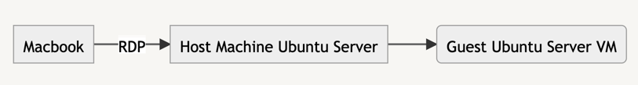
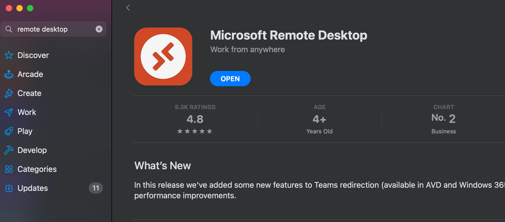
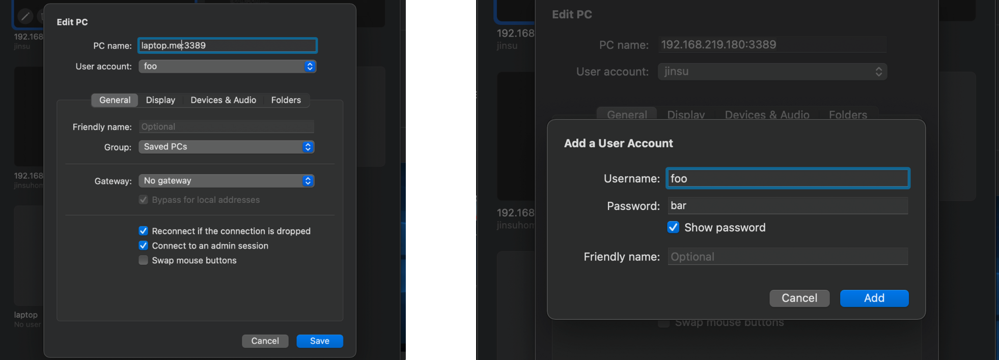
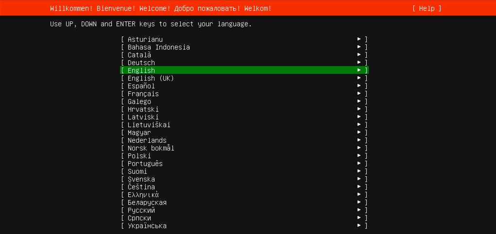
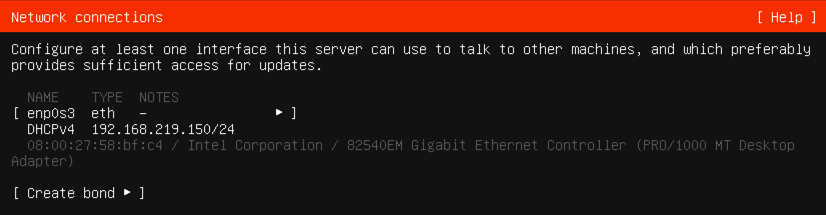

## 시작하며

홈서버를 직접 구성해보면서 실제 기기 개수가 많지 않아 좀 아쉬웠는데 최근에는 이를 VM으로 충당해볼까 싶은 생각이 들기도 했다. 갖고 있는 랩탑 하나에 여러 대의 VM을 띄우면 홈서버에서 좀 더 많은 수의 노드가 있는 것처럼 이용할 수 있지 않을까 싶어 VM을 띄워보기로 했다. 하지만 이번에는 단순히 GUI로 VM을 띄우는 것이 아니라 CLI로 VM을 띄우면서 LV(Logical Volume)을 이용해봤다. 해당 내용을 까먹을까봐 이 글을 통해 한 번 정리해본다.

## 실습 환경

호스트 환경은 아래와 같다.

| 항목   | 정보                  |
|------|---------------------|
| CPU  | amd64, 8 Core       |
| RAM  | 16GB                |
| Disk | 256GB               |
| OS   | Ubuntu server 22.04 |

구성하고자하는 VM은 다음과 같다.

| 항목   | 정보                  |
| --- | --- |
| CPU | amd64, 2 Core |
| RAM | 4GB |
| Disk | 16GB |
| OS | Ubuntu server 22.04 |

우선 내 랩탑의 OS는 Ubuntu server 22.04이기에 기본적으로 GUI 프로그램은 아예 실행이 안된다. 따라서 VirtualBox GUI는 이용할 수 없었고 VBoxManage라는 CLI 프로그램을 사용했다.

이번에 만들어볼 것은 Host machine의 Linux LV(Logical Volume)을 본인(VM)의 디스크 장치로 이용하는 VM이다.

굳이 LV를 이용하고자 했던 이유는 호스트 머신의 OS를 완전히 다시 설치하더라도 VM의 데이터는 보존되길 바랬기 때문이다. 사실 이렇게까지 할 필요는 딱히 없었는데 요즘 볼륨이나 마운트쪽이 궁금해져 이렇게 작업해봤다.

## LV 생성하기

```shell
$ lsblk
NAME                      MAJ:MIN RM   SIZE RO TYPE MOUNTPOINTS
...(생략)
sda                         8:0    0 238.5G  0 disk
├─sda1                      8:1    0     1G  0 part /boot/efi
├─sda2                      8:2    0     2G  0 part /boot
└─sda3                      8:3    0 235.4G  0 part
  └─ubuntu--vg-ubuntu--lv 253:0    0   100G  0 lvm  /

$ sudo pvs
  PV         VG        Fmt  Attr PSize   PFree
  /dev/sda3  ubuntu-vg lvm2 a--  235.42g 135.42g

$ sudo vgs
  VG        #PV #LV #SN Attr   VSize   VFree
  ubuntu-vg   1   1   0 wz--n- 235.42g 135.42g

$ sudo lvs
  LV        VG        Attr       LSize   Pool Origin Data%  Meta%  Move Log Cpy%Sync Convert
  ubuntu-lv ubuntu-vg -wi-ao---- 100.00g
```

- sda라는 디스크 장치에 sda1, sda2, sda3라는 Physical Volume이 존재함.
- ubuntu-vg라는 Volume Group은 sda3라는 Physical Volume으로 구성됨.
- ubuntu-vg라는 Volume Group 아래에는 ubuntu-lv라는 Logical Volume이 존재함.

`lsblk` 로 랩탑의 디바이스 정보를 출력해본 내용은 위와 같다.

앞으로 만들 vm1이라는 VM에게 ubuntu-vg(sda3)에 남는 135.4G 중 16GB를 Logical Volume으로 할당해줄 것이다. 따라서 LV를 만들어주자.

```shell
$ sudo lvcreate -n vm1-disk -L 16G ubuntu-vg
  Logical volume "vm1-disk" created.

$ sudo lvs
  LV        VG        Attr       LSize   Pool Origin Data%  Meta%  Move Log Cpy%Sync Convert
  ubuntu-lv ubuntu-vg -wi-ao---- 100.00g
  vm1-disk  ubuntu-vg -wi-a-----  16.00g
```

vm1이 Disk로 사용할 LV가 잘 만들어진 모습이다. 포맷하며 파일시스템을 설정해줘야하려나 싶었는데 딱히 그렇지는 않고 그냥 바로 VirtualBox가 사용하도록 해줄 수 있는 듯하다.

## 이미지 준비하기

```shell
sudo apt update
sudo apt install -y virtualbox virtualbox-ext-pack
```

우선 이제 슬슬 virtualbox가 필요할 것이기에 virtualbox를 설치해준다. ext-pack은 extension인데 학습할 때에는 웬만하면 있는 게 좋을 것이다. 아마 잠시 후 RDP(Remote Desktop Protocol)라는 프로토콜을 이용할 때에도 ext-pack이 있어야할 것이다.

```shell
sudo su
alias vb=VBoxManage
```

이제부터는 많은 명령어들이 root 권한을 필요로 할 것이다. 따라서 대부분의 작업을 root로 수행할 것이다.

그리고 vboxmanage라는 커맨드가 상당히 마음에 들지 않아서 나는 `vb` 라는 alias를 이용했다.

```shell
# vb internalcommands createrawvmdk \
    -filename vm1-disk.vmdk \
    -rawdisk /dev/ubuntu-vg/vm1-disk
RAW host disk access VMDK file vm1-disk.vmdk created successfully.
```

internal command를 이용해 호스트의 디스크 전체를 사용하는 VMDK 이미지를 `vm1-disk.vmdk` 생성했다. 생성되는 `.vmdk` 파일의 크기는 몇 백 바이트 정도로 상당히 작은데, 이 파일 자체가 데이터를 담는 것은 아니고 그냥 어떻게 호스트의 디스크(현재의 경우 vm1-disk)를 이용할 지에 대한 설정만 존재할 뿐이라서 그런 듯하다. 참고로 `cat` 을 통해 내용을 확인해볼 수도 있다.

```shell
curl -LO https://mirror.kakao.com/ubuntu-releases/22.04/ubuntu-22.04.1-live-server-amd64.iso
```

그리고 이제 Ubuntu Server 22.04에 대한 .iso 이미지 파일을 다운로드 해준다. 카카오의 미러링 페이지를 이용하면 와이파이로도 빠른 경우 약 30초만에 다운로드가 가능하다. 이 이미지는 설치용 이미지이다.

이제 이미지 준비는 완료 됐다 🙂

## VBoxManage(VirtualBox CLI)를 통해 VM 생성하기

```shell
mkdir -p vbox
```

현재의 로컬 경로에 virtualbox vm이 base folder로 사용할 디렉토리를 만들어준다. 사실 글 초반에 적은 취지에 맞추려면 이 경로도 별도의 볼륨쪽이면 좋을 듯하긴한데 일단은 그냥 `/root/vbox` 로 이용하려한다.

```shell
# vb createvm --name vm1 \
    --basefolder=/root/vbox \
    --ostype=Ubuntu_64 \
    --register
Virtual machine 'vm1' is created and registered.
UUID: 8ad1ab2c-1e7d-4e22-b65c-51ff7cacfc25
Settings file: '/root/vbox/vm1/vm1.vbox'
```

VM이 생성됐다고 한다! 하지만, VM을 실행하기 전에 몇 가지 설정을 더 해줘야한다.

아직 우리는 앞서 만든 image들을 mount하지도 않았기 때문이다.

```shell
# vb storagectl vm1 \
    --name "SATA Controller" \
    --add sata --bootable on

# vb storageattach vm1 \
    --storagectl "SATA Controller" \
    --port 0 --device 0 \
    --type dvddrive \
    --medium ubuntu-22.04.1-live-server-amd64.iso

# vb storageattach vm1 \
    --storagectl "SATA Controller" \
    --port 1 --device 0 --type hdd \
    --medium /root/vm1-disk.vmdk
```

SATA라는 Hard Disk Controller을 추가해준 뒤 생성해뒀던 `vm1-disk.vmdk` (16GB짜리 LV 관련) 이미지를 HDD로서 추가해준다.

그리고 bridge network를 통해 host와 같은 네트워크를 이용할 수 있게끔할 것이다.

```shell
# ip addr show wlp2s0
2: wlp2s0: <BROADCAST,MULTICAST,UP,LOWER_UP> mtu 1500 qdisc noqueue state UP group default qlen 1000
    link/ether 20:16:b9:9b:55:1e brd ff:ff:ff:ff:ff:ff
    inet 192.168.219.180/24 metric 600 brd 192.168.219.255 scope global dynamic wlp2s0
       valid_lft 13790sec preferred_lft 13790sec
    inet6 fe80::2216:b9ff:fe9b:551e/64 scope link
       valid_lft forever preferred_lft forever

# vb modifyvm vm1 --nic1 bridged --bridgeadapter1 wlp2s0
```

내 경우에는 `wlp2s0` 라는 와이파이 네트워크 인터페이스에 bridge 할 수 있도록 설정했다.

```shell
# vb modifyvm vm1 --memory 4092 \
    --cpus 2
```

앞서 언급한 대로 Memory는 4GB, CPU는 2 Core로 설정했다.

이제 거의 다 왔다.

하지만 일반적인 GUI에서 VirtualBox를 통해 VM을 실행했을 때와 달리 나의 호스트 머신의 OS는 Ubuntu Server이기 때문에 나는 설치 이미지로 VM을 시작했을 때 VM의 화면을 볼 수 없다.

만약 Cloud image를 이용하거나 Auto installation 설정을 잘 해뒀다면 화면 없이 어떻게 어떻게 알아서 OS를 설치하고 설정한 Bridge adapter을 이용해 DHCP해서 네트워크에 조인하고 SSH 서버가 켜질 수 있을 것이다. 이렇게 되면 GUI 없이 Host machine 및 같은 네트워크 장비에서 SSH로 접속할 수 있는 게 맞긴하다.

하지만 지금 이용 중인 Ubuntu server 이미지는 Cloud image도 아니고 우리는 별도로 Auto installation 설정을 한 것도 아니기에 Display 장치를 통해 화면을 보면서 키보드로 설치를 진행해야할 것이다.

이때 사용할 수 있는 것이 RDP(Remote Desktop Protocol)이라는 기술이다. 자세한 내용은 따로 찾아보는 걸로하고 여기선 간단히 정리하자면 그냥 Remote에서 VM의 화면을 보면서 입출력을 할 수 있는 기술을 의미한다. 나의 경우 같은 공유기 아래의 맥북에서 RDP 접속을 통해 Ubuntu Server 호스트의 Ubuntu Server Guest(VM)의 설치를 진행할 수 있었다.



위의 그림과 같이 맥북을 통해 호스트 머신에 RDP로 접속하면 Guset에 연결될 수 있을 것이다.



RDP를 이용하기 위해선 클라이언트 프로그램이 필요할 것이다.

OSX에서는 remote desktop 클라이언트로 Microsoft Remote Desktop이 가장 좋은 듯했다. 나머지는 유료거나 자기들이 개발한 자체 프로토콜 or http 등을 이용하는 것 같았다.

RDP 프로토콜에서 인증이 필수는 아닐 것 같은데 아쉽게도 이 훌륭한 클라이언트의 단점이 하나 있다면 인증이 강제되는 것 같다는 것이다.

따라서 VM에 RDP 설정을 켜고, 인증을 활성화 해야한다.

```bash
# export VRDE_USERNAME=foo
# export VRDE_PASSWORD=bar
```

위와 같이 RDP 인증에 사용할 username, password를 설정해준다. 이후 커맨드에서 사용하게 될 환경변수이다. 그냥 VRDE는 VirtualBox에서 RDP를 부르는 말 정도로만 알고 넘어가도 될 듯하다.

```shell
# vb setproperty vrdeauthlibrary VBoxAuthSimple

# vb modifyvm vm1 --vrde on \
    --vrdeport 3389 \
    --vrdeauthtype external

# export PASSWORD_HASHED=$(vb internalcommands passwordhash $VRDE_PASSWORD | \
    sed 's/^Password hash: //')

# vb setextradata vm1 \
    VBoxAuthSimple/users/$VRDE_USERNAME $PASSWORD_HASHED
# vb getextradata vm1 enumerate | \
    grep "VBoxAuthSimple/users/$VRDE_USERNAME"
```

좀 복잡하긴한데 쉽게 요약하면 그냥 RDP 인증을 VBoxAuthSimple이라는 방식을 통해 진행하겠다는 거고 그를 위한 username, password를 설정하는 작업이다.

좀 더 자세히 설명하자면 다음과 같다.

```shell
# vb internalcommands passwordhash $VRDE_PASSWORD
Password hash: fcde2b2edba56bf408601fb721fe9b5c338d10ee429ea04fae5511b68fbf8fb9
```

password를 설정하기 위해 password를 해시하는 커맨드이다. plain password를 그대로 설정하지 않고 한  번 미리 해시한 뒤에 그 값을 전달해줘야한다.

```shell
# vb getextradata vm1 enumerate | \
    grep "VBoxAuthSimple/users/$VRDE_USERNAME"
Key: VBoxAuthSimple/users/foo, Value: fcde2b2edba56bf408601fb721fe9b5c338d10ee429ea04fae5511b68fbf8fb9
```

extradata를 조회해봄으로써 `foo` 라는 유저의 해쉬된 패스워드 값을 확인해볼 수 있다.

이 값이 조회되지 않으면 인증 설정이 제대로 적용되지 않은 것이다.

```shell
# vb startvm vm1 --type headless
```

드디어! vm을 시작할 때가 됐다. `--type headless` 인자를 주게 되면 VM의 화면을 바로 GUI로 띄우지 않고 headless mode로 시작한다. GUI로 띄우기 위한 도구들이 호스트에 제대로 설치되어있지 않다면 에러가 날 것이고 나의 랩탑 또한 거의 순정 상태의 Ubuntu server였기 때문에 headless mode로 시작해야만 했다.



RDP Client(e.g. Microsoft Remote Desktop)에서 위와 같이 설정해주면 될 것이다.





🎉 RDP를 통해 성공적으로 연결되면 이렇게 설치 화면을 볼 수 있을 것이다!

와우.. 드디어 VBoxManage로 VM을 띄우는 데에 성공했다. 호스트의 공유기에 붙은 인터페이스를 브릿지 어댑터로 설정하니 호스트와 같이 공유기에 DHCP로 IP를 할당받는 것도 성공한 모습이다.


설치가 완료된 뒤 RDP로 연결된 화면에서 몇 가지 명령어를 사용해봤다. 🙂 설치가 완료되면 이제 RDP는 굳이 사용하지 않아도 된다. 기본적으로 같은 네트워크의 어떤 장비에서든 설치 시에 입력한 username, password로 SSH 접속이 가능할 것이다. 예를 들면 다음과 같이 말이다.


👆 같은 네트워크의 맥북에서 VM에 SSH 접속을 해서 아무 명령어나 실행해본 예시

```bash
# vb controlvm vm1 poweroff

# vb storageattach vm1 \
    --storagectl "SATA Controller" \
    --port 0 --device 0 \
    --medium none

# vb storageattach vm1 \
    --storagectl "SATA Controller" \
    --port 1 --device 0 \
    --medium none

# vb storageattach vm1 \
    --storagectl "SATA Controller" \
    --port 0 --device 0 --type hdd \
    --medium /root/vm1-disk.vmdk

# vb startvm vm1 --type headless
```

그리고 이제 설치가 완료됐으니 더 이상 설치용 이미지인 `ubuntu-22.04.1-live-server-amd64.iso` 를 dvddrive로 붙여줄 필요도 없다. 꼭 해야하는 작업은 아니긴하지만 `--medium none` 을 통해 장치들을 모두 연결 해제한 뒤 그냥 `.vmdk` 를 0번 포트에 연결해줄 수 있다. 

## 배운 것, 얻은 것

- PV, VG, LV 등 Linux의 LVM(Logical Volume Manager)의 개념을 접해볼 수 있었다.
- ‘VirtualBox의 모든 기능을 VBoxManage로 사용할 수 있구나’싶었다.
- RDP, VRDE라는 개념을 접해볼 수 있었다.
- Bridge Adapter, NAT, NAT Network, Host only 등 VirtualBox에서 사용하는 네트워크 형태를 한 번 더 경험해볼 수 있었다.

## 글에서 다룬 내용 외에 더 해볼 만한 것

- cloud-init 볼륨을 통한 auto installation - cloud-init이라는 방식을 이용하면 직접 설치 과정을 하나 하나 진행할 필요 없이 설치와 초기 설정을 자동화 할 수 있다.
- Live 이미지가 아닌 Cloud image 이용하기 - Cloud image를 이용하면 auto install하는 게 기본 설정인듯 함. 좀 더 손쉽게 auto install할 수 있는 느낌이랄까.
- PXE 네트워크 부팅
- qemu, lima 등 다른 가상화 도구를 통해 VM을 이용해보기
- 원하는 다양한 네트워크 토폴로지 구성해보기

## 마치며

며칠 전에 VirtualBox로 VM을 만들 때 Ubuntu server에서 CLI인 VBoxManage로 만들어보겠다고 꽤나 많은 삽질을 했었다. 뿐만 아니라 요즘 pxe, qemu, bridge interface, kubespray 등등으로 인해 많은 삽질이 계속되고 있었다. 본업은 본업대로 하고 퇴근 후에 취미로 공부하다보니 시간이 많지 않다보니 계속 삽질만 하고 배운 내용을 복습/정리하지 못한 것 같아서 한 번 정리해봤다.

LVM, IDE와 SATA의 차이, RDP라는 새로운 프로토콜, img와 iso, 등등… 많은 새로운 개념 혹은 들어만 봤던 개념들을 직접 이용해보려하니 GUI에서는 정말 쉬웠던 작업을 진행하는 데에 많은 삽질이 수반됐다.

다음에는 qemu로 VM 띄우는 내용을 작성해볼까하는데 시간이 될지는 모르겠다 화이팅..! 💪
