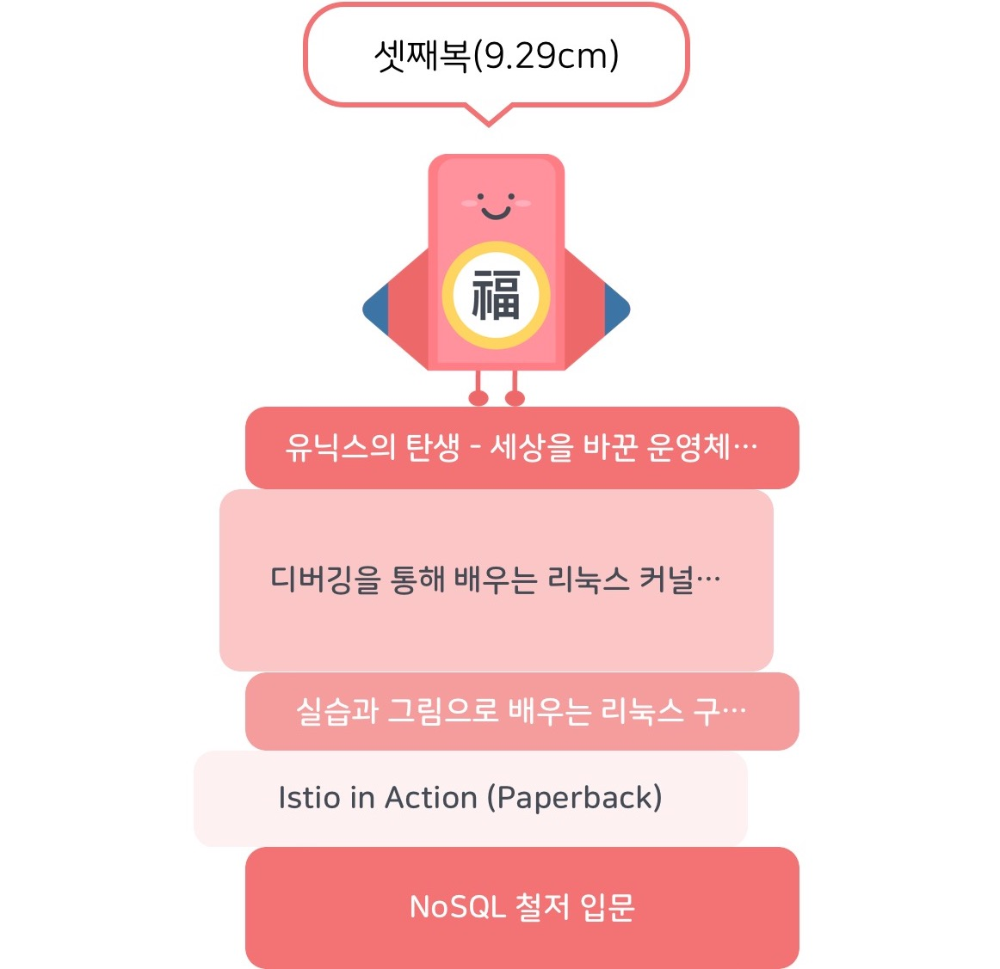

## 시작하며

얼마 전 리눅스 커널의 동작을 설명하는 책을 읽고나니 살짝 내가 매일 사용하는 리눅스는 어떻게 탄생하게 된 걸지 궁금해졌었다.
회사에서 저녁을 먹고 나오는 길에 우연히 사내 책장에서 "유닉스의 탄생"이라는 책을 발견하게 됐고, 그 책을 읽어봤다.

## 책에 담긴 내용 간단히 정리

AT&T라는 미국의 회사 내에 존재했던 벨 연구소에서 어떻게 UNIX라는 운영체제가 탄생하게 되었는지 들어볼 수 있었다.

컴퓨터와 운영체제의 역사에 길이 남을 켄 톰슨, 데니스 리치, 더글라스 매클로이 등의 인물들에 대해서도 자연스레 알게 됐다.

'UNIX는 이러 이러한 기술적인 원리를 바탕으로 발명되었다.'와 같은 기술적인 내용보다는 당시 AT&T와 벨 연구소는 어떤 상황이었고, 어떤 문화를 가지고 있었는지
구성원들은 누가 있었고 각자는 어떤 특징이 있었는지 등과 같은 좀 더 서사적인 내용을 다룬다. 

인간은 1800년대에는 전기를 발견했고 이후 한참의 시간이 흐른 뒤에야 컴퓨터다운 컴퓨터가 탄생하기 시작했는데 책을 읽으면서 새삼 '아... 컴퓨터는 정말 발전한 지 얼마 안됐구나.
발명된 이후로 정말 빠르게 발전해왔구나'라는 생각이 들곤 했다. 강하게 자연을 바탕으로하는 다른 과학 분야와 달리 컴퓨터는 비교적 자연 현상에 의존성이 덜한 분야인듯하다.
예를 들어 물리학과 관련된 '질량이 있는 물체는 왜 서로 끌어당길까?'에 대해 생각해보면, 누군가가 그렇게 법칙을 정했기 때문이 아니라 그냥 자연이 그러한 것이다.
반면, 컴퓨터와 관련된 많은 물음은 보통 누군가가 그렇게 설계하고 구현했기 때문인 경우가 많은 듯하다. 예를 들어 '컴퓨터는 왜 부팅 시에 부트로더를 메모리에 로드하는가?' 'Git은 왜 이렇게 버전을 기록하는가?' 이런 물음에 대한 답은 아마 인간들끼리 그렇게 설계하고 구현했기 때문이지 자연현상이 그렇기 때문은 아닐 것이다.

어쨌든 말하고 싶었던 요지는 평소에는 무의식중에 '컴퓨터는 그냥 원래부터 이래.'라고 생각했던 많은 부분들이
사실 몇십년도 채 되지 않은 과거에 몇몇 연구자들에 의해 그렇게 구현됐기 때문이었다라는 것을 깨달을 수 있었다는 것이다.

또한 내겐 지금도 너무나 어려운 리눅스인데 이 리눅스의 뿌리라고 볼 수 있는 유닉스가 신기하게도 사실은 멀틱스라는 복잡한 시스템의 축소판 같은 것이었다는 걸 처음 알게 되었다.

2020년대의 소프트웨어 업계에서도 먹힐만한 철학이나 가이드라인 등이 당시에도 존재했다는 점도 참 놀라웠고 공감가는 부분들이 종종 존재했다.
예를 들어 나는 데브옵스 엔지니어로 근무하게 되면서 이전보다 쉘이나 grep, sed, diff, awk등의 프로그램도 더 많이 사용하게 됐는데 이런 프로그램을 사용하면서
'어쩜 이렇게 stdin, stdout을 센스있게 파이프할 수 있도록 개발한 거지?', '어쩜 이렇게 서로 연동이 잘 되지?'라는 생각이 들곤 했다. 알고 보니 이런 프로그램은 개발하던 시기부터도
이러한 유연한 사용을 위해 많은 고민과 노력을 했으며 파이프라는 개념으로 이를 해결하곤 했던 것 같다. 또한 이 당시에 그들이 가졌던 자동화에 대한 관점도
요즘의 데브옵스 문화, SRE 업무에도 어느 정도 유용할 수 있을 것 같았다.

sed, grep, diff, awk 등의 프로그램을 개발했던 이야기를 들으면서 그 당시에도 벌써 유용한 소프트웨어 개발 철학이나 가이드라인 같은 게 존재했다는 것도 놀라웠다.
이런 

그외에도 BSD는 뭔지, GNU는 뭔지, USENIX라는 단체는 어떤 단체인지, 리눅스는 어떻게 탄생하게 됐는지 등에 대해서도 조금 알아볼 수 있는데 이런 내용은 꼭 이책이 아니라도
흔하게 얻을 수 있는 지식이긴 할 것 같아서 엄청 신선하게 느껴지는 않았다.

## 장단점

### 장점

* 일반적인 구글링이나 다른 책을 통해서는 얻을 수 없는, 유닉스가 개발되던 그 시대에 그 곳에 존재했던 저자의 이야기를 들어볼 수 있다.
  * 앞서 말한 sed, grep, diff, awk 등의 프로그램을 개발하면서 그들이 가졌던 철학, 그런 프로그램들이 어떠한 니즈에 의해 개발되게 되었는지 등은 흔하게 들을 수 있는 이야기는 아닐 것이다.
* 유닉스의 탄생 역사를 알아볼 수 있다.
* 유닉스의 역사에서 빼놓을 수 없는 위인들과 살짝 친해져볼 수 있다.

### 단점

* 딱히 없다. 약간은 재미없고 불필요해보이는 이야기들도 포함되어있다 정도..? 이런 부분은 그냥 슥슥 넘기는 게 나은 것 같다.
  * 저자의 개인적인 회상이나 (그닥 재미없는) 유머가 꽤 포함되어있다.
  * AT&T나 벨 연구소의 경영 관련 이야기도 꽤 포함되어있다.

## 마치며

최근 커널책을 읽으면서 그리고 홈랩 구축 관련해서 이런 저런 삽질을 하면서 살짝 어지러웠는데 비교적 가벼우면서도 독특한 내용을 담고있는 이 책을 읽으니
부담감이 적고 약간 힐링이 되는 기분이었다. 2022년에 책을 한 권 더 읽게 될 줄은 몰랐는데 우연히 이렇게 한 권 더 읽게 됐다.

내가 당연하게만 여겼던 것들에 대해 한 번 더 생각해볼 수 있었던 부분들이 이 책에는 여럿 존재했고 이 책은 내게 건강하고 신선한 자극이 되어줬다.
예를 들어 나는 인공지능과 같은 특정 영역을 제외하면 많은 알고리즘을 숙지하고 컴퓨터로 풀어내는 능력이 개발과 큰 관계가 없다고 생각하는 편이었다.
하지만 diff 같은 도구의 케이스를 보니 알고리즘을 바탕으로 꼭 인공지능과 같은 영역이 아니라도 유용한 도구를 발명해낸 사례들이 많이 존재한다는 것을 알게 되었다.
그외에도 개발이나 자동화 관련해 이런 저런 자극을 받을 수 있었던 것 같다.
