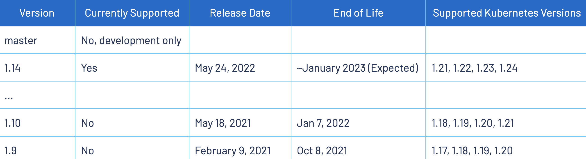
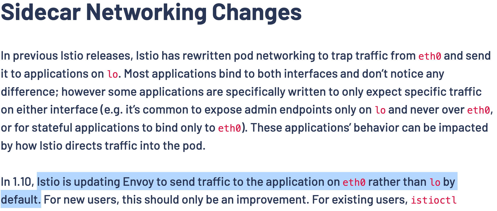
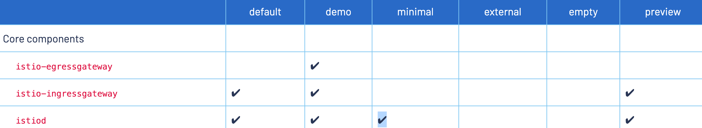

## 시작하며

요즘 istio를 공부하던 중 istio가 변화해온 과정에 대해서도 흥미가 생겨 지난 버전들의 릴리즈 노트들도 읽어보고 있습니다. 그러던 중 현 시점(2022년 7월)에는 이미 공식적인 End of Life가 지난 **2021년 3월 처음 릴리즈된 istio 1.10의 릴리즈 노트를 보다가 재미있는 점을 하나 발견**할 수 있었는데요.

바로 **envoy proxy가 `eth0`에 대한 요청을 넘겨주는 container의 network interface가 `lo` 에서 `eth0` 로 변경되었다**는 점입니다. 네트워크에 대해, 그 중에서도 특히 네트워크 인터페이스에 대해 잘 몰랐던 때에는 이 변경사항에 그닥 관심이 안 갔을 것 같은데 최근 네트워크 인터페이스에 대해 공부를 해서인지 이 변경사항에 관심이 갔습니다.

그래서 이번 글에서는 네트워크 인터페이스와 관련된 `istio` `1.9` → `1.10`의 변경사항을 실제 작업을 통해 확인해보려합니다. 실제 작업은 다음과 같습니다.

- **istio 1.9** - 서버를 `lo` (루프백 인터페이스)의 IP(127.0.0.1)로 띄운 경우 Service에 요청을 보내 성공적인 응답을 받을 수 있음을 확인
- **istio 1.9** - 서버를 `eth0` 의 IP로 띄운 경우 Service에 요청을 보내도 요청이 제대로 전달되지 않음을 확인
- **istio 1.10** - 서버를 `lo` (루프백 인터페이스)의 IP(127.0.0.1)로 띄운 경우 Service에 요청을 보내도 요청이 제대로 전달되지 않음을 확인
- **istio 1.10** - 서버를 `eth0` 의 IP로 띄운 경우 Service에 요청을 보내 성공적인 응답을 받을 수 있음을 확인



`k8s` 버전은 istio 1.9와 istio 1.10 모두와 호환되는 k8s `1.20` 을 이용할 것이고 k8s는 `minikube`를 통해 로컬에서 구성할 것입니다.

⚠️ 참고로 M1 맥북의 minikube에선 envoy proxy가 동작하지 않아서인지 istio를 제대로 이용할 수 없습니다. 따라서 저는 ubuntu에서 minikube를 통해 작업했습니다.

## istio 1.9 → 1.10 변경사항 중 재미있는 점



(참고: [https://istio.io/latest/news/releases/1.10.x/announcing-1.10/](https://istio.io/latest/news/releases/1.10.x/announcing-1.10/))

1.10 버전의 변경사항에 대해 좀 더 자세히 알아보겠습니다. 이전 버전에서는 Sidecar Envoy Proxy가 `eth0`으로 들어온 요청을 `lo`로 넘겨줘왔는데 이번 버전(1.10)에서부터는 `eth0`로 들어온 요청을 eth0로 넘겨준다는 것입니다.

대부분 서버를 띄울 때 `0.0.0.0`을 통해 loopback interface와 ethernet interface 모두에 서버를 띄우는 경우가 많아 해당 내용이 큰 변화를 가져오진 않을 수 있습니다.

하지만 만약 기존에 특정 interface의 IP만을 지정해서 서버를 띄우는 경우가 있었다면 이 변경사항으로 인해 통신 장애가 발생할 수 있습니다.

- loopback interface의 IP로만 서버를 띄운 경우 → `eth0`로 보낸 요청을 sidecar를 거쳐 `lo`가 받을 수 있던 컨테이너가 요청을 받을 수 없어짐.
- eth0 interface의 IP로만 서버를 띠운 경우 → `eth0`로 보낸 요청을 sidecar를 거쳐 여전히 `eth0`가 요청을 받을 수 있어짐.

**이러한 변경 사항이 추가된 이유는?**

On-premise나 non-k8s 환경에서는 보통 `lo` 에 서버를 띄우는 경우는 외부에서의 접속을 막으려는 경우일 것입니다. 반면 `eth0` 에 서버를 띄우는 경우는 외부에서의 접속을 허용하려는 경우일 것입니다.

하지만 이전에는 이러한 기존 환경에서 istio를 도입하게 되면 기존의 의도와 반대되게 오히려 `lo` 에 서버를 띄운 경우 오히려 envoy sidecar에게 요청을 전달받을 수 있어지고, `eth0` 에 서버를 띄운 경우는 오히려 enovy sidecar에게 요청을 전달받을 수 없었던 모순된 상황이 발생했다고 합니다.

따라서 이러한 모순된 상황들을 방지하고자 이러한 변경사항이 추가되었다고 합니다.

## minikube를 통해 k8s 1.20.15 환경 구축하기

```bash
$ minikube start --profile k8s-1-20 --kubernetes-version 1.20.15
```

위의 명령어를 통해 특정 k8s 버전(1.20.15)의 환경을 로컬에 구축할 수 있습니다.

## k8s에 istio 1.9와 1.10 설치하기

istioctl을 통해 두 버전의 istio를 k8s cluster에 배포해줄 것입니다.

istioctl의 버전에 맞게 istio가 설치되기 때문에 그때 그때 편리하게 istioctl의 버전을 변경해야합니다. 따라서 저는 [asdf](https://github.com/asdf-vm/asdf)라는 도구를 사용했습니다. 스타 수는 적지만 [asdf의 istioctl plugin](https://github.com/virtualstaticvoid/asdf-istioctl)을 이용하기도 했습니다.



참고: [https://istio.io/latest/docs/setup/additional-setup/config-profiles/](https://istio.io/latest/docs/setup/additional-setup/config-profiles/)

istioctl을 통해 istio를 클러스터에 배포할 때에는 미리 정의되어있는 profile이라는 것을 이용해 좀 더 편리하게 설정을 해줄 수 있습니다. 이번 작업에서 gateway들은 필요 없기 때문에 저는 minimal profile을 통해 설치해주겠습니다.

```bash
asdf plugin-add istioctl https://github.com/virtualstaticvoid/asdf-istioctl.git && \
asdf install istioctl 1.9.9 && \
asdf install istioctl 1.10.6
```

위의 명령어를 통해 istioctl 1.9.9와 1.10.6 두 버전을 모두 설치할 수 있습니다.

```bash
$ asdf global istioctl 1.9.9 && istioctl version
no running Istio pods in "istio-system"
1.9.9
```

istioctl 1.9.9를 이용하도록 설정합니다.

```bash
istioctl install --set profile=minimal --set revision=1-9 --set values.global.proxy.holdApplicationUntilProxyStarts=true
! values.global.proxy.holdApplicationUntilProxyStarts is deprecated; use meshConfig.defaultConfig.holdApplicationUntilProxyStarts instead
! Istio is being downgraded from 1.9.0 -> 1.9.9.This will install the Istio 1.9.9 minimal profile with ["Istio core" "Istiod"] components into the cluster. Proceed? (y/N) y
✔ Istio core installed
✔ Istiod installed
✔ Installation complete
```

istio 1.9.9를 `1-9`라는 revision으로 깔아줍니다.

`values.global.proxy.holdApplicationUntilProxyStarts`와 `meshConfig.defaultConfig.holdApplicationUntilProxyStarts`는 envoy proxy가 준비된 뒤에
우리가 정의한 실제 컨테이너를 시작하는 옵션입니다. 전자는 Deprecated 되었다고 경고가 뜨지만 적용해본 결과 1.9 버전 대에서는 여전히 전자를 사용하는 것 같더라구요.
따라서 저는 1.9.9 버전에서는 전자의 인자를, 1.10.6 버전에서는 후자의 인자를 적용해주었습니다.

만약 envoy proxy가 완전히 준비되기 전에 다른 컨테이너에서 네트워크 작업을 수행하면 해당 작업은 성공적으로 수행되지 않을 것입니다.  

```bash
$ asdf global istioctl 1.10.6 && istioctl version
client version: 1.10.6
control plane version: 1.9.9
data plane version: none
```

istioctl 1.10.6을 이용하도록 설정합니다.

```bash
$ istioctl install --set profile=minimal --set revision=1-10 --set meshConfig.defaultConfig.holdApplicationUntilProxyStarts=true
WARNING: Istio is being upgraded from 1.9.9 -> 1.10.6.
WARNING: Before upgrading, you may wish to use 'istioctl analyze' to check forIST0002 and IST0135 deprecation warnings.
This will install the Istio 1.10.6 minimal profile with ["Istio core" "Istiod"] components into the cluster. Proceed? (y/N) y
✔ Istio core installed
✔ Istiod installed
✔ Installation complete                                                      Thank you for installing Istio 1.10.  Please take a few minutes to tell us about your install/upgrade experience!  https://forms.gle/KjkrDnMPByq7akrYA
```

istio 1.10.6을 `1-10`이라는 revision으로 깔아줍니다.

워닝이 떠있긴 하지만 그닥 상관은 없습니다.

```bash
$ kubectl get pod -n istio-system
NAME                           READY   STATUS    RESTARTS   AGE
istiod-1-10-5cd4d5b44d-b98xm   1/1     Running   0          84s
istiod-1-9-6b549b9d87-9f76b    1/1     Running   0          2m56s
```

잘 깔렸다면 위와 같이 Pod들이 성공적으로 떴을 것입니다.

## istio sidecar가 injected된 netcat server & client Pod 배포하기

이제 netcat server이자 client가 될 Pod 들을 배포해줄 것입니다.

배포할 리소스들은 모두 다음과 같습니다.

- **Namespace rev-1-9** - istio 1.9의 sidecar inject를 받을 Namespace
- **Namespace rev-1-10** - istio 1.10의 sidecar inject를 받을 Namespace
- **Pod netcat-client** - `default` Namespace에서 각 Service를 통해 netcat 요청을 날려줄 client
- **Pod netcat-lo** - `lo` 인터페이스의 IP 에 netcat 서버를 띄우는 Pod.
- **Pod netcat-eth0** - `eth0` 인터페이스의 IP에 netcat 서버를 띄우는 Pod.
- **Service lo** - `lo` 인터페이스의 IP에 netcat 서버를 띄운 Pod를 노출시켜줄 Service
- **Service eth0** - `eth0` 인터페이스의 IP에 netcat 서버를 띄운 Pod를 노출시켜줄 Service

**(netcat 서버 Pod는 8080 포트에 요청이 TCP 커넥션이 형성되면 “pong”으로 응답하는 Pod입니다.)**

```yaml
apiVersion: v1
kind: Namespace
metadata:
  labels:
    istio.io/rev: 1-9
  name: rev-1-9
---
apiVersion: v1
kind: Namespace
metadata:
  labels:
    istio.io/rev: 1-10
  name: rev-1-10
---
apiVersion: v1
kind: Pod
metadata:
  namespace: default
  name: netcat-client
spec:
  containers:
  - image: ubuntu:22.04
    command:
      - "/bin/bash"
      - "-c"
    args:
    - |
      apt update && apt install -y ncat
      while true;
      do sleep 60;
      done;
    imagePullPolicy: IfNotPresent
    name: netcat-client
  restartPolicy: Always
---
apiVersion: v1
kind: Pod
metadata:
  namespace: rev-1-9
  name: netcat-lo
  labels:
    app: rev-1-9-lo
spec:
  containers:
  - image: ubuntu:22.04
    command:
      - "/bin/bash"
      - "-c"
    args:
    - |
      apt update && apt install -y net-tools ncat
      ifconfig eth0 | grep 'inet ' | awk '{print $2}'
      while true
      do echo 'pong' | nc -l 127.0.0.1 8080
      sleep 1
      done
    imagePullPolicy: IfNotPresent
    name: ubuntu
    ports:
    - containerPort: 8080
  restartPolicy: Always
---
apiVersion: v1
kind: Pod
metadata:
  namespace: rev-1-10
  name: netcat-lo
  labels:
    istio.io/rev: 1-10
    app: rev-1-10-lo
spec:
  containers:
  - image: ubuntu:22.04
    command:
      - "/bin/bash"
      - "-c"
    args:
    - |
      apt update && apt install -y net-tools ncat
      while true
      do echo 'pong' | nc -l 127.0.0.1 8080
      sleep 1
      done
    imagePullPolicy: IfNotPresent
    name: ubuntu
    ports:
    - containerPort: 8080
  restartPolicy: Always
---
apiVersion: v1
kind: Pod
metadata:
  namespace: rev-1-9
  name: netcat-eth0
  labels:
    istio.io/rev: 1-9
    app: rev-1-9-eth0
spec:
  containers:
  - image: ubuntu:22.04
    command:
      - "/bin/bash"
      - "-c"
    args:
    - |
      apt update && apt install -y net-tools ncat
      ifconfig eth0 | grep 'inet ' | awk '{print $2}'
      while true
      do echo 'pong' | nc -l $(ifconfig eth0 | grep 'inet ' | awk '{print $2}')  8080
      sleep 1
      done
    imagePullPolicy: IfNotPresent
    name: ubuntu
    ports:
    - containerPort: 8080
  restartPolicy: Always
---
apiVersion: v1
kind: Pod
metadata:
  namespace: rev-1-10
  name: netcat-eth0
  labels:
    istio.io/rev: 1-10
    app: rev-1-10-eth0
spec:
  containers:
  - image: ubuntu:22.04
    command:
      - "/bin/bash"
      - "-c"
    args:
    - |
      apt update && apt install -y net-tools ncat
      ifconfig eth0 | grep 'inet ' | awk '{print $2}'
      while true
      do echo 'pong' | nc -l $(ifconfig eth0 | grep 'inet ' | awk '{print $2}')  8080
      done
    imagePullPolicy: IfNotPresent
    name: ubuntu
    ports:
    - containerPort: 8080
  restartPolicy: Always
---
apiVersion: v1
kind: Service
metadata:
  namespace: rev-1-9
  name: lo
spec:
  ports:
  - port: 8080
    protocol: TCP
  selector:
    app: rev-1-9-lo
---
apiVersion: v1
kind: Service
metadata:
  namespace: rev-1-9
  name: eth0
spec:
  ports:
  - port: 8080
    protocol: TCP
  selector:
    app: rev-1-9-eth0
---
apiVersion: v1
kind: Service
metadata:
  namespace: rev-1-10
  name: lo
spec:
  ports:
  - port: 8080
    protocol: TCP
  selector:
    app: rev-1-10-lo
---
apiVersion: v1
kind: Service
metadata:
  namespace: rev-1-10
  name: eth0
spec:
  ports:
  - port: 8080
    protocol: TCP
  selector:
    app: rev-1-10-eth0
```

```bash
$ kubectl apply -f tmp.yaml
namespace/rev-1-9 created
namespace/rev-1-10 created
pod/netcat-client created
pod/netcat-lo created
pod/netcat-lo created
pod/netcat-eth0 created
pod/netcat-eth0 created
service/lo created
service/eth0 created
service/lo created
service/eth0 created
```

위의 명령어들을 이용해 sidecar가 injected될 netcat 서버와 클라이언트 Pod를 배포해줍니다.

```bash
$ kubectl get pod -A
NAMESPACE      NAME                               READY   STATUS    RESTARTS   AGE
default        netcat-client                      1/1     Running   0          15m
istio-system   istiod-1-10-5cd4d5b44d-8lv2h       1/1     Running   0          145m
istio-system   istiod-1-9-5ccbd888d8-scdzz        1/1     Running   0          107m
...
rev-1-10       netcat-eth0                        2/2     Running   0          18m
rev-1-10       netcat-lo                          2/2     Running   0          18m
rev-1-9        netcat-eth0                        2/2     Running   1          17m
rev-1-9        netcat-lo                          2/2     Running   1          17m

$ kubectl get svc -A
NAMESPACE      NAME          TYPE        CLUSTER-IP       EXTERNAL-IP   PORT(S)                                 AGE
default        kubernetes    ClusterIP   10.96.0.1        <none>        443/TCP                                 3h10m
istio-system   istiod-1-10   ClusterIP   10.110.227.112   <none>        15010/TCP,15012/TCP,443/TCP,15014/TCP   3h3m
istio-system   istiod-1-9    ClusterIP   10.107.205.100   <none>        15010/TCP,15012/TCP,443/TCP,15014/TCP   145m
kube-system    kube-dns      ClusterIP   10.96.0.10       <none>        53/UDP,53/TCP,9153/TCP                  3h10m
rev-1-10       eth0          ClusterIP   10.111.38.103    <none>        8080/TCP                                35m
rev-1-10       lo            ClusterIP   10.106.100.209   <none>        8080/TCP                                35m
rev-1-9        eth0          ClusterIP   10.105.29.177    <none>        8080/TCP                                35m
rev-1-9        lo            ClusterIP   10.100.228.64    <none>        8080/TCP                                35m
```

성공적으로 배포했다면 위와 같을 것입니다.

## netcat 서버들에게 요청 보내보기

kubectl exec와 netcat 명령어를 통해 `netcat-client` 의 이름으로 배포한 Pod로 각 Service들을 거쳐 각 Pod에게 요청을 보내볼 것입니다.

```bash
$ kubectl exec -n default netcat-client -- bash -c "echo 'ping' | nc lo.rev-1-9 8080"
pong
$ kubectl exec -n default netcat-client -- bash -c "echo 'ping' | nc eth0.rev-1-9 8080"
Ncat: Connection reset by peer.
command terminated with exit code 1
```

각 Pod의 netcat server가 성공적으로 실행되면 위와 같이 `netcat-client` Pod를 이용해 명령을 날려 응답을 받아볼 수 있습니다.

(**초기 서버가 구동되기까지 다소 시간이 걸릴 수 있습니다.** 이 경우 서버의 로그를 통해 서버가 구동됐는지를 확인해보는 것이 좋습니다.)

`eth0`의 IP에 서버를 띄운 Pod를 목적지로 하는 Service에게 요청을 보낼 경우 해당 목적지 Pod가 istio 1.9에 의해 sidecar injection 되었다면 Pod 내의 서버는 올바르게 요청을 전달받을 수 없습니다.

```bash
$ kubectl exec -n default netcat-client -- bash -c "echo 'ping' | nc lo.rev-1-10 8080"
Ncat: Connection reset by peer.
command terminated with exit code 1
$ kubectl exec -n default netcat-client -- bash -c "echo 'ping' | nc eth0.rev-1-10 8080"
pong
```

istio 1.10을 이용한 경우 결과는 예상대로 istio 1.9와 반대입니다.

`lo` 의 IP에 서버를 띄운 Pod를 목적지로 하는 Service에게 요청을 보낼 경우 해당 목적지 Pod가 istio 1.10에 의해 sidecar injection 되었다면 Pod 내의 서버는 올바르게 요청을 전달받을 수 없습니다.

## 마치며

요즘 버전이 참 중요하다는 생각이 듭니다. 실제로 **이렇게 버전에 따라 통신이 되고 안 되고가 결정될 수 있다는 것을 확인해보니 한층 더 버전이 중요하게 느껴집니다.**

따로 컨테이너 이미지를 제작하고 imagePullSecret을 기입하기 귀찮아서 기존에 존재하는 Ubuntu 이미지를 활용하려다 보니 간단하게 네트워크 통신을 하기 위해 netcat을 적극 활용해봤습니다. 오히려 너무 코드가 길어졌나 싶기도하네요.

이 작업을 하면서 완전히 이해하지 못한 부분이 한 가지 존재하긴 합니다. 작업하며 경험한 바로는 Pod의 IP로 요청을 보내는 경우에는 istio 버전에 무관하게 eth0의 IP로 서버를 띄워야만 외부(동료 Pod들)에서는 접속이 가능하고, lo의 IP로 서버를 띄우는 경우 Pod의 IP로 접속이 불가능했는데요. 사실 이로 인해 많은 삽질을 했습니다… 왜 서비스로 접속할 때에는 예상대로 버전에 맞는 동작을 하는데, Pod의 IP로 직접 접속할 때에는 무조건 eth0의 IP로 서버를 띄운 경우에만 외부에서 접근이 가능한지는 잘 모르겠습니다.

하지만 과거 버전의 istio를 통해 네트워크 인터페이스의 동작을 확인해보는 것은 이 정도로 충분할 것 같다고 생각이 들어 이번 글은 여기서 마무리 지으려합니다. 🙂
