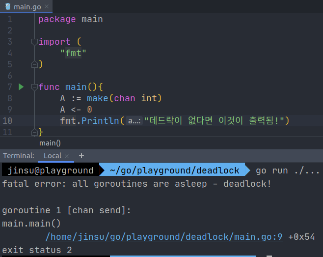
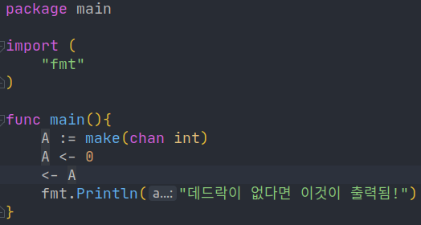
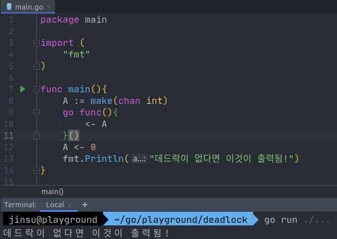
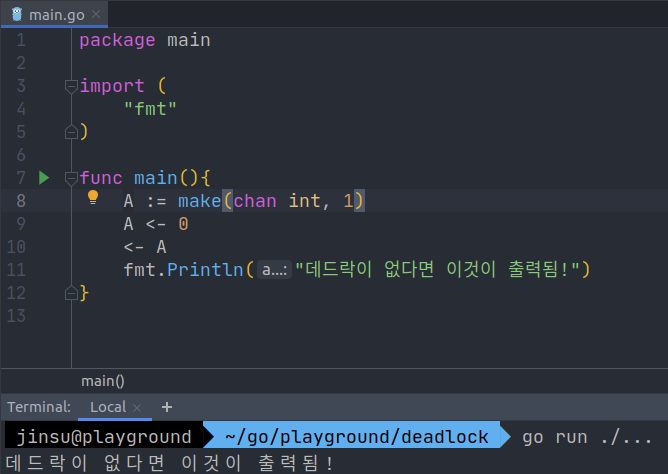
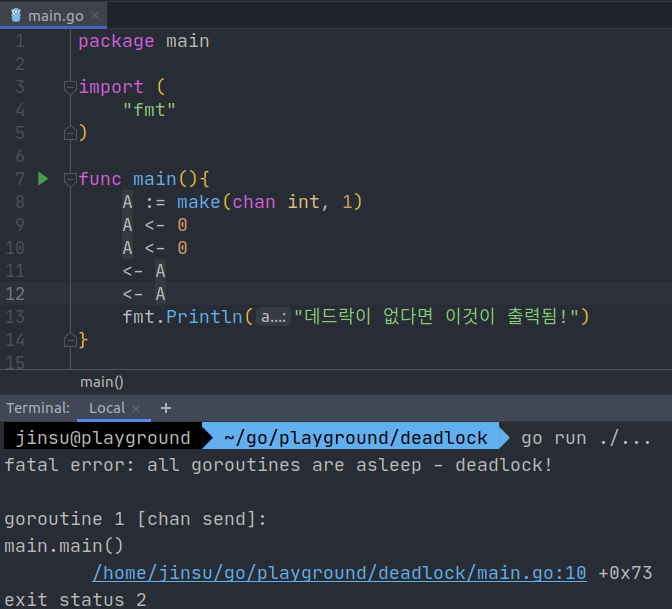
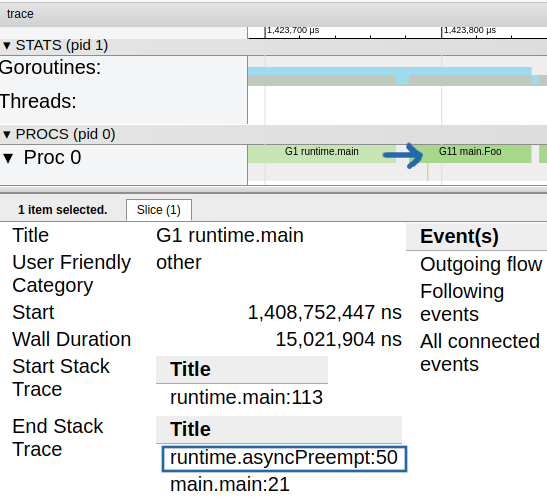

## 시작하며

개발 공부를 시작하고 여태까지 몇 년간 데드락을 실제로 접할 일은 없었다. 사실 동시성을 주의해야하는 작업을 해본 적도 없었고, 트랜잭션에 대한 개념도 없었기 때문일 수도 있다. 전공 과목에서 데드락에 대한 내용을 듣고서도 '*아 이런 게 있구나*' 정도로만 생각하고 넘겼었다. 하지만 Go 언어를 통해 개발을 하던 도중 `Channel`이나 `Mutex`로 인해 종종 데드락을 경험할 수 있었고, 이 경우 프로그램이 완전히 멈춰버리는 크리티컬한 문제가 발생하기도 했고, 디버깅하기 힘든 경우도 있었다. 그런 경험을 하면서 '*데드락 이 녀석... 만만치 않구나*'라는 생각을 하곤 했다.

이번 글에서는 **`Golang` 즉 `Go` 언어를 통해 어떤 경우에 `Deadlock`이 발생할 수 있는지 실제 프로그램을 통해 알아보려한다.** Mutex에 대한 `Lock`과 같이 일반적으로 발생할 수 있는 데드락부터 `channel`이나 `goroutine`에 대한 `Cooperative scheduling`과 같은 Go 언어에 특화된 내용까지를 정리해보았다.

## Deadlock이란

> Deadlock이란 교착상태를 의미하며 두 개 이상의 작업이 서로 상대방의 작업이 끝나기만을 기다리고 있기 때문에 결과적으로 아무것도 완료되지 못하는 상태를 가리킨다. - 위키백과 -

데드락의 개념 자체는 그리 어렵지 않고, 예시를 통해서 쉽게 이해가 가능하다. 위키 백과에 나온 예시를 인용하자면 하나의 사다리에 위에서 내려오려는 사람, 아래에서 올라가는 사람이 동시에 올라가있으면 아무도 내려오거나 올라가지 못하는 경우를 예로 들 수 있다.

### 교착 상태의 조건

더 자세히 정의나 의미에 대해 설명할 것은 없을 듯하고, 학문적으로는 주로 아래의 4가지 조건을 통해 발생한다고 설명하는 것 같다.

1. 상호 배제 (Mutual exclusion) - 하나의 자원을 동시에 사용하지 못하도록 하는 것
2. 점유 상태로 대기 (Hold and wait) - 하나의 자원을 소유한 상태로 다른 자원을 기다리고 있는 상태
3. 선점 불가 (No preemption) - 컴퓨터 분야에서의 선점은 한국말의 선점과 다소 다른 의미. process 혹은 goroutine의 자원을 빼앗는 것을 선점이라고 함. 선점 불가란 그럴 수 없는 상태.
4. 순환성 대기 (Circular wait) - 각 프로세스가 순환적으로 다음 프로세스가 요구하는 자원을 가지고있다. 쉽게 2개의 프로세스를 예로 들면 A는 B가 소유 중인 자원을, B는 A가 소유 중인 자원을 얻으려고 대기 중인 상황을 말함.

Deadlock의 개념 자체가 어렵다거나 위의 4가지 조건을 암기하는 것이 중요한 것은 아니라고 생각한다. 중요한 것은 실제로 어떤 경우에 데드락이 발생할 수 있을 지 파악하고 주의하는 것과 그 경우 어떻게 해결할 수 있을지 인지하는 것이라고 생각한다. 그럼 Go 언어로 간단한 프로그램을 짜보며 알아보자.

## Go에서 발생할 수 있는 Deadlock

### Channel

주로 채널을 접한 지 얼마 안 되어 그 동작 방식을 잘 이해하지 못한 채 사용할 경우 채널로 인한 데드락이 발생한다.

#### Unbuffered channel



특히나 unbuffered channel에 대한 미숙한 사용은 자주 데드락을 야기한다. `unbuffered channel`에서 발생하는 일반적인 데드락의 의미인 2개 이상의 작업 서로의 작업이 완료되기를 대기하는 교착 상태와는 약간 다르다고 볼 수도 있다. 왜냐하면 `sender`와 `receiver` 중 누군가가 먼저 작업을 끝내야지 그 다음으로 누군가가 작업을 수행할 수 있는 것이 아니라 **서로 동시에 협력해야만 unbuffered channel에 대한 대기를 끝낼 수 있는데 이 경우는 동시에 협력해줄 그 누군가(receiver)가 없는 경우**이기 때문이다. 



그렇다고해서 위와 같이 자기 혼자 send와 receive를 하려해봤자 Unbuffered channel은 sender와 receiver가 모두 ready여야 작업을 진행할 수 있기 때문에 불가능하다. (*Unbuffered channel의 동작에 대해 좀 더 궁금하신 분들은 제가 번역에 참여한 [A Tour of Go](https://go-tour-ko.appspot.com/concurrency/2)를 참고해주시면 감사하겠습니다!*)



따라서 **다른 goroutine에서 A에 대한 receiver 역할을 해주면 된다.**

### Buffered channel

> Buffered channel을 이용하면 어떨지 좀 더 자세히 들어가보자. 독자분께서 Go의 channel에 대해 별 관심이 없다면 패스~!



맨 처음에 Unbuffered channel에서는 위와 같이 한 goroutine에서 sender와 receiver 역할 모두를 수행하려해도 이미 sender에서 block이 걸려버려 deadlock을 야기한다고 했으나 buffered channel에서는 그렇지 않다! **buffered channel은 buffer size까지는 입력 작업이 블락되지 않기 때문**이다.



하지만 **buffer size를 넘어서는 순간부터는 receiver가 channel 내의 아이템을 꺼내어 줄 때까지 block되어버리므로 주의**해야한다.

### Mutex.Lock의 중첩

`Mutex`의 구현에 따라 다르겠지만 Go에서는 Lock이 걸린 자물쇠에 다시 자기가 Lock을 걸려해도 Unlock이 될 때까지는 Lock을 걸 수 없다.  즉 어떤 Mutex에 Lock을 건 것이 자신(Goroutine)이라 해도 해당 Mutex에 또 다시 Lock을 걸려하면 그 작업은 Mutex가 Unlock 될 때까지 블락되고 결과적으로는 Deadlock 상태가 되어버린다.

```go
package main

import (
    "fmt"
    "sync"
)

var (
	scores = []int{10,30,20}
	Mutex = &sync.Mutex{}
)

// Lock을 건 뒤 안전하게 topScore를 구함.
func GetTopScore() (playerIndex, topScore int){
    Mutex.Lock()
    topScore = -1
    for idx, score := range scores{
        if topScore < score{
            playerIndex = idx
            topScore = score
        }
    }
    Mutex.Unlock()
    return
}

// GetTopScore는 이미 Lock을 이용해 thread safe하게 작업하는데
// 그걸 인지하지 못하고 실수로 그 밖인 Award에서 Lock을 걸어버림.
func Award(){
    Mutex.Lock()
    playerIdx, topScore := GetTopScore()
    Mutex.Unlock()
    fmt.Printf("%d가 %d의 점수로 우승했습니다!", playerIdx, topScore)
}

func main(){
    Award()
}
// deadlock 발생
```

위의 예시에는 thread-safe하게 top score를 구하는 `GetTopScore` 함수가 선언되어있다. 하지만 `Award` 함수에서 이미 `GetTopScore`는 scores에 대해 `thread-safe`함에도 불구하고 Lock을 걸고 `GetTopScore`를 수행하려하기 때문에 데드락이 발생한다. 이 경우에는 **inner인 GetTopScore 혹은 outer인 Award 둘 중 한 곳에서만 Lock, Unlock 작업을 수행**하도록 해주어야한다. 

inner에서 Lock/Unlock을 담당하는 게 옳을 지 outer에서 Lock/Unlock을 담당하는 게 옳을 지는 잘 모르겠다. inner에서 Lock/Unlock을 담당하면 outer에서는 데드락으로 인해 절대 Lock/Unlock을 못한다는 단점이 있지만, 해당 작업은 언제나 Atomic하게 thread-safe하다는 것이 보장된다는 장점이 있다. 반면 outer에서 Lock/Unlock을 담당하도록하면 비교적 자유자재로 Lock/Unlock을 명령할 수 있는 반면 thread-safe해야할 내부 작업이 unsafe해질 수도 있다. 실수로 Lock/Unlock 작업을 잊어버릴 수 있기 때문이다. 하지만 무엇보다도 **inner에서 Lock/Unlock을 담당할 지 outer에서 담당할 지를 정확히 정할 수 없는 이유는 outer도 결국엔 또 다른 outer의 inner가 될 수 있기 때문**이라고 생각한다.

### Cooperative scheduling 방식에서의 무한 Loop

Goroutine scheduler가 **Goroutine을 스케쥴링 하는 방식은 Go 1.14 이전까지는 Cooperative 방식이었으나, Go 1.14 부터는 Preemptive한 방식으로 바뀌었다**고 한다. OS가 Go process의 thread를 스케쥴 하는 방식은 OS 마다 다르겠지만 대체로 preemptive할 것이고 여기서 얘기하려는 스케쥴러는 Goroutine을 스케쥴링하는 Goroutine scheduler임을 주의하자.

Goroutine은 syscall와 mutex, channel, 함수 콜 등으로 인해 switch 될 수 있는데, **cooperative 방식을 이용하는 경우에는 이러한 goroutine switch 조건에 해당하지 않는 경우 임의로 goroutine switch 함수를 호출하지 않는 한은 같은 스레드 내의 다른 goroutine은 절대로 실행될 수 없다**. preemption(선점) 즉 다른 goroutine을 block 상태로 만들어버리고 자신이 CPU를 선점하는 것이 불가능했기 때문이다. 하지만 Go 1.14부터는 약 10ms를 기준으로 preemption을 수행하고 있다. Asynchronous preemption이라고 부르는 것 같은데, 정확히 왜 asynchronous인지, 기존의 preemptive schedule과는 무엇이 다른지는 찾아봤으나 제대로 설명되어있는 곳을 찾지 못했다.

앞으로 이어지는 내용은 *데드락에 대한 예시라기 보다는 'cooperative 스케쥴링과 preemptive 스케쥴링의 차이로 인해 데드락이 발생할 수도 있고 발생하지 않을 수도 있구나'에 대해 알아보는 예시*이다.

```go
package main

import (
    "fmt"
)

func Foo(){
    fmt.Println("No Deadlock. 나도 실행될 수 있어!")
}

func main(){
    go Foo()
    dummy := 0 // 그냥 for 문 안에서 dummy 작업을 수행하기 위한 변수
    for {
        dummy += 1
    }
}
```

for 문 안에서는 함수콜도 syscall도 channel/mutex도 아닌 goroutine swtich와 관련 없는 `dummy += 1` 작업만을 수행하고 있다. 이 경우 `go Foo()`를 통해 goroutine을 생성하긴 하지만 그 goroutine은 바로 실행되는 것이 아니라 대기 상태이며 만약 스레드가 하나라면 cooperative 스케쥴링으로는 Foo라는 goroutine이 실행될 수가 없을 것이다.

```bash
# Go 버전 >= 1.14 일 때에도 Deadlock 발생
$ GOMAXPROCS=1 GODEBUG=asyncpreemptoff=1 go run main.go
```

* `GOMAXPROCS=1` - Go 프로그램이 사용할 최대 OS Thread 개수를 1개로 제한함으로써 여러 스레드에서 Goroutine이 실행되는 것을 방지. (데드락을 야기해보려는 조건)
* `GODEBUG=asyncpreemptoff=1` - Go 1.14부터 적용된 Asynchronous preemptive scheduling을 사용하지 않는 옵션

이 경우 Go 버전이 1.14 이상이라면 Foo는 실행되지 않는다.

```bash
# Go 버전 >= 1.14인 경우 async preemption으로 인해 Deadlock 발생 X
$ GOMAXPROCS=1 go run main.go

No Deadlock. 나도 실행될 수 있어!
```

하지만 asyncpreemptoff 옵션을 생략하면 기본적으로 선점형 스케쥴링이 지원되므로 이 경우엔 Deadlock이 발생하지 않고 Foo() 함수가 실행되는 것을 "No Deadlock. 나도 실행될 수 있어!" 라는 Stdout을 통해 볼 수 있다.

#### pprof를 이용한 goroutine schedule 시각화

하지만 정말로 async preemption이 동작했기 때문에 데드락에 빠지지 않은 것인지 다른 이유 때문인지는 그닥 직관적으로 와닿지 않는다. 그래서 몇몇 외국 블로그의 글에서 봤던 `pprof`라는 도구를 사용해봤고, 처음엔 사용법이 다소 어려웠지만 조금 익숙해지니 너무나도 편리했다.
`pprof`는 `net/http` 패키지 하위에 존재하고, Goroutine scheduling, syscall log, CPU 사용 등을 시각화해서 보여주는 간편한 디버깅 도구이다.
요청을 날리면 요청 이후 N초 간의 goroutine scheduling에 대한 정보를 기록해 보여주는 기능을 이용해보았다.



End Stack Trace를 통해 어떤 작업으로 인해 goroutine이 잠시 중단되고 CPU를 다른 goroutine에게 양보하게 되는지 알 수 있다. 놀랍게도 dummy에 대한 무한 루프 진행 도중 처음으로 **async preemption이 발생한 뒤 이어서 Foo 함수를 실행하는 goroutine이 CPU를 점유**하게 된다는 것을 시각적으로 볼 수 있다.

Wall Duration은 해당 고루틴 블럭을 수행한 시간으로 보여지고 약 10ms를 기준으로 preemptive하게 switch가 일어날 수 있다는 여러 블로그의 글들과 유사하게 15,021,904ns, 즉 약 15ms만에 asyncPreempt라는 이벤트로 인해 goroutine switch가 일어났다.
cooperative 스케쥴링만을 이용하는 경우에는 데드락으로 인해 한 번도 Foo를 실행하는 goroutine이 수행되지 못한다는 것도 시각화해서 제공해보고싶었지만, 당연하게도 그 데드락으로 인해 일정 기간동안 runtime을 관찰한 뒤 그 정보를 저장하는 goroutine 조차 실행할 수 없어 그 정보를 얻을 수 없었다!

```dockerfile
# Go의 버전을 1.13으로 제한해본다.
FROM golang:1.13
WORKDIR /app
COPY . .
ENTRYPOINT ["go"]
CMD ["run", "main.go"]
```

```bash
$ docker build . -t tmp && \
  docker run -it --rm -e GOMAXPROCS=1 tmp
```

그렇다면 정말 Go의 1.14 이전 버전은 Preemptive한 방식이 아니라 Cooperative한 방식을 이용하고, 이 경우 데드락이 발생할까? 이전 글들과 마찬가지로 Docker를 이용해 간편하게 Go의 버전을 변경해서 실행해보자. golang:1.13 이미지를 이용해보았다.

1.13 버전 이하로는 `GODEBUG=asyncpreemptoff=1` 옵션을 설정하지 않아도 cooperative한 스케쥴링만을 지원하므로 프로그램이 데드락 상태에 빠져 Foo()가 실행되지 못함을 알 수 있다.

#### 참고 사항) GOMAXPROCS=1 옵션을 주는 이유는?

> The GOMAXPROCS variable limits the number of operating system threads that can execute user-level Go code simultaneously. - go rutime package 문서 -

`GOMAXPROCS`는 **Go 프로그램이 사용할 수 있는 최대의 OS 스레드 개수**를 의미한다. 만약 OS 스레드가 2개 이상으로 생성된다면 위의 경우 main goroutine과 함수 Foo를 실행하는 Goroutine이 서로 다른 스레드에 배치될 것이고, 그 경우 **Go의 스케쥴러가 Cooperative한 방식을 이용한다해도 OS 스케쥴러가 Preemptive하게 각각의 Go 스레드(OS Level)를 스케쥴**하기 때문에 Foo goroutine도 실행될 수 있는 기회가 주어진다. 이 경우에는 데드락이 발생하지 않는다. 따라서 **우리는 데드락을 발생시켜보고자 GOMAXPROCS를 1로 제한**한다.

## 마치며

Go를 이용해 실제 프로그램을 짜보며 어떤 경우에 Deadlock이 발생할 수 있는지 알아보았다. 이 글에선 서로 같은 Mutex를 이용하는 경우를 예시로 들었지만 서로 다른 두 Mutex를 통해 서로의 작업을 기다리는 경우의 Deadlock도 거의 유사하며 일반적으로 말하는 Deadlock에 가장 가까운 경우이긴할 것이다. 그래도 Go로 개발을 하면서 아직 서로 다른 Mutex를 이용했던 경우가 딱히 없었기에 같은 Mutex에 중첩으로 Lock을 걸었던 경우를 예시로 들어보았다.

`Channel`이나 `Cooperative scheduling`의 경우는 어느 정도 Go에 한정적인 내용이고 특히나 스케쥴링은 런타임이나 고루틴 스케쥴 방식까지 내려가는 세부적인 내용이긴하지만 Go에 특히 관심 있으신 분들께는 나름 재미있는 내용이 되지 않았을까싶다.

그리고 이전 글에선 `testing`의 `benchmark`를 이용해 좀 더 정확하고 편리한 벤치마킹을 도입해봤다는 점과
이번엔 추가적으로 `pprof`를 이용해 `goroutine 스케쥴링`을 시각화해봤다는 점에서 Golang으로 적용해보는 컴퓨터 사이언스라는 이 시리즈를 처음 시작했을 때에 비해 컴퓨터 사이언스 뿐만 아니라 디버깅 기술이나 스케쥴링 방식 등등 다양한 주제에 대해서도 공부해보고 적용해볼 수 있었던 것 같아 뿌듯하다.
다소 Go만의 지엽적인 내용으로 여겨질 수도 있겠지만 추후에 내가 어떤 언어를 공부하든 어떤 기술을 공부하든 이러한 경험들을 얼마든지 녹여낼 수 있을 것이라 생각한다!!  

## 참고

* Go: How are Deadlocks Triggered? https://medium.com/a-journey-with-go/go-how-are-deadlocks-triggered-2305504ac019
* Go: What Does a Goroutine Switch Actually Involve? https://medium.com/a-journey-with-go/go-what-does-a-goroutine-switch-actually-involve-394c202dddb7
* Goroutine and Preemption https://medium.com/a-journey-with-go/go-goroutine-and-preemption-d6bc2aa2f4b7
* Go: Asynchronous Preemption https://medium.com/a-journey-with-go/go-asynchronous-preemption-b5194227371c
* 데드락 정의
  * https://namu.wiki/w/%EB%8D%B0%EB%93%9C%EB%9D%BD?from=Deadlock
  * https://ko.wikipedia.org/wiki/%EA%B5%90%EC%B0%A9_%EC%83%81%ED%83%9C

* Go runtime documentation https://golang.org/pkg/runtime/