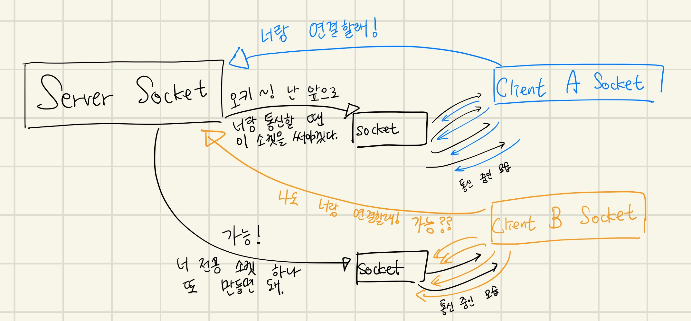

## 시작하며

개발 공부를 처음 시작한 지 언제 안 됐을 무렵, 의경 복무를 하며 자바로 TCP Socket을 이용해 옆 컴퓨터와 채팅을 하는 프로그램을 만들어 보는 것을 시작으로 docker나 mysql과 같은 다양한 오픈소스들을 이용해보면서나 네트워크를 공부하면서 다양하게 들어왔던 `소켓`이지만 정확히 어떤 역할을 하는지 어떤 종류가 있는지 어떻게 동작하는지 알지 못했다.

오늘은 그렇게 알쏭달쏭한 존재였던 소켓을 크게 **`Unix Domain Socket`와 `Network  Socket` 두 가지로 나눠 정리해보고 Unix Domain Socket과 TCP를 사용하는 Network Socket을 벤치마크해보고 어떤 차이가 있는지 확인**해보도록 하겠다. 주로 내가 소켓을 접했던 자료나 이슈 상황에서는 UDP보다는 TCP가 많이 등장했었기 때문에 **UDP에 대한 내용은 거의 제외할 것이므로 대부분이 Network socket과 Unix domain socket 각각의 stream(network socket에선 tcp를 이용하는 경우에 해당) type socket**에 관련한 내용일 것이다.

## Socket 이란

소켓은 어떠한 통신에서의 Endpoint(끝점) 역할을 한다. 끝점이 없으면 어디와 어디가 통신하는지 어디에 데이터를 써야하는지 알 수 없다. 

소켓을 마치 전구 소켓과 같이 소켓이라고 부르는 이유는 소켓에 올바르게 데이터를 적기만 하면 통신을 위한 세부적인 동작은 소켓이 알아서 수행하기 때문이다. 따라서 우리는 통신을 하기 위한 Socket을 올바르게 생성하고, 그 곳에 데이터를 올바르게 적거나 그곳의 데이터를 올바르게 읽기만 하면 된다. 실제 데이터 전송은 소켓이 알아서 수행해준다.

소켓은 같은 호스트 내에서 IPC를 위해 사용되는 `Unix domain socket`과 네트워크 통신을 하기 위해 사용되는 `Network socket`으로 분류할 수 있다. 간혹 unix domain socket과 TCP를 이용하는 Network socket, UDP를 이용하는 Network socket 이렇게 세 가지로 분류하는 경우를 본 것 같은데 이는 잘못된 분류라고 생각한다. Network socket 뿐만 아니라 Unix domain socket 또한 stream(Network socket의 경우 TCP를 이용하는 경우에 해당) 타입과 datagram 타입(Network socket의 경우 UDP를 이용하는 경우에 해당)으로 사용될 수 있기 때문이다.

### 서버 소켓과 클라이언트 소켓



소켓을 역할의 측면에서 분류한다면 서버 소켓과 클라이언트 소켓으로 나눌 수 있다. 동일한 구조의 소켓이지만 생성되는 시기나 역할이 다를 뿐이다. 

* **서버 소켓** - 클라이언트 소켓의 연결 요청을 받아들이기만 할 뿐. 실제 서버 측에서의 데이터의 송수신은 서버 소켓이 클라이언트 소켓의 연결 요청을 수락하면서 새로 만들어지는 소켓을 통해 수행.
* **클라이언트 소켓** - 클라이언트가 서버와 통신하고자 할 때 생성하는 소켓. 클라이언트는 실제 데이터 송수신도 이 소켓을 통해 수행.

서버 소켓과 클라이언트 소켓이 단순한게 1:N으로만 통신하면 이렇게 서버 소켓이 클라이언트 소켓의 요청을 수락한 뒤 새로 소켓을 만들 필요 없지 않을까싶지만 그렇게 되면 서버가 각 클라이언트와 통신할 때 하나의 소켓을 이용하므로 올바르게 원하는 클라이언트와 통신할 수 없을테니 좋은 방식이 아닐 것이다.

그렇다면 과연 **정말 서버에서는 연결을 accept 한 뒤 소켓을 새로 생성할까?** 확인해보자.

```go
package main

import (
    "log"
    "net"
    "os"
    "time"
)

var (
    network = "tcp"
    address = "0.0.0.0:8080"
)
func main() {
    os.Remove(address)
    socket, err := net.Listen(network, address)
    if err != nil {
        log.Fatal(err)
    }

    for {
        connectedSocket, err := socket.Accept()
        if err != nil{
            log.Fatal(err)
        }
        go func() {
            for i := 0; i <= 10; i++{
                connectedSocket.Write([]byte("pong\n"))
                time.Sleep(time.Second)
            }
            connectedSocket.Close()
        }()
    }
}
```

간단하게 TCP 통신프로그램을 하나 만들어봤다. 단순히 1초 간격으로 pong을 5번 출력한 뒤 연결을 끊는 프로그램이다.

**요청 전**

```bash
$ netstat --tcp
Active Internet connections (w/o servers)
Proto Recv-Q Send-Q Local Address           Foreign Address         State
tcp        0      0 ip-172-31-34-13.ap-:ssh 124.50.93.166:60082     ESTABLISHED
tcp        0      0 ip-172-31-34-13.ap-:ssh 124.50.93.166:60084     ESTABLISHED
tcp        0      0 ip-172-31-34-13.ap-:ssh 124.50.93.166:60078     ESTABLISHED
```

**요청 수락 후 통신 중** - 소켓이 하나 생성되어 ESTABLISHED 상태

```bash
$ netstat --tcp
Active Internet connections (w/o servers)
Proto Recv-Q Send-Q Local Address           Foreign Address         State
tcp        0      0 ip-172-31-34-13.ap-:ssh 124.50.93.166:60082     ESTABLISHED
tcp        0      0 ip-172-31-34-13.ap-:ssh 124.50.93.166:60084     ESTABLISHED
tcp        0      0 ip-172-31-34-13.ap-:ssh 124.50.93.166:60078     ESTABLISHED
tcp6       0      0 ip-172-31-34-1:http-alt 124.50.93.166:42434     ESTABLISHED
```

**통신 종료** - 생성되었던 소켓이 TIME_WAIT 상태. 잠시 후 사라진다.

```bash
$ netstat --tcp
Active Internet connections (w/o servers)
Proto Recv-Q Send-Q Local Address           Foreign Address         State
tcp        0      0 ip-172-31-34-13.ap-:ssh 124.50.93.166:60082     ESTABLISHED
tcp        0      0 ip-172-31-34-13.ap-:ssh 124.50.93.166:60084     ESTABLISHED
tcp        0      0 ip-172-31-34-13.ap-:ssh 124.50.93.166:60078     ESTABLISHED
tcp6       0      0 ip-172-31-34-1:http-alt 124.50.93.166:42434     TIME_WAIT
```

> 깔끔한 네트워크 정보를 보기 위해 순수한 AWS EC2 t2.micro 인스턴스에서 작업해보았다. 맨 위 3줄에 나온 소켓 정보는 ssh 접속으로 인한 소켓 정보이다.
>
> 또한 서버 소켓은 출력되지 않았는데 이는 우리는 평소에 listen 중인 포트나 서버 소켓을 보기 위해 netstat에 -l 옵션을 전달한 반면 이번엔 --tcp 옵션을 통해 listen 중인 서버 소켓이 아닌 클라이언트의 요청을 수락한 뒤 생성되는 소켓을 보려하고있기 때문이다.

4번 째 줄의 소켓 정보가 바로 우리가 생각하는 서버 소켓이 client의 연결 요청을 accept 후 생성하는 socket이다. 클라이언트의 요청을 accept 후에 새로운 소켓이 생성되며 통신 종료 후 잠시 기다린 뒤 사라진다.

### Network Socket

`Network socket`은 네트워크 통신이 필요한 작업을 수행할 때 이용하는 소켓의 한 종류로 다시 동작 방식에 따라 TCP 프로토콜을 이용하는 stream socket과 UDP 프로토콜을 이용하는 datagram socket으로 구분할 수 있다. 사용자는 socket에 데이터를 적기만 하면 네트워크와 관련된 작업은 socket이 알아서 수행해준다. 읽을 때에도 마찬가지이다.

TCP socket이라고 부르는 사람도 있고 stream socket, TCP/IP socket이라 부르는 사람도 있는 것 같다. 정확한 명칭은 모르겠지만 사용하거나 이해하는 데에는 무리가 없을 것 같다.
TCP를 이용하는 stream type의 Network socket과 stream type의 Unix domain socket은 사용 방법이 매우 유사하다. 둘 다 stream type이고, 소켓에 데이터를 적은 뒤의 작업은 소켓이 알아서 수행해주기 때문이다. 각각의 소켓을 이용해 서버를 띄우는 작업은 인자의 값만 조금 달라질 뿐이다. 이는 글의 하부의 코드에서 확인해볼 수 있다.

#### Socket과 Port

Network socket에 대해서는 socket과 port의 구분이나 역할이 애매하게 느껴질 수 있다. 통신을 할 때 IP 주소를 이용해 목적지인 Host를 찾을 수는 있지만 그 Host의 어떤 프로세스과 통신하려는 것인지는 알 수 없다. 올바른 프로세스를 찾을 수 있도록 프로세스와 어떠한 숫자를 매핑시키는데 이 숫자를 Port 번호라고 한다. 예를 들어 123.123.123.123:8080으로 요청을 보내는 것은 123.123.123.123의 IP 주소를 갖는 Host의 8080번 포트에 맵핑된 프로세스에 요청을 보내는 것이다.

이 때 Port와 프로세스를 그냥 연결할 수는 없고 Socket이라는 녀석이 필요하다. Socket은 실질적으로 어떤 프로세스를 어떤 포트에 맵핑시킬지에 대한 정보가 필요하고 네트워크 작업을 알아서 수행한다.

조금 비유를 해보자면 회사내에 어떤 부서가 있고 외부에서 해당 부서와 작업하기 위해선 어떠한 고유한 부서 번호가 필요하고, 이때 외부와 해당 부서간에 오가는 통신을 담당하는 담당자가 있어야하는 경우에 비유해 볼 수 있다. "어떤 부서"는 프로세스이고 "고유한 부서 번호"는 포트 번호, 통신을 담당하는 담당자는 소켓에 해당한다.

### Unix Domain Socket

Unix Domain Socket은 IPC(Inter-Process Communication, 프로세스 간 통신)의 여러 방법 중 가장 자유로우면서 사용하는 데에 있어 제한이 별로 없는 방법이다. 네트워크 소켓과 달리 같은 호스트 내의 프로세스 간 통신을 담당하기 때문에 아무런 네트워크 작업이 필요 없다. 하지만 TCP나 UDP를 이용하는 Network socket을 이용할 때와 인자 값만 조금 바꾸어 동일한 방식으로 사용이 가능하다.

#### 🌈 상상의 나래 - 우리가 알게 모르게 겪었던 Unix domain socket의 Permission오류에 대해

```bash
$ mysql
stat /var/lib/mysql/mysql.sock
stat: cannot stat '/var/lib/mysql/mysql.sock': Permission denied
```

```bash
$ docker
docker: Got permission denied while trying to connect to the Docker daemon socket at unix:///var/run/docker.sock
```

주로 우리가 `MySQL`이나 `Docker`를 `localhost`에서 사용할 때 **unix socket에 대한 permission 에러**를 겪은 적이 있을 것이다. MySQL이나 Docker를 비롯한 많은 오픈소스들이 아마 성능상의 이점을 위해 localhost에서 서비스를 이용할 경우 Network socket이 아닌 Unix domain socket을 많이들 이용하는 것으로 알고있다. 그렇기 때문에 주로 MySQL 설치 이후 Remote에서는 접속이 되는데 **localhost에서는 권한 문제로 접속이 안된다거나 Docker 설치 이후 사용자를 docker group에 넣어주는 경우**가 많이 있다.

아마도 네트워크 통신을 통해 서버 소켓에 접근하는 네트워크 소켓과 달리 unix domain socket은 client process가 직접 server의 socket file에 접근하기 때문에 이때 쓰기 권한 때문에 그런 권한 오류가 생기는 것이 아닐까라는 상상의 나래를 펼쳐본다.

```bash
# ubuntu 사용자로 unix domain socket server 프로세스를 띄운 경우
# ubuntu 사용자로는 잘 접속이 된다.
ubuntu@ec2 $ go test -v
=== RUN   TestSocket
=== RUN   TestSocket/tcp
2021/02/13 12:59:06 pong
=== RUN   TestSocket/unix
2021/02/13 12:59:06 pong
--- PASS: TestSocket (0.00s)
    --- PASS: TestSocket/tcp (0.00s)
    --- PASS: TestSocket/unix (0.00s)
PASS
ok  	uds	0.004s
```

```bash
# server가 생성한 unix domain socket에 write 권한이 없는
# guest1이라는 사용자로는 server와 unix domain socket으로는 통신할 수 없고,
# 앞서 오픈소스를 이용하며 겪었던 에러와 마찬가지로 권한 이슈가 발생한다.
# 하지만 TCP 소켓을 이용한 경우는 원활히 ping-pong test가 성공한 것을 볼 수 있다.
guest1@ec2 $ go test -v
=== RUN   TestSocket
=== RUN   TestSocket/tcp
2021/02/13 12:59:01 pong
=== RUN   TestSocket/unix
    main_test.go:21: 
        	Error Trace:	main_test.go:21
        	Error:      	Received unexpected error:
        	            	dial unix jinsu.sock: connect: permission denied
        	Test:       	TestSocket/unix
--- FAIL: TestSocket (0.00s)
    --- PASS: TestSocket/tcp (0.00s)
    --- FAIL: TestSocket/unix (0.00s)

# 하지만 재미있게도 guest1도 socket에 write할 수 있도록 권한을 수정해주니
# guest1도 unix domain socket으로 무리 없이 통신이 가능했다!
guest1@ec2 $ sudo chmod 777 jinsu.sock
guest1@ec2 $ go test -v
=== RUN   TestSocket
=== RUN   TestSocket/tcp
2021/02/13 12:59:06 pong
=== RUN   TestSocket/unix
2021/02/13 12:59:06 pong
--- PASS: TestSocket (0.00s)
    --- PASS: TestSocket/tcp (0.00s)
    --- PASS: TestSocket/unix (0.00s)
PASS
ok  	uds	0.004s
```

따라서 ubuntu 사용자로 TCP socket과 Unix domain socket 두 가지 방법으로 서버 역할을 할 수 있는 프로세스를 띄운 뒤 ubuntu 사용자와 guest1 사용자로 통신 테스트를 진행해보았다. 

서버가 생성한 unix domain socket은 `srwxrwxr-x` 의 형식과 권한을 갖고 있기 때문에 guest1은 이 소켓에 대해 read와 execute 권한 뿐이고, write는 불가능하기에 unix domain socket을 이용해서는 통신할 수 없다. 따라서 우리가 평소에 오픈소스를 localhost에서 이용하면서 종종 맞이했던 소켓에 대한 permission error을 만나볼 수 있었다! 반면 socket에 대한 접근 권한이 필요 없는 TCP로는 통신이 가능했고, 놀랍게도 guest1에게 소켓 파일에 대한 write 권한을 부여해주자 Unix domain socket으로도 통신이 가능해진 것을 볼 수 있다.


**상상의 나래 정리: unix domain socket을 통해 접속을 시도할 때에는 unix domain socket file에 대한 접근을 하는 프로세스가 해당 socket file에 대한 적절한 permission을 갖고 있어야한다.**

> 또한 구글링 도중 보았던 재미있는 예시는 database를 통해 authentication/authorization을 수행하는 일반적인 서비스와 달리 Unix domain socket을 이용하는 경우에는 linux user 시스템을 이용해서도 권한/인증 관리를 수행하는 경우도 존재할 수 있다는 것이었다.

## 벤치마킹 Unix domain socket vs Network socket

Unix domain socket과 Network socket의 성능을 비교하는 벤치마크를 작성했다.
두 경우 모두 Stream type의 socket을 이용하도록 했고, Network socket의 경우는 특히나 이 경우 TCP 프로토콜을 이용하게 된다.

```go
// main.go
// 한 프로세스 내에서 TCP Socket과 Unix Domain Socket 두 가지를 이용해
// 통신할 수 있는 프로그램
package main

import (
    "errors"
    "io"
    "log"
    "net"
    "os"
    "time"
)

func main() {
    go RunTCPSocketServer()
    go RunUnixDomainSocketServer()

    for {
        log.Println("Dummy waiting...")
        time.Sleep(time.Minute)
    }
}

func RunTCPSocketServer(){
    log.Println("Run TCPSocketServer...")
    run("tcp", "0.0.0.0:8080")
}

func RunUnixDomainSocketServer(){
    log.Println("Run UnixDomainSocketServer...")
    serverSocketName := "jinsu.sock"
    os.Remove(serverSocketName)
    run("unix", serverSocketName)
}

// TCP socket을 이용해 서버를 띄우든 Unix Domain Socket을 이용해 서버를 띄우든
// 간단히 인자 값만 변경해서 이용할 수 있다!
func run(network, address string){
    buf := make([]byte, 1024)
    socket, err := net.Listen(network, address)
    if err != nil {
        log.Fatal(err)
    }

    for {
        connectedSocket, err := socket.Accept()
        if err != nil{
            log.Fatal(err)
        }
        go func() {
            for{
                n, err := connectedSocket.Read(buf)
                if err != nil{
                    if !errors.Is(io.EOF, err){
                        log.Fatal(err)
                    } else{
                        log.Print("[Error]", err)
                        break
                    }
                }
                log.Println(network, "Client sent:", n)
                connectedSocket.Write([]byte("pong"))
            }
            connectedSocket.Close()
        }()
    }
}
```

```go
// main_test.go
// tcp socket과 unix domain socket을 이용해 성공적으로 서버와 통신이
// 이루어지는지 테스트하는 테스트 코드
// tcp와 unix domain socket의 성능을 비교하는 벤치마크 코드
package main

import (
    "errors"
    "github.com/stretchr/testify/assert"
    "io"
    "log"
    "net"
    "testing"
)

func TestSocket(t *testing.T){
    args := [][]string{
        []string{"tcp", "0.0.0.0:8080"},
        []string{"unix", "jinsu.sock"},
    }

    for _, arg := range args{
        t.Run(arg[0], func(t *testing.T) {
            conn, err := net.Dial(arg[0], arg[1])
            assert.NoError(t, err)
            buf := make([]byte, 1024)
            _, err = conn.Write([]byte("ping"))
            if err != nil{
                log.Fatal(err)
            }
            n, err := conn.Read(buf)
            if err != nil{
                if ! errors.Is(io.EOF, err){
                    log.Println(err)
                }
            }
            log.Println(string(buf[:n]))
        })
    }
}

func BenchmarkSocket(b *testing.B) {
    args := [][]string{
        []string{"tcp", "0.0.0.0:8080"},
        []string{"unix", "jinsu.sock"},
    }
    for _, arg := range args{
        b.Run(arg[0], func(b *testing.B) {
            //log.Println("Out") // b.N과 상관 없이 args의 길이에 따라 출력됨.
            conn, err := net.Dial(arg[0], arg[1])
            assert.NoError(b, err)
            buf := make([]byte, 1024)
            for i := 0; i < b.N; i++{
                //log.Println("In") // b.N만큼 수행됨
                _, err := conn.Write([]byte("ping"))
                assert.NoError(b, err)
                _, err = conn.Read(buf)
                if err != nil{
                    if !errors.Is(io.EOF, err){
                        b.Fail()
                    }
                }
            }
        })
    }
}
```

```bash
$ go test -bench=. -benchtime=100000x
goos: linux
goarch: amd64
pkg: uds
BenchmarkSocket/tcp         	  100000	    104537 ns/op
BenchmarkSocket/unix        	  100000	     83456 ns/op
PASS
ok  	uds	18.808s
```

10000번의 ping-pong을 수행하는 벤치마크를 수행했다.
그 결과 **TCP socket을 이용할 경우는 한 번의 ping-pong에 약 104537ns, unix domain socket을 이용할 경우는 한 번의 ping-pong에 약 83456ns**가 소요된 것을 보아 **예상대로 네트워크 통신이 일절 필요하지 않은 unix domain socket이 좀 더 성능이 좋은 것으로 보여졌다**. 사전에 자료 조사를 할 때에는 unix domain socket이 tcp socket을 이용할 때보다 약 2배가량 성능이 우월할 것이라고 들었는데, 그렇게 많은 차이가 나는 것 같지는 않다. 하지만 어느 정도 데이터의 크기나 버퍼의 크기에 따라 달라질 수도 있을 것 같고 더 깊은 원리들이 존재할 것 같아 더 자세히는 측정해보지 못했다.

## 마치며

사실 이번에 다룬 소켓이라는 주제는 Go로 적용해보는 Computer Science라는 이 시리즈를 정리해나가던 초기에 2번 째 글로 시도했던 주제였는데 당시엔 Go benchmark도 처음 사용해봤었고 내용이 어려웠던 터라 벤치마크도 제대로 되지 않고 정리도 하기 힘들어서 중단했던 주제이다. 하지만 이번엔 같은 내용에 대해 두 번째 정리해서인지 전보다 내용도 잘 이해됐고, 벤치마킹 코드와 결과도 깔끔하게 나왔던 것 같아 뿌듯하다.

그리고 그 동안 도커나 MySQL 같은 오픈소스들을 사용하면서 간혹 소켓에 대한 오류를 접할 때나 이런 저런 글에서 소켓 관련한 내용이 등장할 때 정확히 어떤 역할인지 이유가 뭔지 자세히 알지 못했는데 이번 기회덕에 앞으로는 좀 더 잘 이해해볼 수 있을 것 같다.

## 참고

* 소켓 http://www.ktword.co.kr/abbr_view.php?nav=&m_temp1=280&id=742
* 네트워크 소켓 https://ko.wikipedia.org/wiki/%EB%84%A4%ED%8A%B8%EC%9B%8C%ED%81%AC_%EC%86%8C%EC%BC%93

* 소켓 프로그래밍 https://recipes4dev.tistory.com/153
* UDS (Unix Domain Socket) http://www.dreamy.pe.kr/zbxe/CodeClip/119393
* [Linux/UDS/Unix Domain Socket] UDS https://yaaam.tistory.com/entry/LinuxUDSUnix-Domain-Socket-UDS

* Unix file type https://en.wikipedia.org/wiki/Unix_file_types

* C# - .NET Core Unix Domain Socket 사용 예제 https://www.sysnet.pe.kr/2/0/11963
* Unix Domain Socket https://www.joinc.co.kr/w/Site/system_programing/IPC/Unix_Domain_Socket
* Unix Domain Socket - UDP https://www.joinc.co.kr/w/Site/system_programing/IPC/Unix_Domain_Socket_UDP
* What is the difference between Unix sockets and TCP/IP sockets? https://serverfault.com/questions/124517/what-is-the-difference-between-unix-sockets-and-tcp-ip-sockets