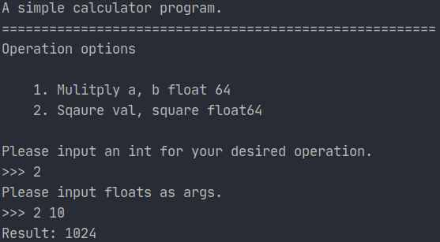
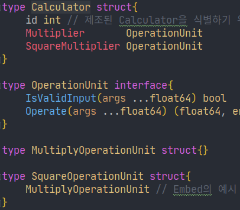

## 시작하며

요즘 `Go`와 `Java` 모두를 이용해 개발을 하다보니 각각의 장단점에 대해 느껴볼 수 있었다. `Go`는 리소스를 적게 먹으며 코드가 간결하고 라이브러리나 프레임워크 또한 심플해서 적용하기 편하다. `Java`는 이런 저런 기능이 많은 반면 그런 기능을 이용하기 위해 이해해야하는 내용들이 많고,  코드가 투명하지는 않다(다양한 Annotation을 이용하게 되면서 코드가 투명하게 그 동작을 나타내지 않음). Java의 장점 중에서는 특히나 **객체지향의 대표적인 언어답게 상속과 다형성을 능력에 따라 자유자재로 이용**할 수 있다는 점이 매력적이었다.

Go 언어를 좋아하는 입장에서 개인적으로 이런 객체지향적인 특징이나 예외 처리를 제외하고는 딱히 Java가 Go에 비해 갖는 장점이 크게 느껴지지 않았다. 예외 처리는 Go가 바라보는 방향이 일반적인 예외 처리와 다르기에 어쩔 수 없지만, 객체지향적의 특징들은 어떻게 적용해볼 수 있을까하는 생각에 공부를 좀 해봤고 그 내용을 정리해본다. (*기회가 된다면 Go에서 error를 다루는 철학에 대해 추가적으로 공부해보고싶다.*)

❗**Go에 대한 기본적인 내용을 정리해보는 것이 아니라 객체 지향 관점에서 바라본 Go에 대한 내용을 정리해보는 것이므로 Go의 기초 내용에 대한 설명은 생략할 것이므로 Go에 대한 기초 이해가 없다면, 그 부분을 먼저 알아보는 것을 추천한다!**

### 예시 코드

Go에서 객체 지향을 적용한 간단한 계산기 프로그램을 예시로 작성해보았다. 전체 소스코드를 다 볼 필요는 없겠지만 필요에 따라 참고할 수 있도록 아래와 같이 첨부한다.

@@@ expand "main 패키지 - /main.go" %}}

```go
package main

import (
    "bufio"
    "calculator/calc"
    "fmt"
    "os"
    "strconv"
    "strings"
)

func main(){
    var (
    	calculator *calc.Calculator = calc.NewCalculator() // 계산기 struct
    	operationUnit calc.OperationUnit // OperationUnit이라는 interface type을 통해 Polymorphism 이용
    	operationResult float64 // 계산 결과를 담음
    	operationErr error // 계산 수행에 대한 error을 담음
    )
    // main package에서는 calc package에 정의된 unexported name인 id에 접근할 수 없다.
    //calculator.id = "Jinsu Park"

    scanner := bufio.NewScanner(os.Stdin)

    // 연산 option을 위해 값을 입력받기 (e.g. 1)
    fmt.Printf(`A simple calculator program.
=======================================================
Operation options

    1. Mulitply a, b float 64
    2. Sqaure val, square float64

Please input an int for your desired operation.
>>> `)
    scanner.Scan()
    option, _ := strconv.Atoi(scanner.Text())

    // args를 위해 입력받기 (e.g. 10 20)
    fmt.Printf("Please input floats as args.\n>>> ")
    scanner.Scan()
    inputs := make([]float64, 0)
    for _, input := range strings.Split(scanner.Text(), " "){
        f, _ := strconv.ParseFloat(input, 64)
        inputs = append(inputs, f)
    }

    // 연산에 대한 multiplexing. 즉 option에 따른 연산을 수행한다는 의미
    // operationUnit이라는 OperationUnit interface type을 통해 Polymorphism 이용
    switch option{
    case 1:
        operationUnit = calculator.Multiplier
    case 2:
        operationUnit = calculator.SquareMultiplier
    }
    // Operate라는 기능을 다양한 동작으로 수행할 수 있다.
    operationResult, operationErr = operationUnit.Operate(inputs...)
    // result
    if operationErr != nil{
            fmt.Println("[Error]", operationErr)
    } else{
        fmt.Println("Result:", operationResult)
    }
}
```

@@@ /expand %}}

@@@ expand "calc 패키지 - /calc/calc.go" %}}

```go
package calc

import (
    "errors"
)

var autoIncrementID int = 1

type Calculator struct{
    id int // 제조된 Calculator을 식별하기 위한 ID. 변수명이 소문자로 시작하므로 export 되지 않는다.
    Multiplier       OperationUnit
    SquareMultiplier OperationUnit
}

type OperationUnit interface{
    IsValidInput(args ...float64) bool
    Operate(args ...float64) (float64, error)
}

type MultiplyOperationUnit struct{}

type SquareOperationUnit struct{
    MultiplyOperationUnit // Embed의 예시
}

func NewCalculator() *Calculator{
    c := &Calculator{
    	    id: autoIncrementID,
    	    Multiplier: &MultiplyOperationUnit{},
    	    SquareMultiplier: &SquareOperationUnit{MultiplyOperationUnit: MultiplyOperationUnit{}},
    }
    autoIncrementID += 1

    return c
}

func (unit *MultiplyOperationUnit) IsValidInput(args ...float64) bool{
    if len(args) != 2{
        return false
    }

    return true
}

func (unit *MultiplyOperationUnit) Operate(args ...float64) (float64, error){
    if !unit.IsValidInput(args...){
        return 0, errors.New("MultiplyOperationUnit의 args가 유효하지 않습니다.")
    }

    return args[0] * args[1], nil
}

//func (unit *SquareOperationUnit) IsValidInput(args ...float64) bool{
//    ... 필요에 따라 정의하면 Override처럼 이용 가능
//}

func (unit *SquareOperationUnit) Operate(args ...float64) (float64, error){
    // *SquareOperationUnit에 대한 IsValidInput 메소드는 정의한 적 없지만
    // Embedding을 통해 일반적인 OOP에서 부모의 메소드를 이용하듯이 이용 가능.
    if !unit.IsValidInput(args...){
        return 0, errors.New("SquareOperationUnit의 args가 유효하지 않습니다.")
    }

    var (
        // val^square 즉 "val의 square 제곱"에 대한 계산
        val = args[0]
        square = args[1]
        reduced float64 = val // 제곱 연산 중 값을 담아 놓는 변수
        cnt = float64(1) // 제곱 연산 루프를 위한 counter
        err error
    )

    for ;cnt < square; cnt ++{
        reduced, err = unit.MultiplyOperationUnit.Operate(reduced, val)
        if err != nil{
            return 0, err
        }
    }

    return reduced, err
}
```

@@@ /expand %}}





- Calculator라는 계산기 `struct`가 존재
    - ✨ `id` field는 소문자로 시작하기때문에 외부에서 함부로 접근할 수 없도록 data를 `캡슐화`
- 계산기에서 각각의 연산을 담당하는 OperationUnit `interface`존재
- OperationUnit `interface`는 Input의 유효성을 검사하는 IsValidInput 메소드와 연산을 수행하는 Operate 메소드 존재
- 각각의 연산을 담당하는 Unit은 OperationUnit interface가 정의한 메소드들을 구현함으로써 duck-typing을 통해 OperationUnit interface로 사용된다. ⇒ ✨ interface를 통한 `추상화`와 `다형성` 이용 가능
    - OperationUnit interface로 사용이 가능한 struct의 예시
        - MultiplyOperationUnit struct - 곱셈 연산을 담당
        - SquareOperationUnit struct - 제곱셈 연산을 담당
            - ✨ `Embed`를 통해 MultiplyOperationUnit을 `상속`한 것처럼 field와 method를 사용 가능

## 객체지향적 관점에서의 Go에 대해

Go는 아무래도 객체 지향 언어라고 하지는 않는 듯하다. 이에 대해선 다양한 의견이 있는 것 같은데  Post-OOP 언어라는 사람도 있고 OOP 언어는 아니지만 Object-Oriented하게 할 수 있으므로 OOP 언어이면서 OOP언어가 아니라는 사람도 있다.

OOP에는 크게 4가지 원칙이 있다.

1. 연관된 변수와 함수를 클래스로 묶으며 외부에서 특정 데이터나 기능에 접근하지 못하도록 하는 정보를 은닉해주는 **캡슐화**
2. 부모 객체의 field, method를 자식 객체가 이용할 수 있도록해주고, Override할 수 있게 해주는 **상속**
3. 세부 사항은 제외하고, 어떤 기능이 존재하는지 등의 추상적인 정보만으로도 이용할 수 있게 해주는 **추상화**
4. 즉 하나의 타입이 여러 타입으로 이용될 수 있으며, 각각이 다양하게 동작할 수 있는 **다형성**

그리고 대표적인 OOP 언어인 `Java`는 이러한 내용들을 아주 잘 이용할 수 있게끔 되어있다. OOP 언어가 아닌 `Go`에서 이러한 **OOP의 특징이자 장점인 요소들을 어떻게 적용할 수 있을지** 알아보도록하겠다.

## 💊 Encapsulation(캡슐화)

Go에서는 Export를 통해 캡슐화를 이용할 수 있다. Export에 대해 간단히 설명하자면 private, public 을 이용해 변수나 함수에 접근 제한을 두는 것이 아니라 이름이 대문자냐 소문자냐에 따라 패키지 외부에서 접근을 제어하는 것을 말한다.

Go의 Export 이용 방법은 많이 찾아볼 수 있으니 캡슐화에 초점을 맞춘 그 쓰임에 대해 알아본다.

```bash
// Calculator에 대한 정의와 구현을 담당하는 calc 패키지
package calc

type Calculator struct{
    ID int // 제조된 Calculator을 식별하기 위한 ID. 변수명이 소문자로 시작하므로 export 되지 않는다.
    ...
}
```

위와 같이 Calculator를 정의하는 calc라는 패키지가 있다고 가정하다. Calculator를 식별하는 ID에 대한 작업은 calc 패키지에서 담당하고 함부로 외부에서 값을 바꾸지 못하도록하고싶은 경우 field가 소문자로 시작하도록 함으로써 외부 패키지에서 직접 접근하지 못하도록할 수 있다.

필요에 따라 Java에서 그러하듯 getter와 setter를 정의해줄 수도 있다.

```bash
package main
...
func main(){
    var (
    	calculator *calc.Calculator = calc.NewCalculator()
    )
    // main package에서는 calc package에 정의된 unexported name인 id에 접근할 수 없다.
    //calculator.id = "Jinsu Park"
}
```

앞서 말했듯이 이렇게 calc 패키지가 아닌 외부 패키지(예를 들어 main 패키지)에서는 unexported name인 id에 접근할 수  없다.

주로 캡슐화와 Go에 대해선 은닉을 어떻게 하는가가 요점이라고 생각해 이 부분에 대해 다뤄보았다. 

> 자세한 내용은? - 연관된 변수와 함수를 묶어주는 내용은 Go의 struct, receiver와 method 등에 대해 검색해보면 더 깊이 알아볼 수 있다.

## 👩‍👧‍👦 Inheriatance(상속)

Go는 Composition을 이용한 Embedding이라는 방식을 통해 Inheritance와 같은 기능을 이용할 수 있게 해준다는 식으로 많이들 설명을 하는 것 같았으나 주관적인 해석을 해보자면 Go의 `Embedding`은 **Composition이면서 자동으로 embed된 field의 method와 본인의 method인 것처럼 사용할 수 있게 해주기에 Inheritance처럼 이용**할 수 있다고 볼 수 있겠다. 

Go의 Embedding은 struct의 field에 별도의 name이 아닌 type만을 적어줌으로써 이용할 수 있다. B라는 type이 는 메소드 Say()를 가지고 있는 경우 struct A가 type B를 Embed한다면 A는 B의 Say 메소드를 두 가지 방법으로 이용 가능하다.

1. `A.Say()` - 이경우 암묵적으로 2.로 변환되어 수행되는 셈
2. `A.B.Say()` - 이렇게 명시적으로 `Selector`(여기선 B)를 적어줄 수도 있다. 일반적인 `Composition`과 동일하다.

*Go에서 Embedding을 사용하는 방법 자체 또한 많은 내용을 인터넷에서 찾아볼 수 있으니 **상속과 Embedding에 초점을 맞춰 설명해보도록하겠다.***

일반적인 객체 지향적인 방식에서는 `type MultiplyOperationUnit struct` 라는 type이 존재하고

`type SquareOperationUnit struct` 가 `MultiplyOperationUnit` type을 상속받는다면 SquareOperationUnit은 IsValidCheck 메소드를 비롯한 MultiplyOperationUnit의 메소드와 멤버 변수를 이용할 수 있을 것이다.

```go
type MultiplyOperationUnit struct{}

type SquareOperationUnit struct{
    MultiplyOperationUnit // type만을 전달함으로써 Embed
}

// 곱셈 연산에 대한 Input validation
func (unit *MultiplyOperationUnit) IsValidInput(args ...float64) bool{
    fmt.Println(args)
    if len(args) != 2{
        return false
    }

    return true
}

func (unit *MultiplyOperationUnit) Operate(args ...float64) (float64, error){
    if !unit.IsValidInput(args...){
        return 0, errors.New("MultiplyOperationUnit의 args가 유효하지 않습니다.")
    }
    ...
}

func (unit *SquareOperationUnit) Operate(args ...float64) (float64, error){
    // *SquareOperationUnit에 대한 IsValidInput 메소드는 정의한 적 없지만 
    // Embedding을 통해 일반적인 OOP에서 부모의 메소드를 이용하듯이 이용 가능.
    if !unit.IsValidInput(args...){
        return 0, errors.New("SquareOperationUnit의 args가 유효하지 않습니다.")
    }
    ...
}
```

이 경우 Go에서는 SquareOperationUnit이 MultiplyOperationUnit을 Embed하도록 한다. 평범한 Compostion 방식으로 이용할 수 있겠지만 Go의 특이한 Embed 방식을 이용함으로써 `*SquareOperationUnit` 에 대한 `IsValidInput` **메소드를 정의한 적 없지만 일반 OOP에서 부모 클래스에 정의된 메소드를 이용하듯`unit *SquareOperationUnit`과 같이 이용 가능**하다.

```go
func (unit *SquareOperationUnit) IsValidInput(args ...float64) (float64, error){
    ...
}
```

OOP에서의 Method Override와 같은 작업을 Go에서 하고싶다면 위와 같이 추가적으로 자신의 타입에 대한 method를 정의하면된다. 메소드를 추가적으로 정의해준 뒤 Selector를 지정하지 않으면 당연히 우리가 바란대로 Embed된 type의 method가 아닌 자기 자신의 method를 호출하게 된다.

> 자세한 내용은? - 아무래도 Go의 Embedding과 Composition에 대한 이해가 없다면 무슨 말인지 이해하기 힘들 수 있다.  따라서 해당 내용들에 대해 알아볼 것을 추천!

## Abstraction(추상화)

추상화는 그 객체의 세부 내용이 아닌 공통된 기능을 바탕으로 추려내는 것을 의미한다. 

추상화에 있어서는 Java와 Go가 interface를 이용한다는 점에서 크게 다르진 않다.

interface에 추상적으로 해당 interface를 구현하는 type들이 구현하기를 바라는 method를 정의만한다.

```go
type OperationUnit interface{
    IsValidInput(args ...float64) bool
    Operate(args ...float64) (float64, error)
}
```

이 경우 OperationUnit는 "IsValidInput과 Operate 기능을 수행할 수 있는 무언가" 이라고 추상화된 것이다.

> 자세한 내용은? - 추상화의 쓰임은 다형성의 쓰임과도 밀접한 연관이 있다. Go에서 interface를 사용하는 패턴과 사용법에 대해 알아보면 좋을 것 같다.

## 🌒🌓🌕 Polymorphism(다형성)

`다형성`이란 **한 가지 타입이 경우에 따라 같은 기능에 대해 다양한 동작을 수행**할 수 있는 것을 말한다. **추상화는 interface에 대한 정의**에 해당하고 **다형성은 interface 활용**에 해당하는 듯하다.

일반적인 OOP 언어에서는 interface가 아닌 상속 관계에서도 부모⇒자식으로 타입 변환을 통해 다형성 활용이 가능하다. 하지만 Go는 이를 지원하지 않는다. 이유는 런타임에 동적으로 method dispatch(해당 type의 객체 혹은 value가 어떤 함수를 메소드로 할 지 결정하는 것)을 수행함으로 인한 오버헤드를 줄이기 위해서 컴파일 타임에 정적으로 method dispatch할 수 있게 하기 위해서라고한다.

```go
type OperationUnit interface{
    IsValidInput(args ...float64) bool
    Operate(args ...float64) (float64, error)
}

type MultiplyOperationUnit struct{}

type SquareOperationUnit struct{
    MultiplyOperationUnit
}
... 각종 메소드 정의 생략
func main(){
    var (
    	calculator *calc.Calculator = calc.NewCalculator()
    	operationUnit calc.OperationUnit
    	operationResult float64
    	operationErr error
    )

    // 연산에 대한 multiplexing. 즉 option에 따른 연산을 수행한다는 의미
    switch option{
    case 1:
        operationUnit = calculator.Multiplier
    case 2:
        operationUnit = calculator.SquareMultiplier
    }

    operationResult, operationErr = operationUnit.Operate(inputs...)
    // result
    if operationErr != nil{
            fmt.Println("[Error]", operationErr)
    } else{
        fmt.Println("Result:", operationResult)
    }
}
```

operationUnit이라는 Interface에 다른 type의 struct인 calculator.Multiplier와 calculator.SquareMultiplier가 담길 수 있다.

이를 통해 `operationUnit.Operate()` 는 **경우에 따라 "*연산*"이라는 기능으로 *Multipliy* 작업을 수행할 수도 있고, *SqaureMultipliy* 작업을 수행할 수도 있는데, 이를 다형성**이라고 한다.

## Go에서의 객체 지향의 한계점과 장점

```go
public class Example {
    public static void main(String[] args){
        // Parent class와 Parent를 extends한 Child class에 대한 구현은 생략한다.
        Parent parent = new Parent();
        Parent child = new Child();

        parent.ShowMetaData(); // parent.GetName() 이용
        /* Output
        =======================================
        Name: Parent
        =======================================
        */

        child.ShowMetaData(); // child.GetName()이용. 
        // 이 때에는 .ShowMetaData()가 Parent class가 아닌 Child class가 Override한 GetName() 이용
        /* Output
        =======================================
        Name: Child of Parent
        =======================================
        */
    }
}
```

객체 지향 프로그래밍에선 **부모 클래스에 정의된 메소드가 내부에서 자식이 Override한 메소드를 이용할 수도 있는데, Go는 그런 기능은 이용할 수 없다는 점이 가장 큰 한계점**인 것 같다.

예를 들어 Parent class의 .ShowMetaData()라는 method가 .GetName()이라는 메소드를 호출하는 경우, java에서는 Child가 GetName을 Override하면 child.ShowMetaData() 호출 시에 Child가 Override한 child.GetName()을 이용하지만, Go는 그럴 수 없다. 필요한 경우 함수를 인자나 field로 전달함으로써 사용할 수 있겠지만, 사용성이 제한적이다. 이 내용에 대해 여기서 설명하면 글이 길어질 것 같아 자세한 묘사는 생략하겠다.

반면 Go에서의 객체 지향은 **장점**은 이 글([https://www.toptal.com/go/golang-oop-tutorial](https://www.toptal.com/go/golang-oop-tutorial))의 후반부에 잘 나와있는데, **굳이 Java를 이용하지 않아도 이렇게 OOP가 충분히 가능하다**는 것이 핵심이다. Java의 VM/JIT으로 인한 리소스 부족, 자유도가 떨어지는 프레임워크, 많은 annotation, ... 등등의 단점 없이도 충분히 Go를 통해 가볍게 OOP 할 수 있다는 것이 장점이다.

## 마무리

아무래도 객체 지향적 개발을 하는 데에 있어서는 Java가 좀 더 직관적으로 그대로 설계, 구현해서 이용이 가능한 것 같다. 처음 Java를 공부했을 때부터 Java는 객체지향적으로 개발하는 패턴에 대해 수없이 많은 예제가 존재했고, 그 패턴이 명확했던 반면 Go는 명확한 패턴이나 깔끔하게 정의가 없다(*이런 식으로 OOP 원칙을 이용해볼 수 있지 않을까~ 정도*). 아마 애초에 Go는 객체 지향 언어로 설계하지 않았기 때문이 아닐까싶다. 

이를 계기로 Go에서는 OOP 원칙들이 어떻게 다양하게 적용할 수 있는지 좀 더 자세히 알아볼 수 있었다.

## 참고

- [번역] Go와 OOP - [https://mingrammer.com/translation-go-and-oop/](https://mingrammer.com/translation-go-and-oop/)
- Golang OOP tutorial - [https://www.toptal.com/go/golang-oop-tutorial](https://www.toptal.com/go/golang-oop-tutorial)
- go object-oriented - [https://golangkorea.github.io/post/go-start/object-oriented/](https://golangkorea.github.io/post/go-start/object-oriented/)