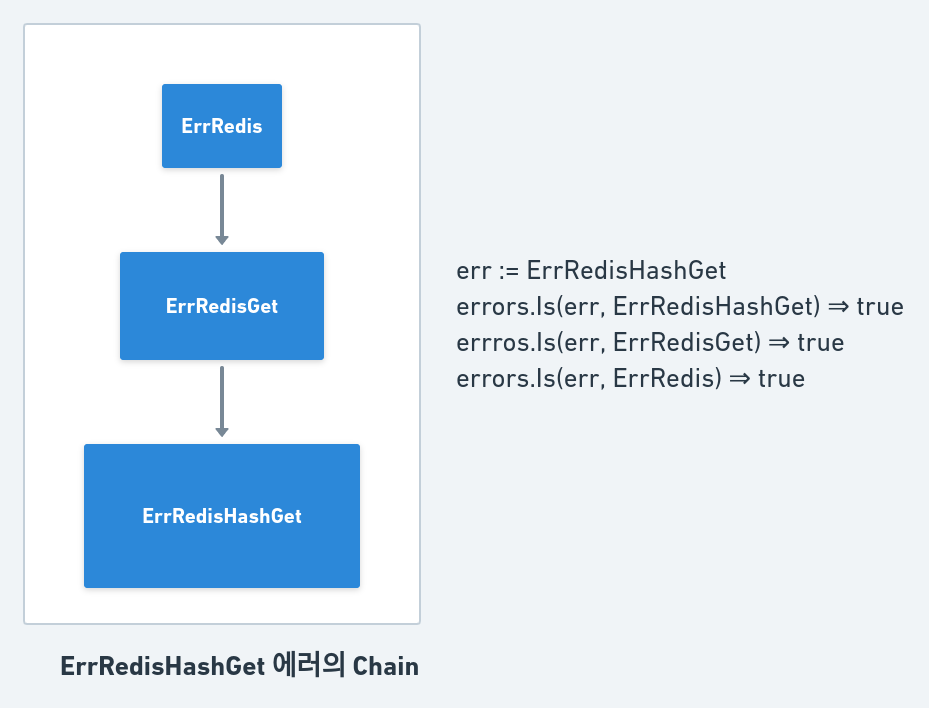
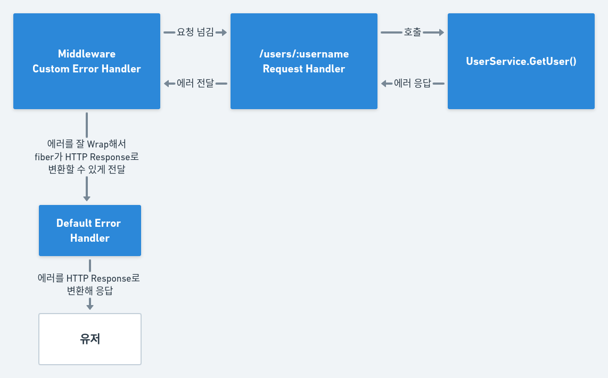

## 시작하며

드디어 에러를 다뤄볼 차례가 됐네요. 작년까지만 해도 `Error`나 `Exception` 처리의 중요성을 잘 몰랐던 것 같습니다. 하지만 API **클라이언트랑 작업을 하면 할수록 에러 처리의 중요성을 느끼게 되는 것 같아요**. 왜냐하면 백엔드에서 각각의 에러 케이스에 대한 `status_code`나 `error_type`등을 명확히 정의하지 않으면 클라이언트는 에러를 해석할 방법이 없기 때문입니다. 

또한 **에러를 잘 처리한 뒤 올바르게 응답하거나 로그를 남기는 것은 유지/보수 시에 백엔드 개발자 스스로 에게도 정말 중요**할 수 있습니다. 우리는 실제 운영 환경의 로그를 마치 우리가 로컬에서 개발할 때 처럼 항상 보고있을 수는 없기 때문이죠. 즉 에러 로그만 따로 "편리하게" 볼 수 있거나 에러 로그로 인한 Notification System이 있으면 훨씬 에러를 추적(Tracing)하기 쉽겠죠!

그리고 **`Golang`은 다른 언어들과 달리 Try Catch의 형태로 에러를 처리하지 않는다**는 점을 모두들 알고 계실 겁니다. 하지만 이 에러를 그럼 어떻게 처리하지에 대한 방안은 뚜렷이 인지하지 못한 경우가 많을 수 있습니다.(제가 그랬습니다. ㅎㅎ..) 그래서 대충 에러 로그를 출력하게만 하고 통일성 없는 방식으로 그때 그때 떠오르는 대로 에러처리를 해왔던 것 같아요.

그럼 이번 글에서는 에러를 왜 우아하게, 잘 처리해야하는지 살펴보고 그를 위한 방법도 소개해보겠습니다.

## 📦 에러를 Wrapping 하자

다른 언어들은 에러를 상속해 정의하는 방식을 이용하지만 **`Golang`은 에러를 `Wrapping`하는 방식을 이용**합니다. 좀 낯설어서 그렇지 익숙해지면 훨씬 간결한 것 같습니다.

예를 들어 Redis 관련 에러는 모두 추상적인 에러인 `RedisError`에 속하고 조회 도중 발생한 에러는 `RedisGetError`라고 정의하는 경우가 있다고 해보겠습니다. 자바의 경우는 다음과 같이 정의하겠죠.

```java
public class RedisError extends Exception{
    public RedisError(String msg){
        super(msg);
    }
}

public class RedisGetError extends RedisError{
    public RedisError(){
        super("레디스 조회 관련 에러")
    }
}

public class Something{
    public void somethingWithRedis(){
        try{
            redis.get("X");
        } catch (RedisGetError e){
            ... // 레디스 조회 관련 에러 케이스에 대한 대응
        } catch (RedisError e){
            ... // 레디스 조회를 제외한 레디스 관련 에러 케이스에 대한 대응
        } catch (Exception e){
            ... // 그 외의 모든 에러 케이스에 대한 대응
        }
    }
}
```

이렇게 Java의 경우는 `상속`을 통해 각 에러 케이스에 대해 대응합니다. 하지만 Golang에서는 주로 다음과 같은 방법으로 에러를 처리합니다.

1. `error.New(msg string)` 으로 sentinel error(더 이상 쪼갤 수 없는 최상위 에러 같은 느낌)를 정의

2. `fmt.Errorf("%s: %w", msg, sentinelErr)` 으로 sentinel error를 감싼(wrap) 자식 에러를 정의

   에러를 Wrapping 하면 sentinel error에 좀 더 정보를 추가할 수 있어 친절한 에러가 되죠!

3. `errors.Is(err, parentErr)` 으로 err의 wrapping chain에 parentErr이 존재하는지 판단

 에러를 Wrapping한다는 개념이 잘 이해되지 않는 분들은 [Wrapping and Un-wrapping of error in Go (Golang)](https://golangbyexample.com/wrapping-and-unwrapping-error-golang/)을 참고해주시면 좋을 것 같습니다.

그럼 Go에선 위와 같은 케이스가 어떻게 구현될 수 있는지 적어보겠습니다.

```go
var (
    ErrRedis = errors.New("레디스 관련 에러")
    ErrRedisGet = fmt.Errorf("조회 도중 에러: %w", ErrRedis)
)

type Something struct{}

func (s *Something) somethingWithRedis(){
    _, err := redis.Get("X");
    if err != nil{
        if errors.Is(err, ErrRedisGet){
            ... // 레디스 조회 관련 에러 케이스에 대한 대응
        } else if errors.Is(err, ErrRedis){
            ... // 레디스 조회를 제외한 레디스 관련 에러 케이스에 대한 대응
        } else{
            ... // 그 외의 모든 에러 케이스에 대한 대응
        }
    }
}
```

Go에서 error는 `interface`이기 때문에 간혹 `type assertion`을 이용해 에러의 타입을 비교하거나 직접 error variable와 비교하는 경우도 있긴합니다만 바람직하지는 않습니다. type assertion은 애초에 다소 불안하거나 번거로운 면이 있고 직접 error value와 비교하는 경우는 해당 error value를 제공하던 package가 추후에는 어떤 error value를 재정의할 지 모르기 때문입니다. **예를 들어 `ErrRedisGet` 를 리턴하던 패키지가 `ErrRedisGet` 를 Wrapping한 `ErrRedisHashGet` 를 리턴하는 형태로 변경됐다고 가정**합시다.

```go
var (
    ErrRedis = errors.New("레디스 관련 에러")
    ErrRedisGet = fmt.Errorf("조회 도중 에러: %w", ErrRedis)
)

func (r *redis) HashGet(key string) string, error{
    if (Hash Get 도중 에러가 발생한 경우){
        return "", ErrRedisGet // 이 버전에서는 ErrRedisGet을 리턴함.
    }
    ... // 에러가 발생하지 않은 경우
}

func (s *Something) somethingWithRedis(){
    _, err := redis.HashGet("X");
    if err != nil{
        if err == ErrRedisGet{
            // Redis 조회 도중 에러가 발생한 경우에 대한 대응
        }
        ...
    }
}
```

기존 버전에선 `ErrRedisGet` 을 리턴하고, 그 결과를 확인하는 메소드에서도 `ErrRedisGet` 과 직접 `==`으로 비교를 하니 올바르게 동작합니다. 



```go
var (
    ErrRedis = errors.New("레디스 관련 에러")
    ErrRedisGet = fmt.Errorf("조회 도중 에러: %w", ErrRedis)
    ErrRedisHashGet = fmt.Errorf("해쉬 조회 도중 에러: %w", ErrRedisGet)
)

func (r *redis) HashGet(key string) string, error{
    if (Hash Get 도중 에러가 발생한 경우){
        return "", ErrRedisHashGet // 이 버전에서는 ErrRedisGet을 리턴함.
    }
    ... // 에러가 발생하지 않은 경우
}

func (s *Something) somethingWithRedis(){
    _, err := redis.HashGet("X");
    if err != nil{
        // 만약 아래처럼 errors.Is를 이용하면 ErrRedisGet은 실제로 리턴된
        // ErrRedisHashGet의 wrapping chain에 존재하므로 기존과 동일하게
        // 올바르게 동작할 수 있음.
        // if errors.Is(err, ErrRedisGet){}
        
        // 하지만 이제는 ==을 통한 직접 비교는 예상한대로 동작하지 못함 ㅜㅜ
        if err == ErrRedisGet{
            ... // ㅜㅜ
        }
        ...
    }
}
```

하지만 다음 버전에선 `redis.HashGet()` 이 Hash에 대한 조회 도중 에러가 발생했을 땐 `ErrRedisGet`이 아닌 그것을 Wrap한 `ErrRedisHashGet`을 리턴한다면 기존의 `==`을 이용한 직접 비교는 올바른 결과를 가져다주지 못할 것입니다.

다소 어렵거나 낯설 수 있는 내용이라 간단한 내용을 위주로 예시를 들어봤습니다. 관심이 있으신 분들은 기본으로 제공되는 `errors` 패키지 외에 https://github.com/pkg/errors 라는 패키지를 이용하는 경우도 있으니 한 번 살펴보시면 좋을 것 같습니다.

자, 그럼 에러를 Wrap하라는 내용 하나 갖고 얘기를 주절 주절 길게 했으니 이제 실제로 웹 백엔드 개발에서의 에러 처리에 대해 알아봅시다~!

## 🤔 웹서버가 에러를 제대로 처리하지 않으면?

에러를 제대로 처리하지 않으면 일반적으로 웹 프레임워크들은 `500 Internal Error`로 응답하기 때문에 Client는 `500 Internal Error` 응답 밖에 받을 수 없습니다... 경우에 따라서는 Body는 올바르게 받을 수도 있긴하지만 매우 불안하죠. 에러의 원인을 모르니 클라이언트 측에서도 유저에게 **"알 수 없는 이유로 요청에 실패했습니다." 같은 메시지를 띄운다면 유저 경험도 당연히 좋지 않아지겠죠**.

각 에러 케이스에 적절히 대응해서 응답하면 클라이언트와 유저가 모두 잘 반응할 수 있을 것입니다.

* **로그인하지 않은 유저의 요청이라 에러가 난 경우** => 401 Unauthorized 응답 => 클라이언트는 유저를 로그인 창으로 안내함.
* 권한이 없는 유저의 요청이라 에러가 난 경우 => 403 Forbidden 응답 => 클라이언트는 유저에게 권한이 없어서 불가능하다는 친절한 오류 메시지를 띄움.
* **존재하지 않는 리소스에 접근해 에러가 난 경우** => 404 Not Found 응답 => 클라이언트는 유저에게 해당 리소스가 존재하지 않는다는 친절한 오류 메시지를 띄움.

## `Fiber`에서 에러 처리하는 법

`fiber`는 golang 웹 프레임워크들 중에서 문서가 참 잘 되어있는 편이라고 생각합니다. [Error Handling](https://docs.gofiber.io/guide/error-handling) 파트를 보면 웹 프레임워크단에서는 어떻게 에러를 처리할 지 간단히 살펴볼 수 있습니다. Default Error Handler는 기본적으로 사용되는 것이고, Custom Error Handler을 따로 정의해 이용을 할 수도 있습니다. 하지만 저는 저번 시간에 다뤘던 `Middleware` 방식을 이용해 에러를 잘 처리해보겠습니다.



간단히 조금 설명을 드리자면 Fiber에서 제공하는 Error Handler는 `fiber.Handler`들이 리턴한 error 타입을 실제 HTTP Response로 어떻게 변환을 할까에 대한 내용을 포함하고 있는 것이고, 제가 정의하는 미들웨어 방식의 Error Handler는 하나의 middleware로서 다른 `fiber.Handler`(미들웨어 혹은 요청 핸들러)가 리턴한 error을 fiber의 Default Error Handler가 이해할 수 있는 fiber의 error type으로 변환시키는 것이라고 보시면 됩니다.

### 예시 - username으로 User 조회

전체 코드는 이전 글들과 마찬가지로 제 깃헙 [umi0410/how-to-backend-in-go](https://github.com/umi0410/how-to-backend-in-go/tree/master/errorhandle)에 올려두겠습니다. 글에서는 간단한 코드 비교와 HTTP 응답만 설명드릴게요.

에러를 잘 Wrapping한 정도에 따라 다르게 응답하는 세 가지 경우가 있습니다.

* **Worst** - 에러를 어딘가에 정의하지도 Wrap하지도 않은 익명 에러 리턴 => 적절히 에러를 판단할 수 없어 500 Error
* **Ungraceful** - 어딘가에 정의된 Error을 리턴 => 에러를 적절히 판단해 올바른 Status code로 응답은 가능하지만 에러에 대한 자세한 문맥이나 설명이 없음.
* **Graceful** - 에러를 잘 Wrap해서 리턴 => 에러를 적절히 판단해 올바른 Status code로 응답할 수 있고 에러에 대한 자세한 문맥이나 설명도 클라이언트에게 제시됨.

코드로 보면 다음과 같습니다.

```go
var (
	ErrResourceNotFound = errors.New("존재하지 않는 리소스")
	users = []*User{
		&User{Name: "우미잉", Age: 25, Username: "umi0410"},
	}
)

... 생략

func (svc *UserService) GetUserWorst(username string) (*User, error) {
	for _, user := range users {
		if user.Username == username {
			return user, nil
		}
	}

	return nil, errors.New("유저가 존재하지 않는 유저(username=" + username + ")")
}

func (svc *UserService) GetUserUngracefully(username string) (*User, error) {
	for _, user := range users {
		if user.Username == username {
			return user, nil
		}
	}

	return nil, ErrResourceNotFound
}

func (svc *UserService) GetUserGracefully(username string) (*User, error) {
	for _, user := range users {
		if user.Username == username {
			return user, nil
		}
	}

	return nil, fmt.Errorf("입력된 username=%s: %w", username, ErrResourceNotFound)
}
```

위와 같이 에러와 에러를 리턴하는 서비스 메소드들을 정의하고 커스텀 에러 핸들러로서의 미들웨어는 아래와 같이 작성했습니다.

```go
func customErrorHandler(ctx *fiber.Ctx) error {
	// 다음 핸들러를 호출한 뒤
	// 본 미들웨어의 작업은 사후처리!
	err := ctx.Next()
	if err != nil {
		log.Error(err)
		if errors.Is(err, ErrResourceNotFound) {
			// fiber의 Default Error Handler가 알아들을 수 있는 형태의 fiber Error을 리턴
			return fiber.NewError(404, err.Error())
		}
	}

	return err
}
```

이 미들웨어는 다른 일반적인 미들웨어들과는 약간은 다르게 동작한다고 볼 수 있는데요. **대부분의 미들웨어들은 요청을 실제로 처리하기 전에 자신의 작업을 수행하는 사전처리 방식을 이용**하는데요. 예를 들어 저번 글에서 살펴본 basic auth 미들웨어는 요청을 처리하는 핸들러 이전에 미들웨어로서 요청자의 인증 정보를 기입(사전처리)하는 역할을 했죠. 하지만 **이 미들웨어는 요청을 처리하는 핸들러의 결과 에러를 이용하기 때문에 미들웨어가 시작하자마자 다음 핸들러를 호출하고 그 결과 에러를 이용합니다. 사후처리 방식이죠!**

그럼 이제 customErrorHandler가 리턴한 에러를 fiber의 Default Error Handler가 잘 처리해줄 것입니다.


```text
$ curl  http://localhost:8000/worst/jinsu -w "\t%{http_code}\n"
유저가 존재하지 않는 유저(username=jinsu)	500

$ curl  http://localhost:8000/ungraceful/jinsu -w "\t%{http_code}\n"
존재하지 않는 리소스	404

$ curl  http://localhost:8000/graceful/jinsu -w "\t%{http_code}\n" 
입력된 username=jinsu: 존재하지 않는 리소스	404
```

응답을 보시면 worst case의 경우 status code가 500이기 때문에 클라이언트가 해당 에러 케이스에 대해 올바른 처리를 할 수 있는 방법이 없습니다.. 응답을 정규표현식을 이용해 판단해야할까요..? ㅎㅎ...

그리고 ungraceful case의 경우 status code는 404로 잘 정의되었지만 응답 바디가 다소 불친절해 클라이언트측에서 디버깅하기가 힘들겠죠.

반면 graceful한 경우에는 status code도 잘 정의되었고 에러 바디도 자세합니다 굿굿이에요!

## 마치며

정말 작년까지는 에러를 핸들링하는 것에 대해 별 생각이 없었던 것 같습니다. 하지만 사이드 프로젝트를 하면서 에러를 제대로 처리하지 않아 `Index Out Of Range 런타임 에러` 하나에도 서버가 종료되어버린다거나 모든 에러를 `500 Internal Error`로 리턴해버리는 케이스를 겪으면서 '_아... 에러를 잘 처리해야 하는구나_'를 느껴볼 수 있었고, 실제 프로덕트를 개발하면서 '_클라이언트 측에서 에러에 대한 적절한 액션을 취하기 위해선 status code나 error_type등을 잘 전달해야겠구나_' 라는 생각도 해볼 수 있었던 것 같습니다.

게다가 Go에서 에러를 처리하는 방법에 대해 깊게 생각을 못해봤었는데 [yorkie](https://github.com/yorkie-team/yorkie) 라는 오픈소스에 기여([PR #222](https://github.com/yorkie-team/yorkie/pull/222) )하게 되면서 멘토님께서 잘 이끌어주셔서 에러를 Wrapping한다는 개념에 대해 자세히 알아볼 수 있었던 기회가 된 것 같습니다.

이번에 [디프만](https://www.depromeet.com/) 10기로 활동하게 되었는데 10기 인터뷰 당시에도 클라이언트와 협업하면서 어려웠던 점과 해결해나간 방식과 관련된 질문을 받았을 때에도 에러 핸들링과 관련지어 답변을 했을만큼 에러 핸들링은 '_그래도 내가 한편으로는 아직 성장하고 있나보다.. ㅎㅎ_'를 느낄 수 있었던 새로운 경험이었던 것 같습니다! 이 글을 읽으시는 **여러분들도 이제 에러 잘 처리하고 저와 함께 클라이언트에게 칭찬받는 백엔드 개발자가 되어봅시다**~!

## 참고

* Working with Errors in Go 1.13 - https://go.dev/blog/go1.13-errors
* Wrapping and Un-wrapping of error in Go (Golang) - https://golangbyexample.com/wrapping-and-unwrapping-error-golang/
* Add RPC Config validation and handle the errors ([yorkie](https://github.com/yorkie-team/yorkie) PR #222) - https://github.com/yorkie-team/yorkie/pull/222
* fiber docs Error Handling - https://docs.gofiber.io/guide/error-handling
* Error는 검사만 하지말고, 우아하게 처리하세요. - http://cloudrain21.com/golang-graceful-error-handling

