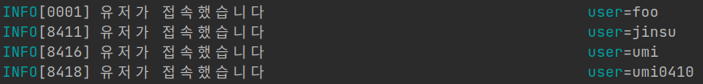

## 시작하며

안녕하세요. 저번 글에서는 `fiber` 라는 웹 프레임워크로 간단히 웹 애플리케이션을 만드는 방법에 대해 알아봤으니
이번엔 웹 애플리케이션을 만들다보면 꼭 필요해지는 `middleware` 작성법에 대해 알아보겠습니다.
여태까지 백엔드에서 서버를 개발하면서는 `JS`의 `Express` 프레임워크를 제외하고는 미들웨어 개발이 그닥 쉽게 이해되는 부분은 아니었던 것 같습니다.
`Express`에서 미들웨어를 작성하는 방법은 굉장히 직관적이고 문서도 많은 편이었거든요. 하지만 `Spring`은 `Filter`나 `Interceptor`를 이해하기 위해 많은 내용을 알아야하고,
`Django`는 Class based나 function based, 그리고 middleware를 추가하는 법 등이 좀 복잡한 편이라고 생각합니다.

그리고 `Golang`은 아무래도 코드로 말하는 사람들이 많아서인지 그닥 **middleware 작성과 같은 부분들이 문서로 잘 나와있진 않고, 코드를 까보면서 만드는 경우가 많았던 것 같습니다.**
그래서 이번 글에서는 **`fiber` 로 웹서버를 띄우면서 간단히 미들웨어 하나 만들어보겠습니다.**

1. 제공되는 `Basic Authentication` middleware을 이용해 요청 유저를 식별
2. 식별된 유저 정보가 삽입된 logger를 `context`에 주입

이렇게 하면 이후 service layer등에서는 요청 유저가 삽입된 logger을 통해 로그를 작성하니 로그 추적하기가 용이해지겠죠? ㅎㅎ
(BasicAuth를 이용하는 이유는 남이 작성한 미들웨어를 가져다쓰는 방법을 편하게 알아보기 위함일 뿐 인증 방법으로 권장해서는 아닙니다.)

## 미들웨어?? 그게 뭐야? 왜 필요해?!

웹 프레임워크에서 말하는 미들웨어는 보통 요청에 따른 핸들러를 수행하기 전 혹은 수행한 후에 수행하는 작업을 말합니다. 주로 체인의 형태라고 보시면 되고
한 미들웨어에서 응답을 완료하면 걔가 요청 핸들러의 역할을 하게 된다고 보면 될 것 같습니다. 응답을 완료하지 않으면 다음 미들웨어를 호출하죠.

서버 개발을 처음할 때는 미들웨어의 필요성을 잘 느끼지 못할 수 있습니다. 하지만 어느정도 개발을 하거나 배포를 해나가다보면 _'아... 모든 요청마다 ~~~한 작업을 수행하고 싶은데'_ 이런 생각이 들 때가 있을 수 있습니다.
예를 들어 **API 별로 레이턴시를 체크**하고 싶을 수도 있고, **body나 query string을 로그**로 남기거나 **어떤 유저의 요청인지 매 요청마다 정보를 주입**하고 싶을 수 있죠.
이런 경우 middleware를 이용하면 모든 요청은 미들웨어를 거치면서 처리되기 때문에 편리하게 작업할 수 있습니다!

대표적으로는 `인증`이나 `캐싱`, `로깅`, `응답 타임아웃` 등에 사용하고 있는 것 같아요!

## 남이 만든 미들웨어 사용해보기 - BasicAuth

Go를 통해 개발하는 이상 저희는 문서에만 의존할 수는 없습니다. 코드를 까봐야죠 !_!
[Guidelines for creating Middleware - fiber Github Issue](https://github.com/gofiber/fiber/issues/338) 이슈에는 미들웨어 작성에 대한 몇 가지 가이드라인이 제시되어있더라구요.
참고해보시면 좋을 것 같기도 합니다.

저는 [gofiber/fiber/middleware/basicauth](https://github.com/gofiber/fiber/blob/master/middleware/basicauth) 의 코드를 바탕으로 해석해보겠습니다. 링크를 따라가면 README가 있긴하지만 정보가 많지는 않죠.

```go
// fiber의 basicauth 미들웨어 코드 중 일부입니다.

// Config defines the config for middleware.
type Config struct {
	// Next defines a function to skip this middleware when returned true.
	//
	// Optional. Default: nil
	Next func(c *fiber.Ctx) bool

	// Users defines the allowed credentials
	//
	// Required. Default: map[string]string{}
	Users map[string]string

	// Realm is a string to define realm attribute of BasicAuth.
	// the realm identifies the system to authenticate against
	// and can be used by clients to save credentials
	//
	// Optional. Default: "Restricted".
	Realm string

	// Authorizer defines a function you can pass
	// to check the credentials however you want.
	// It will be called with a username and password
	// and is expected to return true or false to indicate
	// that the credentials were approved or not.
	//
	// Optional. Default: nil.
	Authorizer func(string, string) bool

	// Unauthorized defines the response body for unauthorized responses.
	// By default it will return with a 401 Unauthorized and the correct WWW-Auth header
	//
	// Optional. Default: nil
	Unauthorized fiber.Handler

	// ContextUser is the key to store the username in Locals
	//
	// Optional. Default: "username"
	ContextUsername string

	// ContextPass is the key to store the password in Locals
	//
	// Optional. Default: "password"
	ContextPassword string
}
```

위의 코드가 BasicAuth 미들웨어의 설정을 담당하는 Config 타입에 대한 코드입니다. 간단히 몇 개만 알아두면 이해하는 데에 도움이 되는 것들만 짚어보겠습니다.

* `Next` - nil이 아닌 경우 `Next(*fiber.Ctx)`가 true를 반환하면 Basic Auth 미들웨어 자체를 건너뜀.
* `Users` - 이 map에 정의된 유저만이 유효한 유저로 이용될 수도 있음. (Authorizer가 nil인 경우 이 정보를 바탕으로 인증 진행)
* `Authorizer` - 인증 로직을 담당함. nil로 둘 경우 Users에서 일치하는 유저를 찾음. 여길 커스터마이징해서 DB에서 찾거나 할 수도 있음.
* `ContextUsername`, `ContextPassword` - 인증 후 Context에 어떤 키로 각 정보를 담을지. (기본값은 "username", "password")

오호.. 막상 코드를 까보니 그닥 어렵지 않죠?! 그럼 과연 이 코드들이 설명한 게 맞는지 한 번 서버를 띄워봅시다.

### Basic Auth 미들웨어를 다양하게 설정해보기

#### 1. 항상 인증에 성공하는 Authorizer를 이용하는 Config
```go
// newBasicAuthConfigAlwaysAllow 는 언제나 인증에 성공하는 Authorizer를
// 이용하는 Config를 만듭니다.
func newBasicAuthConfigAlwaysAllow() *basicauth.Config{
	return &basicauth.Config{
		Authorizer: func(username string, password string) bool {
			return true
		},
	}
}

func main(){
    ...
    app.Use(basicauth.New(*newBasicAuthConfigAlwaysAllow()))
    ...
}
```
```text
# curl -u username:password는 해당 username과 password로 Basic auth를 하는 요청을 보냅니다.

$ curl -u wrong:wrong localhost:8000
Welcome!

$ curl -u foo:bar localhost:8000
Welcome!
```

Authorizer가 username과 password가 어떻든 true를 반환해 인증에 성공합니다.

#### 2. 미리 정의된 유저에 대해서만 인증에 성공하는 Authorizer를 이용하는 Config
```go
// newBasicAuthConfigAlwaysAllow 는 Users에 존재하는 유저 정보에 대해서만
// 인증에 성공하는 Authorizer를 이용하는 Config를 만듭니다.
func newBasicAuthConfigAllowOnlyAdmin() *basicauth.Config{
	return &basicauth.Config{
		Users: map[string]string{
			"foo": "bar",
		},
	}
}

func main(){
    ...
    app.Use(basicauth.New(*newBasicAuthConfigAllowOnlyAdmin()))
    ...
}
```
```text
# curl -u username:password는 해당 username과 password로 Basic auth를 하는 요청을 보냅니다.

$ curl -u wrong:wrong localhost:8001
Unauthorized

$ curl -u foo:bar localhost:8001
Welcome!
```

앞서 말했듯 Authorizer를 설정하지 않고 nil로 둘 경우 Users 맵의 데이터를 이용하는 Authorizer가 기본값으로 설정됩니다.
저는 `username=foo, password=bar`인 유저 정보를 맵에 기록했기 때문에 foo:bar 요청만이 승인되는 것을 볼 수 있습니다.

자, 이렇게 남이 작성한 미들웨어를 설정만 조금 바꿔서 이용해봤는데, 코드를 읽는 것도 그걸 바탕으로 가져다가 쓰는 것도 어렵지 않다는 걸 알게 됐군요.
이제는 직접 미들웨어를 작성해보겠습니다.

## Custom middleware 작성하기

커스텀으로 미들웨어를 작성할 때에는 그닥 정해진 기준이 많지는 않습니다. 
대부분의 미들웨어들은 Skipper 등의 개념으로(basic auth 미들웨어에선 Next라고 정의됨.) 해당 미들웨어의 기능을 실행하지 않고 넘어가는 설정이나
뭐 각종 설정들이 존재는 하지만 우리는 근본적으로 커스텀 미들웨어를 어떻게 작성하는지에 대해 궁금하니까 그 부분만 알아보겠습니다.

```go
package fiber
...
// Handler defines a function to serve HTTP requests.
type Handler = func(*Ctx) error
```

fiber 프레임워크에서는 middleware을 정의할 때 `fiber.Handler` 라는 일종의 함수 타입을 이용합니다. 그리고 `fiber.Handler`는 보통은 클로져를 이용하는 형태로 제공됩니다.
제가 볼 땐 좀 특이한 것 같은데 아마 echo도 이런 식으로 클로져를 이용해 미들웨어를 생성했던 것 같습니다. 다음과 같이 말이죠.

```go
func NewMiddleware(config Config) fiber.Handler {
    // config에 기본값을 넣은 config를 클로져로 접근하려 함.
    config = injectDefaultValues(config)
    
    // 실제 미들웨어 역할을 할 함수.
    // config에 클로져로 접근한다.
    return func(c *fiber.Ctx) error{
        ...
        // 다음 미들웨어(혹은 요청 핸들러)를 수행한다.
        return c.Next()
    }
}
```

근데 이런 경우는 아무래도 config를 설정해야하는 경우인 것 같고 저희는 그냥 최대한 심플하게 만들어볼게요. 목표는 Basic Auth를 거친 뒤 유저 정보가 기입된 logger를 context에 삽입해주는 것입니다.
그럼 어떤 계층에서든 `ctx.Get("logger")` 등을 이용해 logger에 편리하게 접근할 수 있죠! log 프레임워크는 `sirupsen/logrus` 를 이용하겠습니다.
컬러도 잘 나오고 확장성도 좋은 걸로 알고 있어요!

```go
var injectLoggerMiddleware = func (ctx *fiber.Ctx) error{
    // basic auth middleware가 주입한 username을 이용합니다.
	username := ctx.Locals("username")
	logger := log.WithField("user", username)
	// context에 logger라는 키로 유저 정보를 주입한 logger를 전달합니다!
	ctx.Locals("logger", logger)

	// 다음 미들웨어(혹은 요청 핸들러)를 수행합니다.
	return ctx.Next()
}

func main(){
    ...
    // injectLoggerMiddleware는 basicauth가 context에 주입한 username을 이용하기 때문에
    // 꼭 basicauth middleware 다음에 수행되어야합니다!
    app.Use(basicauth.New(*newBasicAuthConfigAllowOnlyAdmin()))
    app.Use(injectLoggerMiddleware)
    
    // 요청 핸들러는 이런 식으로 middleware에게 주입받은 logger를 context에서 꺼내쓸 수 있습니다.
    app.Get("", func(ctx *fiber.Ctx) error {
        logger := ctx.Locals("logger").(*log.Entry)
        logger.Info("유저가 접속했습니다")
        return ctx.SendString("Welcome!\n")
    })
    ...
}
```



그럼 다음과 같이 Basic Auth를 통해 각각 다른 유저로 요청을 보내면 해당 요청을 처리하는 동안은 해당 context 속의 logger을 이용해 로그를 남길 수 있는 걸 볼 수 있습니다.
이렇게 정리해보니 golang에서도 middleware를 작성하는 게 그리 어렵지 않네요~! 

## 마치며

`echo` 프레임워크를 쓰면서는 미들웨어를 작성할 때 좀 애를 먹었던 기억이 있는데, 막상 `fiber`로 미들웨어를 작성해보니
생각보다 많이 직관적이고 쉬워서 좀 놀랐습니다. _(사실 글을 쓸 필요가 없었을지도..?)_ 그래도 Go로 작성된 한글 자료도 많아졌으면 좋겠고,
누군가는 `fiber` 미들웨어를 작성하는 방법이 좀 이해되지 않고 어려우실 수 있으니 도움이 될 수 있으면 좋겠습니다 ㅎㅎ
다음엔 서버 개발에 있어 또 하나의 중요한 점인! 에러 핸들링에 대해 알아보겠습니다! 감사합니다.

## 참고

* [Guidelines for creating Middleware - fiber Github Issue](https://github.com/gofiber/fiber/issues/338)
* [Fiber middleware](https://github.com/gofiber/fiber/tree/master/middleware)
* [Fiber error handling](https://docs.gofiber.io/guide/error-handling)
* [Redhat - 미들웨어란](https://www.redhat.com/ko/topics/middleware/what-is-middleware)