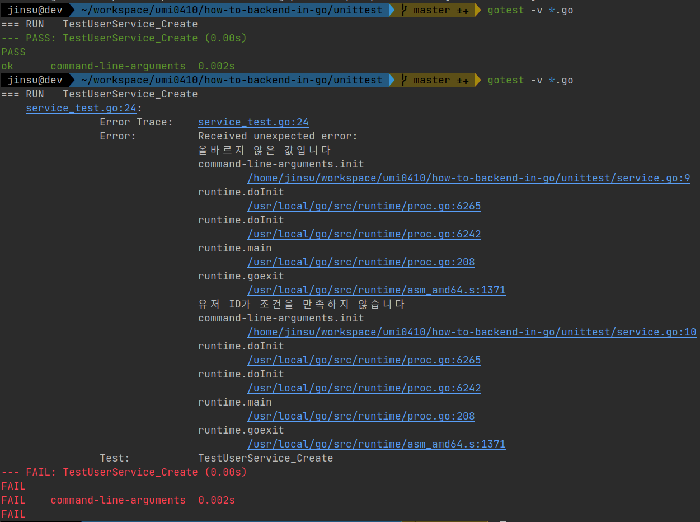
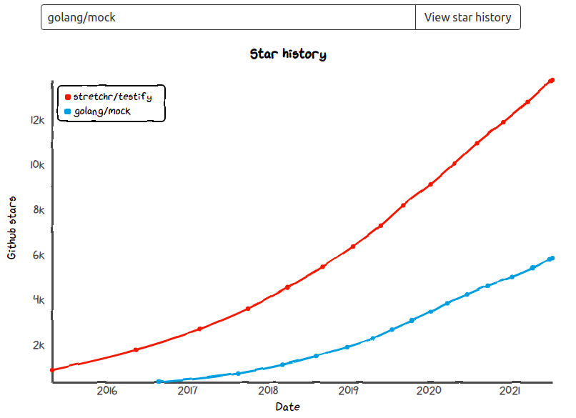
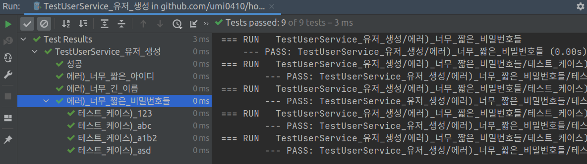
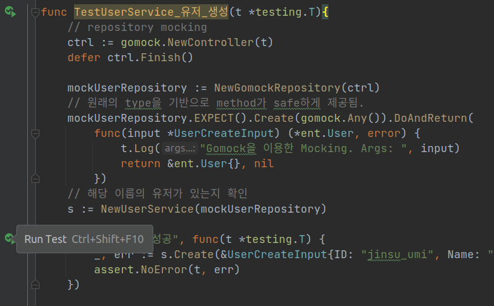

## 시작하며

저는 `Go 언어`를 공부하면서 거의 처음으로 본격적인 테스트 코드를 작성하게 되었습니다. 과거에는 그저 기능을 구현하는 것에만 관심이 있었지 애플리케이션을 어떻게 계층을 나눠 설계할지, 어떻게 해야 유지 보수하기 쉬우면서 안정적인 개발을 할 수 있을지에 대한 고민을 하지 않았습니다. 하지만 Go를 공부하면서 `클린 아키텍쳐`나 `MSA`, `동시성 패턴` 등을 비롯해 `테스트 코드`에 대해서도 공부해볼 수 있었습니다.  그 중에서도 테스트 코드에 대해 공부해보며 익혔던 점들을 바탕으로 이번 글에서는 **Golang으로 백엔드 개발을 하면서 테스트 코드를 어떻게 작성할 수 있을지**에 대해 알아보려합니다.


본 글에서 사용된 예시 코드는 [저의 Github how-to-backend-in-go 레포지토리](https://github.com/umi0410/how-to-backend-in-go/tree/master/testcode)에 업로드 해둘테니 참고하실 분들은 참고해주세요~!

## TDD (Test Driven Development)와 유닛 테스트

사용자의 반응에 맞춰 재빠르게 대응할 수 있도록 개발 주기가 빨라지면서 `DevOps` 문화 뿐만 아니라 `TDD`도 많은 인기를 얻게 된 것 같습니다. `TDD`란 개발을 먼저 다~ 진행한 뒤 한 번에 배포하거나 시간 날 때 테스트 코드를 짜는 것이 아니라  우리가 개발해야할 최소한의 내용들을 검증할 수  있는 테스트 코드를 먼저 작성한 뒤 해당 테스트를 통과하는 코드를 개발해나가는 개발 방법론입니다.

TDD에 대해 설명하자면 TDD만으로도 책 몇 권의 분량이 될 수 있고, 저 또한 TDD를 잘 아는 것은 아니기에 자세한 설명은 생략하겠습니다. **이번 글의 주된 내용은 TDD에 대해 소개하는 것보다는 Golang으로 유닛 테스트를 작성**하는 요령입니다.

유닛 테스트는 다른 계층과 무관하게 독립적으로 각각의 메소드의 기능을 테스트하는 것이라고 볼 수 있겠습니다. 계층마다 해당 테스트를 통해 검증하고자 하는 주요한 내용은 다를 수 있습니다. 유닛 테스트는 주로 자신만을 테스트 하기 때문에 자기 계층의 동작을 테스트하지 다른 계층의 동작까지 테스트하진 않습니다. 또한 경우에 따라 아예 다른 계층을 실제로 이용하지 않고 모킹(Mocking)한 타입을 이용하는 경우도 있습니다.

1. **Data access layer**

   * `userRepository.Create(user *entity.User)` - 유저 테이블에 해당 데이터가 잘 저장되는지 테스트

2. **Business layer**

   * `userService.Create(ctx *fiber.Ctx, user UserCreateInput)` - 유저 생성 관련 비즈니스 로직을 주로 테스트.

     DB에 잘 영속화 되었는지 까지는 테스트 할 필요 없음. 이는 Data access layer에서 테스트 할 내용

3. **Presentation layer**

   * `userHandler.Craete(ctx *fiber.Ctx)` - 응답 코드가 바라던 대로 `201` 번이 맞는지. JSON으로 잘 응답하는지

     마찬가지로 DB에 잘 영속화 되었는지까지는 테스트할 필요 없음. 이는 Data access layer에서 테스트 할 내용.

     또한 어떤 business layer의 비즈니스 로직에 대해서도 자세히 테스트 할 필요 없음. 이 또한 Business layer에서 테스트할 내용

참고로 **저는 Business layer를 위주로 테스트**하고 있습니다. Data access layer의 경우 많은 부분이 Database framework(ORM)을 통해 검증이 되었고, Presentation layer도 Web framework들에 의해 많은 부분이 검증되었을 뿐 아니라 포스트맨 같은 도구들을 통해 확인해보기도 쉽기 때문입니다. 반면 Business layer의 동작은 매번 눈으로 혹은 머리로 확인하기 쉽지 않기 때문입니다.

## Unit test를 도입하기 전에 알아두면 좋은 것들

1. 테스트를 위한 의존성 주입 및 변수 초기화 방법
2. mocking에 대하여
3. assert 구문 이용

Spring을 바탕으로 개발하는 경우 JUnit이라는 테스트 프레임워크를 주로 이용하고 이를 통해 테스트하는 방식이 거의 정형화 되어있는 것 같습니다. 하지만 Golang은 그닥 테스트 코드를 작성하는 형태가 정형화되어있지는 않습니다. 하지만 어떤 언어나 프레임워크를 통해 유닛 테스트 코드를 사용하든 위의 세 가지 항목들을 어떻게 이용할 지 알아야할 것입니다.

### 1. 테스트를 위한 의존성 주입 및 변수 초기화 방법

어떠한 모듈이 자신의 멤버 변수들을 내부적으로 생성하는 것이 아니라 외부에서 주입 받는 형태인 `의존성 주입`은 유연한 의존성 관리를 위해 권장됩니다. 예를 들어 User에 대한 도메인/비즈니스 로직을 실행하며 UserRepository를 이용해 User를 영속적으로 저장하기도 하는 UserService가 UserRepository에 의존하는 경우를 살펴봅시다.

```go
// 1. 의존성 주입 형태 - Good
func NewUserService(userRepository UserRepository) *UserService{
    return &UserService{
        userRepository: userRepository,
    }
}

// 2. 의존성을 주입하지 않는 형태 - Bad
func NewUserServiceWithoutInjection(client *ent.UserClient) *UserService{
    return &UserService{
        userRepository: NewUserRepository(client),
    }
}
```

**첫 번째 - 의존성 주입 형태**는 테스트 하는 경우나 개발 환경에 따라 유동적으로 적절한 UserService가 이용할 UserRepository를 주입받을 수 있습니다. 즉 실제로 **API 서버를 구동시킬 때에는 `NewUserService(userRepository UserRepository)` 메소드에 실제로 DB를 이용하는 Repository인 `UserRepositoryImpl` 을 주입하고, 유닛 테스트를 수행할 때에는 모킹한 타입인 `MockUserRepository`를 주입**하는 것입니다.

**두 번째 - 의존성을 주입하지 않는 형태**는 자신이 의존하는 UserRepository가 이미 `NewUserServiceByItSelf`라는 메소드에서 `NewUserRepository` 라는 메소드를 통해 특정 UserRepository를 이용하도록 정의되어있기 때문에 Mocking을 적용하기도 힘들고, 만약 다른 모듈들 또한 UserRepository를 이용하는 경우 Singleton으로 이용하지 못하고 여러 UserRepository가 생성될 수도 있습니다.  사실 ent.UserClient라는 DB Client 또한 주입받지 않고 내부적으로 새로 생성해야 의존성을 완전히 주입받지 않는 형태이겠지만 그런 방식은 너무도 구현하기 번거로워 편의상 DB client는 주입받았습니다. 이것만 봐도 개발하는 형태가 일관되지 못하고 불편한 사항이 많다는 것을 알 수 있죠.

### 2. Mocking에 대하여

`모킹`이란 실제로 서버가 실행될 때 사용하는 모듈이 아닌 가짜 모듈을 이용하는 기법입니다. 앞에서 잠깐 언급했듯이 종종 테스트 코드 작성 시에 종종 Mocking이 이용됩니다. 의존성 주입 패턴을 통해 테스트 코드에서는 실제 type이 아닌 Mocking type을 유동적으로 주입할 수 있습니다. 잘 와닿지 않을 수 있는데 예를 들어 UserService의 비즈니스 룰과 로직이 잘 동작하는지를 확인할 때 Data access layer의 동작까지 테스트하고 싶지 않을 수 있습니다. 이 경우 Data access layer의 모듈을 가짜 타입으로 모킹합니다.

```go
type MockUserRepository struct{}

func (m MockUserRepository) Create(input *UserCreateInput) (*ent.User, error) {
    return &ent.User{
        ID: input.ID,
        Password: input.Password,
        Name: input.Name,
    }, nil
}

func TestUserService_Create(t *testing.T){
    // 해당 이름의 유저가 있는지 확인
    s := NewUserService(new(MockUserRepository))

    _, err := s.Create(&UserCreateInput{ID: "jinsu_umi", Name: "Jinsu Park", Password: "123123123"})
    assert.NoError(t, err)
}
```

이런 식으로 MockUserRepository 타입에서는 Create 메소드가 직접 DB에 유저를 영속화하는 작업을 생략한 뒤 그럴싸한 리턴값을 리턴하도록만 구현함으로써 UserRepsotiroy를 모킹하는 것입니다.

하지만 이렇게 수작업으로 Mock type을 매번 정의하는 것은 귀찮을 수 있죠. 따라서 이번 글의 뒤에서는 mocking framework들에 대해서도 정리해보겠습니다.

> 종종 Stub과 Mock에 대해 혼동이 올 수 있습니다. 기본적으로 실제 모듈이 아닌 가짜 모듈을 이용하는 기법 자체를 mocking이라고 합니다. 이를 좀 더 세분화해서 봤을 땐 stub은 단순히 테스트를 간단히 통과시키기 위해 실제 모듈을 대체하는 가짜 객체를 말하고 mock은 예상값까지 비교를 하고, 때때로 테스트를 실패시키기도 하는 더 스마트한 stub이라고 볼 수 있다고 합니다.
>
> 참고: https://stackoverflow.com/questions/3459287/whats-the-difference-between-a-mock-stub

### 3. assert 구문 이용하기

```go
func TestUserService_Create(t *testing.T){
    // 해당 이름의 유저가 있는지 확인
    s := NewUserService(new(MockUserRepository))
	t.
    _, err := s.Create(&UserCreateInput{ID: "jinsu_umi", Name: "Jinsu Park", Password: "123123123"})
    // 이런 식으로 로그를 통해 하나 하나 테스트 결과를 확인하는 것이 아니라
    //t.Log("에러가 존재하지 않아야합니다.")
    //t.Log("err == nil 인지 확인하십시오. err == nil: " , err == nil)
    // assert를 이용해 자동으로 성공/실패를 판단합니다.
    assert.NoError(t, err)
}
```

`assert` 라는 방식을 통한 테스트 케이스 검증은 다양한 테스트 프레임워크에서 사용됩니다. 눈으로 하나 하나 테스트 케이스들의 결과를 확인하는 것이 아니라 assert라는 방식을 통해 자동으로 테스트의 성공/실패를 판단하는 것입니다. 저는 주로 `github.com/stretchr/testify` 패키지의 `assert` 메소드를 이용하고 있습니다.



assert를 통해 테스트의 성공/실패 여부를 판단하면 성공시에는 크게 stdout을 확인할 필요 없고, 실패한 경우에는 그것에 대한 에러 메시지들만 확인하면 되기 때문에 편리합니다. 만약 로그나 프린트 문을 통해 수작업으로 테스트 결과를 판단해야한다면... 매번 테스트마다 너무 불편하겠죠?!

## Golang에서 Mocking 이용하기

이번엔 Golang에서 Mocking을 이용하는 방법을 좀 더 자세히 알아보겠습니다. golang에서 Mocking을 이용하는 방법은 크게 3가지로 나눌 수 있을 것 같습니다.

1. 직접 Mock type 구현하기
2. `golang/mock` 즉 `gomock` 프레임워크 이용하기
3. `stretchr/testify/mock` 프레임워크 이용하기

자바의 경우 따로 미리 mock 타입(즉 가짜 타입)을 작성해놓지 않더라도 그리고 기존 타입이 interface가 아닌 concrete한 일반 class이더라도 상속 혹은 프록시를 통해 mock 타입을 이용할 수 있습니다. 반면 Golang은 투명한 동작과 엄격한 타입이 특징인 만큼 테스트 진행 시에 자동으로 적절한 mock 타입을 생성하거나 프록시를 이용하거나 interface가 아닌 struct에 다른 type의 struct를 할당할 수도 없습니다. 따라서 Go에서 mocking을 이용하기 위해서는 아래와 같은 제약 조건들이 존재합니다. 이러한 점을 생각해본다면 Go에서는 Mocking을 이용하는 것은 다른 언어에 비해 쉬운 편은 아닌 것처럼 느껴지기도 합니다.

* interface로 선언된 변수에만 mock type을 할당할 수 있다.
* mock type을 직접 정의하거나 mocking framework을 이용해 코드를 생성한다.(테스트 진행 시 자동이 아님. 직접 우리가 실행시켜야함.)

주로 1번(직접 Mock type 구현하기) 같은 경우는 이 mock 타입이 우리 서비스에서 자주 사용될 것이고 그냥 예상치못한 call이나 missing call(호출되길 예상했지만 호출되지 않는 경우)에 대한 대응이 필요 없는 경우 사용하면 좋을 것 같습니다. 반면 2, 3번은 이번 테스트를 위한 1회성 mocking인 경우 많이 사용되기도 하고 mock 타입의 메소드에 대한 unexpected call이나 missing call 에 대한 대응을 수행하고자하는 경우 이용할 수 있습니다.

추가적으로 1번 방식이 아닌 2, 3 번 방식처럼 모킹 프레임워크를 이용하는 게 더 편했던 적이 있는데요. 바로 메소드가 여러 개 존재하는 타입을 모킹할 때 입니다. Golang이 지향하는 방향 자체가 interface는 많은 메소드를 갖지 않는다는 것이긴 하지만 뭐.. 경우에 따라 메소드가 많아질 수도 있죠 ㅎㅎ. interface를 모킹하기 위해 별로 테스트 시에 필요도 없는 메소드들을 구현하는 것은 꽤나 귀찮습니다. 하지만 mocking 프레임워크들을 이용하면 기본적으로 모킹하려는 interface들의 메소드들은 모두 구현되고, 우리는 필요한 경우에만 추가적으로 구현을 해나가는 형태이므로 모킹 프레임워크를 이용하는 것이 편리할 수 있습니다.

반면 mocking 프레임워크를 이용할 때의 단점은 프레임워크 사용법을 익혀야한다는 것이나 내가 직접 작성하지 않은 코드가 많이 생성된다는 점이 되겠네요. 그럼 이제 `gomock`과 `testify/mock`을 비교해보겠습니다. ["GoMock vs. Testify: Mocking frameworks for Go" - codecentric blog](https://blog.codecentric.de/2019/07/gomock-vs-testify/ )에도 내용이 잘 정리되어있으니 참고해보세요.

### Golang mocking 프레임워크 gomock vs testify/mock 비교



golang에서 직접 제작하는 `gomock`과 `stretchr/testify`라는 유명한 테스트 관련 레포지토리의 하위 패키지인 `testify/mock` 은 Golang에서 사용할 수 있는 가장 유명한 모킹 프레임워크들입니다. 깃헙 스타만 놓고 봤을 때에는 testify가 훨씬 많지만 testify는 다른 테스트를 위한 패키지들도 함께 있어서 정확히 비교는 안되겠네요.

저도 두 프레임워크의 특징에 대해 정확히는 모르지만 간단히 아는 선에서 주관적인 추천을 하자면 `gomock`을 추천드리겠습니다. `testify/mock`에 비해 원본 interface 타입을 바탕으로 모킹 메소드를 좀 더 safe하게 정의할 수 있었던 것 같습니다. 다만 정말 뭘 쓰든 상관 없을 것 같습니다. 각자 조금의 장단점은 있지만 뭐 하나가 특출나거나 모자란 느낌은 아닙니다. 두 프레임워크의 특징을 아래와 같이 정리해봤습니다. (참고로 알아보니 제가 좋아하는 서비스인  `ArgoCD` (K8s의 GitOps 방식의 배포 도구)에서는 `testify/mock`을 이용하더군요... T.T)

* 코드 생성 도구를 이용해 원하는 interface의 mock type을 정의, 구현하는 코드를 생성하는 것이 `testify/mock`이 좀 더 편함.
* `testify/mock` 이 좀 더 메소드를 mocking하고 expectation을 설정하는 게 직관적이고 간결하다. 이 부분이 `testify/mock`의 큰 장점인듯 함.

* `testify/mock` 의 코드 생성 도구인 `mockery`가 `gomock`의 코드 생성 도구인 `mockgen`보다 쓰기 편하다는 의견이 있음. (본인은 잘 체감 못하겠음)
* `gomock`이 좀 더 type safe하게 모킹 코드를 작성할 수 있다. 일단 메소드가  gomock은 타입을 기반으로 자동완성 되지만 `testify/mock`은 메소드 명을 문자열로 받음. 이 부분이 gomock의 큰 장점인듯 함.
* 두 프레임워크 모두 unexpected call이나 missing call, 특정 횟수 만큼 call 등등의 기능들은 제공하는 것 같음. 단 조사한 바로는 `testify/mock`은 모킹 메소드 구현 시에 인자 값을 이용할 수 없음.

그럼 말로만 설명하지 말고 코드로 한 번 간단하게 비교드리겠습니다!

### 1. 직접 mock 타입 작성

```go
type ManualMockUserRepository struct{}

func (m *ManualMockUserRepository) Create(input *UserCreateInput) (*ent.User, error) {
    log.Info("직접 Mocking. Args: ", input)
    return &ent.User{}, nil
}

func TestUserService_CreateWithManualMock(t *testing.T){
    s := NewUserService(new(ManualMockUserRepository))

    _, err := s.Create(&UserCreateInput{ID: "jinsu_umi", Name: "Jinsu Park", Password: "123123123"})
    // 이런 식으로 로그를 통해 하나 하나 테스트 결과를 확인하는 것이 아니라
    //t.Log("에러가 존재하지 않아야합니다.")
    //t.Log("err == nil 인지 확인하십시오. err == nil: " , err == nil)
    // assert를 이용해 자동으로 성공/실패를 판단하십시오.
    assert.NoError(t, err)
}
```

앞서 말씀드린 대로 직접 mock type을 작성하는 경우입니다. 정말 정말 safe하지만 테스트 케이스마다 메소드가 return하는 값이나 동작을 다르게 하고 싶다면 코드가 복잡해지거나 한 interface에 대한 다양한 mock type을 여러 개 작성해야할 수 있습니다.

### 2. `testify/mock` 이용

> testify/mock을 이용하는 경우 [mockery](https://github.com/vektra/mockery)라고 하는 코드 생성 CLI 도구를 이용하면 편리합니다. 본 코드는 mockery를 통해 생성된 mock 타입을 이용했습니다.

```go
func TestUserService_CreateWithMockery(t *testing.T){
    mockUserRepository := &MockUserRepository{}
    // method를 문자열 자체로 설정해야해서 safe하지 않음.
    mockUserRepository.On("Create", mock.Anything).Run(func(args mock.Arguments) {
        t.Log("testify/mock과 mockery를 이용한 Mocking. Args: ", args.Get(0))
    }).Return(&ent.User{}, nil)
    // 해당 이름의 유저가 있는지 확인
    s := NewUserService(mockUserRepository)

    _, err := s.Create(&UserCreateInput{ID: "jinsu_umi", Name: "Jinsu Park", Password: "123123123"})
    assert.NoError(t, err)
}
```

앞서 말씀드린 대로 메소드 명이 unsafe하게 `.On(methodName string, ...)`의 형태로 문자열을 이용하고 있습니다. argument 또한 단순히 mock.Arguments를 통해 얻을 수 있고 이에 대해 `.Get`을 통해 얻는 값은 `interface{}`이기 때문에 type assertion을 거쳐야만 내부 값을 복사해서 이용할 수 있습니다.

### 3. `gomock` 이용

> gomock은 mockgen(참고: https://github.com/golang/mock)이라는 코드 생성 CLI 도구를 이용합니다. 본 코드는 mockgen을 통해 생성된 mock 타입을 이용했습니다.

```go
func TestUserService_CreateWithMockgen(t *testing.T){
    // gomock controller을 만들고 Finish 시켜주는 등의 불편함 존재.
    ctrl := gomock.NewController(t)
    defer ctrl.Finish()

	mockUserRepository := NewGomockRepository(ctrl)
	// 원래의 type을 기반으로 method가 safe하게 제공됨.
	mockUserRepository.EXPECT().Create(gomock.Any()).DoAndReturn(
		func(input *UserCreateInput) (*ent.User, error) {
			t.Log("Gomock을 이용한 Mocking. Args: ", input)
			return &ent.User{}, nil
		})
    // 해당 이름의 유저가 있는지 확인
    s := NewUserService(mockUserRepository)

    _, err := s.Create(&UserCreateInput{ID: "jinsu_umi", Name: "Jinsu Park", Password: "123123123"})
    assert.NoError(t, err)
}
```

gomock controller라는 녀석을 생성해주고 finish 시켜줘야하는 불편함이 생겨났습니다만 모킹하고자 하는 메소드를 safe하게 제공받을 수 있습니다. `.DoAndReturun()` 메소드의 인자로서 어떤 함수로 모킹할 지를 전달하는데 사실 이 함수 자체를 interface{}가 받기 때문에 인자는 제가 정의하기 나름이라 원본 interface와 싱크되지는 않는 약간의 아쉬움이 존재합니다. 하지만 `testify/mock`처럼 args의 순서에 따라 `.Get()`을 한 뒤 `interface{}` 타입의 각각의 인자들을 type assertion할 필요도 없고 가독성이 더 좋다고 생각합니다.

## 테스트 코드 작성해보기

1. `*_test.go` 형태의 파일 생성하기
2. func `Test* (t *testing.T){...}` 형태의 테스트 케이스 작성하기
3. 로그나 Print문이 아닌 assert 문을 이용해 테스트 성공/실패 판단을 자동화하기

Golang에서 테스트 코드를 하기 위해선 우선 위의 3가지 사항만 알아두면 됩니다.

그리고 추가적으로 golang에선 테스트 케이스 속에 nested된 테스트 케이스를 얼마든지 집어넣을 수 있습니다. 너무너무 편리하죠~! 그럼 이번에도 코드로 예시를 보여드리겠습니다. User에 대한 Domain/Business layer에서의 도메인 룰을 테스트하는 코드입니다. Data access 계층을 통해 User가 영속적으로 잘 저장되었는지보다는 도메인 룰을 테스트하려는 목적이기 때문에 Data access 계층(Repository)에 대해서는 모킹을 적용했습니다.

```go
// nested test case를 작성하고 싶은 경우. 이렇게 작성하십시오.
func TestA(t *testing.T){
    t.Run("A-a", func(t *testing.T){
        t.Run("A-a-1", func(t *testing.T){
            ...
        })
    })
}
```

```go
// service_test.go 예시
func TestUserService_유저_생성(t *testing.T){
    // repository mocking
    ctrl := gomock.NewController(t)
    defer ctrl.Finish()

	mockUserRepository := NewGomockRepository(ctrl)
	// 원래의 type을 기반으로 method가 safe하게 제공됨.
	mockUserRepository.EXPECT().Create(gomock.Any()).DoAndReturn(
		func(input *UserCreateInput) (*ent.User, error) {
			t.Log("Gomock을 이용한 Mocking. Args: ", input)
			return &ent.User{}, nil
		})
    // 해당 이름의 유저가 있는지 확인
    s := NewUserService(mockUserRepository)

    t.Run("성공", func(t *testing.T) {
        _, err := s.Create(&UserCreateInput{ID: "jinsu_umi", Name: "Jinsu Park", Password: "123123123"})
        assert.NoError(t, err)
    })

    t.Run("에러) 너무 짧은 아이디", func(t *testing.T) {
        _, err := s.Create(&UserCreateInput{ID: "short", Name: "Jinsu Park", Password: "123123123"})
        assert.ErrorIs(t, err, ErrInvalidUserID)
        assert.ErrorIs(t, err, ErrInvalidValue)
    })

    t.Run("에러) 너무 긴 이름", func(t *testing.T) {
        _, err := s.Create(&UserCreateInput{ID: "jinsu_umi", Name: "니노막시무스 카이저 쏘제 쏘냐도르앤 스파르타 죽지 않아 나는 죽지않아 오오오오 나는 카이저 쏘제", Password: "123123123"})
        assert.ErrorIs(t, err, ErrInvalidUserName)
        assert.ErrorIs(t, err, ErrInvalidValue)
    })

    t.Run("에러) 너무 짧은 비밀번호들", func(t *testing.T) {
        errorPasswords := []string{
            "123",
            "abc",
            "a1b2",
            "asd",
        }
        for _, errorPassword := range errorPasswords {
            t.Run("테스트 케이스) " + errorPassword, func(t *testing.T) {
                _, err := s.Create(&UserCreateInput{ID: "jinsu_umi", Name: "Jinsu Park", Password: errorPassword})
                assert.ErrorIs(t, err, ErrInvalidPassword)
                assert.ErrorIs(t, err, ErrInvalidValue)
            })
        }
    })
}
```

`TestUserService_유저_생성` 이라는 테스트 케이스 안에 성공하는 경우와 올바르지 않은 ID나 이름, 비밀번호로 인해 에러가 발생해야하는 경우를 nested된 테스트 케이스로 작성했습니다. 특히나 비밀번호는 한 번 더 nested된 케이스를 작성했습니다. 같은 로직을 다양한 인풋을 이용해 테스트 하고 싶은 경우에는 `errorPasswords` 부분처럼 인풋 혹은 결과값을 배열로 선언한 뒤 테스트 하는 경우를 종종 보게되더군요. (참고: "[Using Subtests and Sub-benchmarks](https://blog.golang.org/subtests)" - Go Blog, "[Uber Go style guide](https://github.com/uber-go/guide/blob/master/style.md)"의 test-tables 파트 - uber)





게다가 GoLand를 비롯해 Go언어를 지원하는 IDE를 이용 중이시라면 높은 확률로 이렇게 편리하게 테스트를 실행하고 결과를 확인하실 수도 있습니다. 그리고 두 번째 사진에 보이듯 내부 테스트 케이스에 대한 단일 실행도 가능하다는 점~! 이제 좀 더 테스트 코드를 쉽게 이용할 수 있겠군요. ㅎㅎ


## 마치며

이번 편을 준비하면서 처음 유닛 테스트를 작성할 때 찾아봤던 자료들도 다시 한 번 읽어보고 etcd나 argocd 같은 Go로 작성된 유명 오픈 소스들은 어떻게 테스트 코드를 작성하는지도 찾아보는 등 꽤 조사를 많이 하게된 것 같습니다. 아무래도 테스트 코드라는 것이 어떠한 방향으로 테스트 코드와 개발을 설계해나갈지, 어디까지 테스트할 지와 같은 방법론적인 부분과 테스트 프레임워크 자체의 사용법, 모킹 프레임워크 사용법과 같은 약간은 Golang 특화적인 내용 등등 다양한 영역에 걸친 내용이라 쉽진 않은 것 같습니다. 그래도 이번을 기회 삼아 저도 평소에 궁금했던 mockery vs testify/mock 의 비교도 해볼 수 있었던 것 같고, mocking을 적용하는 방법에 대해 좀 더 자세히 알아볼 수 있었습니다! 감사합니다~!


**예시 코드**: https://github.com/umi0410/how-to-backend-in-go/tree/master/testcode

## 참고 자료

* What's the difference between a mock & stub? - https://stackoverflow.com/questions/3459287/whats-the-difference-between-a-mock-stub
* gomock vs testify - https://blog.codecentric.de/2019/07/gomock-vs-testify/
* mockery Github Repository - https://github.com/vektra/mockery
* stretchr/testify Github Repository - https://github.com/stretchr/testify
* gomock Github Repository - https://github.com/golang/mock
* Using Subtests and Sub-benchmarks - https://blog.golang.org/subtests
* uber-go Guide - https://github.com/uber-go/guide/blob/master/style.md

