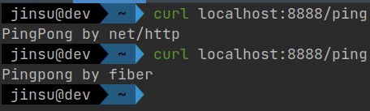

# 웹 애플리케이션 개발해보기 (feat. fiber)

## 시작하며

이번에는 Go언어에서 **유명한 웹 프레임워크를 비교**해보고 간단하게 **Pingpong 서버를 개발**해보겠습니다.
다만 "_Golang으로 백엔드 개발하기_"를 주제로 글을 쓰면서 주 목적으로 했던 것은 개발하면서 계속 궁금했지만 어딘가에서 뚜렷한 설명을 찾아보기 힘들었던 내용들을
다뤄보고자하는 것이었기 때문에 이번 주제는 그닥 주 목적에 해당하는 주제는 아니므로 이번엔 아주 가~볍게 훑어보고 넘어가겠습니다. 
왜냐하면 웹 프레임워크를 사용하는 것은 해당 웹프레임워크의 문서나 이런 저런 블로그들에 이미 너무도 많이 자료가 존재하기 때문입니다.

## Golang으로 웹 애플리케이션을 개발하는 방법들

보통 다른 언어 같은 경우 Java에서는 Spring MVC 혹은 Spring WebFlux, Python은 FastApi, Flask, Django, Node.js는 Express, nest, koa처럼
각 언어마다 손에 꼽을 만한 대표적인 웹 프레임워크들이 있는 것 같은데 Go는 그렇지가 않습니다. Go는 잘 나가는 웹 프레임워크들이 너무도 다양하게 존재합니다.
아주 아주 다양한 프레임워크가 존재하지만 그닥 우위가 뚜렷하진 않습니다.
어떤 한 기술이 생태계를 독점해버리거나 그 기술만이 강요되는 일 없이 서로(프레임워크간)가 경쟁하며 좋은 기술로 나아가는 게 장점이 될 수도 있고,
너무 프레임워크가 다양해서 선택하기 곤란하다는 것이 단점이 될 수도 있을 것 같습니다. 커뮤니티가 한 데 집중된다면 더 버그 픽스하기 쉬울텐데 그런 면에서는
조금 아쉽기도 합니다.

다만 한 가지 흐름이 있다면 Python을 사용하는 개발자분들이 `"Pythonic"`이라는 철학(?)을 굉장히 좋아하시듯 Go를 사용하는 개발자분들은 `"Go스러움"`을 굉장히 좋아하는 경향이 있어
어떤 프레임워크가 계속해서 인기를 끄는 데에는 `"Go스러운가"`가 큰 영향을 끼치는 것 같습니다.
아마 Go스러움이란 다음과 같은 특징들을 얘기하는 것일 겁니다.

* 타입을 통해 안정적으로 개발한다. (interface{} 와 같은 빈 인터페이스를 이용하면서 type assertion이나 reflect를 이용하는 것을 지양)
* 가볍고 간결하다. (Spring MVC와 같은 방식은 지양. 프레임워크에서 쓸 데 없이 많은 걸 지원하면서 서비스가 무거워지는 것을 지양.)
* 빠르다.
* 동시성을 goroutine과 channel을 이용해 잘 사용한다. (근데 이 부분은 web framework을 고를 때는 영향을 끼치지 않는 것 같고 개발자의 코드에 대한 go스러움일 것입니다.)

## 프레임워크 추천

* `net/http` - Go 표준(빌트인) 패키지
* `github.com/labstack/echo` - 스타 20k
* `github.com/gofiber/fiber` - ❤️ 스타 14.6k
* `github.com/gin-gonic/gin` - 스타 50k
* `github.com/beego/beego` - 스타 26k
* ...

이런 특징들을 가진 웹프레임워크로 한국에서 많이 쓰이는 듯한 프레임워크들은 `fiber`, `echo`, `gin` 이 세 친구들인 것 같습니다.
저도 다 깊이 있게 써본 건 아니지만 그 동안 리서치 해온 것들이나 한국 Go 커뮤니티에서 오가는 이런 저런 내용들을 참고했을 때의 의견은 다음과 같습니다.
`gin`은 오랜 시간 개발되어 온 프로젝트이고 꾸준히 스타도 많지만 아마 좀 '무겁다. 느리다.' 이런 얘기가 있었던 것 같습니다. `echo`는 간결하게 사용할 수 있으면서 필요한 기능들은 다 있고 개발이 활발하게 이루어지고 있는 듯한 느낌이지만
문서가 그닥 친절하지 않고 썩 빠른 건 아니다는 생각이 듭니다. 문서가 거의 그냥 예시 코드 작성한 정도입니다. 그래도 Go 언어 특성상 남의 코드를 까서 봐도 해석하기 쉽고 주석도 잘 달려있는 편이라 큰 어려움은 없었습니다.
`fiber`는 요즘 가장 핫한 프레임워크 같습니다. 빠르게 깃헙 스타 수도 늘어나고 있고 fasthttp를 사용해서인지 아마 월등히 빠른 것으로 알려져있습니다. 게다가 문서도 너무 잘 작성되어있고 개발도 활발히 이루어지고 있습니다.

이러한 이유로 저는 현재 `fiber`와 `echo`를 이용 중이고 추후 새로운 서비스를 개발해야한다면 `fiber`를 이용할 예정입니다! (_사실 gin이 스타는 꾸준히 많이 늘어나고 있고 스타 수 자체도 1타인데 왜 한국에서 많이들 사용하지 않는지는 잘 모르겠습니다. 아시는 분이나 gin을 사용해보신 분 있으시면 의견 부탁드립니다..!_)

## 예시 코드

간단하게 `net/http` 나 `fiber` 중 하나를 이용해 `GET /ping`에 응답하는 웹 애플리케이션을 만들어보았으니 참고하실 분들은 참고하시길 바랍니다.
웬만하면 공식 문서의 Getting started나 Example들을 보시는 걸 추천드립니다.

다른 글들과 마찬가지로 예시 코드는 `https://github.com/umi0410/how-to-backend-in-go`의 webapp 디렉토리에 업로드 해두겠습니다.
```go
package main

import (
	"flag"
	"fmt"
	"github.com/gofiber/fiber/v2"
	"log"
	"net/http"
)

var (
	framework string
	port      = flag.Int("p", 8888, "서버가 Listen할 port 번호를 입력해주세요.")
)

func init() {
	flag.Parse()
	if len(flag.Args()) != 1 {
		log.Fatal("하나의 인자를 전달해 framework를 정의해주세요. (e.g. http, echo, fiber)")
	}
	framework = flag.Arg(0)
}
func main() {
	switch framework {
	case "http":
		RunNewHttpServer()
	case "fiber":
		RunNewFiberServer()
	default:
		log.Fatal("지원하지 않는 framework 입니다.")
	}
}

func RunNewHttpServer() {
	addr := fmt.Sprintf(":%d", *port)
	log.Printf("Server is listening %d", *port)
	http.HandleFunc("/ping", func(w http.ResponseWriter, req *http.Request) {
		if _, err := w.Write([]byte("PingPong by net/http\n")); err != nil {
			log.Print(err)
		}
	})

	if err := http.ListenAndServe(addr, nil); err != nil {
		log.Print(err)
	}
}

func RunNewFiberServer() {
	addr := fmt.Sprintf(":%d", *port)
	app := fiber.New()

	app.Get("/ping", func(c *fiber.Ctx) error {
		return c.SendString("Pingpong by fiber\n")
	})
	log.Printf("Server is listening %d", *port)
	if err := app.Listen(addr); err != nil {
		log.Print(err)
	}
}
```



## 마치며

간단하게 Go언어에서 유명한 프레임워크들을 비교해보고 Pingpong 서버 예제 코드를 작성해봤습니다.
앞서 언급드렸듯이 아무래도 웹 프레임워크로 hello world를 찍는 수준의 서버를 작성하는 내용은 이미 어느 곳에서든 찾아볼 수 있기 때문에
이번 글은 가볍게 마무리하고 이런 저런 프레임워크들의 공식 문서를 보시는 걸 추천드립니다 ㅎㅎ
다음 글은 `미들웨어 작성`이나 `에러 처리`에 대해 다뤄볼 예정인데 이번 글 보다 재밌을 것으로 예상됩니다. 
'**에러를 어떻게 처리할까**'나 '**미들웨어는 어떻게 작성할 수 있을까**'와 같은 내용은 그닥 흔히 찾아볼 수 있는 내용은 아닌 것 같았기 때문입니다.
그럼 다음 글에서 봐요 우리~ ㅎㅎ 👋

## 참고

* 간단한 웹 서버 (HTTP 서버) - http://golang.site/go/article/111-%EA%B0%84%EB%8B%A8%ED%95%9C-%EC%9B%B9-%EC%84%9C%EB%B2%84-HTTP-%EC%84%9C%EB%B2%84
* Understanding Listen Ports and Addresses - https://www.ateam-oracle.com/listen-addresses
* https://www.esparkinfo.com/top-golang-web-framework-development.html
* https://blog.devgenius.io/best-web-framework-of-golang-in-2021-aae4b2ad9bf
* 내가 Go 언어를 선택한 이유 - https://pronist.tistory.com/67