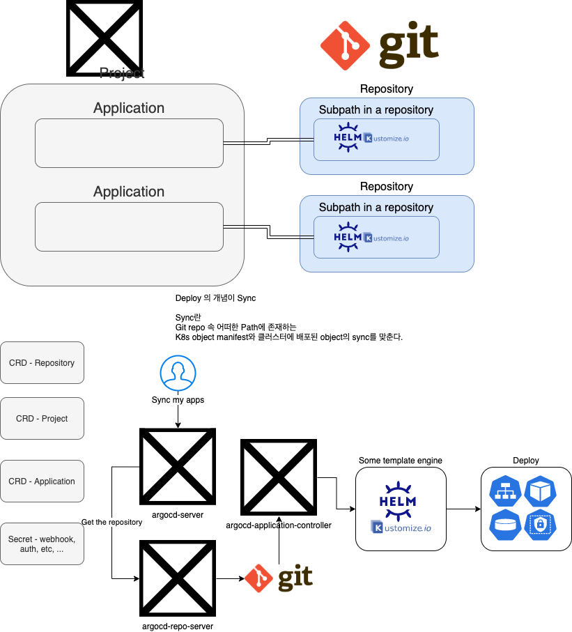
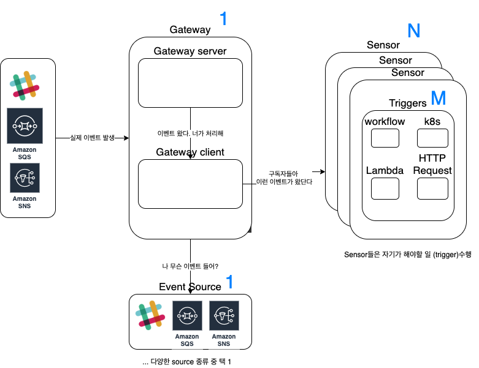
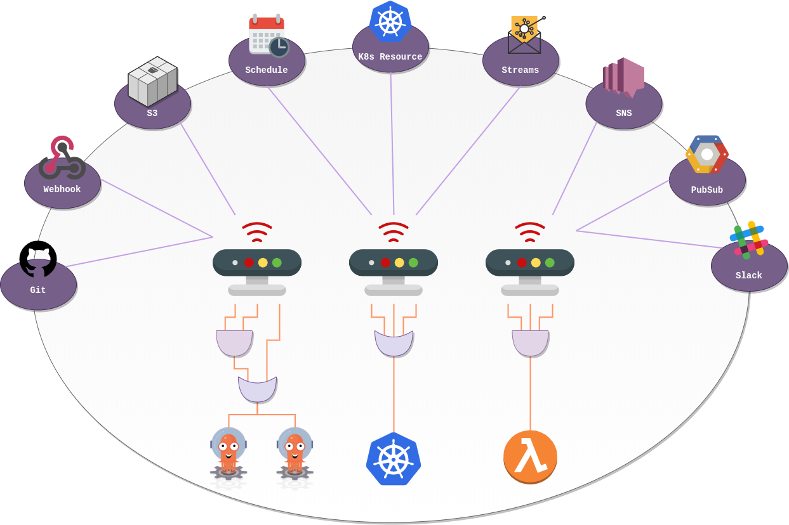

## Argo PoC를 진행하게 된 배경

입사 초기부터 `Argo`에 대해 간간히 이야기를 들어왔습니다. 저희는 원래 `Spinnaker`을 사용했는데,
쿠버네티스 환경에 좀 더 친화적이라는 `Argo`를 도입해보는 것은 어떨까에 대한 얘기였는데요.
어느정도 개발 인프라 구축이 완료되고 한가해지자 잠깐이나마 `Argo`를 사용해볼 수 있었습니다.
결과적으로 `Argo` 도입은 적합하지 않다고 판단이 되었고 따라서 충분히 써볼 수는 없었기에 기록용으로만
간단히 적어보겠습니다.

## Argo Project 구조

> Argo가 워낙 빠르게 변화하는 서비스다보니 지금은 구조가 많이 변경되었을 수도 있습니다!

chart by Jinsu Park

간편하게 사용할 수 있는 순서는 `argo`, `argo`(workflow), `argo event` 순이라고 생각되는데,
실질적인 파이프라인 구축은 `argo event`, `argo` (workflow), `argo` 순으로 이뤄지는 셈이라 후자의
순서에 맞춰 설명해보겠습니다.

### Argo Event ([Official site](https://argoproj.github.io/argo-events/))

image by argo-events

셋 중 가장 베이비 프로젝트입니다. 빠르게 개발되고 있고, 변화하고있기에 제가 `argo` project들을 만났던
시절과 많이 구조가 달라져있습니다.  간단하게 말하자면 이벤트를 감지하여 어떤 작업을 수행할 수 있습니다.
`argo-events`의 공식 홈페이지에서 제공되는 위의 이미지와 같이 다양한 이벤트 소스를 이용해 다양한 이벤트를
트리거할 수 있습니다. 예를 들어 `AWS SQS`에 메시지가 생기면, 그 메시지를 가져와서 어떤 작업을 수행할 수 있습니다.
혹은 웹훅 서버를 돌려서 웹훅 요청이 오면, 어떤 작업을 트리거할 수 있습니다.

제가 구상한 파이프라인에서는 이벤트를 감지하는 역할로서 Argo Events를 앞에 두고,
Argo Events가 Workflow를 생성는 작업을 트리거하는 방식으로 CI/CD에 이용할 수 있습니다.

### Argo, Argo Workflow ([Official site](https://argoproj.github.io/argo/))

셋 중 가장 오래된 프로젝트이고, 별도 많습니다. Argo 라는 이름을 가졌고 실질적으로는 Workflow 관련 프로젝트입니다.
`Workflow`란 컨테이너를 이용해 진행되는 일련의 step들을 정의하는 CRD(K8s Custom Resource Definition 입니다.)

처음엔 '굳이 Workflow가 필요할까' 싶었지만, 쿠버네티스 상에서 일련의 Job을 연속적으로 수행할 수 있는
방법이 현재까지는 없는 것으로 알고 있습니다.
K8s Job의 `Container`에 대한 `InitContainer`을 지정함으로써 한 Job에 대한 두 Container의 순서를
명시할 수는 있지만, `Workflow`처럼 다양하게 일련의 Job을 연속적으로 수행하기는 힘든 것으로 알고 있습니다.

### ArgoCD ([Official site](https://argoproj.github.io/argo-cd/))

`ArgoCD`만 보면 가장 간단하게 실제 CD에 적용할 수 있는 프로젝트 중 하나가 아닐까싶습니다.
`ArgoCD` 자체에 대한 설정, 소스가 될 Repository에 대한 설정, Project, Application에 대한 설정 등등
모든 것이 `Code` IaC에 특화된 독특한 프로젝트입니다.

UI가 직관적이고 알아보기 쉽지만, 반대로 대규모 애플리케이션이 될 경우 너무도 배포 현황을 보여주는 맵이 커지기 때문에
알아보기 쉽지 않을 수 있을 것 같습니다. `GitOps`("GitOps의 핵심은 Git 저장소에 저장된 쿠버네티스 매니페스트 같은 파일을 이용하여, 배포를 선언적으로 한다는 것입니다. [출처](https://kangwoo.kr/tag/gitops/)")
라는 말에 아마 빠지지 않고 등장하는 CD 도구인듯합니다. Git에 올라가는 Manifest가 그대로 K8s 클러스터에 적용됩니다.
마치 Github Page나 S3(웹호스팅 설정이 된 S3 Bucket)에 올린 파일들이 바로 하나의 웹 애플리케이션처럼 동작하는 것과 비슷한 느낌입니다.
간단하게 사용하기에는 ArgoCD가 참 좋아보였지만, 실제로 업무적으로 사용하지는 못하겠다고 판단한 이유가 몇 가지 있습니다.

* 애플리케이션 하나에 대한 배포는 쉽지만, 연속적인 배포나 다양한 배포 파이프라인을 구성하기는 어려웠다.
* Github Push 시에 webhook을 설정해서 `ArgoCD`의 배포를 트리거하도록 했는데 이 부분이 최적화가 덜 되었는지
어떤 repository든 하나의 ArgoCD 환경에서는 Git platform 당 하나의 secret만 설정이 가능했고, 한 repository가 push되면
다른 repository도 배포가 다 같이 이루어져버렸습니다. (이 부분은 패치됐을 수도 있습니다.)
* 소규모 애플리케이션은 배포 상황을 한 눈에 보기 쉽지만, K8s Object가 많아지면 많아질수록
점점 하나하나 눈에 보이지 않고, 잡다한 Object들(ConfigMap, Secret, ...)로 인해 인식하기 힘듭니다.

## Argo Project를 조합한 CI/CD 파이프라인 구축기

### 파이프라인 수행 과정

1. (`Argo Event`) Github Push를 감지하고 `Argo Workflow CRD`를 생성
`Argo workflow`를 통해 다양한 step들을 이용하기 위해 바로 `ArgoCD`가 Github Push를 받지 않고,
`Argo Event`가 받도록 했습니다.
2. `Argo Workflow`의 step들 수행
    * Slack에 workflow 시작 알림
    * Experiment 환경에 배포 (Argo CD 이용)
    * Interation Test 실행 트리거 (Jenkins 이용)
    * Integration Test 결과가 성공이면 Dev 환경에 배포 (Argo CD 이용)
    * 어느 step에서든 실패 시 Slack에 실패 알림

이 정도 Pipeline을 짜면 사실 사용할 정도는 될 수 있겠지만, "일"로서 본다면 굳이 현재 사용 중인
Spinnaker에 비해 장점이 뚜렷하게 느껴지지 않는 Argo를 위해 파이프라인을 이전하기에는 역부족이라는
판단이 들었습니다. 예를 들어 과정 목록에서는 간단히 묘사했지만, Spinnaker에서는 UI에서 알아서 처리되던
부분들을 하나 하나 webhook을 걸어주거나, 따로 bash script를 짜야하는 경우들이 많았습니다.

## Argo Project들에 대한 PoC를 진행하며 느낀 점

개인적으로는 많이 애정이 갔던 프로젝트들이고 신기했던 배포방식에 대한 소개였으며, 이 프로젝트들을
공부해보면서 다양한 아키텍쳐에 대해 경험해볼 수 있었던 것 같지만, 현실적인 벽에 부딪혀 도입을
할 수 없었던 아쉬움 컸습니다. 마치 좋아하는 분야가 있었지만, 현실의 벽에 부딪혀 꿈을 접고, 어떠한
현실적인 진로 나아가는 것과 같았달까요?

그리고 개인적인 아쉬움은 위의 차트를 손수 그리며 PoC 문서를 작성했었지만, 결국은 PoC를 진행한
담당자인 저조차 "음... 실사용은 힘들 것 같은데요"라는 의견을 냈던 터라 바쁜 일정 속에서
reject할 개념 증명 리뷰에 많은 시간을 할애할 수 없었기에, 팀원들과 이 내용을 공유할 수 없었던 점에
조금 아쉬움이 남습니다..! 만약 정말 `Argo`를 사용하는 방식이 뛰어난 방식이었다면, 저도 적극 추천하며
함께 리뷰해주길 기대했겠지만, 현실적으로 저희 팀의 배포 방식과는 맞지 않았다고 판단해서 그랬던 것이기에
괜찮습니다~!