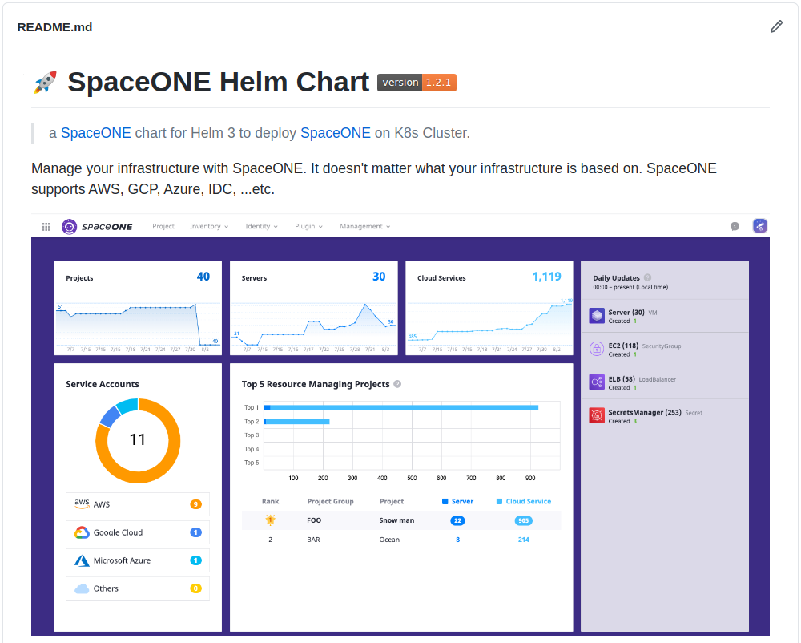

## SpaceONE Helm Chart란?

[spaceone-helm](https://github.com/spaceone-dev/spaceone-helm) 은 저희 
`CloudOne` 팀이 개발하는 서비스인 [SpaceONE](https://spaceone-dev.github.io/)을
`helm chart`를 이용해 패키지화하는 프로젝트입니다. 원래의 저희 환경은 MicroService들을 
개별 배포하고있었지만 오픈소스로 개발되는 저희 서비스를 저희 팀원들 뿐만아니라 다른
개발자들이 쉽게 개발할 수 있고, SpaceONE을 모르던 사용자들도 쉽게 SpaceONE을 구축해볼
수 있도록 하기 위해 패키지화도 진행하게되었습니다.

일반적으로 만들어진 Helm Chart를 이용해보기만했지 직접 Chart를 만드는 것은 처음 해본 일이기도 했고,
Chart를 개발하면서 새로운 환경에 저희 서비스를 배포해보다보니 삽질하며 고생도 꽤 했고,
무엇보다 프로젝트의 시작부터 퇴사 전까지의 작업들을 거의 제가 도맡아한 프로젝트였기에 개인적으로
애정이 많이 갔습니다 ^_^! 그리고 저도 이제는 저희 Chart를 이용해 SpaceONE을 구축형으로
손쉽게 이용할 수 있었습니다.

## spaceone-helm 설계

일단은 심플하게 사이드카 없이 저희의 마이크로서비스들만을 배포하고, 그 외에 필요한 서비스들도 최대한
Cloud Service에 의존하지 않고 그때 그때 손쉽게 서비스를 내렸다 올렸다 할 수 있도록 K8s 클러스터 위에
함께 배포하는 형식으로 Chart를 설계했습니다.

무엇보다 chart 개발의 목적은 아래 두 가지 사항이 컸기 때문에, `minikube` 혹은 `EKS` 띄운
마이크로서비스들과 로컬에서 통신이 가능하도록 해야했고, 사용하기 편리한 구조를 만들기 위해
고심했습니다.

* 팀원이 아닌 개발자들도 자신의 부가적인 마이크로서비스를 로컬에 띄워 개발할 수 있도록 지원.
  * 로컬에서도 쿠버네티스 클러스터 내의 서비스에 접속이 가능해야하고, 경우에 따라 클러스터에서도
  본인의 로컬 서비스로 접속을 할 수 있어야함.
* 오픈소스로서 임의의 사용자가 서비스를 구축해보고자 시도할 때 손 쉽게 구축할 수 있도록 지원.
  * 마치 유저들의 사용자 경험을 중요시해서 디자인, 기획을 하듯 Chart의 사용자들이 직관적이고
  편리하게 구축할 수 있도록 Configuration values(`values.yaml` in Helm Chart)를 설계함.

## spaceone-helm chart 구조

```bash
templates/
├── backend
│   ├── config
│   │   ├── config-conf.yml
│   │   ├── config-deployment.yml
│   │   └── config-svc.yml
│   ├── identity
│   │   ├── identity-conf.yml
│   │   ├── identity-deployment.yml
│   │   └── identity-svc.yml
│   ├── inventory
│   │   ├── inventory-conf.yml
│   │   ├── inventory-deployment.yml
│   │   └── inventory-svc.yml
│   ├── inventory-scheduler
│   │   ├── inventory-scheduler-conf.yml
│   │   ├── inventory-scheduler-deployment.yml
│   │   └── inventory-scheduler-svc.yml
│   ├── inventory-worker
│   │   ├── inventory-worker-conf.yml
│   │   ├── inventory-worker-deployment.yml
│   │   └── inventory-worker-svc.yml
#... Backend 생략
├── consul, mongo, redis # 디테일한 파일구조는 생략
├── frontend
│   ├── console # 디테일한 파일구조는 생략
│   └── console-api # 디테일한 파일구조는 생략
├── ingress
│   └── ingress.yaml
├── initializer
│   ├── initialize-spaceone-conf.yml
│   ├── initialize-spaceone-job.yml
│   ├── spacectl-apply-conf.yml
│   └── spacectl-conf.yml
└── supervisor
    └── supervisor
        ├── supervisor-conf.yml
        ├── supervisor-deployment.yml
        └── supervisor-roles.yml
```

저희 `spaceone-helm` chart는 꽤나 구조가 간단한 편은 아니라고 생각됩니다. 웹페이지 환경상 너무
부수적인 부분은 tree에서 생략하기도 했습니다. 꽤나 복잡한 구조를 가졌기에 패키지화하는 부분이 쉽지 않았지만,
그런 과정 속에서 많이 트러블 슈팅을 경험하고 성장할 수 있었던 것 같습니다.

그리고 반대로 생각하면, 서비스가 패키지화하기도 쉽지 않을만큼 복잡한 구조를 가졌다면,
당연히 손수 배포하는 것은 그것보다 몇 배는 어려울 것이므로 누군가가 저희 서비스를 구축형으로 이용해주기 위해서는
패키지화가 필수라는 생각이 들었습니다.

## 마이크로서비스들의 버전 관리를 시작

Helm Chart를 개발하고, CI가 고도화되기 전까지는 단순히 팀 내에서 개발을 진행하면서
개발환경에 대한 배포는 `latest` tag만을 이용해 자동으로 진행하고,
QA를 진행하면서 커밋을 멈추고, 그 시점에 빌드된 Docker image의 Tag를 바탕으로 상용 환경에도
배포를 하곤했습니다. 하지만, Chart에서도 tag를 `latest`로 유지하거나 가독성이 좋지 않은 임의의
tag를 이용해 이미지를 제공하기는 힘들었고, 맞는 방향이 아니라고 생각했습니다.  

따라서 저희는 꼭 Helm을 통한 패키지 뿐만 아니라 롤백에 대한 안정성, 버전 간의 Update 내역 관리
등을 위해 `{{MAJOR}}.{{MINOR}}.{{SPRINT_NUMBER}}-{{EXTRA_TAGS}}` 형태를 통해
버전을 관리하고자했습니다.

## Helm Chart를 통해 패키지화하며 느낀 점

Helm Chart를 통해 저희 서비스를 패키지화하기 전까지는 마이크로서비스 형태로 관리되는 서비스를
새로운 환경에 완전하게 구축한다는 것은 쉽지 않았습니다.
`Container`라는 것이 ReadOnly 레이어로 이미 구성이 완료된 이미지를 바탕으로 생성되기 때문에
언제 어디서든 구동이 가능하다는 것이 장점이겠지만, 현실적으로는 환경에 따라 이것 저것 설정해줘야하는
것이 있었기때문입니다.

이러한 난관들은 어떠한 변수처리와 자동화를 통해 해결할 수 있을텐데, 그러한 작업을 해준 녀석이 바로
`Helm`이었고, 그때 그때 설정을 바꿈으로써 커스터마이징할 수 있다는 점이 알고는 있었습니다만 막상
저희 서비스에 도입해보니 꽤나 만족스러웠습니다.

일화로 사내 네트워크가 막힌 상황에서도 받아놓은 이미지들만 있으면 네트워크 접속을 할 필요 없이
`minikube`와 `로컬 서버`를 이용해 minikube의 클러스터와 통신하면서 개발을 진행할 수도 있었습니다.

누군가 제가 만든 서비스를 사용해준다는 것은 참 뿌듯한 일이었고, 앞으로도 저희 helm chart가 잘
발전되어 더욱 더 편리하게 구축할 수 있는 형태로 제공될 수 있기를 기대해봅니다! 