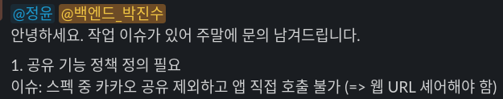
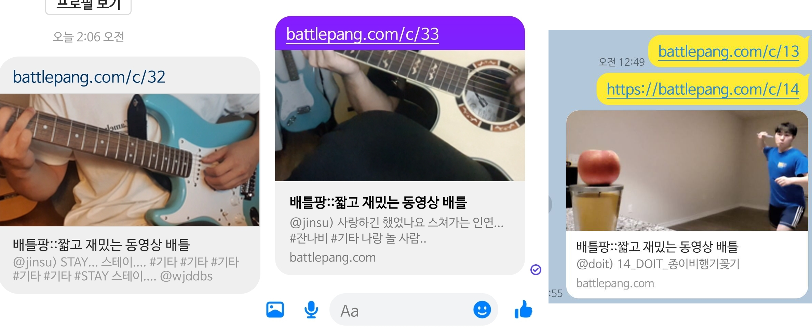
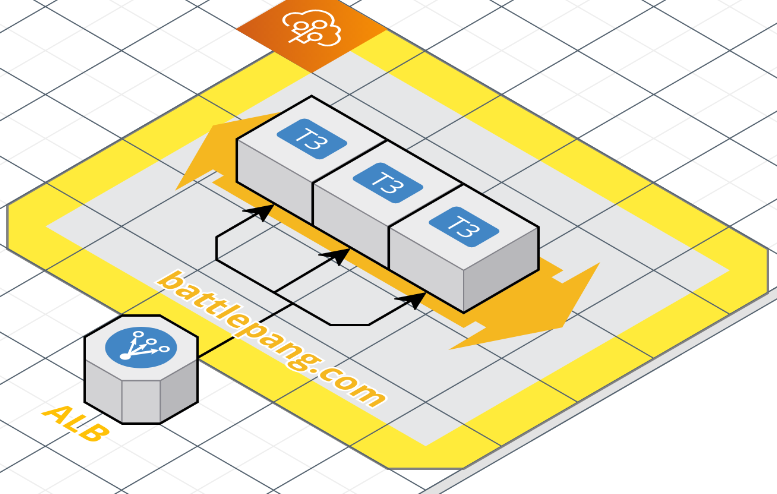
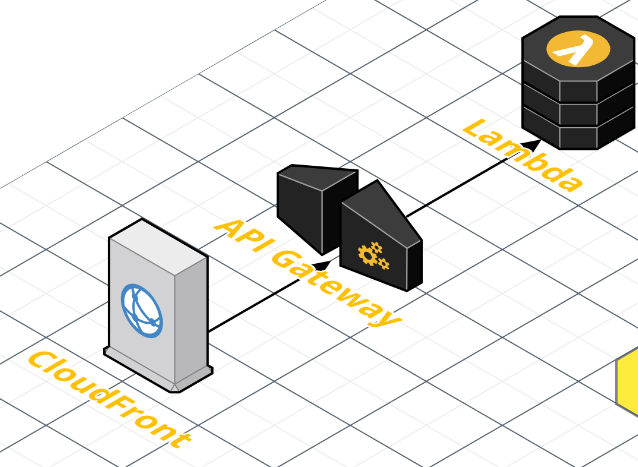
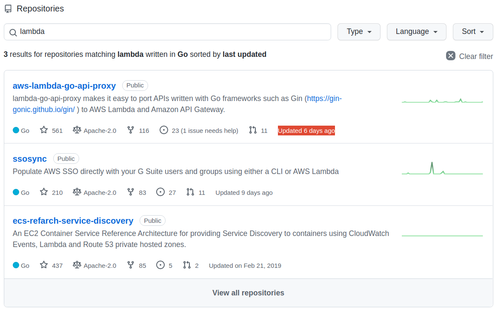

## 시작하며





서비스 출시를 앞두고 마무리 작업을 하던 중 잊고 있었던 SNS 관련 기능들이 있었습니다. 그 중 OpenGraph를 통해 "공유하기" 기능 수행 시에
적절한 메타데이터를 제공해줘야 했습니다. 별로 어려운 기능은 아니지만 이를 제공하기 위해 적절한 방향을 찾기가 쉽지 않았던 것 같습니다.
고민과 삽질 끝에 저는 CloudFront, API Gateway, Lambda 서비스들을 이용하기로 결정했고, Serverless framework를 이용해 Golang 바탕의
마이크로서비스를 개발했습니다.

## OpenGraph? SSR?

> 본 글은 아키텍쳐나 기술 선정에 대한 내용을 많이 담을 것이라서 정의에 대한 자세한 설명은 생략하겠습니다.

`OpenGraph`는 `<head>` 태그 안에 `<meta property="og:title" content="배틀팡::짧고 재밌는 동영상 배틀" />` 과 같은 형태로 **메타데이터들을 정의해
SNS나 크롤링 봇들이 사이트의 정보를 좀 더 통일된 방법으로 데이터를 수집**할 수 있게 하는 것과 관련된 개념입니다. 그리고 `SSR`(Server Side Rendering)은 **클라이언트가 서버에게는 껍데기 같은 파일만 제공받고
실제 페이지의 내용은 Client 측에서 API와 js 등을 이용해 만들어나가는 방식**입니다. 아마 대부분의 SPA 앱들은 CSR로 배포/개발 되고 있는 것 같은데요. 그 이유는 프론트엔드를 제공할 때
S3나 CloudFront, Github Page 등 서버의 기능과 완전히 분리하여 제공할 수 있기 때문이라는 점이 크게 작용하지 않을까 싶습니다.

**"왜 OpenGraph를 제공하는데 SSR이 필요해?"**

크롤링 봇들은 JS를 실행하지 않는 경우가 대다수입니다. 반면 일반적인 CSR 방식의 SPA 앱들은 JS를 이용해 서버에게 API를 호출해 그 응답으로 페이지를 만들죠.
따라서 **JS를 실행하지 않는 크롤링 봇은 기대되는 데이터가 서버로부터 제공되기 이전인 빈 껍데기의 파일만 제공받게 됩니다.** 따라서 "공유하기 링크"는 **크롤링 봇이 오픈그래프를 읽을 수 있도록
SSR로 오픈 그래프 메타데이터들이 담긴 HTML을 제공**해줘야하는 것이죠!

## 오픈 그래프 제공을 위한 SSR(Server Side Rendering) 마이크로서비스

그래서 **오픈 그래프를 위한 정보만을 SSR로 제공하는 마이크로서비스**를 만들고자했습니다. HTML 파일을 제공하는 시점에 단순 정적 파일 제공이 아닌 
로직 수행 후 동적으로 파일을 제공해야한다면 사실 개발 중이던 Spring 서버에서 엔드포인트 하나만 더 파서 개발을 하면 될 수 있습니다.
하지만 이렇게 되면 메인 백엔드 코드에 SSR 관련 페이지 제공 기능이 추가되어야하는데 **API 서버와 같은 곳에서 일종의 프론트의 기능을 하는 SSR이 공존하는 형태는 선호하지 않았습니다**.
게다가 백엔드인 Spring boot에서도 어떤 요청에 대해 에러로 응답할 때 SSR에 대한 에러 처리로 해줘야할 지 API에 대한 에러 처리로 해줘야할 지 등등 꽤나 개발적으로 골치가 아픈 부분이 많았습니다.
```json
{
    "message": "올바르지 않은 페이지입니다.",
    "error": "NotFound"
}
```
예를 들면 API에 대한 에러 응답은 위와 같은 형태를 띄는 것이 좋을 것이고, 그래야 프론트엔드에서도 처리를 하기 편할 것입니다. 반면 SSR에 대한 에러 응답은 어쨌든 사용자가 직접 대면하는 페이지이다보니
결국 메인 서비스의 프론트엔드로 리다이렉트가 되어 메인 서비스의 프론트엔드가 처리할 수 있게 해줘야할 것이구요. 

'이게 무슨 소리지?' 라고 생각하실 수 있는데, SSR로 제공된 페이지는 결국 **"공유하기"를 통해 링크를 전달 받은 사용자가 직접 접속하는 페이지**이면서 동시에 **크롤링 봇이 오픈 그래프를 통해 데이터를 수집해가는 페이지**이기도 합니다.

* 크롤링 봇은 JS를 수행하지 않는다
* 따라서 올바른 메타데이터가 담긴 HTML 만들기 위해선 SSR이 필요하다.
* SSR로 제공된 페이지로 유저가 접속했을 때 서비스로 올바르게 접속할 수 있어야한다. 하지만 서비스 자체를 SSR 방식으로 변경하기에는 무리가 있다!

위와 같은 특징들로 인해 **오픈 그래프 제공을 위한 SSR 마이크로서비스는 다음과 같이 동작하면 좋지 않을까?!** 싶었어요.

* **오픈그래프 정보가 담긴 동적으로 생성된 HTML은 SSR 마이크로서비스**에 의해 제공된다. SSR 마이크로서비스는 요청이 들어왔을 때 API 서버에게 해당 요청과 관련된 정보를 질의한다.
  * 이때 SSR이 직접 DB(스프링이 이용 중인 DB)를 이용하지 않는 게 좋은 이유는 정말 많겠지만 우선은 다음과 같다.
    * SSR 마이크로서비스가 지지고 볶고 뭘 해도 스프링의 DB 설계에는 영향을 주지 않는다. SSR로 인해 메인 스프링이 흔들리는 것을 방지해준다.
    * 일단 간단하다. 간단한 조회만을 위해 DB를 설정하는 것보다는 필요한 API의 필요한 필드들만 정의해서 API로 조회하는 게 더 쉬울 것이다.
  * 반면 스프링이 API 스펙을 변경할 때 SSR에도 영향이 있을지를 고려해야한다는 것과 추가적인 인프라 관리가 필요하다는 단점도 있긴하다.

## 고려했던 인프라 및 설계

1. `ElasticBeanstalk`
2. `Lambda` + `ALB`
3. `Lambda` + `API Gateway` + `CloudFront`

고려했던 인프라는 위와 같았고 결국에는 1, 2번 방식은 단점들이 존재해서 3번으로 선택했습니다!

### Option 1) ElasticBeanstalk 바탕의 인프라



`ElasticBeanstalk`은 `eb cli`를 통해 편리하게 배포를 할 수 있고, auto scaling group도 편리하게 관리할 수 있다는 장점이 있습니다.
손 쉬우면서도 안정적으로 관리하기는 딱이죠. 그리고 기존 메인 서버인 스프링 서버도 빈스톡으로 관리를 하고 있었기 때문에 빈스톡에 익숙하다는 장점도 있었습니다.

내부적으로 빈스톡의 `도커 플랫폼`에 대한 궁금증도 있었고 Go라면 `nano` 인스턴스로도 어떻게 잘 굴려볼 수 있지 않을까 싶은 마음에 `fiber` 프레임워크를 바탕으로 개발을 했습니다.
하지만 아무리 Go라도 생각보다 nano 인스턴스로 굴리기는 힘들었고, `micro`도 아슬아슬하더라구요.(micro도 빌드할 때 OOM으로 실패함.) 

빈스톡 인스턴스 내부에서 이미지를 빌드하고 태그를 수정해서 배포를 트리거 시키는 방식을 이용하면 빌드 도중의 OOM 이슈는 없겠지만 ECR을 통해 이미지 레지스트리를 관리해줘야하고, 
빌드할 때마다 docker-compose.yml에서 이미지 태그를 올바르게 업데이트 시켜주는 과정도 번거로울 것 같았죠. 

스프링이 t3.small로 돌아가고 있는데(스프링은 JAR를 젠킨스에서 빌드) Go를 쓰면서 t3.small을 쓰자니 이건 웬 공유하기 기능하나에 본 서버의 몇 분의 1에 해당하는 리소스를
사용해야하는 이상한 아키텍쳐가 되어버릴 것만 같았죠. 비용도 비용이구요.

그래서 `fiber` 개발한 SSR 마이크로서비스를 ElasticBeanstalk에 배포하는 방식은 기각되었습니다.

### Option 2) `Lambda` + `ALB`

'_SSR을 위해 서버를 관리하는 건 너무 낭비가 크다._'는 생각에 서버리스로 방향을 돌렸습니다. `serverless` 프레임워크를 기존에 이용하고 있었기 때문에 크게 낯선 기술은 아니기도 했구요.

`Lambda`를 이용할 때 Go언어 같은 경우에는 AWS Lambda의 콘솔 에디터 화면이 제공되지 않아 좀 불편해 파이썬으로 개발을 할까 싶었는데, 단방향이긴 하지만 API로 밀접하게 메인 API 서버랑 통신을 해야하는 SSR 서비스의
특성상 type을 명확히 정의해서 API 스펙과 비교하기도 편하고, 개발/동작도 안정적으로 할 수 있는 `Go`를 선택했습니다. 

`파이썬`은 API에게 응답받은 json을 어떻게 역직렬화할까부터도 고민이었고, 귀찮아서 그냥 json이나 dictionary로
우겨넣어서 개발을 하면 당시에는 편하지만 일주일만 지나도 무슨 코드인지 알아보기 힘들고 API 스펙이 변경되는 경우의 디버깅은 거의 극악의 난이도이기 때문에 파이썬도 배제했습니다.

하지만 `ALB` => `Lambda`로 요청을 바로 넘기는 경우, ALB에서 넘어온 요청을 처리하는 방식이 너무 간단해 커스터마이징하기가 더 까다로운 형태였습니다.
예를 들면 경로를 바탕으로 라우팅하는 로직을 직접 구현해야했었는데요. 보통의 웹 프레임워크에서 제공하는 `/*`, `/b/*` 이런 표현들을 바탕으로 한 경로와 핸들러간의 맵핑이 불가능했던 것입니다.
이유는 쉽게 말해 Lambda에는 string으로 path가 들어오고 응답도 string으로 줘야하는 겁니다. 이 방식은 기존의 웹프레임워크를 이용해 개발하던 방식과는 거리가 멀죠. 

따라서 이 방식도 기각되었습니다.

### Option 3) `Lambda` + `API Gateway` + `CloudFront`



드디어 최종 채택안! **"`CloudFront`로 HTTP/S 관련 기능을 처리하고, 그 Origin을 `API Gateway`로 둔 뒤 `Lambda`로 요청 처리하기"** 입니다. 사실 API Gateway의 이런 저런 기능이 별로 필요 없었기에
'_Lambda를 ALB로 노출시킬 수 있으면 간단하게 그렇게 하자_'라고 생각했던 방식이 Option 1이었습니다. 하지만 람다로 ALB TargetGroup에 대한 요청을 직접 처리하기에는 개발적으로 많은 불편히 있었어요. 정말 간단한 작업용 같은 느낌!

반면 Lambda가 APIGateway에게서 요청을 전달받으면 아주 편리하고 익숙한 방식으로 개발을 할 수가 있었습니다.

```go
// 코드 일부를 예시로 가져왔습니다.
func init(){
	app = fiber.New()
	app.Use(logger.New())
	app.Get("/health", func(ctx *fiber.Ctx) error {
		return ctx.SendString("OK")
	})
	
	app.Get("/", handleIndex)
	app.Get("/c/:clipId", handleClip)
	app.Get("/b/:battleId/:clipId", handleBattleWithClips)
	app.Get("/*", handleDefaultNotFound)
}


func main() {
	// 람다가 실행된다.
	// 요청마다 Handler를 호출한다.
	lambda.Start(Handler)
}

func Handler(ctx context.Context, req events.APIGatewayV2HTTPRequest) (events.APIGatewayV2HTTPResponse, error) {
	return fiberadapter.New(app).ProxyWithContextV2(ctx, req)
}
```

위와 같이 람다로 들어오는 요청을 처리하기 위한 핸들러를 찾아 호출하는 로직을 직접 구현하지 않고 기존의 유명한 웹 프레임워크들과 그에 대한 어댑터를 통해 개발할 수 있었습니다! (참고: [aws-lambda-go-api-proxy](https://github.com/awslabs/aws-lambda-go-api-proxy))
람다의 핸들러가 `fiber` 앱에게 요청을 넘겨서 그 응답을 리턴하는 형태죠. fiber 앱의 **핸들러들은 SSR 방식의 동적으로 생성된 HTML들을 리턴**해줬습니다. 



AWS에서 개발 중인 오픈소스 같습니다. 최근 커밋도 6일 전인 활발한 프로젝트인가봐요! (근데 왜 `ALB(TargetGroup) - Lambda`에 대한 어댑터나 프록시 오픈소스는 개발을 해주지 않은 걸까요.. 궁금합니다.)

어쨌든 `Lambda` + `API Gateway`를 이용하면서 저렴하면서도 편리하게 개발을 할 수 있었습니다. 여기서 끝나면 좋았겠지만 다음 삽질이 있었습니다.

[API Gateway를 커스텀 도메인 네임으로 이용하기](https://docs.aws.amazon.com/ko_kr/apigateway/latest/developerguide/http-api-custom-domain-names.html). 즉 기본적으로 API Gateway는 AWS 자체적인
도메인 네임을 통해 제공되고, 인증서도 AWS 측에서 제공을 해줍니다. 하지만 **Custom domain을 이용하고 싶다면**? 우리의 도메인을 인증해줘야겠지요. 하지만 기본적으로는 그렇게 할 수 없고 위의 링크의 방법을 통해서는 가능합니다.
API Gateway에 Custom domain name을 달기 위한 추가적인 방법들이에요.

> API Gateway doesn't directly support http without TLS, presumably as a security feature ... - "[Redirect http:// requests to https:// on AWS API Gateway (using Custom Domains)](https://stackoverflow.com/questions/47311081/redirect-http-requests-to-https-on-aws-api-gateway-using-custom-domains)"

하지만 이렇게 API Gateway를 Custom Domain name으로 이용할 수 있게 했더니 이번엔 또 다른 이슈가 존재했죠. 즉, API Gateway는 443 HTTPS만을 지원하고 **80 HTTP는 지원을 하지 않고 HTTP->HTTPS로의 리다이렉션도 지원하지 않는다**는 것이었습니다 ㄱ-... 
그럼 어떤 문제냐 있냐... 해당 HTTP로 링크를 접속하면 아무런 응답이 없습니다. 치명적이죠. 따라서 HTTPS Redirect를 수행할 수 있는 CloudFront를 앞단에 붙이고 API Gateway를 Origin으로 설정하는 방식으로 개선했습니다.
그 최종 아키텍쳐가 위의 그림과 같구요.


결과적으로 위와 같이 URL이 HTTP 이건 HTTPS 이건 상관 없이 원활히 오픈 그래프를 통해 적절한 정보를 제공할 수 있었고, 이제 정말 출시가 다가오는 것 같아 걱정 반 설렘 반이기도 합니다.

## 마치며

SSR로 오픈 그래프 하나 제공하겠다고 일요일 내내 삽질을 하게 된 것 같습니다. 평소에 서버리스는 아무래도 벤더 lock-in 이슈나 개발/디버깅 과정에서 로컬과 실제 클라우드 환경의 차이로 인한 불편 등등으로 인해
별로 선호하지 않았는데 그래도 공유하기 기능은 이제 앞으로 트래픽 걱정을 크게 하지 않고 가볍게 잘 사용할 수 있을 것 같아 좋습니다 ㅎㅎ

아쉬운 점은 좀 더 **각 서비스를 각 서비스의 역할이나 특성에 맞춰 사용할 수 있었으면 좋았을텐데, 단순히 특정 상황을 해결하기 위한 수단으로 이용하게 된 점이 조금 아쉽습니다**.

예를 들어 Lambda를 노출시키기 위해 굳이 API Gateway를 사용하지 않아도 ALB로 간단하게 충분히 노출 시킬 수 있었지만, 개발적으로 API Gateway-Lambda간의 작업이 Adpater framework을 통해 개발하기 편해서 API Gateway를
이용하게 됐죠. API Gateway의 API Key를 이용하는 인증/인가 기능이나 쓰로틀링 제한과 같은 기능들은 하나도 필요가  없는데 말이죠.

거기에 CloudFront는 사실상 Content Delivery나 캐싱이라는 주용도로 사용되면 좋았겠지만 단순히 API Gateway를 사용하면서 HTTPS로의 리다이렉트를 위해서 사용됐을 뿐이라는 점이 아쉽습니다.

물론 CloudFront나 API Gateway 같은 서비스들도 기본적으로 켠 만큼 돈이 나가는 게 아니라 호출한 만큼 돈이 나가는 형태이면서도 매우 저렴한 서비스들이기 때문에 지금은 불필요하지만 특정 상황을 해결하기 위한 서비스들처럼 느껴지더라도
후에 저희 서비스가 성장하면 분명히 CloudFront의 주기능인 캐싱 자체의 중요성도 증가할 수도 있을 것이고, 그 정도 규모가 된다면 간단한 서버리스 아키텍쳐가 아닌 좀 더 정교한 구축형 아키텍쳐로 개선할 수도 있을 것 같습니다!

이상 오픈 그래프를 위한 SSR 서비스 구축기였습니다~!