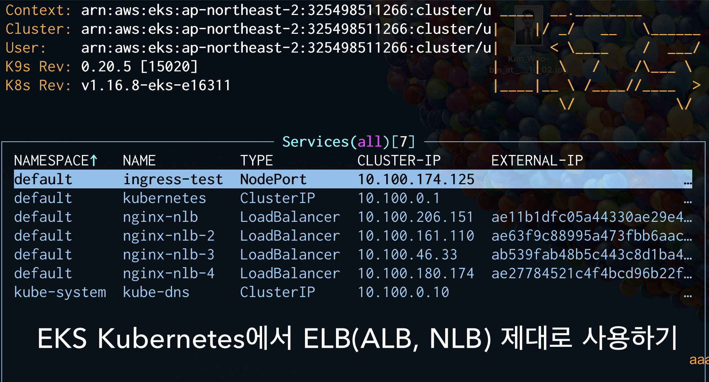
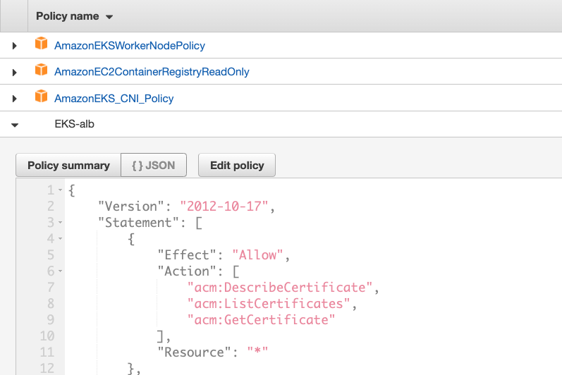
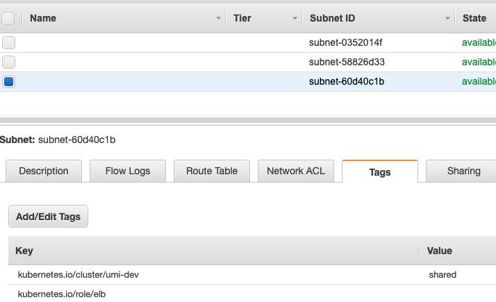
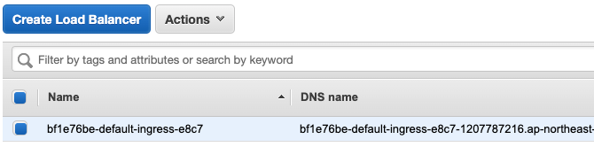
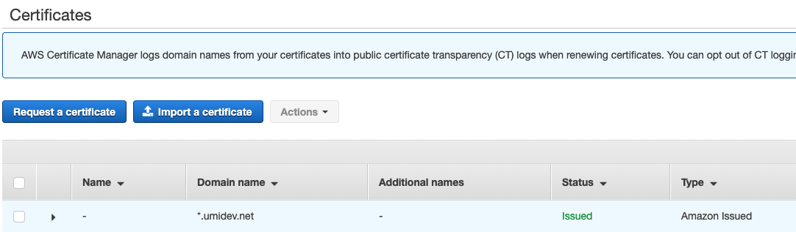
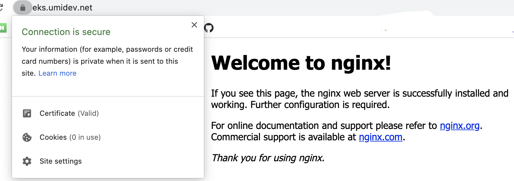
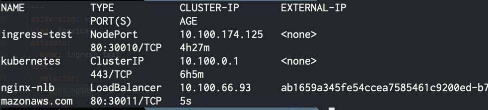

## 🐶 시작하며

> 본 게시글은 AWS 대학생 유저그룹인 [AUSG](https://velog.io/@ausg)의 활동 중
> 하나로서 본인(박진수)이 작성한 게시물을 포워딩한 것입니다.



`데브옵스` 인턴으로 근무한 지가 벌써 두 달이 되어갑니다. 이것 저것 배운 것이 많았던 시간이었는데, 그 중 꽤나 삽질을 했던 `Kubernetes` 와 `ELB`를 이용하는 부분에 대해 정리를 해볼까합니다. `Jenkins`, `Spinnaker`, `ArgoCD`, `Terraform`, `Ansible`, `Github Actions` 등등 다양한 내용을 경험할 수 있던 시간이었지만, 그 중 kubernetes에서 무슨 작업을 하던 빼놓을 수 없으면서 어딘가 깔끔히 그 흐름이 정리된 곳을 보기 힘들었던 **service를 ELB에 연결**하기에 대한 내용을 정리해보겠습니다.

*본 포스트는 EKS를 통해 K8s를 이용할 때를 기준으로 설명합니다.*

## 💁🏻‍♂️ EKS 에서 ELB를 사용해 서비스를 노출킬 때 유의사항들

> 🧐 : " `ELB`, `NLB`, `ALB` 대체 뭐가 다른 거야..?ㅜㅜ **쿠버네티스**를 쓸 때는 어떻게 얘네를 지정하는 거지..? `kubectl expose deploy {{deployment_name}} --type=LoadBalancer` 하면 그냥 작동은 하던데..."

`EKS`에서 주로 사용하는 `ELB`는 L4의 `NLB`와 L7의 `ALB` 입니다. ALB가 L7에 대한 좀 더 다양한 설정이 가능하기 때문에 조건이 많기도 하고, AWS의 ALB만을 위한 `alb-ingress-controller`라는 녀석이 직접 `Ingress`의 설정들을 관리해주기 때문에 설정할 수 있는 옵션도 많습니다. 좋게 보면 많은 설정을 할 수 있고, 나쁘게 보면 초보자에겐 귀찮을 수 있습니다. `NLB`는 비교적 설정이 적고 따라서 설정해줄 수 있는 항목도 적습니다.

쿠버네티스에서 다양한 작업을 하면서 다양한 controller을 접하게 되고, 그렇게 될 수록 `annotation`으로 많은 설정을 하게 됩니다.  k8s를 처음 접할 때에는 annotation에 대한 정의로서 아래와 같은 문장을 접할 수 있고, 마치 기능과 크게 상관이 없을 것처럼 느껴지기도 하지만 사실 EKS를 비롯한 여러 서비스에서는 annotation을 이용해 중요한 설정 등을 기입할 수 있기 때문에 잘 설정해주어야합니다. ELB또한 모든 설정이 annotation으로 동작한다.

> " `Label`을 사용하여 오브젝트를 선택하고, 특정 조건을 만족하는 오브젝트 컬렉션을 찾을 수 있다. 반면에, `annotation`은 오브젝트를 식별하고 선택하는데 사용되지 않는다. 어노테이션의 메타데이터는 작거나 크고, 구조적이거나 구조적이지 않을 수 있으며, 레이블에서 허용되지 않는 문자를 포함할 수 있다."

### ⚠️ ALB를 사용할 때 유의할 점

> 어떤 옵션들이 있고, 기본적으로는 어떻게 설정되는 지에 대한 이해가 있어야 오류 과정을 추적하기 쉬우므로 기본적으로 ALB를  AWS Console에서 사용해본 뒤에 설정할 것을 추천합니다.

- `alb ingress controller`가 생성할 ALB가 사용할 서브넷을 discover하기 위해서는 **올바른 태그가 달린 subnet**이 존재해야한다.
- node 혹은 `alb ingress controller`에 연결된 service account가 alb를 제어하기 위한 **iam permission**이 부여되어야한다.
- internet facing한 alb를 만들지 internal한 alb를 만들지 고민해봐야한다.
- `alb ingress controller`의 log를 통해 작업에 대한 log를 볼 수 있다.

### ⚠️ NLB, CLB를 사용할 때 유의할 점

[https://kubernetes.io/ko/docs/concepts/services-networking/service/#aws-nlb-support](https://kubernetes.io/ko/docs/concepts/services-networking/service/#aws-nlb-support)

[https://docs.aws.amazon.com/ko_kr/eks/latest/userguide/load-balancing.html](https://docs.aws.amazon.com/ko_kr/eks/latest/userguide/load-balancing.html)

- `NLB`, `CLB`가 사용할 서브넷을 설정하기 위해서는 **올바른 태그가 달린 subnet**이 존재해야한다.
- 어느 부분에선가 NLB, CLB를 제어하기 위한 **iam permission**이 부여되어야한다. (어느 부분인지 확실히는 모르겠음. 따로 설정안해도 동작하는 것을 보아 worker node가 갖는 iam role에 permission이 붙어있을 것으로 예상됨)

## 🌎 ALB를 사용해 서비스를 노출시키는 방법

> 😊 `ALB`는 K8s에 친숙하지 않으신 분들께는 다소 진입장벽이 있을 수 있습니다. 그냥 서비스를 노출시킬 때는 굳이 사용할 필요 없는 `Ingress` 라는 오브젝트도 관리해야하고, `alb-ingress-contoller`라는 녀석도 배포해야하며 설정이 다양하기 때문이죠! 💦

K8s에서 EKS를 사용해 `ALB`를 이용하고싶은 경우 `alb-ingress-controller`을 배포한 뒤, `Ingress`를 통해 사용할 alb에 대한 rule을 설정을 해주어야합니다. 

[https://kubernetes-sigs.github.io/aws-alb-ingress-controller/guide/controller/setup/](https://kubernetes-sigs.github.io/aws-alb-ingress-controller/guide/controller/setup/) 의 내용을 버릴 부분이 하나도 없습니다. 위 링크를 통해 alb-ingress-controller에 대한 개념을 잡고 배포해봅니다. `alb-ingress-controller.yaml`의 인자를 적절히 수정해주어야합니다.

ALB가 아닌 k8s cluster 상에서 L7 LoadBalancer를 이용하는 경우에는 nginx ingress controller등을 이용하며 nginx 에 적용할 rule을 `Ingress`라는 K8s Object를 통해 설정합니다. ingress controller의 설정에서 자신의 class name을 적어주고, `Ingress`에서는 어떤 class name의 ingress controller에서 자신(Ingress이자 Rule)을 적용하도록 할 지를 annotation을 통해 설정하거나 ingressClassName이라는 필드를 통해 설정합니다.(ingress 설정에 대한 참고 - [https://kubernetes.io/ko/docs/concepts/services-networking/ingress/#인그레스-클래스](https://kubernetes.io/ko/docs/concepts/services-networking/ingress/#%EC%9D%B8%EA%B7%B8%EB%A0%88%EC%8A%A4-%ED%81%B4%EB%9E%98%EC%8A%A4))

이와 같은 경우에는 ingress controller가 직접 ingress에 명시된 rule을 이용했지만, **alb-ingress-controller**의 경우는 alb-ingress-controller가 nginx-ingress-controller처럼 **직접 웹서버의 역할을 하는 것이 아닌**, ingress에 명시된 rule을 이용하는 **ALB를 생성하고 관리**하는 역할을 한다는 것입니다. 이 부분이 처음에는 다소 헷갈리게 느껴질 수 있기에 길게 서술해보았습니다.

실제로 ingress를 생성한 뒤 앞에서 배포한 alb-ingress-controller의 log를 보면 alb를 관리하기위한 여러 작업을 수행중인 모습을 볼 수 있습니다.

그럼 이제 실제로 alb ingress controller을 통해 alb를 이용해보겠습니다.

### ALB를 원활히 제어하기 위한 permission 부여

- ALB iam 정책 참고
    - [https://docs.aws.amazon.com/ko_kr/eks/latest/userguide/alb-ingress.html](https://docs.aws.amazon.com/ko_kr/eks/latest/userguide/alb-ingress.html)
    - [https://raw.githubusercontent.com/kubernetes-sigs/aws-alb-ingress-controller/v1.1.2/docs/examples/iam-policy.json](https://raw.githubusercontent.com/kubernetes-sigs/aws-alb-ingress-controller/v1.1.2/docs/examples/iam-policy.json)

`ALB`를 제어하기 위해서는 aws의 리소스에 대한 어떠한 permission이 필요합니다. `node`에 부여할 수도 있고, IAM User에 부여한 뒤 `alb ingress controller`의 설정에서 해당 IAM User의 Key를 부여할 수도 있고, Service account와 IAM Role을  `OIDC`(OpenID Connect를 이용해 Service account와 IAM Role을 연결시키는 작업)를 이용해 엮은 뒤, alb ingress controller pod에 해당 Service Account를 부여할 수도 있지만 뒤의 방법들은 좀 튜토리얼치고 투머치한 감이 있기때문에, 간단히 node에 Permission을 부여하도록하겠습니다.



worker node들이 이용하는 IAM Role에 Policy를 추가한 모습.

### alb가 사용할 subnet에 적절한 태그 달기

[https://docs.aws.amazon.com/ko_kr/eks/latest/userguide/alb-ingress.html](https://docs.aws.amazon.com/ko_kr/eks/latest/userguide/alb-ingress.html) 에 나와있듯이 ELB가 이용하는 서브넷을 자동으로 설정되도록 하기 위해서는 사용하고자 하는 서브넷에 아래와 같은 태그들을 달아주어야한다.

```jsx
kubernetes.io/cluster/<cluster-name> = shared | owned # Required
kubernetes.io/role/internal-elb = 1 | "" # Optional, for internal alb
kubernetes.io/role/elb = 1 | "" # Optional, for internet-facing alb
```

`a | b`와 같은 표현은 a 나 b중 한 값을 가져야한다는 의미로 표현한 것입니다.



internet facing ALB만 이용할 것이기 때문에 [`kubernetes.io/role/internal-elb`](http://kubernetes.io/role/internal-elb) tag는 생략하고 태그를 달아준 모습.

subnet에 ALB를 사용하기 위한 태그를 제대로 달아주지 않을 경우 alb-ingress-controller 에서 아래와 같은 로그를 보게 됩니다. ALB가 생성되지도 않습니다.

```jsx
controller.go:217] kubebuilder/controller "msg"="Reconciler error" "error"="failed to build LoadBalancer configuration due to failed to resolve 2 qualified subnet for ALB. Subnets must contains these tags: 'kubernetes.io/cluster/umi-dev': ['shared' or 'owned'] and 'kubernetes.io/role/internal-elb': ['' or '1']
```

### alb ingress controller 배포하기.

> 슬슬 읽기 귀찮아질 타이밍입니다. '*요놈이 IAM policy도 만들고, 서브넷에 엄한 태그를 달더니 이제는 하,,, 뭘 또 배포하라고 하는구나 아이고 내 눈아,,,*' 싶겠지만, 좀 더 힘을 내어봅시다 🍻

[https://kubernetes-sigs.github.io/aws-alb-ingress-controller/guide/controller/setup/](https://kubernetes-sigs.github.io/aws-alb-ingress-controller/guide/controller/setup/) 를 참고하여 `Deployment` 내의 container의 `args`를 자신의 상황에 맞게 수정한 뒤 배포해줍니다.

```jsx
...
  args:
    - --ingress-class=alb # ingress의 annotation에 명시할 class name
    - --cluster-name=umi-dev # eks cluster name
    - --aws-region=ap-northeast-2
    - --aws-api-debug=true
```

저는 위와 같은 식으로 설정해주었고, 잘 배포되었는지 확인해봅니다.

```jsx
$ kubectl get po -A | grep alb
kube-system   alb-ingress-controller-594f84b465-q4qjb   1/1     Running   0          106m
```

### 노출시킬 서비스 배포하기

간단하게 `Nginx`를 배포해보록하겠습니다.

```jsx
apiVersion: v1
kind: Service
metadata:
  name: ingress-test
spec:
  selector:
    app: nginx
  ports:
    - protocol: TCP
      port: 80
      targetPort: 80
      nodePort: 30010
  type: NodePort

---
apiVersion: apps/v1
kind: Deployment
metadata:
  name: ingress-test
  labels:
    app: nginx
spec:
  replicas: 3
  selector:
    matchLabels:
      app: nginx
  template:
    metadata:
      labels:
        app: nginx
    spec:
      containers:
      - name: nginx
        image: nginx
        ports:
        - containerPort: 80
```

ALB는 기본적으로 **node의 Port**를 AWS 상의 `target group`으로서 이용하기 때문에, ingress를 통해 노출시켜줄 서비스는 적어도 `NodePort` 타입으로 노출되어있어야 `ALB ingress controller`가 해당 서비스를 노출시킬 수 있습니다.(target type을 기본값인 `instance`가 아니라 `IP`로 설정하면, Pod의 IP로 트래픽이 흘러가게 할 수는 있습니다.)

작동방식을 설명해보자면 ingress 는 service name과 service port를 설정으로 받습니다. alb-ingress-controller는 그러면 해당 service name, service port와 연결된 NodePort를 찾아서 ALB의 target group으로 등록시킵니다.

### Ingress 배포하기

```jsx
apiVersion: extensions/v1beta1
kind: Ingress
metadata:
  name: "ingress"
  annotations:
    kubernetes.io/ingress.class: alb # the value we set in alb-ingress-controller
    alb.ingress.kubernetes.io/scheme: internet-facing
spec:
  rules:
    - http:
        paths:
          - path: /*
            backend:
              serviceName: "ingress-test"
              servicePort: 80
```

[https://kubernetes-sigs.github.io/aws-alb-ingress-controller/guide/ingress/annotation/](https://kubernetes-sigs.github.io/aws-alb-ingress-controller/guide/ingress/annotation/) 을 참고하여 `Ingress`를 작성해줍니다. `[kubernetes.io/ingress.class`는](http://kubernetes.io/ingress.class는) alb-ingress-controller에서 설정한 `ingress.class`를 적어주고, [`alb.ingress.kubernetes.io/scheme`는](http://alb.ingress.kubernetes.io/scheme는) 용도에 따라 `internet-facing` 혹은 `internal`을 적어줍니다. ingress 를 생성하기 전에 `kubectl logs -f {alb-ingress-controller pod name}`을 한 창에 띄워놓으면 ALB 생성 관련 로그를 쭈루룩 볼 수 있습니다.



잘 설정되었다면 위와 같이 ALB가 생성될 것 입니다.

```jsx
$ kubectl get ingress
NAME      HOSTS   ADDRESS                                                                     PORTS   AGE
ingress   *       bf1e76be-default-ingress-e8c7-1351183883.ap-northeast-2.elb.amazonaws.com   80      30s
```

### 인증서 설정을 통해 HTTPS 까지?!

> ❤️ AWS `Certificate Manager`와 `Ingress`에 대한 `annotation`을 이용해 간단하게 `HTTPS`를 이용할 수도 있습니다!  직접하려면 도메인 소유 인증과 인증서, 비밀키 등을 모두 관리해야했는데 말이지요! 🐥



이런식으로 AWS의 `Certificate Manager`을 통해 발급받은 인증서가 있다면 이를 alb 에서 ingress에 annotation을 설정함으로써 사용할 수 있습니다.

**Ingress의 annotation에 HTTPS및 인증서 관련 설정 추가해주기**

```jsx
apiVersion: extensions/v1beta1
kind: Ingress
metadata:
  name: "ingress"
  annotations:
    kubernetes.io/ingress.class: alb
    alb.ingress.kubernetes.io/scheme: internet-facing
    alb.ingress.kubernetes.io/listen-ports: '[{"HTTP": 80}, {"HTTPS": 443}]'
    alb.ingress.kubernetes.io/actions.redirect-to-https: >
      {"Type":"redirect","RedirectConfig":{"Port":"443","Protocol":"HTTPS","StatusCode":"HTTP_302"}}
    alb.ingress.kubernetes.io/certificate-arn: {Certificate Manger의 인증서 arn}
...
```

*http redirect 및 actions에 대한 내용은 저의 애교입니다.* 궁금하신 분들은 한 번 적용해보시거나 알아보시면 어렵지 않게 알아내실 수 있을 겁니다! 😆

**Route53에 ALB 추가해주기**

EKS에서 ALB를 사용하는 등의 작업을 하시는 분은 어느 정도 aws에 대한 이해가 있으리라 생각하고, ALB를 Route53을 통해 레코드로 추가하는 작업에 대한 설명은 생략하겠습니다.



alb-ingress-controller로 AWS Certificate Manager의 인증서까지 사용한 모습.

## 🌎 NLB를 사용해 서비스를 노출시키는 방법

CLB는 Deprecate 대상이라고 들었기도 하고, 굳이 써본 적이 없어 NLB로만 설명합니다. NLB는 ALB에 비해 사용이 간단합니다.

Ingress와 alb-ingress-controller를 사용했던 ALB와 달리 NLB는 서비스를 직접 노출시킵니다. 주로 `Nginx Ingress Controller`을 NLB에 연결해서 사용했던 기억이 납니다. NLB는 L4 LB로, Nginx를 주로 L7 LB로 사용하는 경우 이렇게 NLB를 사용합니다. ALB와 Nginx 모두 L7 LB로서 역할을 하기때문에 굳이 ALB를 사용할 필요가 없는 경우가 많았습니다.

NLB를 통해 서비스를 노출시키기 위해선 annotaion중에서도 [`service.beta.kubernetes.io](http://service.beta.kubernetes.io/)...`형태의 annotation을 이용합니다. 사실 실제로 실무해서 사용해본 annotation은 거의 [`service.beta.kubernetes.io/aws-load-balancer-type:](http://service.beta.kubernetes.io/aws-load-balancer-type:) "nlb"` 뿐입니다. (이를 사용하지 않을 경우 디폴트가 CLB이기 때문에...)

### NLB가 사용할 subnet에 적절한 태그 달기

ALB를 사용했을 때와 마찬가지로 NLB가 사용할 서브넷에 필수 태그를 달아줍니다. 기억이 안난 다면 글의 상단 ALB 파트를 참고!

### NLB로 노출할 서비스 생성하기

```jsx
apiVersion: v1
kind: Service
metadata:
  name: nginx-nlb
  annotations:
    service.beta.kubernetes.io/aws-load-balancer-type: "nlb"
spec:
  selector:
    app: nginx
  ports:
    - protocol: TCP
      port: 80
      targetPort: 80
      nodePort: 30011
  type: LoadBalancer
```




간단히 type을 LoadBalancer로 바꾸어주고, annotation에 어떤 ELB를 사용할지( NLB/CLB )만 적어주면 아래 그림처럼 손쉽게 NLB로 서비스를 노출 시킬 수 있습니다.

### 인증서 설정을 통해 HTTPS까지?!

> 🌋: "그만.... 아무도 안 궁금해..." - 하지만 마지막까지 힘을 내서 EKS에서의 ELB를 정복해봅시다!

```jsx
apiVersion: v1
kind: Service
metadata:
  name: nginx-nlb
  annotations:
    service.beta.kubernetes.io/aws-load-balancer-type: "nlb"
    service.beta.kubernetes.io/aws-load-balancer-backend-protocol: tcp
    service.beta.kubernetes.io/aws-load-balancer-ssl-ports: "443"
    service.beta.kubernetes.io/aws-load-balancer-ssl-cert: arn:aws:acm:ap-northeast-2:{{root}}:certificate/{{arn}}

spec:
  selector:
    app: nginx
  ports:
    - protocol: TCP
      port: 80
      targetPort: 80
      nodePort: 30011
    - protocol: TCP
      port: 443
      targetPort: 80
      nodePort: 30012
  type: LoadBalancer
```

`backend-protocol`은 `tcp`|tls 혹은 https|http로 설정이 돠는 듯합니다. 예를 들어 `backend-protocol` 로 `tcp`를 설정한 뒤 `ssl-port`로 443을 설정, 서비스의 `spec`에서의 포트로는 `80`과 `443`을 설정하면, 자동적으로 `80`은 `tcp`, `443`은 tls를 이용하는 NLB listener로 설정되게 되는데 http,https도 마찬가지로 tcp,tls로 적절히 설정이 됩니다. 다만 http,https를 설정할 경우 `X-Forwarded-For` 헤더가 삽입된다고 합니다. (정확하지는 않아요... 딱히 NLB의 backend protocol을 L7으로 설정하는 것이 NLB의 원래 스펙이 아니었던 점도 있고, L7을 이용하고 싶으면, ALB를 이용하는 것이 더 편하다고 생각이 들어서 따로 검증해본 적이 없기 때문에... )

⚠️**단점**이 하나 있다면 아직 **http⇒https redirect**가 불가능하다는 것인데, 이는 애초에 L4 LB를 이용하는 것과 L7 LB를 이용하는 쓰임에 대한 차이라고 생각을 하기 때문에 감수를 해야할 것 같습니다. 예를 들어 L4 NLB에 L7 nginx-ingress-controller을 연결하여 redirect는 nginx가 담당하도록하는 방식을 많이 이용하는 것 같습니다. NLB에서는 L4 의 뭔가 SSL/TLS한 작업을 하기 위함이고, L7의 https 작업이 주가 되는 것은 아니므로...?  *사실 이 부분은 잘 모르겠습니다...💦💦 잘 아시는 분이 계시다면 알려주시면 감사하겠습니다. ㅜㅜㅜ*( NLB에서 HTTP, HTTPS redirect가 안되는 이유 참고 - [https://aws.amazon.com/premiumsupport/knowledge-center/redirect-http-https-elb/](https://aws.amazon.com/premiumsupport/knowledge-center/redirect-http-https-elb/) )

### ⭕️ NLB를 통한 HTTPS 서버 구축 결과

어쨌든 위의 annotation을 통해 올바르게 svc를 설정한다면

```jsx
$ kubectl get svc

nginx-nlb    LoadBalancer   10.100.180.174   ae27784521c4f4bcd96b22f2cca2358b-4bffb166fafa47f2.elb.ap-northeast-2.amazonaws.com   443:30014/TCP   37m
```

- Route53 설정은 추가로 해주어야함. - 예시
[nlb.umidev.net](http://nlb.umidev.net) - ALIAS ae2778452xxxxxxxxxxxxxx.elb.ap-northeast-2.amazonaws.com

이렇게 service가 생성될 것이고, (service의 port로서 사용할 80,443 등은 service.spec에서 명시) 생성 후 `A Record Alias`로서 NLB의 `DNS` name을 넣어주면 사진과 같이 `HTTPS` 접속이 가능합니다!


## 🐳 마치며

어차피 한 번의 검색이면 정보를 얻을 수 있는 모든 annotation이나 기타 설정에 대한 내용을 다루기 보단 나름 제가 **실제로 쿠버네티스를 관리하는** **데브옵스 인턴로서 일을 하면서 헷갈렸던 내용**과 **EKS에서의 ELB 관리에 대한 흐름**을 위주로 설명하려 노력했고, 저의 `삽질`이 깃든 내용들입니다 ㅎㅎㅎ

아는 범위 + 좀 더 조사하여 열심히 정리해보았지만, 부족한 부분이 있을 수도 있고 틀린 부분이 있을 수도 있을텐데, 보완해주실 내용이 있다면 말씀해주시면 열심히 검토해보겠습니다~! 감사합니다.

## 🧙‍♂️글쓴이

- **박진수** - 👨‍👩‍👧‍👧`AUSG` (AWS University Student Group) 3기로 활동 중
- **관심사**
    - `Docker`, `Kubernetes` 등의 **컨테이너 기술**
    - `Argo`, `Spinnaker`, `Github action` 등의 **CI/CD 툴**
    - `Terraform`, `AWS`를 통한 **클라우드 인프라 구축**
- **Blog** - [https://senticoding.tistory.com](https://senticoding.tistory.com)
- **Email** - bo314@naver.com

## 📚 참고 (References)

- EKS의 Required subnet tags
    - [https://docs.aws.amazon.com/ko_kr/eks/latest/userguide/load-balancing.html](https://docs.aws.amazon.com/ko_kr/eks/latest/userguide/load-balancing.html)
    - [https://docs.aws.amazon.com/ko_kr/eks/latest/userguide/alb-ingress.html](https://docs.aws.amazon.com/ko_kr/eks/latest/userguide/alb-ingress.html)
- Kubernetes Cloud  provider aws - [https://kubernetes.io/docs/concepts/cluster-administration/cloud-providers/#aws](https://kubernetes.io/docs/concepts/cluster-administration/cloud-providers/#aws)
- ALB ingress controller install - [https://kubernetes-sigs.github.io/aws-alb-ingress-controller/guide/controller/setup/](https://kubernetes-sigs.github.io/aws-alb-ingress-controller/guide/controller/setup/)
- ALB ingress Annotation [https://kubernetes-sigs.github.io/aws-alb-ingress-controller/guide/ingress/annotation/](https://kubernetes-sigs.github.io/aws-alb-ingress-controller/guide/ingress/annotation/)
- NLB의 HTTPS redirect가 불가능한 이유 -[https://aws.amazon.com/premiumsupport/knowledge-center/redirect-http-https-elb/](https://aws.amazon.com/premiumsupport/knowledge-center/redirect-http-https-elb/)
- NLB service Annotations - [https://kubernetes.io/ko/docs/concepts/services-networking/service/#aws-nlb-support](https://kubernetes.io/ko/docs/concepts/services-networking/service/#aws-nlb-support)
- Ingress의 class에 대해 -  [https://kubernetes.io/ko/docs/concepts/services-networking/ingress/#인그레스-클래스](https://kubernetes.io/ko/docs/concepts/services-networking/ingress/#%EC%9D%B8%EA%B7%B8%EB%A0%88%EC%8A%A4-%ED%81%B4%EB%9E%98%EC%8A%A4)