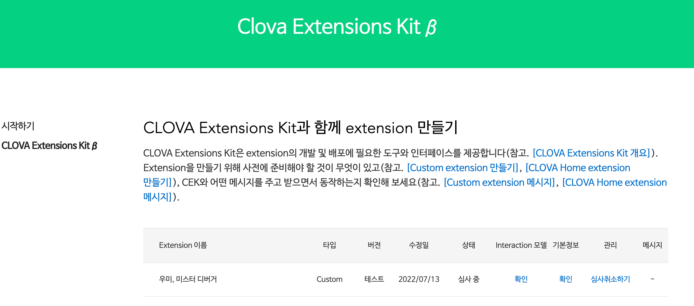
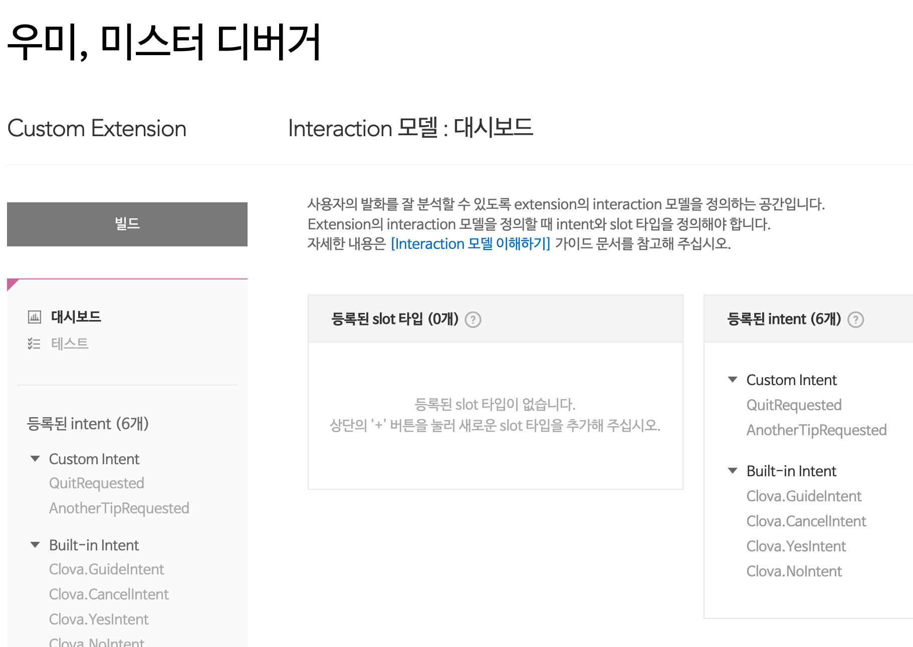

## 시작하며


**올해에는 많은 변화가 있었다!**

- 💼 **데브옵스 엔지니어**로 회사를 가게 됐고 아주 만족 중이다!
- 🏠 회사의 좋은 보상, 복지에 힘입어 생애 첫 **자취**를 하게 됐다.
- 💻 **네트워크**나 **리눅스**, **보안** 등 딥한 영역에 좀 더 관심을 갖게 됐다.
- 🎸 **기타**를 꾸준히 다니고 있다.

그런 변화들 속에서 자취방에 인터넷 설치를 하게 됐는데 **클로바 AI 스피커**를 공짜로 주더라.

본가에 있을 때도 쓰긴 했는데 딱히 관심 없다가 직접 클로바 앱을 깔아서 이것저것 써보니 '전보다 재밌네..? ㅎㅎ' 싶었고, '아니 이거 직접 만들지는 못하나'하는 생각이 들던 참에 "스킬 스토어”라는 게 눈에 띄었다. 스킬 스토어에는 개별 개발사들이 개발한 자기네 기능들이 소개되어있었다.

요즘 재미있게 딥한 영역을 공부해나가고 있긴 하지만 너무 딥한 것만 하다보니 심심풀이 작업 좀 즐기고 싶은 마음에 나도 하나 스킬을 만들어보고자 했다. 마침 요즘 `istio`에도 관심이 많이 갔고 적용해보고 싶었는데 갖고 있던 k8s 클러스터에 istio는 배포해놓은 상태였고, `Gateway`, `VirtualService` 등의 `CRD`와 `인증서`만 잘 만져주면 스킬을 공개할 수 있을 것 같았다.

그리하여 "**우미, 미스터 디버거**"라는 스킬을 개발하고자 했고 이 녀석의 기능은 사용자가 "디버거, 디버깅 팁 좀 알려줘"라는 식으로 요청하면 미리 정의해놓은 디버깅 팁(e.g. "환경변수가 잘 설정되어있나요?") 중에서 랜덤으로 팁을 알려주는 것이다.

> _이번 글은 그냥 일기장 같은 느낌으로 CS 지식은 일부 제외하고 적어보려합니다._

> _이번 글에서 사용한 소스코드는 Github [umi0410/umi-mrdebugger](https://github.com/umi0410/umi-mrdebugger)에서 찾아보실 수 있습니다._

## 환경 및 버전 정보

| 이름           | 버전     |
|--------------|--------|
| k8s cluster  | 1.22   |
| Istio        | 1.11.8 |
| cert-manager | 1.8.2  |

실제로 실무를 다루고 최신 기술들을 이용하다보니 **최근 버전으로 인한 삽질이 잦았다**. 따라서 혹시 참고하실 분이 계실까 싶어 내 클러스터의 환경 및 버전 정보를 정리해봤다. **버전은 참 중요하다**. 각 도구들의 호환성을 잘 확인해봐야한다.

나는 클러스터를 한동안 업그레이드 해주지 않아 2022년 7월 기준으로 그냥 저냥 최신은 아닌 [1.22 버전](https://kubernetes.io/releases/patch-releases/#1-22)의 k8s 클러스터를 갖고 있었고 istio는 k8s 1.22와 호환되는 버전 중 가장 오래된 minor 버전의 [1.11.8](https://istio.io/latest/docs/releases/supported-releases/)을 사용했다. istio를 최대한 구버전으로 이용해본 이유는 istio를 업그레이드해나가면서 istio의 변경사항, 역사등을 공부하면 좋을 것 같기 때문이었다. 때로는 업그레이드 작업을 실제로 진행해야할 수도 있고 말이다.

`cert-manager`는 가끔 CRD api version이 변경되는 경우가 있어서 그냥 기록해놨다.

`k8s`는 `GKE`를 이용 중이고 `istio`는 `istioct`l로, `cert-manager`는 `Helm3`로 관리 중이다.

## 서버 개발하기

서버 개발은 별거 없다. 그냥 HTTP Post 요청 분석 후 응답을 주면 된다. 실제로 정말 그 정도 수준이라 퇴근 후 몇 시간 만에 개발 → 배포까지 완료할 수 있었다. 생각보다 금방이었다.

직상된 지 몇 년은 된 듯하면서 [그닥 친절하진 않은 공식 문서](https://developers.naver.com/docs/clova/custom_ext/Develop/Guides/Build_Custom_Extension.md)와 [예시 프로젝트(코인헬퍼)](https://developers.naver.com/docs/clova/custom_ext/Develop/Examples/Extension_Examples.md#CoinHelper)를 참고하면 쉽게 만들어볼 수 있다. 나는 예시 프로젝트인 코인헬퍼 레포지토리를 포크 떠서 개발했다.

"우미, 미스터 디버거" 레포지토리: [https://github.com/umi0410/umi-mrdebugger](https://github.com/umi0410/umi-mrdebugger)

(*일기장스러운 글이므로 코드를 해석하진 않겠습니다.*)

많은 예시 프로젝트 중 코인헬퍼를 골라 개발해나간 이유는 유일하게 Go언어로 개발된 예시 프로젝트였기 때문일 뿐이었다. 실제로는 그냥 타입 선언이랑 유틸 함수 정도만 가져오고 나머진 다 재구현하게 되긴 했다. 기존엔 내장 `http` package를 사용했는데 `fiber`라는 웹프레임워크 이용하도록 변경하는 등..

## 쿠버네티스에 배포하기

쿠버네티스에 배포된 istio를 통해 외부에서 서버 Pod로 접속 가능하게끔 해줄 것이고, cert-manager를 통해 인증서 발급 후 해당 인증서와 관련된 시크릿을 istio가 가져가서 tls를 제공한다.

*(k8s manifest file 또한 앞서 언급했듯 [https://github.com/umi0410/umi-mrdebugger](https://github.com/umi0410/umi-mrdebugger) 에서 찾아보실 수 있습니다.)*

```bash
umi-mrdebugger/k8s $ tree                                                                                      4s 00:38:42
.
├── certificate.yaml
├── cluster-issuer.yaml
├── deployment.yaml
├── gateway.yaml
├── svc.yaml
└── virtual-svc.yaml
```

필요한 항목들은 k8s 리소스들은 위와 같다

```yaml
# cluster-issuer.yaml
apiVersion: cert-manager.io/v1
kind: ClusterIssuer
metadata:
  name: clova-issuer
  namespace: cert-manager
spec:
  acme:
    # The ACME server URL
    server: https://acme-v02.api.letsencrypt.org/directory
    email: dev.umijs@gmail.com
    # Name of a secret used to store the ACME account private key
    privateKeySecretRef:
      name: clova-issuer-secret
    solvers:
    - http01:
        ingress:
          class: istio
```

cert-manager가 Let's Encrypt로 인증서를 발급받을 수 있게 해주는 ClusterIssuer를 작성한다. 아마 Certificate와 동일 네임스페이스를 이용한다면 ClusterIssuer가 아닌 Issuer여도 괜찮을 것이다.

그리고 기존에는 Challenge 방식을 DNS01로 했었는데 DNS01 방식이 약간 가물 가물해져서 우선은 HTTP01 방식으로 도메인을 인증하기로 했다.

참고로 HTTP01 방식을 이용하는 경우 인증서를 발급받기 전부터 미리 HTTP → HTTPS 를 설정해두면 Challenge가 성공적으로 이루어지지 않는 듯하다. 아마 HTTPS로 리다이렉트 되는데 인증서가 없다보니 HTTPS 통신이 원활하지 않아서겠다.

```yaml
# certificate.yaml
apiVersion: cert-manager.io/v1
kind: Certificate
metadata:
  name: mrdebugger-cert
  namespace: istio-system
spec:
  secretName: mrdebugger-cert-secret
  commonName: mrdebugger.clova.jinsu.me
  issuerRef:
    name: clova-issuer
    kind: ClusterIssuer
    group: cert-manager.io
  dnsNames:
  - "mrdebugger.clova.jinsu.me"
```

HTTP01 방식으로 Challenge를 진행하기 때문에 와일드카드(*, asterisk)는 사용하지 못해 그냥 사용할 도메인 네임인 [mrdebugger.clova.jinsu.me](http://mrdebugger.clova.jinsu.me) 를 적어주었다.

```yaml
# deployment.yaml
apiVersion: apps/v1
kind: Deployment
metadata:
  name: mrdebugger
  labels:
    app: mrdebugger
spec:
  replicas: 1
  revisionHistoryLimit: 3
  selector:
    matchLabels:
      app: mrdebugger
  template:
    metadata:
      labels:
        app: mrdebugger
    spec:
      terminationGracePeriodSeconds: 1
      containers:
      - name: mrdebugger
        image: umi0410/mrdebugger
        imagePullPolicy: Always
        ports:
        - name: http
          containerPort: 8080
        readinessProbe:
          httpGet:
            port: 8080
            path: /health
          initialDelaySeconds: 5
          timeoutSeconds: 2
          successThreshold: 1
          failureThreshold: 3
          periodSeconds: 10
```

```yaml
# svc.yaml
apiVersion: v1
kind: Service
metadata:
  namespace: mrdebugger
  labels:
    app: mrdebugger
  name: mrdebugger
spec:
  selector:
    app: mrdebugger
  ports:
  - name: mrdebugger
    port: 80
    protocol: TCP
    targetPort: http
  type: ClusterIP
```

이번엔 그저 그런 평범한 서버 Pod를 배포해줄 Deployment와 그것을 노출시켜주는 Service를 작성해줬다. 이건 뭐 설명할 건 없다.

```yaml
# gateway.yaml
apiVersion: networking.istio.io/v1alpha3
kind: Gateway
metadata:
  name: mrdebugger
spec:
  selector:
    istio: ingressgateway
  servers:
  - port:
      number: 80
      name: http
      protocol: HTTP
    hosts:
    - "mrdebugger.clova.jinsu.me"
    #tls:
    #  httpsRedirect: true
  - port:
      number: 443
      name: https
      protocol: HTTPS
    hosts:
    - "mrdebugger.clova.jinsu.me"
    tls:
      mode: SIMPLE
      credentialName: mrdebugger-cert-secret
```

istio의 Gateway CRD를 정의하자. 배포되어있는 istio ingress gateway를 selector로 선택해주고 아까 정의한 인증서가 담길 secret을 TLS에서 사용하도록 한다.

```yaml
# virtual-svc.yaml
apiVersion: networking.istio.io/v1alpha3
kind: VirtualService
metadata:
  name: mrdebugger
  namespace: mrdebugger
spec:
  hosts:
  - "*"
  gateways:
  - mrdebugger
  http:
  - match:
    - uri:
        prefix: /
    route:
    - destination:
        host: mrdebugger
        port:
          number: 80
```

마지막으로 istio의 VirtualService CRD를 정의해주면 된다. 그냥 모든 요청을 mrdebugger 서비스로 넘겨준다고 보면 된다.

💡 몇 가지 istio CRD에 대해 헷갈리는 부분들을 정의해보자면 다음과 같다.

- Gateway는 istio ingress gateway와 다르다.
    - Gateway는 CRD이고, ingress gateway는 자신을 selector로 설정한 Gateway를 보고 해당 설정을 적용한다.
    - 마치 Ingress와 Nginx Ingress Controller 같은 느낌이랄까
- Istio ingress gateway는 보통 istio-system 네임스페이스에 존재한다.
- Gateway는 아무 네임스페이스에 만들어도 된다.
- VirtualSevice 또한 아무 네임스페이스에 만들어도 된다.
    - 단, VirtualService의 destination은 접근 가능한 mesh 내의 호스트여야하고 네임스페이스가 다른 경우 적절한 도메인 네임을 써야할 수 있다.
    - 같은 네임스페이스의 경우 service name만으로 이용 가능하다.
- Service, Deployment, Pod, … 또한 아무 네임스페이스에 만들어도 된다.

```bash
umi-mrdebugger $ kubectl create ns mrdebugger
namespace/mrdebugger created

umi-mrdebugger $ kubectl label namespace mrdebugger istio-injection=enabled
namespace/mrdebugger labeled

umi-mrdebugger $ kubectl apply -n mrdebugger -f k8s/
certificate.cert-manager.io/mrdebugger-cert created
clusterissuer.cert-manager.io/clova-issuer created
deployment.apps/mrdebugger created
gateway.networking.istio.io/mrdebugger created
service/mrdebugger created
virtualservice.networking.istio.io/mrdebugger created
```

한 번에 리소스가 빵 떠서 잘 연결되면 좋겠지만,,, 당연히도 현실실은 그렇진 않다. 🥲

자잘한 이슈들을 해결해주고 나면 다음과 같이 서버에게 성공적으로 응답을 받을 수 있다.

```bash
# 인증서가 READY 되었다!
$ kubectl get cert -n istio-system mrdebugger-cert
NAME              READY   SECRET                   AGE
mrdebugger-cert   True    mrdebugger-cert-secret   28m
```

```bash
$ curl https://mrdebugger.clova.jinsu.me/health
OK
```

🎉 굿. 좋당!

## Clova AI Console에서 Custom Extension 등록하기


[Clova AI Console](https://developers.naver.com/console/clova/cek/#/list)에 가서 자신의 Extension을 생성하면 된다. 만드는 과정은 별건 없다.


이것만 잘 설정해주면 되는데 보통 "{{호출 이름}} 시작해줘"로 스킬이 시작되는 것 같다. 그 이후는 세션이 끊어지지 않으면 세션의 컨텍스트를 살려 대화할 수는 있는듯 하다.



그리고 나선 Interaction 모델 설정에 들어가 빌드를 해줘야한다. 자신이 Custom Intent를 사용하지 않는다해도 무조건 한 번은 빌드를 해줘야한다. 문서 상으로는 3~5분 정도 소요된다고 하는데 체감상 한 10분은 걸린듯하다… 최초 1번이 오래 걸리는 것 같고 그 이후로는 금방 되는 듯? (사이트 UI가 그닥 친절하진 않다. 약간은 버려진 느낌…?)

그러고 나면 테스터 ID를 등록해줘야한다. 보통은 심사, 실제 퍼블리시까지는 귀찮기 때문에… 혼자만 쓸 거라던가 그냥 재미삼아 만들어본 경우에는 뭐 테스터만으로 사용하는 것도 충분할 것 같다. 네이버 API 등등은 주로 이렇게 출시 심사 전까지 테스트 ID를 사용할 수 있게 해주더라.


테스터 아이디를 등록한 뒤 네이버 클로바 앱에 자신의 네이버 아이디로 로그인하면 스킬 스토어 페이지에서 위와 같이 자신이 등록한 스킬을 볼 수 있다. 문서상으론 시간이 꽤 걸릴 수도 있다고 했는데 아마 바로 보였던 것 같다.

그럼 아마 아까 콘솔에서 설정한 "{{호출 이름}} 시작해줘"로 스킬을 시작할 수 있을 것이다. 나는 끝에 "시작해줘"를 안 붙여도 되는 줄 알고 호출 이름을 "디버깅 도와줘"로 했는데 고생을 좀 했다. 호출 이름이 "디버깅 도와줘"인 경우 실제로는 "디버깅 도와줘 시작해줘" 이런 식으로 말해야 실행이 되기 때문이다… ㅜㅜ

그럼 결과를 확인해보자.



🎉 귀엽게 디버깅을 도와줘는 "**미스터 디버거 우미**"를 만나볼 수 있었다. 🥳

## 마치며

오랜만에 딥한 기술을 탐구하는 것에서 벗어나 유흥스러운 개발을 해보았다. 사이드 프로젝트를 시작으로 가꾸게 됐던 GKE 클러스터에 **istio를 구축만 해놓고 제대로 도입은 못해본 상태였는데 이번 서버 배포를 진행하면서 한 번 데모처럼 istio를 사용해볼 수 있었어서 좋았다**. istio를 도입해본 걸 생각하면 그닥 유흥스럽다기 보단 기술 탐구스러웠을지도..? ㅎㅎ

새로 회사를 들어가고나서는 궁금한 것, 공부하고 싶은 것이 넘쳐나고 재미있게 공부해나가고 있지만 다소 블로그에 정리하긴 어려운 내용들이 많은 것 같다. 어려운 내용들이다보니 공부는 했더라도 1번의 공부만으로 의미있는 글을 담아내긴 어렵기도 했다.

하지만 바쁘기도 한데다가 뭔가 깊이 있는 글을 쓰려다보니 요즘 블로그에 글을 오히려 안 쓰게 되고 '아 이것도 써보고 싶은데 저것도 써보고 싶은데…' 생각만 하다 벌써 마지막으로 글을 쓴지도 엄청 오래된 것 같다.

그래서 앞으로는 CS 지식이나 정확한 정보는 아니더라도 가끔 이렇게 개발 일기스러운 글도 적어볼까한다. 그런 글은 남에게 정보를 전달하려는 목적보단 나를 기록하는 용도기 때문에 '_…입니다._' 체보다는 '_…이다_' 체로 그냥 가볍게 적어나가려한다.

*그럼, 다음에 또 만나용.*