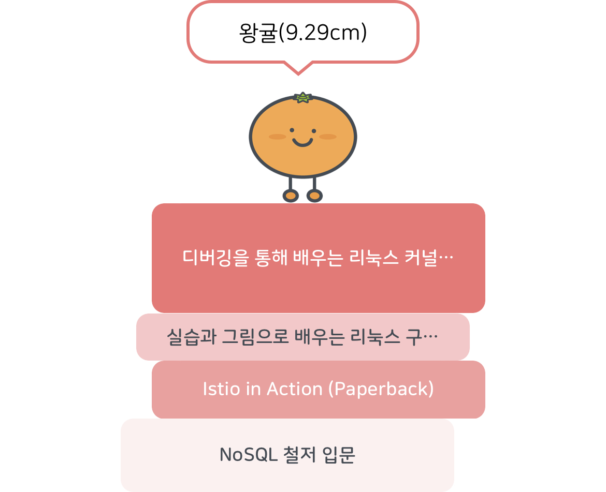

## 시작하며

이 책을 읽기 전, 커널이나 운영체제는 나에게 꽤나 안개 같은 존재였다.
나는 클라우드 인프라를 다루는 엔지니어임에도 불구하고 커널이나 운영체제에 대해 제대로 알지 못하는 점이 약간 부끄럽게 느껴져
이 책을 통해 커널이 어떻게 동작하는지 좀 더 알아가고 싶었다.

## 책에 담긴 내용 간단히 정리

* 실제로 커널을 빌드하고 설치하는 방법
* ftrace, trace32 등의 커널 개발, 디버깅에 도움되는 도구들 사용법
* process나 thread 등의 개념이 실제로 구현된 자료구조
* 인터럽트가 발생하고 감지되어 처리되기까지의 일련의 과정
* 인터럽트 처리 기법

## 장단점

### 장점

* 실제로 커널을 빌드하고 설치해볼 수 있다! - 이 책을 읽으면서 수차례 커널을 빌드해볼 수 있었다.
  만약 이 책이 없었더라면 어떻게 시작해야할지, 가능은 한 걸지 막연한 두려움에 쌓여있었을 수도 있었을 것 같은데 
  이 책 덕분에 어렵지 않게 직접 커널을 설치해볼 수 있었고, 몇몇 유용한 팁, 코드들을 얻을 수 있었다.
* 인터럽트가 어떻게 발생해서 어떻게 처리되는지 좀 더 구체적으로 알 수 있다.
* 여러가지 인터럽트 처리 기법에 대해 배워볼 수 있다. - IRQ 스레드, Soft IRQ, Work Queue등의 개념을 다룬다.
  만약 이 책이 없었다면 이런 키워드를 얻는 것 조차 매우 힘들었을 듯하다.
* 인터넷 강의도 존재하고 저자분 블로그도 존재하는데 커뮤니케이션이 활발해 열심히 학습했다는 전제하에 그래도 모르는 게 있다면
  얼마든지 여쭤볼 수 있다.

### 단점

* (너무) 코드 위주의 자세한 내용이 많다. - 이건 단점이라기 보단 내 상황과는 조금 맞지 않았던 점이다.
  처음에는 코드까지 까본다는 면이 되게 매력적으로 느껴졌는데 점점 너무나 깊은 심연을 탐구하게 되는 느낌이었달까...
  일반적인 개발자, 엔지니어들에게는 다소 과하게 느껴질 만한 깊이인 듯하다.
* 중반 이후로는 실습이 별로 없고 인터럽트 후반부 처리에 대한 단순 나열이 많다. - 사실 나는 현재 데브옵스 엔지니어일 뿐
  본업이 커널 개발자는 아니기에 애초에 이 책의 내용을 완~전히 이해하는 것을 목표로 하진 않았다. 디버깅 실습이 많다고 하니
  '책을 슥슥 넘기지 말고 실습이라도 무조건 다 따라해보자!'는 마인드였는데 중반부터는 인터럽트 후반부 처리 기법들이 등장하면서는 실습은 거의 없고,
  해당 기법들을 각각 설명해나가는 내용이 주였다. 하지만 이 부분은 거의 나에게는 도움되지 않는 내용이었던 것 같아 결국
  아쉽게도 뒷부분은 그냥 슥슥 읽고 넘어가게 됐다.

## 마치며

**이 책은 커널에 대한 두려움을 없애줬고, 실제로 커널을 빌드하고 설치해보는 멋진 경험을 할 수 있게 해줬다.** 이 책 덕분에 프로세스는 어떤 자료구조로 구현되어있고 어떻게 처리되는지,
fork는 무엇인지, 스레드는 어떻게 구현되어있고 어떻게 처리되는지, 인터럽트는 어떤 흐름으로 발생되고 처리되는지를 한 번 더 공부해볼 수 있었다.
관련된 주제를 다루는 글들이 흔하다면 흔할 수는 있지만, 이 책처럼 자세하게 다뤄주는 경우는 없었기에 중반까지는 이 책을 참 재밌게 읽었던 것 같다.
하지만 인터럽트 후반부 처리 관련된 내용이 나오면서 머리가 어질어질해지고, 나랑은 좀 무관한 내용 같아서 좀 급히 책을 마무리하게 된 경향이 있어서 이 점은 조금 아쉽다.

시간적 여유가 된다면 언젠가 이 책의 초반부~중반부는 한 번 더 읽어보고 2편까지도 읽어보고 싶긴한데 아무래도 당장 공부해야할 내용이 산더미이다보니 실질적으로 업무와는 거리가 먼 이 내용을 공부할 여유가 생길 수 있을지 잘 모르겠다.

올해에 책 3권을 읽는 게 목표였는데 이를 초과달성해 4권을 읽었다. 좋았던 점은 목표를 초과달성했다는 것이고, 아쉬운 점은 돌이켜보면 잊어버린 내용이 꽤 많다는 점이다.
아쉬운 점을 어떻게 개선해나갈지는 몇 주 뒤 올 한 해를 회고하고 새해 계획을 세울 때에 더 생각해봐야겠다.
