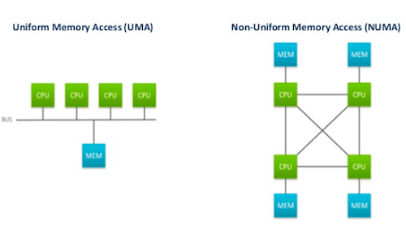
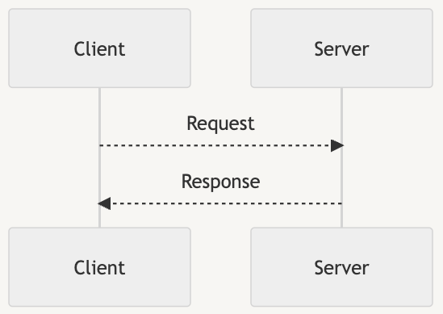
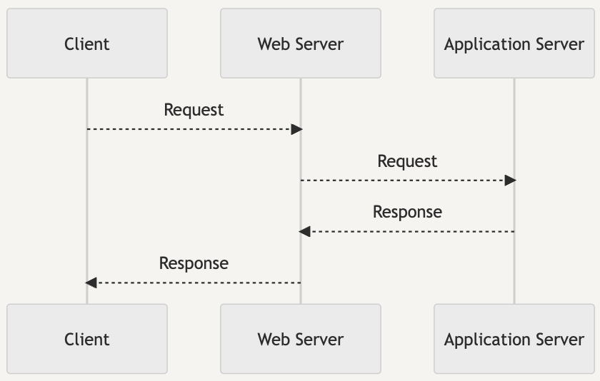
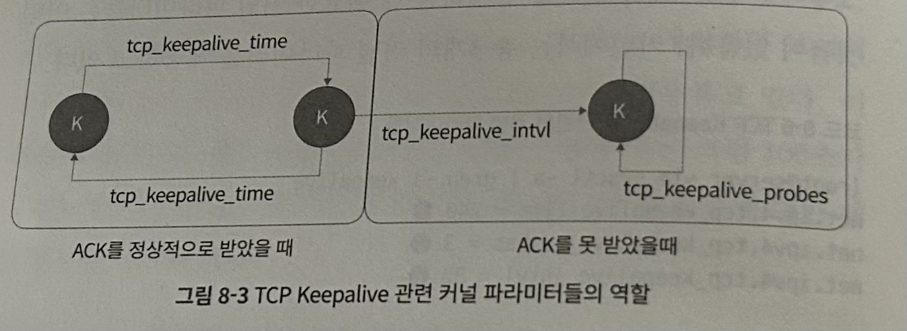

## 1. Overview

★★★★ - 리눅스 서버의 성능에 영향을 끼칠 수 있는 부분들을 공부해볼 수 있는 책.
하지만 인프라가 클라우드를 바탕으로 고도로 추상화되고 있는 요즘의 상황을 고려했을 때 로우 레벨 수준의 내용이나 코드를 자세히 다루는 부분들은 일반적인 DevOps나 SE에게는 다소 불필요한 내용 같이 느껴지기도 한다.

## 2. Personal Impressions

- 개념 소개 후 저자가 경험한 실제 사례들을 비교적 이해하기 쉽게 설명해주기 때문에 배운 내용의 필요성을 바로 공감할 수 있어서 좋았다.
- 리눅스에서 성능에 영향을 끼칠 수 있는 부분들에 대해 살펴볼 수 있었다. 
  - 메모리나 캐시의 특징, 디스크 IO, 네트워크 IO에 대해 다뤘다.
  - 기본적인 개념 자체를 깔끔히 설명한다.
  - 게다가 커널이 그런 리소스들을 어떻게 관리하는지까지 다뤄준다. 이 책 외에는 이런 내용들을 한 데에 모아 정리된 곳을 찾아보기 힘들다고 생각한다.
- 개념 소개 후 관련된 실제 사례들을 소개해주어 해당 개념의 필요성을 공감할 수 있었다.
- 마지막 챕터에서는 앞서 배운 내용들을 바탕으로 실제로 성능 개선을 해나가는 과정이 있는데 전체적인 내용 wrap up 겸 굉장히 좋았다. 
  개인적으로 실제 사례를 생략한 채 추상적인 얘기만 하거나 이론적인 내용만 다루는 책들을 싫어하는 편인데, 이런 관점에서 이 책은 꽤나 재미있었다.    
- 다만 인프라가 클라우드를 바탕으로 고도로 추상화되고 있는 요즘 시대에 DevOps/SE에게는 이제 그닥 필요하지 않을듯한 내용까지 너무 자세히 다루는 점이 개인적으로는 오히려 좀 아쉬웠다.
  예를 들어 로우 레벨의 깊은 코드단까지 살펴보면서 집요하게 설명하는 부분이 좀 불필요하고 지루하게 느껴지기도 했다.
- 각 장의 요약부분이 사실 굉장히 요약이 잘 되어있는데, 책의 내용이 다소 과하게 자세하고 깊다는 점을 고려했을 때, 요약만 읽어도 큰 문제 없을 듯하고, 그 경우 굉장히 효율적일 수 있겠다는 생각도 들었다.
  따라서 책 전체를 읽기는 좀 지루할 것 같다거나 부담스러울 것 같다고 느껴지는 분들은 요약을 읽고 흥미로운 부분만 골라 읽어도 될 것 같다. 
- 책에서 inode나 denti cache, filesystem 관련 metadata 등등 file system에 대한 내용들이 언급되었는데 이 내용들은 계속해서 내가 약한 부분 같아서 언제 한 번 살펴봐야겠다.

## 3. Summaries

### Chapter 1. 시스템 구성 정보 확인하기

- 시스템 구성 정보를 확인해보는 간단한 커맨드들을 소개한 장.
- cpu 정보는 /proc/cpuinfo 파일을 통해 확인 가능
- free 명령어를 통해 시스템에 설치된 메모리의 크기, 사용 중인 메모리 등을 조회할 수 있음.
- df 명령어를 통해 시스템에 마운트된 블록 디바이스의 정보 확인 가능
    - /dev/sda - Old-SCSI-based Disk, 요즘의 SATA, SAS와 같은 일반적인 하드디스크 타입의 인터페이스를 이용하는 디스크
        - 일반적으로 서버의 경우 RAID 컨트롤러를 통해 생성된 logical volume으로 존재함.
    - /dev/hda - IDE-based disks
    - /dev/vda - Virtual-hypervisor-based disks
    - 디스크를 사용하려는 쪽과 실제 디스크 사이의 컨트롤러라는 부품이 있음. 이 부품의 타입은 IDE와 SCSI로 나뉨
        - IDE - 개인용 컴퓨터
        - SCSI - 서버용 컴퓨터, 더 많은 장치, 더ㅃ 빠른 접근 속도
- ethtool을 통해 네트워크 카드의 정보 조회 가능

### Chapter 2. top을 통해 살펴보는 프로세스 정보들

- top 명령어를 통해 CPU, memory, swap 정보를 조회 가능
    - **VIRT** - 프로세스에 할당된 "가상" 메모리
    - **RES** - 실제로 메모리에 올려서 사용하고 있는 물리 메모리의 크기
    - SHR - 다른 프로세스와 공유하고 있는 메모리
    - VIRT는 엄청 커도 사실 문제 없을 수 있다.
    - 중요한 것은 RES. RES가 너무 높으면 커널의 OOM Killer에 의해 프로세스가 종료당할 수 있다.
- **Memory overcommit** - 프로세스가 메모리를 요청할 때 바로 물리 메모리를 할당해주지 않고, 가상으로만 할당해주는 것.
  그렇기에 할당된 메모리들의 합은 실제 물리 메모리의 크기를 초과할 수 있다.실제 물리 메모리 공간을 할당 받는 것은 해당 프로세스가 실제로 해당 메모리 공간에 접근하려할 때이다.
- 프로세스에는 스케쥴링 우선순위라는 것도 존재한다. 커널의 프로세스 스케쥴러는 이 우선순위를 참고해 프로세스들을 스케쥴한다.

### Chapter 3. Load Average와 시스템 부하

- Load Average는 상태별 프로세스들의 개수들을 바탕으로 만들어진 값
  - 프로세스가 갖는 상태의 종류
      - 실행 중인 프로세스
      - 실행 대기 중인 프로세스
      - IO 작업을 위해 대기 큐에 있는 프로세스

### Chapter 4. free 명령이 숨기고 있는 것들

- free 아웃풋에서의 buffers - 파일 시스템의 메타데이터 등을 저장하고 있는 블록 디바이스의 블록을 위한 캐시
- free 아웃풋에서의 cached - I/O 작업의 효율성을 위해 한 번 읽은 파일의 내용을 저장하는 데에 사용하는 캐시 (**Page cache**)
- 여유 메모리가 없는 상황에서 다른 프로세스가 메모리 할당을 필요로 하면 커널은 buffers와 cached 영역의 메모리를 해제해 메모리가 필요한 프로세스에게 할당해준다.

### Chapter 5. swap, 메모리 증설의 포인트

- swap 메모리란? - 물리 메모리가 부족한 경우 프로세스가 사용하는 메모리 중 우선순위가 낮은 영역을 물리 메모리에서 해제하고 디스크로 빼두는 영역.
  이때 디스크 I/O는 메모리 I/O에 비해 월등히 느리기 때문에 시스템 전체(혹은 해당 프로세스)에 대한 병목이 될 수 있다.
- swap 영역이 조금이라도 사용되었다는 것은 어찌됐든 시스템에 물리적 메모리가 부족하다는 것이다.
- 어떤 프로세스가 swap 영역을 사용 중인지는 smem이라는 툴로 확인 가능.
- 커널 파라미터를 통해 swap을 사용할지 메모리 영역 중 페이지 캐시로 사용 중인 영역을 해제할지의 비율을 조절 가능
- 커널 파라미터를 통해 캐시를 더 많이 해제할지, 디렉토리 캐리나 inode 캐시를 더 많이 해제할지의 비율을 조절할 수 있다.

### Chapter 6. NUMA, 메모리 관리의 새로운 세계

(사진 출처: https://www.motioncontroltips.com/what-is-non-uniform-memory-access-in-industrial-controls/)

- NUMA(Non-Uniform Memory Access) - 멀티 프로세서 환경에서 적용되는 메모리 접근 방식
    - UMA(Uniform Memory Access) - NUMA와 반대되는 개념으로, 초창기 아키텍쳐임. 모든 프로세서가 공용 BUS를 이용해 메모리에 접근
        - 여러 프로세서가 BUS를 동시에 사용할 수 없음. e.g., 0번 소켓에 있는 CPU가 메모리에 접근하는 동안 1번 소켓에 있는 CPU는 메모리에 접근할 수 없음.
- 노드 - CPU와 메모리가 한 세트로 존재하는 단위
- 메모리의 지역성 - CPU는 같은 노드에 위치한 메모리에 접근하는 것이 성능이 가장 좋다.
- 커널 파라미터를 통해 노드의 메모리가 부족할 때 재할당할지, 다른 노드의 메모리를 이용할지 설정 가능
- policy를 통해 특정 노드에서만 메모리를 할당받도록 강제 가능
- policy를 통해 특정 노드를 선호하되 해당 노드에 여유 메모리가 없을 경우 다른 노드에서 메모리를 할당 받도록 설정 가능

### Chapter 7. TIME_WAIT 소켓이 서비스에 미치는 영향

- TCP 연결의 플로우
    - 3way handshake로 연결 성립
        - 클라 → 서버 SYN
        - 서버 → 클라 SYN / ACK
        - 클라 → 서버 ACK
    - 4way handshake로 연결 종료
        - active closer - 연결을 먼저 끝내겠다고 신호보내는 쪽
        - passive closer - 연결을 끝내겠다는 active closer에게 신호를 받는 쪽
        1. active closer → passive closer - FIN
        2. passive closer → active closer - ACK
        3. passive closer → active closer - FIN
        4. active closer → passive closer - ACK
- **active closer 쪽에는 TIME_WAIT socket이 생성된다.**
    - 서버든 클라든 active closer가 될 수 있다. 서버가 먼저 연결을 끊으려하면 서버가 active closer, 클라가 먼저 연결을 끊으려하면 클라가 active closer.
- 소켓이 TIME_WAIT 상태로 변경되는 시점 - passive closer에게 FIN을 받은 후
- TIME_WAIT 소켓이 있는 이유
    - active closer 측에서 종료하려한 커넥션에 대해 문제가 생긴 경우를 잘 핸들링하기 위해 적당한 시간동안 이전 커넥션에 대한 기록을 해두는 용도
    - e.g., FIN - ACK - FIN - ACK 과정에서 2번째 ACK이 passive closer에게 제대로 전달되지 못했다고(e.g., 패킷 로스) 해보자.
        - passive closer는 자신의 FIN에 대한 ACK을 받지 못해 LAST_ACK 상태에 머물러있게 될 수 있다.
        - 이때 passive closer는 한 번 더 자신의 FIN을 전달해본다. - ‘active closer야, 너 왜 내가 보낸 FIN에 대해 ACK을 안 주니?’
        - 이때 active closer측에 해당 커넥션에 대한 TIME_WAIT socket이 있다면 해당 FIN 패킷을 보고 ‘아 얘가 내 ACK을 못 받았었나보구나’를 유추하고 ACK를 다시 전송해줄 수 있다. 하지만 active closer 측에서 TIME_WAIT socket이 이미 사라진 상태라면 ‘이건 웬 FIN..? 난 몰라!’하고 RST로 응답해버리게 될 수 있다.
        - (RST 응답을 받은 passive closer는 뭘 하게되는지는 잘 모르겠다. 책에서는 LAST_ACK 상태로 남아있을 거라고 하는데 그냥 클라측에서도 connection을 완전히 끊고 소켓도 지워버릴 수도 있지 않나?
- nginx 같은 웹서버를 WAS 앞 단에 두면 패킷이 지나는 구간이 하나 더 추가된다.
  - 클라이언트와 WAS가 직접 통신하는 경우 
  - WAS의 앞단에 웹서버를 추가하는 경우 
  - 그럼에도 불구하고 Nginx, Apache 등의 Web Server을 앞단에 두는 이유는?
      - HTTPS를 사용하는 경우 인증서 설정 및 관리를 위해
      - UserAgent, Referer 및 각종 헤더 등 부가적인 정보를 바탕으로 처리하는 서비스 외적인 설정을 하기 위해
      - 도메인 이름에 따른 라우팅을 지원하기 위해
      - 캐시를 설정하기 위해
      - …
- TIME_WAIT 소켓이 너무 많이 쌓이면 사용할 수 있는 port mapping(source_ip:source_port:destination_ip:destination_port)이 고갈될 수 있다.
- TIME_WAIT 소켓을 아주 빠르게 회수하도록 하거나 바로 재사용하도록 하는 설정등도 가능은 함.
- TIME_WAIT 소켓이 너무 많은 경우 불필요하게 수많은 TCP Handshake이 발생하고 있는 케이스일 수 있음. → 이 경우 TCP Keepalive를 설정해주면 성능이 개선될 확률이 높다.

### Chapter 8. TCP Keepalive를 이용한 세션 유지

- 매 통신마다 TCP Handshake를 통해 Connection을 맺고 끊는 방식이 아니라 한 번 맺은 Connection을 재사용하는 방식
- 주기적으로 ‘우리 커넥션 유효하지..?’라는 의미의 TCP Keep-Alive 관련 패킷을 주고 받는다. 만약 조건 이상으로 커넥션이 idle하다고 판단되면 그제서야 커넥션이 끊긴다.
    - 먼저 idle한지 체크하는 쪽에서 TCP Keep-Alive 관련 패킷을 전송
    - 응답자 쪽에서 TCP Keep-Alive ACK 패킷으로 회신
- TCP Keepalive는 커널 레벨에서 종단 간의 세션을 유지시켜주는 기능을 한다.
- 설정값 3개 존재
   
  - tcp_keepalive_time - 두 종단 간의 연결이 유지되어있는지를 확인하는 keepalive 패킷을 보내는 주기
  - tcp_keepalive_probes - keepalive 패킷에 대한 응답을 받지 못했을 때 추가로 보내는 패킷의 개수
  - tcp_keepalive_intvl 패킷에 대한 응답을 받지 못해 재전송 패킷을 보낼 때의 주기

### Chapter 9. TCP 재전송과 타임아웃

- TCP 재전송 - 패킷이 중간에 손실되었다고 판단하고 재전송하는 것
- RTO(Retransmission Timeout) - 내가 보낸 패킷에 대한 ACK를 얼마나 기다릴 것인가. RTO 안에 ACK를 받지 못하면 패킷이 중간에 손실되었다고 판단하고 재전송한다.
- RTO의 2가지 종류
    - **일반 RTO** - RTT(두 종단 간에 패킷을 주고 받는 데에 소요되는 시간)을 기준으로 설정.
    - **InitRTO** - 두 종단 간 최초의 연결을 시작할 때. 즉 TCP Handshake가 일어나는 첫 번째 SYN 패킷에 대한 RTO.
        - 리눅스에서는 기본적으로 1초.
        - 최초 SYN 패킷이 유실되면 최소 TCP Handshake를 하는 데에만 1초 이상 소요
- RTO는 연속된 재전송 시도마다 2배씩 늘어남.
- RTO_MIN - 기본적으로 200ms로 설정되어있으나 ip route 등의 명령어에서 network device 별로 RTO min을 수정할 수 있다. 

### Chapter 10. dirty page가 I/O에 끼치는 영향

- Dirty page - Page cache에 존재하는 파일을 수정할 때 수정사항을 바로 반영하지 않고 우선 Page Cache에 적어둠으로써 성능을 향상시키고, 이 page cache 영역에는 dirty bit로 마킹을 해놓은 뒤 커널 레벨에서 주기적 혹은 비동기적으로 Disk에 변경사항을 반영하는 것. 이때 dirty bit으로 마킹된 page cache(메모리) 영역을 말함.
- dirty page를 너무 잦게 동기화하도록 설정하면 flush라는 kernel thread가 너무 자주 깨어나 효율이 안 좋고, 너무 드문 주기로 동기화하면 dirty page가 쌓이다가 vm.dirty_ratio에 도달해버릴 수 있다.
- vm.dirty_ratio에 도달할 경우 vm.dirty_background_ratio와 달리 해당 프로세스(dirty page가 많은 프로세스)의 I/O 작업을 모두 멈춘 뒤 dirty page을 디스크에 동기화한다. → 성능이 악화될 수 있다.
- 그 외의 자세한 커널 파라미터까지 알 필요는 크게 없을 듯하다.

### Chapter 11. I/O 작업이 지나가는 관문, I/O 스케쥴러

- I/O 장치마다 스케쥴러를 갖고 있을 수 있고, 수정할 수도 있다.
    - e.g., /sys/block/<block device name>/queue/scheduler에서 해당 block device의 I/O scheduler 조회/수정 가능
- I/O 스케쥴러 종류
    - cfq - 각 프로세스가 각자의 I/O 요청 큐를 갖기 때문에 공정하다. 단, 섹터 순 정렬이 모든 프로세스들의 I/O 요청을 섹터 순 정렬해서 처리하는 방식 대비 효율은 떨어진다. 각 큐는 자신의 process의 I/O request에 대해서만 고려하기 때문.
    - deadline - 기본적으로는 섹터 기준으로 정렬된 순서로 처리하되 deadline기 지난(즉, 급한) 요청이 있다면 해당 요청부터 처리한 뒤 섹터를 다시 정렬한다.
    - noop - SSD에서 주로 사용되는 것으로 섹터 위치 등에 따른 정렬을 수행하진 않고 그냥 개별 요청 병합만 수행

### Chapter 12. 애플리케이션 성능 측정과 튜닝

- 이 책의 꽃 같은 챕터이다. 솔직히 앞선 다른 챕터들은 내용이 너무 커널까지 내려간다 싶기도하지만 이 챕터는 간단하면서도 보다 더 실용적이다.
- CPU를 제대로 사용하지 못하는 병목 해소법 - 애플리케이션이 시스템의 CPU 리소스를 잘 활용할 수 있도록 worker 및 process 수를 조정한다.
    - 예를 들어 싱글 스레드로 동작하는 프로세스를 하나 띄워서는 코어가 8개인 서버에서도 CPU를 최대 써봐야 1/8밖에 쓰지 못한다. 이 경우 코어 개수 이상으로 프로세스를 늘려주면 CPU를 더 잘 활용할 수 있다.
- 불필요한 TCP Handshake들을 해소하는 법 - Keepalive를 적용한다.
    - 이 경우 불필요한 TIME_WAIT 상태 등의 소켓들이 다수 존재할 수 있다. 소켓 포트 자체가 고갈되는 문제는 TIME_WAIT 소켓이 살아있는 기간을 줄이거나 빠르게 재활용시킴으로써도 해결은 가능하다. 다만 불필요한 Handshake 자체를 줄이는 게 대체로 근본 해결책일 듯함.
- 웹서버의 세부 설정 등을 활용해 성능 개선하기
    - 웹서버가 비동기로 작업하도록 하는 설정을 추가하는 등.
    - 혹은 캐시를 웹서버 단에서 제공할 수도 있음.
    - 비정상적인 요청을 웹서버 단에서 deny할 수 있음.
- 캐시 등을 통해 성능 개선하기

### Appendix A, B

- printk, strace 등을 활용해 kernel 코드 레벨을 디버깅하는 방법에 대해 소개함.

### Appendix C. tcpdump와 와이어샤크를 통한 TCP 패킷 분석

- 간단하게 tcpdump을 통해 packet을 캡쳐하고 wireshark를 통해 packet을 분석하는 방법을 소개함.
