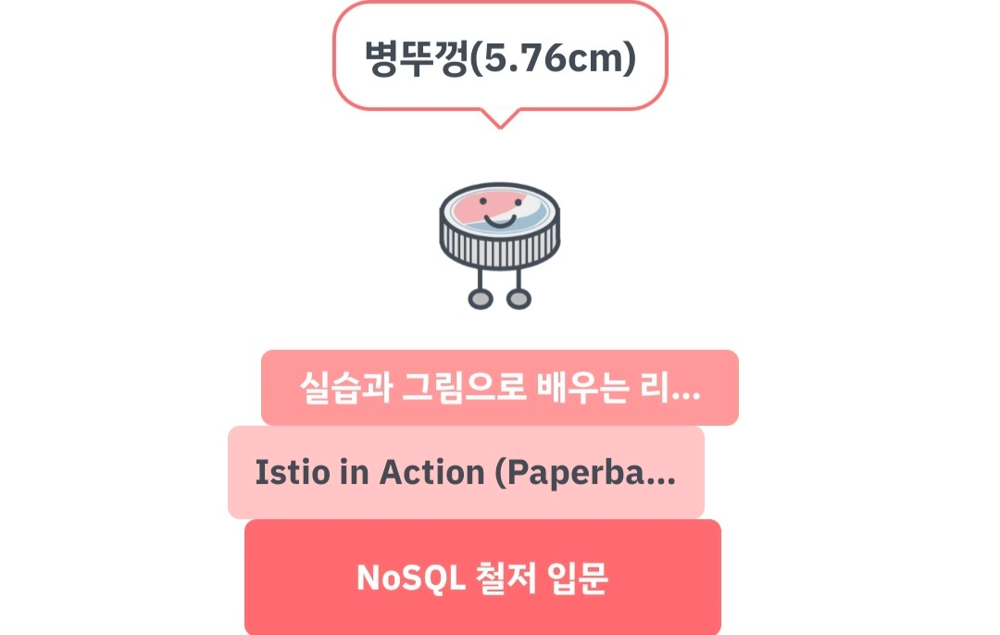

## 시작하며

Istio in Action을 읽고난 뒤에 리눅스나 커널에 대한 책을 읽어보겠다는 계획을 갖게 되었습니다. 정확히는 [DevOps와 SE를 위한 리눅스 커널 이야기](https://product.kyobobook.co.kr/detail/S000001033135)라는 책을 읽고싶었습니다.
기존에는 그 책이 사무실에 비치되어있었지만 이번에 사무실을 이사하면서 그 책이 어디갔는지 보이지가 않더라구요. 그래서 그냥 다른 책장에 비치되어있던 이 책을 읽어봤습니다.

다루고 있는 내용은 주로 리눅스 구조라기보다는 전반적인 컴퓨터 구조, 운영체제 같았습니다. 

## 책에 담긴 내용 간단히 정리

* 커널의 역할, 운영체제의 역할이 무엇인지. 커널과 운영체제 및 드라이버들이 없다면 어떤 불편이 있을지 설명합니다.
* syscall, interrupt에 대해 이해하기 쉽게 설명하고 어떤 플로우로 동작하는지 설명합니다.
* CPU, 코어, 하이퍼 스레드에 대해 설명합니다.
* 메모리와 Virtual Memory, Cache, HDD, SSD의 특징과 어떻게 동작하는지를 설명합니다.
* fork & execve가 어떻게 동작하는지와 계층적인 리눅스의 프로세스 관계에 대해 설명합니다.
* 파일 시스템이 무엇인지, 파일 시스템이 없다면 어떠한 불편이 있는지 설명합니다.

## 장단점

### 장점

* 실제 코드와 그것에 대한 수행 결과, 개념을 나타낸 그림 등을 통해 이해를 돕습니다.
* 단순히 "이런 역할을 하는 녀석입니다."로 설명이 끝나는 게 아니라 그 녀석이 없으면 어떤 불편이 있는지 예시를 들어줍니다.
  * e.g. 디바이스 드라이버가 없다면 유저들은 작성하는 모든 프로그램에서 디바이스를 어떻게 제어할지를 구현해야할 것이고, 여러 프로세스가 같은 디바이스를 사용하려는 경우 어떻게 해야할 지에 대한 문제가 생길 것이다.
  * e.g. 가상 메모리라는 개념 없이 물리 메모리를 직접 이용한다면 프로세스들이 실제로 자신의 물리메모리 주소를 관리해야하는데 이런 경우 다양한 어려움이 존재할 것이다. (너무 다양해서 이 글에선 생략.)
* 평소에 궁금했던 개념들, 내가 잘 알고 있는 건지 의문이 들었던 개념들, 이것까지 알아야하나싶은 개념들에 대해 한 번 가볍게 정리해볼 수 있습니다.
  * 예를 들면 Page cache, Hyper thread 이런 개념들은 들어보기만 많이 들어보고 가볍게 알아볼 기회가 없었는데 이번에 가볍게 '아~ 이런 거구나~' 해볼 수 있었습니다.
  * 교수님께 배웠던 Virtual Memory 역할과 흔히 인터넷에서 Virtual memory를 설명하던 내용이 조금 달라서 내가 잘 알고있는 건지 의문이 들었는데 이런 의문도 해소가 됐습니다.
    * 흔히 인터넷에서 봤던 Virtual memory의 역할은 Page라는 개념을 바탕으로 물리 메모리를 프로세스가 안전하고 편리하게 사용할 수 있도록 해주는 것이었습니다.
    * 교수님께 배웠던 Virtual memory는 이뿐만 아니라 메모리를 demading page, swap 같은 응용된 내용도 있었습니다.
    * 그래서 제가 인터넷에서 봤던 내용들이 맞는 건지 교수님께 배웠던 내용이 맞는 건지 궁금했는데 이 책 덕분에 '뭐 모두 맞는 내용 같다.'는 결론을 낼 수 있었습니다.

### 단점

* 깊이가 깊진 않습니다. 깊이만 놓고 보면 학부생 수준의 컴퓨터구조, 운영체제 정도인 듯합니다.
* 번역이 조금 어색한 부분들이 종종 보였습니다.

## 마치며

"북적북적"이라는 앱을 통해 캡쳐한 저의 2022년 독서 상태입니다. 올해에 3권을 읽는 게 목표였는데 아무래도 올해가 가기전에 한 권 정도는 더 읽어볼 수 있을 것 같습니다!
책의 권수보다는 제가 어떤 내용을 어떤 깊이로 배워나가고 있는지가 더 중요하겠지만 일단은 뿌듯하네요! ㅎㅎ
한국어로 된 책인데다가 친숙한 내용, 깊지 않은 깊이였던 터라 제 기준에선 꽤나 빨리 읽을 수 있었던 것 같습니다.

다음에 기회가 된다면 이 책처럼 컴퓨터 구조, 운영체제의 내용을 주로 다루는 책보다는 커널에 대해 다루는 책을 읽어보고 싶습니다.