## 시작하며

**취준생 기간을 마무리**하고 **데브옵스 엔지니어로서 커리어를 시작**하게 됐습니다! 🎉

근무를 시작하기 전까지 기간이 좀 남아있어서 그 전까지 뭘 해보면 재밌을까 고민하던 중에
새로 생긴 클라우드 동아리인 **Cloud Club**에서 클라우드와 인프라에 관한 주제로 발표할 기회가 주어져 ArgoCD를 토픽으로 발표를 해보려합니다.
그리고 관련된 내용을 한 번 더 블로그에 정리해보려해요!

주제는 "_`ArgoCD` 선언적으로 이용해나가기_" 이고 주로 다룰 내용은 어떻게 ArgoCD를 좀 더
선언적으로 관리하고 이용해나갈 수 있을지입니다.

ArgoCD가 뭔지, 어떻게 Getting Started할지, GitOps가 뭔지 등을 다루지 않으려는 이유는 이미 그 내용으로는 충분한 양질의 자료가
존재한다고 생각하기 때문입니다.
ArgoCD나 GitOps의 개념 자체 같은 내용보다는 새로운 기술(ArgoCD)을 접할 때 어떻게 입맛대로 커스터마이징해나가는지
그리고 그 작업을 **어떻게 좀 더 유지보수하기 쉽도록 즉 선언적으로 해나갈 수 있을지**에 대한 저의 작업 과정을 소개해보려합니다 ☺️

이번 글에서는 크게 다음과 같은 작업을 다루게 될 거에요.

1. `minikube`를 통해 로컬에 kubernetes 환경을 구축합니다.
2. `helm`을 통해 ArgoCD를 install 합니다.
3. `ArgoCD`를 이용해보기 위해 `CRD`인 `AppProject`와 `Application`을 생성합니다.
4. 실제로 GitOps의 형태로 CD가 잘 동작하는지 확인~
5. 1~4번 과정을 helm을 통해 좀 더 선언적으로 수행할 수 있도록 개선합니다.

해당 과정들을 실습해보고 싶으신 분들은 제가 작성해둔 Repository(https://github.com/umi0410/declarative-argocd)를 포크한 뒤 작업하시면 편하실 것 같습니다.

## Glossary (용어 사전)

간단하게 이번 글에서 다루게 될 용어들을 정리해보겠습니다. 자세한 내용이 궁금하시다면 따로 찾아보시는 것을 추천드리겠습니다.
이번 글에서 전부를 다루긴 힘들기 때문이에요 ㅜㅅㅜ

* **Glossary** - 용어 사전
* **minikube** - "minikube is local Kubernetes, focusing on making it easy to learn and develop for Kubernetes." from [Minikube Docs](https://minikube.sigs.k8s.io/docs/start/)
* **ArgoCD** - "Argo CD is a declarative, GitOps continuous delivery tool for Kubernetes." - from [ArgoCD Documents](https://argo-cd.readthedocs.io/en/stable/)
* **CRD**(Custom Resource Definition) - K8s의 표준 Resource는 아니지만 개별적으로 정의하여 사용할 수 있는 리소스 kind들을 말함.
* **Application** - ArgoCD가 사용하는 CRD 중 하나. 어떤 K8s 리소스들을 어떤 Repository에서 가져와서 어떤 식으로 배포할 지를 정의함.
* **AppProject** 혹은 Project - Application이 속하는 그룹. 
* **GitOps** - DevOps의 실현 형태 중 하나. 인프라나 애플리케이션 운영 정보에 대한 Single Source of Truth로서 Git Repository를 활용하는 형태
* **Helm** - K8s application을 패키징하여 편리하게 관리할 수 있도록 해주는 도구
* **Chart** - Helm을 통해 배포되는 것. Chart는 다양한 k8s 리소스들을 패키징한 형태이다.
* **선언적**(Declarative) - 절차적(Procedural) 혹은 명령적(Imperative) 방식과 달리 과정을 생략하고 간결하게 Desired State를 선언적으로 정의하는 것.

## Requirements

* **minikube**
  * `brew install minikube && minikube start`
* **kubectl**
  * `brew install kubectl && kubectl version`
* **helm**
  * `brew install helm && helm version`
* **Github account**
  * 예시 코드 레포(https://github.com/umi0410/declarative-argocd)를 포크뜬 뒤 자신의 레포를 통해 Continuouse Deploy하기 위함

## ArgoCD를 구축하고 관리하는 방법

쿠버네티스에서는 어떤 서비스를 배포하고 관리해나가는 데에는 다음과 같은 방법들이 있습니다.

* Plain k8s manifest yaml
* Kustomize
* Helm Chart
* ...

이외에도 다양한 방법들이 있을 수 있지만 일단 제가 사용해본 방법들은 위의 3개와 같아요.

저는 복잡한 형태를 가진 오픈소스를 배포할 때에는 Helm Chart를, 우리 팀의 서비스를 각각 배포할 때에는 가볍게
인자를 수정하는 등의 용도로 Kustomize를 사용하고 있습니다.
Plain k8s manifest yaml은 실제 업무나 프로젝트에서는 거의 사용하지 않고, 쿠버네티스 관련 tutorial 등에서 주로 사용하고 있습니다.

복잡한 형태의 오픈소스를 배포할 때에는 Helm Chart를 사용하는 이유는 Helm Chart는 `values.yaml`과 같은 설정 파일을
통해 필요한 대부분의 것을 편리하게 설정하게 하고 관리할 수 있기 때문입니다. 오픈소스 프로젝트를 직접 Plain k8s manifest 파일들로 관리하기에는
너무나도 벅차기 때문입니다. Deployment만 해도 한 손가락으로 세기 힘든 경우도 있고, Configmap에 전달해야하는 값도 변경될 수 있는데, 또 새로운 버전이 출시되면
그 manifest 파일들을 하나 하나 비교하는 것도 너무 힘들죠. 그래서 저는 보통 `Nginx Ingress Controller`, `Cert manager`, `ArgoCD` 와 같은 오픈소스들은 Helm으로 관리하는 것을 선호합니다.

반면 우리 팀 서비스를 배포하는 경우 대부분 Image tag만 변경하면 되는데 이런 케이스에는 가볍게 `Kustomize`를 사용하는 것이 적절하다고 생각됩니다.

그래서! **이번 글에서는 `ArgoCD`를 `Helm`으로 배포**해보려 합니다.

## Helm으로 간단하게 구축해보기

### ArgoCD Helm Chart 설치

Helm 으로 ArgoCD를 설치하는 방법은 [ArgoCD Helm Chart Github](https://github.com/argoproj/argo-helm/tree/master/charts/argo-cd)에서 확인하실 수 있습니다.
참 간단합니다.

대신 저는 namespace를 `argocd`로 고정하여 설치할게요! 그렇지 않으면 `default` namespace에 설치더라구요. Release name은 `argocd-demo`로 하겠습니다.

```console

$ minikube start
😄  minikube v1.25.2 on Darwin 12.2 (arm64)
...

$ kubectl create ns argocd

$ helm repo add argo https://argoproj.github.io/argo-helm
"argo" has been added to your repositories

$ helm install -n argocd argocd-demo argo/argo-cd
NAME: argocd-demo
LAST DEPLOYED: Sat Apr 23 05:37:32 2022
NAMESPACE: argocd
STATUS: deployed
REVISION: 1
TEST SUITE: None
NOTES:
In order to access the server UI you have the following options:

1. kubectl port-forward service/argocd-demo-server -n argocd 8080:443

    and then open the browser on http://localhost:8080 and accept the certificate

2. enable ingress in the values file `server.ingress.enabled` and either
      - Add the annotation for ssl passthrough: https://github.com/argoproj/argo-cd/blob/master/docs/operator-manual/ingress.md#option-1-ssl-passthrough
      - Add the `--insecure` flag to `server.extraArgs` in the values file and terminate SSL at your ingress: https://github.com/argoproj/argo-cd/blob/master/docs/operator-manual/ingress.md#option-2-multiple-ingress-objects-and-hosts


After reaching the UI the first time you can login with username: admin and the random password generated during the installation. You can find the password by running:

kubectl -n argocd get secret argocd-initial-admin-secret -o jsonpath="{.data.password}" | base64 -d

(You should delete the initial secret afterwards as suggested by the Getting Started Guide: https://github.com/argoproj/argo-cd/blob/master/docs/getting_started.md#4-login-using-the-cli)
```

대부분의 경우 helm chart를 install한 뒤 표시되는 안내문이 많은 도움이 됩니다.

1번 - 브라우저에서 ArgoCD를 열기 위한 Port forwarding 설명이에요.

2번 - Ingress나 TLS Termination 관련 설명이에요.

나머지 - admin과 랜덤 패스워드에 대한 설명이에요.

### 브라우저로 로그인해보기

자동으로 생성된 admin 비밀번호를 얻은 뒤 콘솔에 접속하기 위해 Port forward한 뒤 접속해볼게요.

```console
$ kubectl -n argocd get secret argocd-initial-admin-secret -o jsonpath="{.data.password}" | base64 -d
5VYjI5YcfOo6XMHx

$ kubectl port-forward service/argocd-demo-server -n argocd 8080:443
Forwarding from 127.0.0.1:8080 -> 8080
Forwarding from [::1]:8080 -> 8080
```


TLS 설정을 올바르게 해주지 않았기 떄문에 브라우저에서 인증서나 HTTPS 문제가 경고될 수 있어요. 일단은 '_무시하고 페이지 진행하기_'와 같은 버튼들을 통해 진행해줍시다. 로컬에서 데모해보는 것이니까요.
그럼 벌써 손쉽게 로그인 창이 뜬 것을 볼 수 있고, 아까 조회한 admin에 대한 패스워드를 통해 `admin` / `{{YOUR_PASSWORD}}`로 로그인해줍니다.

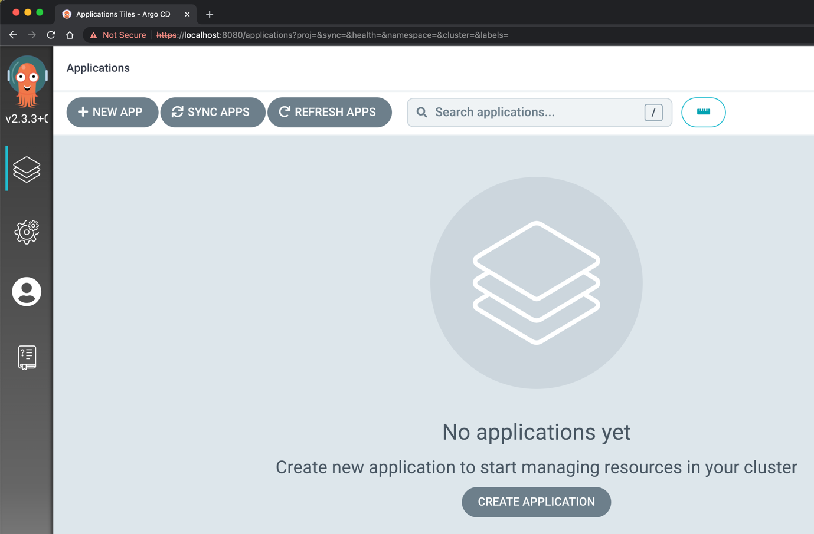

🎉 짜잔~! **ArgoCD 콘솔 화면이 등장**했어요!!!

### Application을 통해 CD 동작을 테스트해보기

ArgoCD에는 `Repository`, `AppProject`, `Application` 과 같은 개념들이 존재합니다.

* **Repository** - Private Repository 및 다양한 Repository에 대한 설정들을 담당해요.
* **AppProject** - Application이 속할 수 있는 그룹으로 해당 Project내의 Application들이 수행할 수 있는, 혹은 Project Token이 수행할 수 있는 동작을 제한할 수 있어요.
* **Application** - 원하는 k8s 리소스들을 어떤 식으로 CD할 지에 대한 설정이에요.

Application이 가장 중요해요~! Private repository를 이용하기 전까지는 아마 Repository가 필요하진 않을 거고, default project 외의 프로젝트를
생성해서 사용할 게 아니면 AppProject도 필요하진 않을 거에요.

다만 Application은 필수로 새로 생성해야 CD 동작을 확인해볼 수 있어요!

ArgoCD에서 쓰이는 대부분의 리소스는 쿠버네티스 CRD(e.g. Repository, AppProject, Application)로 관리되고 그 외의 것들도 configmap에 설정을 기입함으로써 설정할 수 있습니다!

따라서 우리는 ArgoCD CRD 중 하나인 Application을 만들어볼 거에요. 공식 문서의 Getting Started에서는 직접 ArgoCD CLI로 Application을 만들지만
ArgoCD CLI나 콘솔 화면을 통해 Application을 만들게 되면 추후에 Application을 yaml 코드로 나타내어 선언적으로 이용하려는 경우 기존의 Application을 코드로 나타내려면 어떻게 해야하는지 혼란스러우실 수도 있습니다.
따라서 저는 **직접 Application을 yaml로 작성해서 적용**해주겠습니다.

하지만 만약 아직 ArgoCD가 낯서시다면 단순히 콘솔에서 직접 Application을 생성하는 방법도 추천드립니다. 이후 어떤 설정들이 있는지 감을 잡아보시고 그런 설정들을 어떻게 CRD(yaml)로 나타내는지를
찾아나가며 IaC로 관리하는 것도 하나의 방법이라고 생각합니다.

제가 본 게시글을 위해 만들어놓은 Repository(https://github.com/umi0410/declarative-argocd)를 **Fork하셔서** 사용하시면 되겠습니다. 그리고 **아래 항목들을 잘 수행해주세요.**

* ⚠️ 아래의 kubectl apply 수행 시 URL을 본인의 Github username 혹은 Organization name으로 변경하기
* ⚠️ fork 뜬 Repository의 `getting-started/argocd/application.yml` 파일에서 `spec.source.repoURL` 값을 자신의 fork 뜬 Repository URL로 올바르게 수정하기

**fork를 뜨는 이유**는 이후에 **GitOps 방식으로 CD하기 위해 image tag를 변경해서 푸시**한 뒤 업데이트 되는 모습을 보기 위함이에요!

저희는 **샘플 프로젝트로 Guestbook(방명록) 프로젝트를 배포하고 확인**해볼거에요.

```console
$ kubectl apply -n argocd -f https://raw.githubusercontent.com/umi0410/declarative-argocd/master/getting-started/argocd/application.yml
```

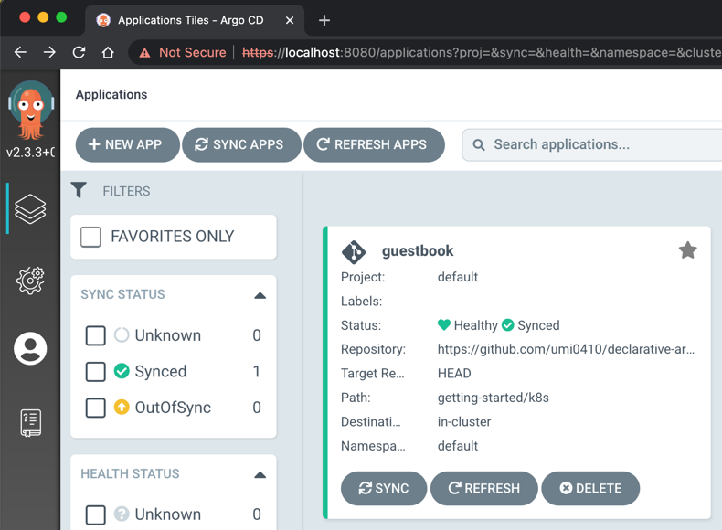

그럼 위와 같이 guestbook 앱이 등록되어 sync된 모습을 볼 수 있습니다.

```console
$ kubectl port-forward service/guestbook-ui -n default 8888:80
Forwarding from 127.0.0.1:8888 -> 80
Forwarding from [::1]:8888 -> 80
```

마찬가지로 방금 배포한 guestbook이 잘 동작하는지 확인해보기 위해 guestbook-ui 서비스를 port forward해주겠습니다.

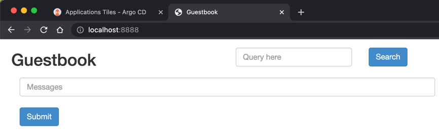

`0.1` 버전으로 설치했다면 위와 같이 **검은 타이틀의 Guestbook** UI를 확인하실 수 있을 것입니다!

그럼 과연 다른 버전의 이미지로 업데이트하려면 어떻게 해볼 수 있을까요?!

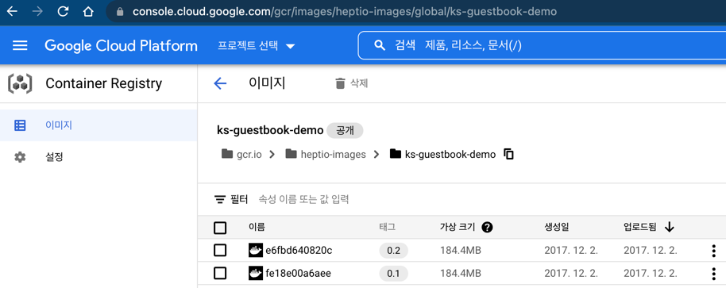

지원되는 이미지 태그 목록은 [이곳](https://console.cloud.google.com/gcr/images/heptio-images/global/ks-guestbook-demo)에서 확인하실 수 있습니다.

우리는 GitOps를 위한 도구인 ArgoCD를 이용하고 있고 guestbook application은 Auto Sync 설정을 해놓았기 때문에
단순히 image tag를 `0.2`로 변경한 뒤 푸시해주기만 하면 됩니다!

그럼 fork 뜨신 레포지토리에서 `getting-started/k8s/deployment.yml`의 `spec.template.spec.containers[0].image` tag 값을 `0.1` -> `0.2` 로 변경해주시고 푸시해주세요.

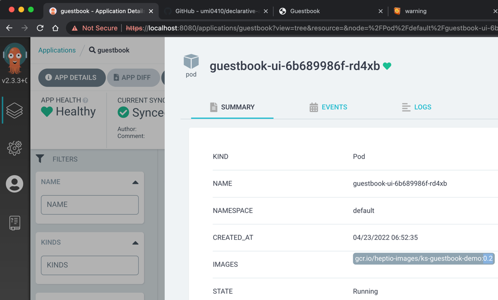

위와 같이 Pod의 컨테이너의 이미지 태그가 `0.2`로 변경된 것을 확인할 수 있고

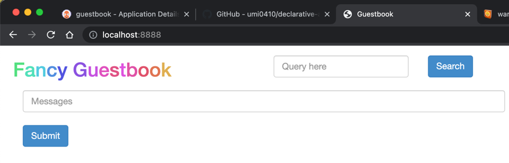

기존에는 **검정색 타이틀의 "Guestbook"** 이었지만 이제는 **알록달록한 "Fancy Guestbook"** 이 된 것을 확인할 수 있어요~!

### 이런 식의 작업 방식에서 불편한 점들

성공적으로 CD 작업을 수행할 수 있었습니다. 하지만 실제로 ArgoCD를 도입하고 꾸준히 사용하기 위해서는 방금과 같은 방식으로
작업하게 되면 몇 가지 불편 사항들이 존재할 수 있어요.

1. **helm으로 ArgoCD를 설치한 뒤 추가적으로 수동으로 Application을 등록**해줘야 합니다.
   * 이렇게 되면 또 다른 클러스터에 동일한 설정으로 ArgoCD를 설치하거나 재구축할 때 많이 번거로울 수 있어요.
2. 이후에도 **Application을 새로 생성할 때나 변경할 때마다 kubectl을 직접 수행**해야합니다.
   * 우리는 GitOps의 형태로 ArgoCD를 통해 `Deployment`, `Service`, `Configmap` 등을 관리하고 있지만
    `Application`은 직접 `kubectl`로 관리하고 있어요.

## App of App 패턴을 통해 좀 더 선언적으로 관리하기

따라서 위와 같은 불편 사항들을 해소하기 위해서 ArgoCD에는 `App of App`이라는 패턴이 존재합니다.
`App of App 패턴`이란 **ArgoCD로 관리할 Application들을 관리하는 우두머리 Application을 두는 패턴**을 말해요.

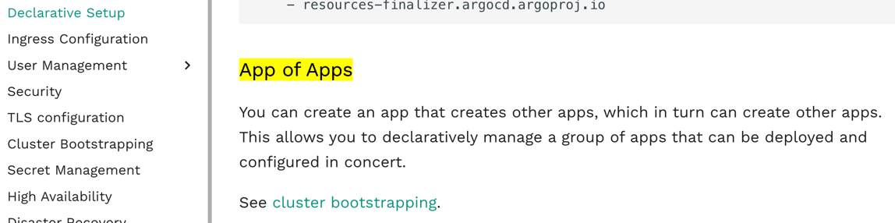

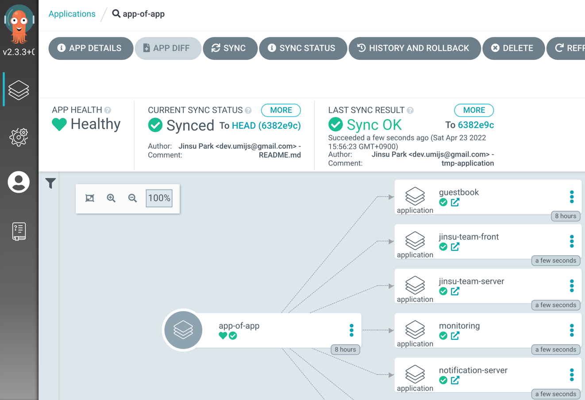
그럼 위에서 2번으로 언급한 문제는 어느 정도 해결할 수 있지만, 그럼 그 우두머리 App은 어떻게 생성/관리할 것인가(1번 문제)가 여전히 문제에요.

저는 이 문제를 우리가 직접 App을 생성/관리하는 것이 아니라 ArgoCD helm chart의 추가적인 설정을 통해 선언적으로 관리함으로써 해결하려합니다.

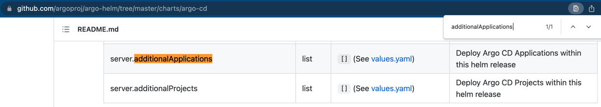

설정값 예시는 [이곳](https://github.com/argoproj/argo-helm/blob/master/charts/argo-cd/values.yaml)에서 확인하실 수 있습니다.

즉, ArgoCD Helm Chart를 통해 관리할 Application을 `values.yaml`에 작성할 수 있다는 것입니다.

그럼 `getting-started/values.yaml`의 `server.additionalApplications[0].source.repoURL`을 마찬가지로 본인이 fork 뜨신 레포지토리의 URL로 변경해주시고 아래의 명령어로 helm chart를 업그레이드해주세요.

```console
$ helm upgrade -n argocd argocd-demo argo/argo-cd -f getting-started/values.yaml
...
```

이후에는 아래와 같이 `app-of-app`이라는 `guestbook` Applicaiton을 관리하는 Application이 생성된 것을 보실 수 있을 거에요 :)

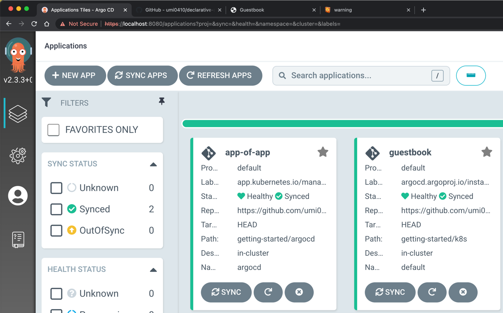

app-of-app은 guestbook application을 관리하고 있습니다. 만약 **추가적으로 Application을 생성하거나 삭제하고 싶다면 직접 kubectl을 통해 관리할 것이 아니라
변경하고싶은 사항을 `getting-started/argocd`에 작성한 뒤 Git push하면 ArgoCD가 알아서 적용**해주게 됩니다! 대단하죠?!

그럼 위의 작업을 통해 우리가 앞서 언급했던 불편들이 해소되었는지 확인해볼게요.
제가 바라는 건 **백지 상태의 클러스터에서도 제가 선언해놓은 설정 파일들만을 통해 `helm install` 명령어 한 줄만으로
현재와 동일한 ArgoCD 상태, guestbook 상태를 갖는 것**이에요! 아주 선언적이죠?!

```console
$ minikube delete
Deleting "minikube" in docker ...
🔥  Deleting container "minikube" ...
...

$ minikube start
😄  minikube v1.25.2 on Darwin 12.2 (arm64)
✨  Automatically selected the docker driver
...

# ArgoCD나 guestbook 관련 Pod나 리소스가 없음을 확인해볼게요

$ kubectl get pod --all-namespaces
NAMESPACE     NAME                               READY   STATUS    RESTARTS   AGE
kube-system   coredns-64897985d-pd57n            1/1     Running   0          36s
...

$ kubectl create ns argocd
namespace/argocd created

$ helm install -n argocd argocd-demo argo/argo-cd -f getting-started/values.yaml
NAME: argocd-demo
LAST DEPLOYED: Sat Apr 23 07:27:22 2022
NAMESPACE: argocd
...
```

그럼 시원하게 minikube를 통해 구축한 쿠버네티스 환경을 날려버리고 다시 생성한 뒤 ArgoCD를 helm chart로 깔아볼게요.
이번에는 helm chart 설치 시 `getting-started/values.yaml`을 설정파일로 이용해야합니다.

helm install이 완료되면 동일한 방법으로 새로운 Admin 패스워드를 조회한 뒤 다시 port forward해주시고 콘솔에 로그인해주세요.

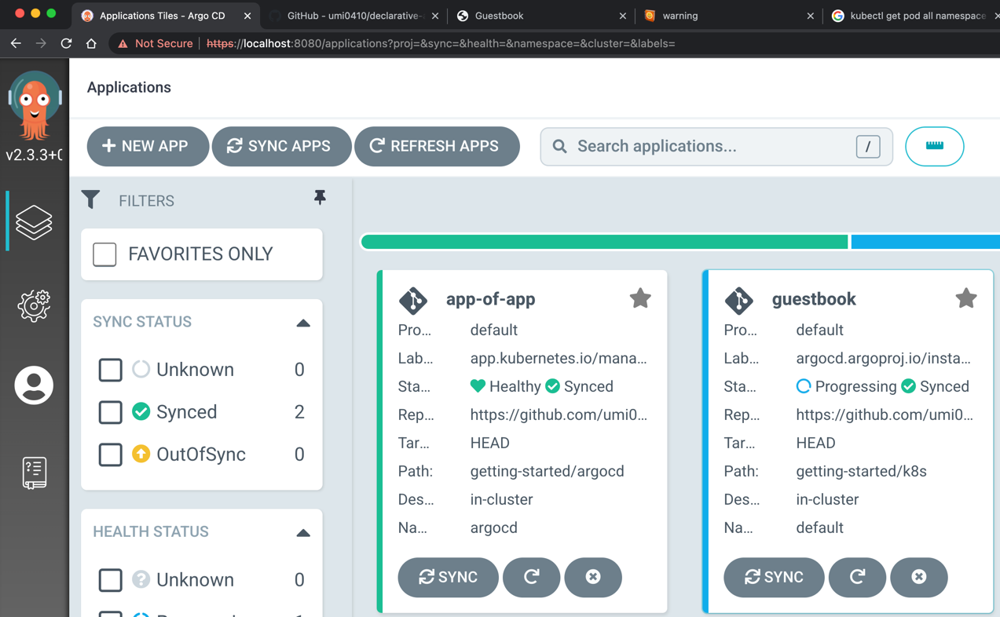


🎉 와우.. 새로운 클러스터에서도 **우리가 선언적으로 작성한 코드들만 있다면 위와 같이 기존과 동일한 상태로 구축이 가능**하네요! 좋습니다 좋아요~

## 마치며

1. ArgoCD를 Helm으로 install 해보기
2. Application을 생성하고 guestbook 프로젝트를 통해 CD 테스트해보기
3. 그 과정에서의 불편이나 문제사항을 발견해내고 선언적으로 해결해나가기 
   * `App of App` 패턴 이용하기
   * ArgoCD Helm Chart가 지원하는 `additionalApplications` 설정을 이용하기

이번 글에서 위의 과정들을 통해 ArgoCD를 어떻게 좀 더 선언적으로 관리할 수 있을지 또 그런 작업을 수행할 때
자료들을 어디서 찾아볼 수 있는지에 대해 알아봤습니다.

좀 더 제가 어떻게 자료를 찾아나가는 지 그런 요령이나 과정들을 적어보려했는데 글이 길어지면서 기능 자체의 내용에 집중하게 된 감이 있네요 🥲..

다음 편에서는 ArgoCD에서 RBAC 설정을 해보면서 '_어떻게 새로운 기능들을 찾고 적용해나가는지_'에 좀 더 포커스를 맞춰보려해요. 또한 이런 과정들은 `ArgoCD` 뿐만 아니라
`Kafka`, `ELK`, `Jenkins` 등의 오픈소스들을 사용할 때에도 도움이 될 수 있을 것이라 생각합니다. '_아~ 이런 식으로 자료를 찾아볼 수 있구나_' 하고 말이죠 ㅎㅎ

이번 글이 **ArgoCD를 처음 이용해보시는 분들**, **이용해오면서 조금 불편하셨던 분들**, **새로운 오픈소스를 어떻게 학습하고 적용해나갈지 잘 모르겠는 분들**께
도움이 될 수 있는 글이었기를 바랍니다! 감사합니다~ 😆