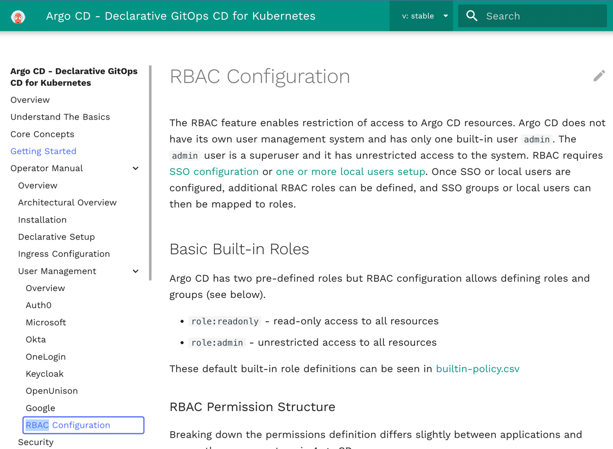
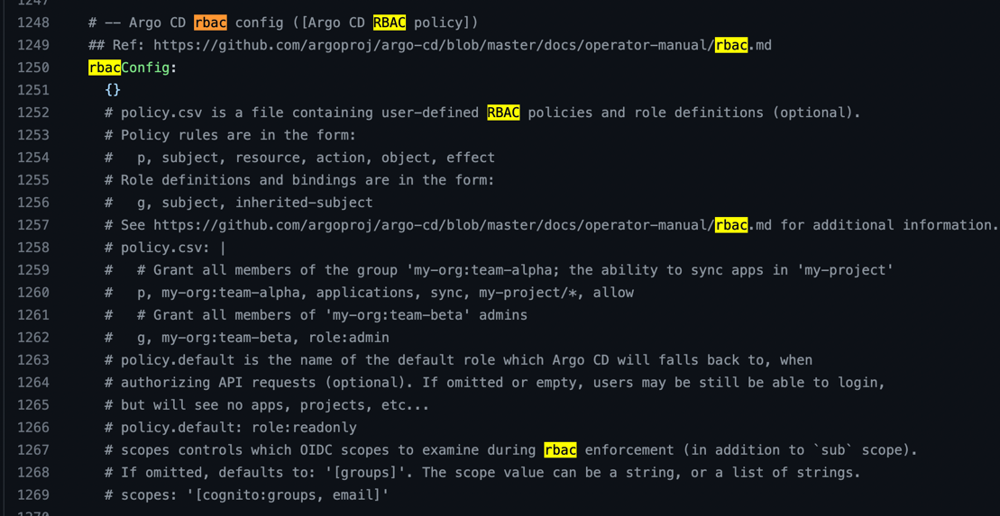
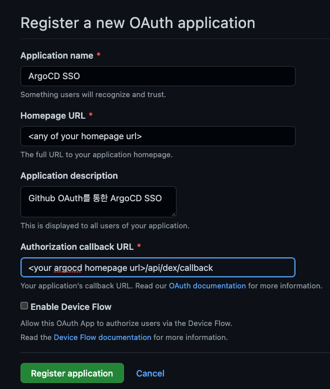
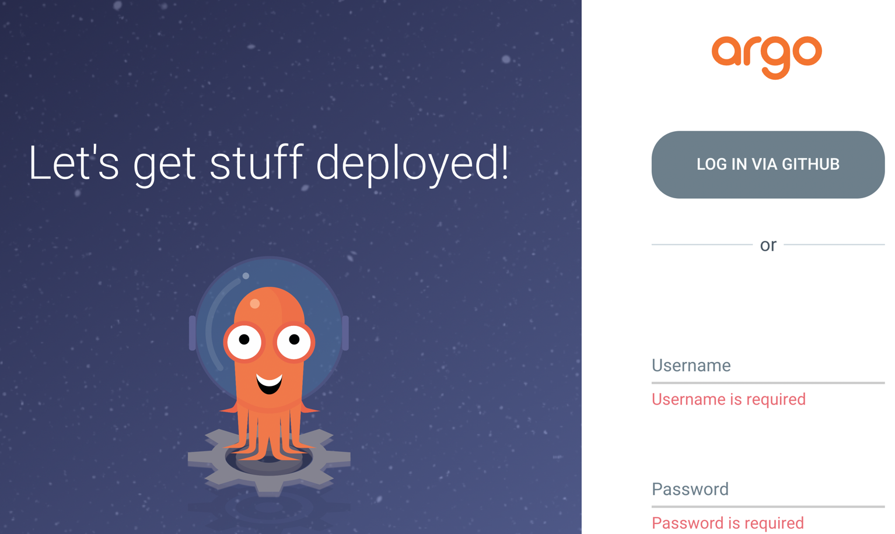
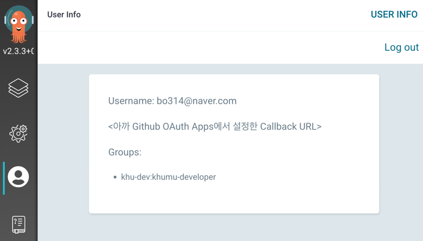
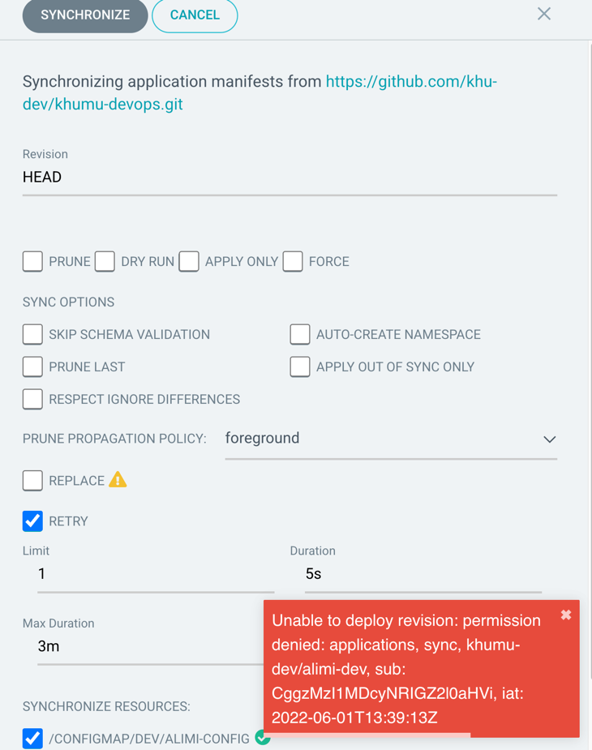
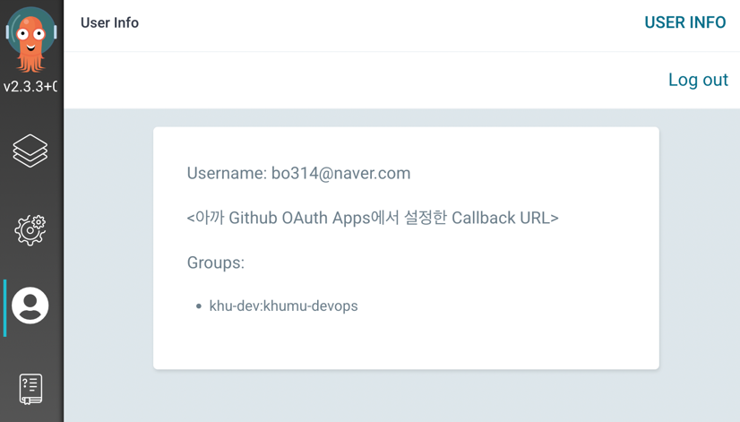

## 시작하며

저번 글(["ArgoCD 선언적으로 이용해나가기 - Helm, App of App"](https://umi0410.github.io/blog/devops/declarative-argocd-helm-app-of-app/))에서는
`Helm`과 `App of App` 패턴을 이용해 ArgoCD를 선언적으로 이용해나가는 방법을 다뤘습니다.

바~로 ArgoCD를 좀 더 선언적으로 이용해나가는 것과 관련된 팁부터 글을 적어나가기는 좀 무리가 있을 것 같아 해당 글에서는

배경지식들에 대한 간략한 정리와 핸즈온 같은 느낌의 내용들도 많이 포함하게 됐던 것 같아요.

이번 글에서는 **ArgoCD를 실제로 이용하기 위해 필요할만한 이런 저런 설정들을 어떻게 선언적으로 정의해볼 수 있을지**를 소개해보려해요!

그리고 그 예시로 `RBAC 설정`을 해보겠습니다. 이번 글에서 수행해볼 작업은 **Github 계정을 ArgoCD와 연동시켜 역할(Role) 기반으로 ArgoCD의 권한을 제어**하는 것이에요. 

'_왜 RBAC을 ArgoCD 커스터마이징의 예시로 했는가?_'는 제가 사이드 프로젝트에서 ArgoCD를 이용하면서 Local user(ArgoCD의 자체 계정)을 이용하는 데에 불편이 있었기 때문이에요.
저는 **ArgoCD와 Github 계정을 연동해 RBAC을 이용함으로써 해결**했습니다. 이제는 Admin 계정의 패스워드를 암기할 필요도 새로운 팀원에게 새 계정을 생성해 전달할 일도 필요가 없어졌습니다! 또한 Github 계정 별로 권한을 갖도록 (e.g. readonly) 설정할 수도 있어졌습니다.

그리고 글의 내용은 '_제 글만 무조건 따라하면 됩니다_'보다는 '_저는 이런 식으로 자료를 찾았고 이렇게 적용해봤어요._'식의 내용들을 다뤄보겠습니다.

### 본 글에서 사용하는 환경

* 핸즈온 과정 참고 레포지토리 - https://github.com/umi0410/declarative-argocd/tree/master/configuring-rbac
* Minikube를 이용한 K8s Cluster
* [ArgoCD Helm Chart](https://github.com/argoproj/argo-helm/tree/main/charts/argo-cd)를 이용해 argocd namespace에 배포한 ArgoCD

## RBAC이란?

`RBAC`은 `Role-Based Access Contol`의 약자로 쉽게 말하자면 그냥 역할 기반 권한 제어입니다.

속성 기반으로 나름 복잡한 로직에 의해 어떤 유저가 어떤 리소스에 어떤 작업을 수행할 수 있는지를 정의하는 `ABAC(Attribute-Base Access Control)`에 비해 그저 간단히 역할에 권한들을 부여하고 유저들은 그 역할을 부여받음으로써 권한을 체크하게 됩니다.

개인적으로는 많은 경우에 간단히 RBAC만으로도 권한 제어가 충분한 경우가 많은 것 같습니다. 그리고 많은 솔루션들이 RBAC 기능을 지원하는 것 같았어요. ArgoCD 또한 마찬가지로 RBAC을 지원하고 있습니다.

## Github organization + team으로 ArgoCD RBAC 이용하기

자, 그럼 Github의 Organization, Team을 통해 ArgoCD에서 RBAC을 이용해보는 과정을 진행해봅시다!

### 1. ArgoCD에 RBAC 설정하기

요즘 인기있는 솔루션들은 `RBAC` 및 기타 권한 제어 기능이 대부분 존재합니다. 보안과 권한 관리는 아주 중요하기 때문입니다. 그리고 그런 권한 제어의 방법 중 가장 대중적인 방법은 바로 `RBAC` 입니다.



공식 문서는 언제나 가장 좋은 교과서입니다. 자세한 방법은 [공식 문서](https://argo-cd.readthedocs.io/en/stable/operator-manual/rbac/)에서 찾아보실 수 있습니다.




또한 제가 사용한 [ArgoCD Helm Chart에서 제공하는 README.md](https://github.com/argoproj/argo-helm/tree/main/charts/argo-cd) 속 Configuration 부분과 [default values.yaml](https://github.com/argoproj/argo-helm/blob/main/charts/argo-cd/values.yaml) 보면

Helm Chart를 통해 배포한 ArgoCD의 경우 어떻게 values.yaml을 통해 rbac을 설정할 수 있는지 나와있습니다.

기본 원리는 다음과 같습니다.

* `p, <role/user/group>, <resource>, <action>, <appproject>/<object>` - AppProject에 속한 Object(e.g. Application)에 대한 권한을 정의한다.
* `p, <role/user/group>, <resource>, <action>, <object>` - AppProject에 속하지 않는 Object(e.g. Clusters, AppProject, Repositories, ...)에 대한 권한을 정의한다.

그리고 위에서 말하는 Resource나 Action은 다음과 같습니다.

* **Resources**: `clusters`, `projects`, `applications`, `repositories`, `certificates`, `accounts`, `gpgkeys`
* **Actions**: `get`, `create`, `update`, `delete`, `sync`, `override`, `action`

공식 문서의 설명이 좀 부족하긴하지만 Github SSO를 이용해 인증하는 경우 RBAC은 다음과 같이 설정할 수 있다고 합니다.

```csv
p, role:org-admin, applications, *, */*, allow
p, role:org-admin, clusters, get, *, allow
p, role:org-admin, repositories, get, *, allow
p, role:org-admin, repositories, create, *, allow
p, role:org-admin, repositories, update, *, allow
p, role:org-admin, repositories, delete, *, allow

g, your-github-org:your-team, role:org-admin
```

* 의미: org-admin이라는 Role이 갖는 권한들을 정의하고 해당 <your-github-org>:<your-team>에 속하는 Github user로 로그인한 경우 org-admin Role에 허용된 권한들을 갖는다.

그리고 저는 다음과 같은 요구사항을 가정하려합니다.

**RBAC 요구사항**

* 나의 Github Organization `khu-dev`의 `khumu-devops` 팀의 유저들은 admin 권한을 갖는다.
* 나의 Github Organization `khu-dev`의 `khumu-devops` 팀의 유저들은 readonly 권한을 갖는다.

그 경우 저는 다음과 같이 values.yaml을 작성한 뒤 helm release를 update 해주면 됩니다.

```yaml
# values.yaml
server:
  rbacConfig:
    policy.csv: |
      g, khu-dev:khumu-developer, role:readonly
      g, khu-dev:khumu-devops, role:admin
...
```

`readonly`와 `admin`이라는 Role은 공식문서에도 나와있듯 `builtin-policy`로서 [이곳](https://github.com/argoproj/argo-cd/blob/master/assets/builtin-policy.csv)에 작성되어 있습니다.

```console
$ helm upgrade -n argocd argocd \
  argo/argo-cd -f values.yaml
```
그럼 위의 커맨드를 통해 RBAC 설정을 적용시켜주겠습니다.

### 2. ArgoCD에 Github을 통한 SSO 설정하기

ArgoCD는 [Dex](https://github.com/dexidp/dex)라는 인증 관련 각종 기능을 담당하는 컴포넌트를 함께 제공하고 있습니다. `Github`의 `OAuth2`를 이용해 `SSO(Single Sign On)`을 이용하는 과정은 [공식문서 Dex 부분](https://argo-cd.readthedocs.io/en/stable/operator-manual/user-management/#dex)에도
소개되어있고, 사실 이대로 따라만하면 됩니다. ㅎㅎ



`Organization` - `Settings` - `Developer Settings` - `OAuth Apps` 에서 위와 같이 OAuth App을 만들어주고 이후 생성되는 `Client ID`와 `Client Secret`을 다음과 같이 `dex.config`에 전달하면 됩니다.
(사실 Organization이 아니라 개인 계정에서 App을 생성해도 동작합니다.)

단, `dex.config`는 `argocd-cm`이라는 Configmap의 `.data`의 필드로 존재하기 때문에 우리는 Helm chart의 values.yaml에 `dex.config`를 올바르게 전달해야합니다.
이를 위해선 `server.config.dex.config`를 다음과 같이 작성해주면 됩니다.

```yaml
server:
  config:
    dex.config: |
      connectors:
      # Github OAuth를 통해 SSO하려는 경우
      - type: github
        id: github # 상관 없을 듯 뭘로 하든
        name: GitHub # 상관 없을 듯 뭘로 하든
        config:
          clientID: <your github oauth app client id>
          clientSecret: <your github oauth app client secret>
          orgs:
          - name: <your github organization name> # e.g. khu-dev
...
```

**server.config.dex.config에 작성해야한다는 것은 어떻게 알 수 있는가?**

* [ArgoCD의 공식 문서](https://argo-cd.readthedocs.io/en/stable/operator-manual/declarative-setup/#quick-reference)에서는 `argocd-cm.yaml`을 'General Argo CD configuration'로 소개하고 있습니다.
* [ArgoCD Helm Chart Github](https://github.com/argoproj/argo-helm/tree/main/charts/argo-cd)에서는 `values.yaml` 속 `server.config`를 동일하게 'General Argo CD configuration'로 소개하고 있습니다.
* 따라서 `values.yaml` 속 `server.config`에 정의하는 내용이 곧 `argocd-cm.yaml`의 `.data`가 됨을 유추할 수 있습니다.

```console
$ helm upgrade -n argocd argocd \
  argo/argo-cd -f values.yaml
```
한 번 더 위의 커맨드를 통해 RBAC 설정을 적용시켜주겠습니다.



성공적으로 Github을 통한 SSO가 활성화되면 ArgoCD에 접속할 때 위와 같이 `LOG IN VIA GITHUB` 버튼이 추가된 것을 확인할 수 있습니다.

그럼 요구사항대로 `khu-dev`라는 Github Organization의 `khumu-developer` Team에 속한 계정으로 ArgoCD에 로그인해보겠습니다.



성공적으로 로그인한 뒤 `<your argocd url>/user-info`로 이동하면 위와 같이 <organization>:<team> 이라는 이름의 그룹에 속한 모습을 볼 수 있습니다.



이후 만약 어떤 Application을 Sync하려해도 현재 속한 그룹인 `khu-dev:khumu-developer`는 `readonly` Role을 부여받았기에 어떠한 App도 Sync할 권한이 없어 위와 같이 Permission Denied 라는 에러를
맞이하게 됩니다.



🎉🎉🎉 하지만 위와 같이 `khu-dev:khumu-devops`에 속한 계정으로 로그인한 뒤 동일하게 어떤 App을 Sync해보면 이번에는 성공적으로 App이 Sync되는 모습을 볼 수 있습니다. `khu-dev:khumu-devops` 그룹은 admin Role을 부여받았기 때문입니다!

자, 그럼 이제는 admin 계정을 비롯한 username, password 기반의 계정을 이용할 필요 없이 Github을 이용해 ArgoCD의 인증/인가를 수행할 수 있습니다 ㅎㅎ

## 마치며

새로운 회사에 입사하고 행복하게 적응해나가면서 운동, 취미, 업무까지 챙기다보니 글을 작성해놓고 마무리를 오랜 시간 동안 짓지 못하다가 급히 지방선거일을 기회 삼아 글을 마무리 지어봤습니다.
우선은 ArgoCD를 Helm chart와 함께 선언적으로 이용해나가는 내용은 이 글을 끝으로 2편으로 마무리 지어보려합니다. 사이드 프로젝트에서 ArgoCD를 이용하면서 ArgoCD는 선언적으로 관리가 가능하다는 장점을 많이
써먹지 못하고 좀 더러운 형태로 억지로 사용하다보니 번거롭게 느껴졌던 경우가 많았는데 저 스스로도 이를 선언적인 형태로 개선하면서 많이 편해졌고, 그 과정들을 이렇게 글로 기록하고나니 나름 뿌듯합니다.

ArgoCD 관련한 또 다른 내용으로는 [Applpicaitonset](https://argocd-applicationset.readthedocs.io/en/stable/)에 관해 추후에 기회가 되면 다뤄볼까 생각 중입니다.

몇 년 전에 처음 데브옵스 엔지니어 인턴으로서 이쪽 일을 시작했을 때 제가 알던 ArgoCD는 'ArgoCD라고 요즘 쿠버네티스 환경에서 쓸만한 CD 툴이 있다더라' 정도의 도구였던 것 같은데 이제는 자체 CD툴만을 사용하는 기업을 제외하면
쿠버네티스를 사용하는 경우는 대부분이 ArgoCD를 이용할 정도로 대중적인 기술이 된 것 같고, 그 시절보다 많은 기능들을 편리하게 제공하는 기술이 된 것 같아 새삼 기특하단 생각이 들었습니다 ㅎㅎ.

데브옵스로 입사하면서 거대한 규모의 클라우드 인프라를 다루다보니 네트워크 관련된 내용을 자주 접하게 되고, 이론적으로는 제가 약한 부분이라고 생각이 들어서 앞으로는 DevOps 서비스들보다는 네트워크 공부를 우선적으로 해볼까합니다!
곧 자취를 시작할텐데 라즈베리 파이로 자취방에서 재밌는 무언가를 해볼 수 있을까 싶은 생각도 있구요 ㅎㅎ.
시간이 되면 관련 내용을 틈틈이 기록해보겠습니다! 감사합니다.

## 참고자료

* [RBAC vs ABAC - Okta](https://www.okta.com/kr/identity-101/role-based-access-control-vs-attribute-based-access-control/)
* [ArgoCD 공식 문서](https://argo-cd.readthedocs.io/en/stable/)
* [ArgoCD Helm Chart](https://github.com/argoproj/argo-helm/tree/main/charts/argo-cd)