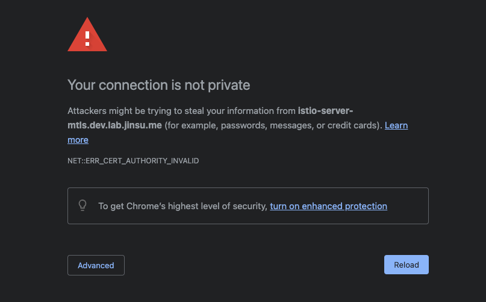
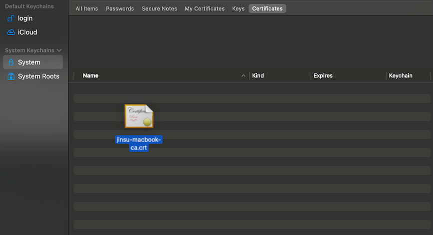
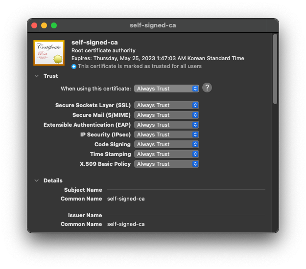
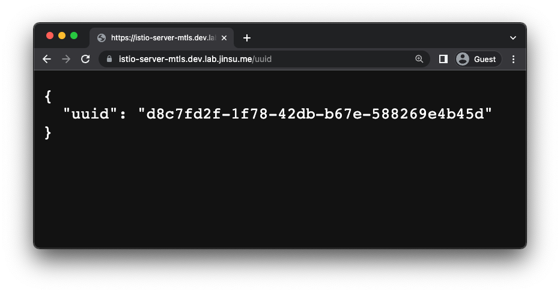
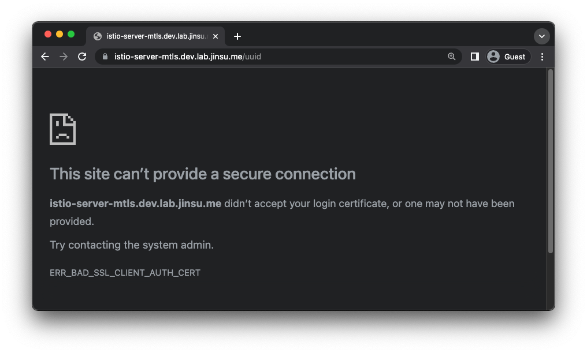
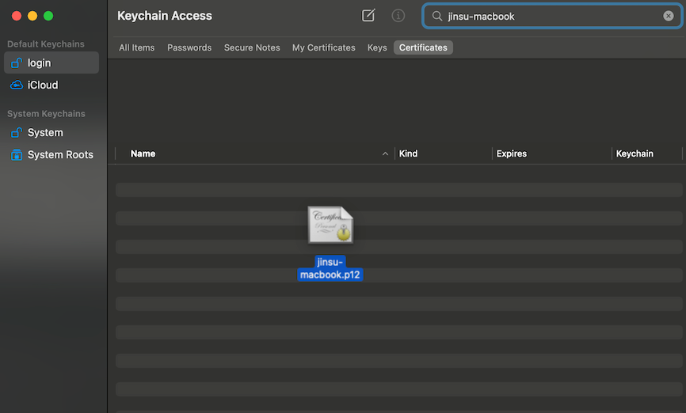
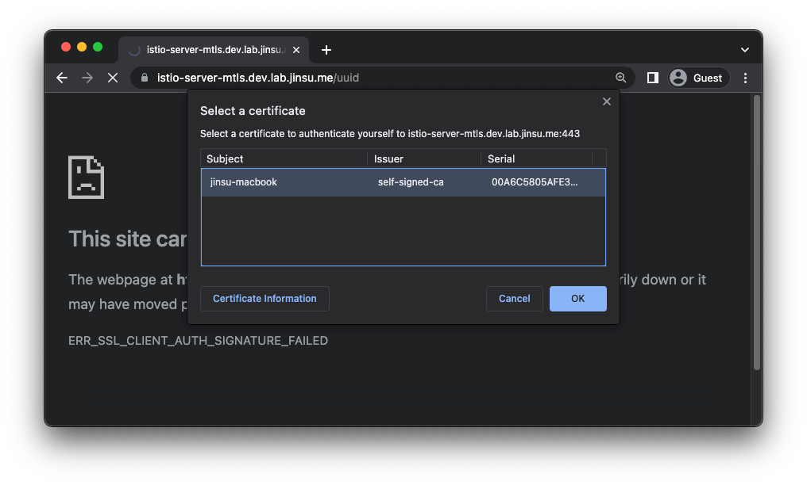
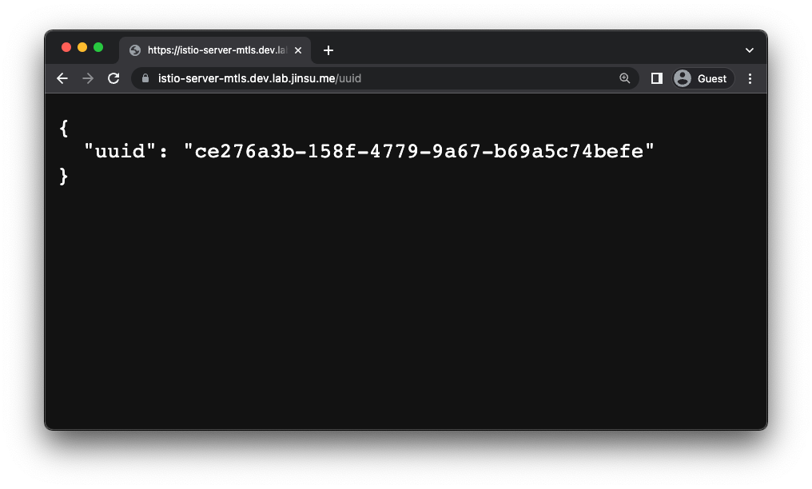

## 시작하며

K8s에서 Istio를 통해 서비스 메쉬를 구현하는 경우, Istio는 알아서 Pod가 사용하는 ServiceAccount에 대한 인증서를 발급해주고 이를 바탕으로
메쉬 내부에서는 mTLS를 이용한 시큐어한 통신이 가능하다.

하지만 메쉬 내부에서 뿐만 아니라 메쉬 외부와도 mTLS로 시큐어하게 통신하고 싶은 경우에는 어떨까?

예를 들어보자면 내 서비스에 VPN 없이 퍼블릭하게 인터넷으로 접근은 가능하지만 해당 서비스를 나만 이용하고 싶은 경우, 내 디바이스에 설치된 인증서를 이용해
내 서버와 mTLS로 통신을 하려면 어떻게 해야할까?

Istio를 이용하면 손쉽게 Ingress gateway단에서 클라이언트(나를 비롯한 유저들)과 mTLS 통신을 지원할 수 있다.

1. **Istio의 Gateway**
2. 부모 CA의 인증서
3. 같은 부모 CA로부터 발급받은 서버 인증서와 클라이언트 인증서 

이번 글은 일반적으로 서버간의 mTLS나 DB 서버와 클라이언트 상의 mTLS와 달리 조금은 재밌게(?) 실제 브라우저 등에서 접근하는 방법을
소개해보려한다. 사실 방금 언급한 서버간 mTLS를 위한 설정, DB 서버와 클라이언트 상의 mTLS 등은 이미 인터넷 상에 잘 설명된 자료가 많으니
해당 내용 자체가 궁금하다면 다른 자료들을 찾아보는 것도 좋을 수 있다. (_예시 - [[Istio 문서] Configure a mutual tls ingress gateway](https://istio.io/latest/docs/tasks/traffic-management/ingress/secure-ingress/#configure-a-mutual-tls-ingress-gateway)_)

## 실습 맛보기

이번 글에서 실습할 내용은 다음과 같다.

1. 내가 시큐어하게 접속하고 싶은 서버 띄우기 (Deployment, Service, VirtualService)
2. Cert-Manager를 통해 부모 CA의 인증서 및 해당 CA에게 인증받은 서버 인증서와 클라이언트 인증서 발급 받기
3. 해당 서버 인증서를 사용하는 Gateway 만들기
4. 클라이언트 인증서를 내 디바이스에 설치하기
5. 특정 유저를 차단해보기

위의 실습을 진행할 필자의 실습 환경은 다음과 같고, 실습에 등장하는 URL은 임시일 뿐이며 몇몇 값들은 실습자의 환경에 맞춰
적절한 값으로 수정되어야할 것이다.

| Name         | Description                                   |
|--------------|-----------------------------------------------|
| GKE          | 1.24                                          |
| Istio        | 1.16.0                                        |
| Cert Manager | v1.9.1                                        |
| Namespace    | istio-server-mtls (Sidecar injection enabled) |

이 글에서 Kubernetes 환경을 구성하는 방법, Istio를 설치하는 방법은 생략한다.
Yaml 파일이 좀 많기는 하지만 평소 쿠버네티스를 사용해왔다면 낯설진 않은 manifest들일 것이다.

### 1. 서버 띄우기

`kennethreitz/httpbin` 서버를 띄우는 manifest는 다음과 같다. (_`kennethreitz/httpbin` 이미지는 이래 저래 간단히 테스트해볼 서버를 띄우기 참
편리한 이미지라고 생각하는데 맨날 얘만 사용하다보니 좀 질리는 것 같기도합니다. 좋은 테스트용 이미지가 있다면 추천해주시면
감사하겠습니다._) 참고로 VirtualService에 설정한 `hosts`에는 알아서 자신의 도메인으로 변경해두어야 올바르게 뜰 것이다.

```yaml
# server.yaml
apiVersion: apps/v1
kind: Deployment
metadata:
  name: server
  labels:
    app: server
spec:
  replicas: 1
  selector:
    matchLabels:
      app: server
  template:
    metadata:
      labels:
        app: server
    spec:
      containers:
      - name: httpbin
        image: kennethreitz/httpbin
        ports:
        - containerPort: 80
---
apiVersion: v1
kind: Service
metadata:
  name: server
spec:
  selector:
    app: server
  ports:
  - name: http-server
    protocol: TCP
    port: 80
    targetPort: 80
---
apiVersion: networking.istio.io/v1alpha3
kind: VirtualService
metadata:
  name: server
spec:
  hosts:
  # NOTE: please update this value to your hosts
  - istio-server-mtls.dev.lab.jinsu.me
  gateways:
  - istio-system/mtls-gateway
  http:
    - match:
        - uri:
            prefix: /
      route:
        - destination:
            host: server
            port:
              number: 80
```
---
```shell
$ kubectl apply -f server.yaml

deployment.apps/server created
service/server created
virtualservice.networking.istio.io/server created
```

아직은 서버가 퍼블릭하게 접근 가능한 형태는 아니기에 `kubectl port-forward` 등을 통해 서버가 잘 동작하는지 확인해보는 것도 좋다.

## 2. 인증서 발급 받기

이제 다음은 Cert manager을 통해 생성할 ClusterIssuer 및 Certificate라는 CR에 대한 manifest이다. ClusterIssuer는 Namespace scoped resource가 아닌
cluster-wide한 리소스이기에 혹시 자신이 ClusterIssuer을 사용 중이라면 영향이 없는지 한 번쯤 체크해보도록 한다.

내용이 다소 많게 느껴질 수 있는데 그냥 self-signed-ca의 인증서를 발급 받고, self-signed-ca에게 서버 인증서와 클라이언트 인증서를 발급
받는 것이다. 직접 openssl 커맨드로 인증서를 발급한 뒤 k8s Secret을 만들어주고 해당 Secret을 다음 단계에서 Gateway가 잘 가져갈 수 있도록
설정해줄 수도 있긴하다. 하지만 실제로는 cert-manager을 이용하는 것이 인증서 갱신이나 권한 관리, 쿠버네티스에 친숙한 형태 등의 측면에서 여러 장점을 갖는다.

```yaml
# certificates.yaml
# NOTE: Please check out these manifests before applying them.
apiVersion: cert-manager.io/v1
kind: ClusterIssuer
metadata:
  name: self-signed-cluster-issuer
spec:
  selfSigned: {}
---
apiVersion: cert-manager.io/v1
kind: Certificate
metadata:
  namespace: cert-manager
  name: self-signed-ca
spec:
  isCA: true
  commonName: self-signed-ca
  secretName: self-signed-ca-tls
  privateKey:
    algorithm: RSA
  issuerRef:
    name: self-signed-cluster-issuer
    kind: ClusterIssuer
    group: cert-manager.io
  usages: []
---
apiVersion: cert-manager.io/v1
kind: ClusterIssuer
metadata:
  name: leaf-issuer
spec:
  ca:
    secretName: self-signed-ca-tls
---
# A certificate for the server
apiVersion: cert-manager.io/v1
kind: Certificate
metadata:
  namespace: istio-system
  name: server
spec:
  secretName: server-tls
  duration: 2160h
  renewBefore: 360h
  commonName: istio-server-mtls.dev.lab.jinsu.me
  isCA: false
  privateKey:
    algorithm: RSA
    encoding: PKCS1
    size: 2048
  usages:
    - server auth
  dnsNames:
    - istio-server-mtls.dev.lab.jinsu.me
    - server
    - server.istio-server-mtls
    - server.istio-server-mtls.svc.cluster.local
    - 127.0.0.1
    - localhost
  issuerRef:
    name: leaf-issuer
    kind: ClusterIssuer
    group: cert-manager.io
---
# A client certificate for my macbook
apiVersion: cert-manager.io/v1
kind: Certificate
metadata:
  name: jinsu-macbook
spec:
  secretName: jinsu-macbook-tls
  duration: 2160h
  renewBefore: 360h
  commonName: jinsu-macbook
  isCA: false
  privateKey:
    algorithm: RSA
    encoding: PKCS1
    size: 2048
  usages:
    - client auth
  uris:
    - spiffe://jinsu-macbook
  issuerRef:
    name: leaf-issuer
    kind: ClusterIssuer
    group: cert-manager.io
```

다음과 같이 `spiffe://`을 prefix로 달아주는 특이한 설정이 있긴하지만 이는 밑에서 다룰 얘정이다.

```yaml
uris:
  - spiffe://jinsu-macbook
```

다음 커맨드로 적용한다.

```shell
$ kubectl apply -f certificates.yaml

certificate.cert-manager.io/self-signed-ca created
clusterissuer.cert-manager.io/leaf-issuer created
certificate.cert-manager.io/server created
certificate.cert-manager.io/jinsu-macbook created
```

정상적으로 인증서가 잘 발급되었다면 `READY` 상태로 보여질 것이다.

```shell
$ kubectl get cert -A

NAMESPACE           NAME                 READY   SECRET                AGE
cert-manager        self-signed-ca       True    self-signed-ca-tls    29s
istio-server-mtls   jinsu-macbook        True    jinsu-macbook-tls     28s
istio-system        server               True    server-tls            28s
```

이 인증서들의 실제 데이터를 담고 있는 Secret을 로컬에 저장한다. `view-secret`라는 kubectl plugin을 이용했다.

```bash
kubectl view-secret "jinsu-macbook-tls" ca.crt > "jinsu-macbook-ca.crt"
kubectl view-secret "jinsu-macbook-tls" tls.crt > "jinsu-macbook-tls.crt"
kubectl view-secret "jinsu-macbook-tls" tls.key > "jinsu-macbook-tls.key"
```

정상적인 경우 다음과 같이 두 `ca.crt` 파일은 동일할 것이다.

### 3. 해당 서버 인증서를 사용하는 Gateway 만들기

```yaml
apiVersion: networking.istio.io/v1alpha3
kind: Gateway
metadata:
  namespace: istio-system
  name: mtls-gateway
spec:
  selector:
    # NOTE: It might be needed to update these labels.
    istio: ingressgateway
  servers:
    - hosts:
        # NOTE: Please update this values to your hosts.
        - 'istio-server-mtls.dev.lab.jinsu.me'
      port:
        number: 443
        name: https
        protocol: HTTPS
      tls:
        # NOTE: This configuration is very important.
        # Mode should be MUTUAL for the purpose of this article,
        # to use mTLS. But first things first, set it to SIMPLE
        # which means not mTLS but TLS.
        # Credential name should be the name of a secret
        # which contains your server certificates and ca bundles.
        # (e.g. the secret resource from the certificate issued
        # by cert-manager)
        mode: SIMPLE # MUTUAL
        credentialName: server-tls
```
---
```shell
$ kubectl apply -f gateway.yaml

gateway.networking.istio.io/mtls-gateway created
```

이 Gateway가 사용하는 인증서는 나라는 공인되지 않은 Root CA가 발급한 인증서이므로 내 기기가 해당 인증서를 신뢰하도록 설정해줘야 올바르게
HTTPS 통신을 할 수 있다.
앞서 저장해뒀던 ca.crt 파일을 이용해 curl로 잘 접속되나 확인해보자.

```shell
# We need ca.crt file because we are using tls mode: SIMPLE gateway and
# its certificate is issued by an unknown CA(This is me).
$ curl https://istio-server-mtls.dev.lab.jinsu.me/uuid \
    --cacert jinsu-macbook-ca.crt
{
  "uuid": "7475307e-47aa-4978-a3ce-1483adb3a895"
}
```

브라우저로 접속해보면 ca.crt를 디바이스에 설치해주지 않았기에 다음과 같은 에러가 발생하는 것을 확인할 수 있을 것이다.



OSX 기준, 다음과 같이 Keychain Access에서 ca.crt 파일을 드래그해서 CA 인증서를 설치하고 신뢰하도록 설정해준다.



그 뒤에 브라우저로 다시 접속하면 다음과 같이 잘 응답을 받을 수 있다. 여전히 인증서 에러가 난다면 브라우저를 재시작해보자.




### 4. 클라이언트 인증서 설치하기

이제 단순 TLS가 아닌 mTLS를 활성화함으로써 인증과 암호화 두 가지를 모두 누려볼 것이다.
위에서는 Gateway의 tls mode를 `SIMPLE`로 설정했지만 이를 `MUTUAL`로 변경해주자.

```yaml
tls:
  mode: MUTUAL # This was SIMPLE just before
```

그럼 아까와 달리 `ca.crt`를 디바이스(내 컴퓨터)에 설치했더라도 다음과 같이 에러가 날 것이다.
**이제 유효한 클라이언트 인증서가 없는 클라이언트는 우리의 서버와 올바르게 통신할 수 없어진 것이다.**



이제 여기서 재미있걸 하나 해볼 것이다. 우리는 클라이언트 인증서도 로컬에 설치하고 브라우저는 이를 인식해 서버와
mTLS handshake를 할 때 사용할 수 있다! 주의할 점은 대부분의 브라우저들이 `.crt`나 `.key` 형태의
인증서나 비밀키 자체는 인식하지 못하고 인증서와 비밀키를 함께 묶은 PKCS#12라는 `.p12` 형태의
파일을 인식하는 경우가 많다는 것이다.

다음 명령어를 통해 `.p12` 명령어를 만들고 설치해줬다. 비밀번호는 뭐 자유롭게 설정하면 된다.
이번에는 Keychain Access에서 좌측의 login 탭을 이용했다.

```shell
$ openssl pkcs12 -export -inkey jinsu-macbook-tls.key \
    -in jinsu-macbook-tls.crt -out jinsu-macbook.p12

Enter Export Password:
Verifying - Enter Export Password:
```



클라이언트 인증서를 잘 설치했다면 재접속 시 다음과 같이 사용 가능한 인증서 목록을 띄워줄 것이다!



해당 인증서가 유효해 mTLS로 서버(Istio ingress gateway)와 잘 통신한다면 다음과 같이
성공적인 응답을 전달받을 수 있을 것이다 :)



### 5. 특정 유저를 차단해보기

[Istio AuthorizationPolicy 문서](https://istio.io/latest/docs/reference/config/security/authorization-policy/#Source)를
보면 AuthorizationPolicy라는 CR을 이용해 권한 제어를 하는 방법이 소개되어있고, 여기에는 mTLS로 인증한 경우 `principal`이라는
필드를 통해 접근 제한이 가능하다고 한다.

근데 이 `principal`이라는 필드가 낯설어 좀 알아봤다. 우리는 `principal`을 어디서, 어떻게, 무엇으로 정의해야하는 걸까?
Istio는 [SPIFFE](https://spiffe.io/docs/latest/spiffe-about/overview/)라고 하는 도구를 내부적으로 이용 중이기에 이 도구가 제공해주는
형태에 맞게 값을 정의해주면 된다.

조금 어려울 수 있는데 예를 들어 어떤 Pod이 갖고 있는 principal을 뜯어보면 내용물이 다음과 같이 SPIFFE ID가 들어있다.
istio-ingressgateway Pod가 들고 있는 ServiceAccount를 바탕으로 한 인증서를 한 번 파보면 SPIFFE ID가 들어있을까 싶은 생각이 들었다.

```shell
# istioctl을 통해 어떤 Pod(istio-ingressgateway-6fc4d9f8d-72wwc)의 istio 관련 secret 정보들을 조회해본 값은 다음과 같았다. 
$ istioctl pc secret -n istio-system istio-ingressgateway-6fc4d9f8d-72wwc -o yaml

dynamicActiveSecrets:
...
- lastUpdated: "2023-02-24T06:23:40.111Z"
  name: default
  secret:
    '@type': type.googleapis.com/envoy.extensions.transport_sockets.tls.v3.Secret
    name: default
    tlsCertificate:
      certificateChain:
        inlineBytes: LS0tL...(생략)RS0tLS0tCg==
...

# 왠지 .dynamicActiveSecrets[].secret.tlsCertificate.certificateChain.inlineBytes 라는 
# 위치의 값이 base64로 인크립트 되어있는 느낌이라 디크립트를 해봤다.
# 인증서임을 알 수 있었다.
$ istioctl pc secret -n istio-system istio-ingressgateway-6fc4d9f8d-72wwc -o yaml | \
    yq '.dynamicActiveSecrets[] | select(.name == "default") | .secret.tlsCertificate.certificateChain.inlineBytes' | \
    base64 -D

-----BEGIN CERTIFICATE-----
MIIDYjCCAkqgAwIBAgIQQXifofqN7m1WYSprG9PRPjANBgkqhkiG9w0BAQsFADAY
...(생략)
7Dh/w+ECtLa8LzjQkTK37asKuFmdH0N5g1ggGQslyNtbaAWNIjmUdVQT6JGQ5A/y
EeG24IZ3
-----END CERTIFICATE-----
-----BEGIN CERTIFICATE-----
MIIC/TCCAeWgAwIBAgIRAK2yAFatuUpsdgP/blA7JvQwDQYJKoZIhvcNAQELBQAw
...(생략)
rYA2RvVaZmB/wFXjL6N1W9kRsbCfRLXBlBd3aWu0/ERBpgcS4HysT3IXiOilv8ca
Jw==
-----END CERTIFICATE-----

# openssl을 통해 인증서를 한 번 더 디크립트해봤다.
$ istioctl pc secret -n istio-system istio-ingressgateway-6fc4d9f8d-72wwc -o yaml | \
    yq '.dynamicActiveSecrets[] | select(.name == "default") | .secret.tlsCertificate.certificateChain.inlineBytes' | \
    base64 -D | openssl x509 -text -noout
    
...(생략)
        X509v3 extensions:
            ...(생략)
            X509v3 Subject Alternative Name: critical
                URI:spiffe://cluster.local/ns/istio-system/sa/istio-ingressgateway-service-account
```

아하! 인증서 발급시에 x509 v3 extension 중에 SAN을 이용해 `URI:spiffe://` 형태의 설정을 해주면 Istio가 잘 알아듣겠구나.

\* _`istioctl pc log ...` 커맨드를 통해 로그 레벨을 낮추고 AuthorizationPolicy에서 principal에 대한 설정한 뒤 로그를 살펴보면 실제로 `spiffe://`을 prefix로 갖는
형태로 SAN이 생성되어야겠구나라는 것을 알 수 있다. [istio/istio Github comment](https://github.com/istio/istio/issues/29891#issuecomment-755839402) 등을 통해서도
좀 팁을 얻을 수 있을 것이다_

위에서 잠시 Cert manager로 발급받을 Certificate CR에 대해 다음 설정에 대한 설명을 건너뛰었는데 방금 설명한 `SPIFFE` 관련 내용이 다음 설정이 필요했던 이유이다.

```yaml
# certificates.yaml
...
---
apiVersion: cert-manager.io/v1
kind: Certificate
metadata:
  name: jinsu-macbook
spec:
  secretName: jinsu-macbook-tls
  duration: 2160h
  renewBefore: 360h
  commonName: jinsu-macbook
  ...
  # NOTE: 이곳에 uris를 통해 spiffe:// 형태로 내가 원하는 principal 값을 적어주면
  # 해당 값을 principal로 인식한다.
  uris:
    - spiffe://jinsu-macbook
```

그럼 위와 같이 Certificate를 만들었었으니 해당 인증서의 principal은 `jinsu-macbook`으로 인식될 것이다.
그럼 이제 드디어 `AuthorizationPolicy`를 통해 `jinsu-macbook`이라는 principal의 요청을 deny해보자.
성공적으로 deny가 된다면 해당 인증서가 설치된 나의 맥북에서는 접속 시 에러가 발생해야하고, 다른 디바이스들에서는 모두 잘 접속되어야한다.

```yaml
# authorizationpolicy.yaml
# WARNING: Wrong AuthorizationPolicy resources might effect 
# to all of your traffic.
apiVersion: security.istio.io/v1beta1
kind: AuthorizationPolicy
metadata:
  namespace: istio-system
  name: istio-ingressgateway-deny
spec:
  action: DENY
  selector:
    matchLabels:
      istio: ingressgateway
  rules:
  - from:
      - source:
          principals: ["jinsu-macbook"]
```

위와 같이 AuthorizationPolicy를 정의하고 적용해주었다.
source의 principal이 `jinsu-macbook`인 요청은 istio-ingressgateway 단에서 deny하고, 그 외의 요청은 모두 허용한다는 설정이다.

따라서 `principal=jinsu-macbook`인 인증서가 설치된 나의 맥북에서는 아까와 달리 이제는 서버에 요청을 보낼 경우 Istio ingress gateway 단에서
다음과 같이 403 에러로 응답한다.


이로써 실습은 마친다.

## 마치며

본인만 사용하고 싶은 사이드 프로젝트가 있다거나 SSO를 하기 곤란한 팀의 경우 사용해볼 수 있을법한 mTLS의 유즈케이스에 대해 다뤄봤다.
서버간 통신은 Istio 공식 문서에도 잘 나와있지만 이렇게 브라우저에서도 사용하는 케이스는 잘 못봤던 것 같은데 실제로 해보니 나름
재미있었던 것 같다.
'principal은 어디서 어떤 형태로 정의해야하는가'와 같은 내용들이 제대로 문서화 되어있지 않고 약간의 히든 스펙 같은 느낌이 있어
실제로 사용하기에는 좀 유지 보수가 곤란할 수 있을 것 같긴하지만 오랜만의 이런 숨은 그림 찾기 같은 작업도 재밌었다.

요즘 Istio를 어떻게 잘 활용할 수 있을까에 대해 좀 고민해보고 있는데 올해에는 좀 더 잘 활용해볼 수 있으면 좋겠다.

## 참고 자료

- [Istio 문서] Configure a mutual tls ingress gateway](https://istio.io/latest/docs/tasks/traffic-management/ingress/secure-ingress/#configure-a-mutual-tls-ingress-gateway)
- [Istio 문서] [AuthorizationPolicy](https://istio.io/latest/docs/reference/config/security/authorization-policy/#Source)
- Cert manager의 Certificate CR의 extension 설정 관련 문서 - https://cert-manager.io/docs/reference/api-docs/#cert-manager.io/v1.CertificateSpec
- [istio/istio Github comment](https://github.com/istio/istio/issues/29891#issuecomment-755839402)
- [SPIFFE](https://spiffe.io/docs/latest/spiffe-about/overview/)
