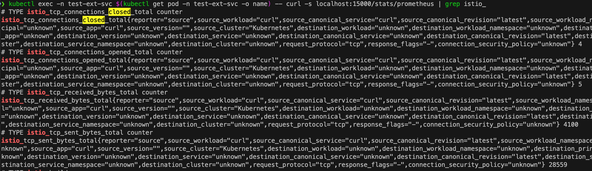
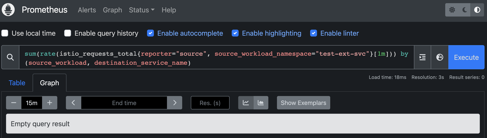
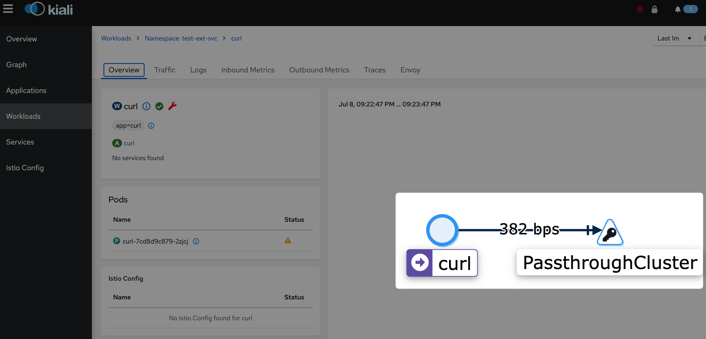
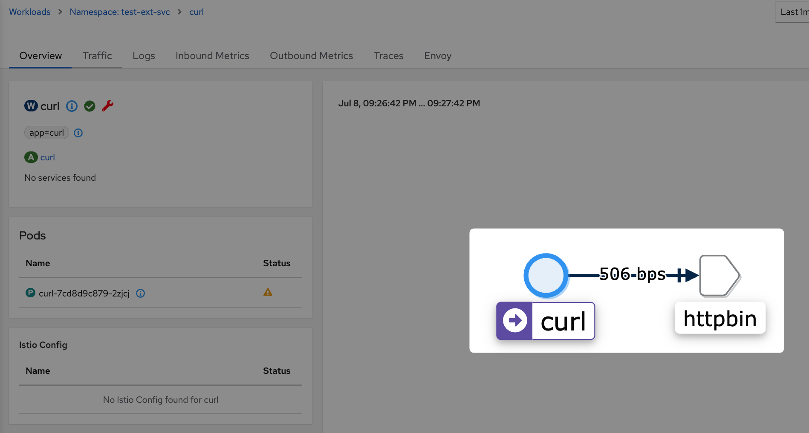

## 시작하며

서비스를 개발하다보면 외부 서비스에 HTTPS로 요청을 보내는 경우가 생길 수 있다. 

Istio를 사용하는 경우, `Service registry`에 등록되어있지 않은 host를 바탕으로한
요청은 기본적으로 `Passthrough`라고하는 `Cluster`로 인식되며 Passthrough 클러스터는
단순한 TCP proxy로 동작한다. 즉, 해당 TCP 패킷에 대해 아무런 부가기능을 수행해주지 않고
그냥 패킷을 전달할 뿐이다. 이 경우 L7인 HTTPS를 바탕으로한 요청에 대해 Istio는 L4인
TCP 수준의 메트릭 밖에 기록하지 못하며, TCP 메트릭 또한 정보가 매우 빈약하게 된다.

> - _`Service registry` - Service Mesh가 인지하고 있는 Service 정보를 모아둔 것을 의미 (참고: [Istio 공식 문서](https://istio.io/latest/docs/concepts/traffic-management/))_
> 
> - _`Passthrough` - Service registry를 바탕으로 어떤 클러스터인지 식별할 수 없는 경우 사용하는 특수 Cluster.
> Sidecar API의 Egress mode가 `ALLOW_ANY`인 경우 사용되며, `REGISTRY_ONLY`인 경우는 Passthrough가 아닌 Blackhole 클러스터가 사용됨. (참고: [Istio 공식 블로그](https://istio.io/latest/blog/2019/monitoring-external-service-traffic/))_
> - `Cluster` - Cluster는 다양한 뜻이 있겠지만 Istio나 Envoy 관련 맥락에서는 주로 Endpoint들의 논리적 그룹을 의미

Istio의 ServiceEntry라는 기능을 이용하면 외부 서비스를 이용하면 외부 서비스를 우리의
Service Registry에 등록시킴으로써 외부서비스에 대한 요청이 Passthrough cluster로 처리되는 것을
방지할 수는 있다.

하지만 애플리케이션 컨테이너에서 외부 서비스로의 요청이 HTTPS를 바탕으로한다면 기본적으로 egress 트래픽은
envoy를 거치기 전에 application container에서 암호화되기 때문에 envoy는 이 packet을 해석할 수 없다.
따라서 application 컨테이너가 외부 서비스와 HTTPS로 주고받는 요청에 대한 Istio를 바탕으로한
가시성이 떨어지게된다.

이번 글에서는 이렇게 외부 서비스에 HTTPS로 요청을 보내는 경우 가시성이 저하되는 문제를
Istio의 `ServiceEntry`와 `DestinationRule`을 이용해 개선해보려한다.

> - _`ServiceEntry` - K8s가 서비스가 아닌 것을 별도로 Service처럼 정의해
> Service registry에 등록하는 Istio의 Custom Resource 중 하나_
> 
> - _`DestinationRule` - Routing이 일어난 뒤 Traffic에 적용할 policy를
> 정의하는 Istio의 Custom Resource 중 하나_

ServiceEntry와 DestinationRule을 적용하면 Application container에서는 HTTP로 요청을 보내고,
Envoy가 해당 egress traffic에 대한 TLS orgination을 담당하게 된다.
이렇게 하면 HTTPS의 보안적인 장점은 챙기면서 Envoy는 application container와 외부 서비스가 주고받는
패킷을 더 잘 해석할 수 있어지므로 가시성이 개선될 수 있다.

## 데모 환경

외부 서비스로 HTTPS 요청을 보내고, Service mesh를 통해 그런 요청들에 대한 모니터링을 진행해본 경험이 없다면
어떤 얘기인지 와닿지 않을 수 있다.
좀 더 명확하게 문제와 해결책, 개선된 결과를 확인하기 위해 간단한 데모를 수행해봤다.
이를 위해 로컬에서 간단하게 Istio와 Prometheus, Kiali가 깔린 K8s 클러스터를 준비해뒀다.

| Name        | Version | Description        |
|-------------|---------|--------------------|
| K8s cluster | 1.23.3  | minikube로 로컬에 설치함. |
| Istio       | 1.18.0  | [Istio 공식 문서의 Helm을 이용한 Istio 설치 가이드](https://istio.io/v1.18/docs/setup/install/helm/) 대로 간단하게 설치함.<br />Revision을 나누지 않고 default로 설치함.
| Prometheus  | 2.41.0  | [Istio 공식 문서의 Prometheus 설치 가이드](https://istio.io/v1.18/docs/ops/integrations/prometheus/) 대로 간단하게 설치함.
| Kiali       | 1.67    | [Istio 공식 문서의 Prometheus 설치 가이드](https://istio.io/v1.18/docs/ops/integrations/kiali/) 대로 간단하게 설치함.

`test-ext-svc`라는 K8s Namespace에 몇 가지 K8s 리소스들을 배포할 것이다.
해당 Namespace에 대해서는 Pod 생성 시 istio-proxy 사이드카가 자동으로 주입되도록 설정해두었다.

## 데모 1. 외부 서비스에 HTTPS 요청을 보낼 경우의 가시성 살펴보기

외부 서비스에 HTTPS 요청을 보낼 경우의 가시성이 어떻길래 나쁘다는 것인지 살펴보자.

이번 글에서 테스트용으로 사용할 외부 서비스는 `https://httpbin.org`이다.
이 외부 서비스에 HTTPS로 요청을 보내는 Deployment를 만들어보자.

```yaml
apiVersion: apps/v1
kind: Deployment
metadata:
  name: curl
  namespace: test-ext-svc
  labels:
    app: curl
spec:
  replicas: 1
  selector:
    matchLabels:
      app: curl
  template:
    metadata:
      labels:
        app: curl
    spec:
      containers:
      - name: curl
        image: curlimages/curl
        command:
        - sh
        - -c
        - |
          while true; do
            curl -vs https://httpbin.org/status/200
            sleep .2
          done;
      terminationGracePeriodSeconds: 0
```

생성된 Pod에서는 [https://httpbin.org/status/200](https://httpbin.org/status/200)으로 열심히 요청을
보내고 있지만, 해당 Pod의 istio의 metric을 조회해보면 `istio_requests_total`, `istio_request_duration_milliseconds`
등의 L7 관련 기본 메트릭([공식 문서 참고](https://istio.io/latest/docs/reference/config/metrics/))들은
생성되지 않음을 알 수 있다.

앞서 말한대로 TCP 관련 메트릭만 생성될 뿐이고, 라벨을 자세히 보면 대부분의 라벨의 값이 unknown으로 설정되었음을 알 수 있다.
특정 Pod에서의 Istio 관련 메트릭은 다음 명령어를 통해 조회해볼 수 있다.
```bash
kubectl exec -n test-ext-svc \
  $(kubectl get pod -n test-ext-svc -o name) -- \
  curl -s localhost:15000/stats/prometheus | grep istio_
```



즉, **가시성이 매우 좋지 않다.**

당연히 외부 서비스로의 L7 요청에 대한 L7 메트릭이 생산되지 않기 때문에
Prometheus에서 Istio 관련 metric을 조회하는 경우에도 다음과 같이 아무런 정보를 얻지 못한다.

```promql
sum(
  rate(
    istio_requests_total{reporter="source", source_workload_namespace="test-ext-svc"}[1m]
  )
) by (source_workload, destination_service_name)
```



그나마 TCP(L4) 관련 메트릭은 존재는하지만 다음과 같이 `Passthrough` 클러스터로 인식되기 때문에 자세한 정보를 얻을 수 없다.

```promql
sum(
  rate(
    istio_tcp_connections_closed_total{reporter="source", source_workload_namespace="test-ext-svc"}[1m]
  )
) by (source_workload, destination_service_name)
```


만약 외부 서비스가 다양하다면 모든 외부 서비스가 동일하게 Passthrough 클러스터로 인식되어 구분할 수도 없을 것이다.

Kiali에서도 마찬가지로 Passthrough 클러스터로만 표기될 뿐 어디로 요청이 가고 있고, 그 결과(e.g., status code)가 어떠한지 등을 조회할 수 없다.



## 데모 2. ServiceEntry를 추가해 Passthrough Cluster가 아닌 고유한 Cluster로 인식되도록 하기

`ServiceEntry`라는 Isito의 Custom resource를 이용해 `httpbin.org`를 우리의 Service registry에 등록하도록 하자.
그럼 Passthrough 클러스터로 처리되지 않고 `httpbin.org`라는 고유한 클러스터로 인식될 수 있을 것이다.

```yaml
apiVersion: networking.istio.io/v1beta1
kind: ServiceEntry
metadata:
  name: httpbin
  namespace: test-ext-svc
spec:
  hosts:
    - httpbin.org
  location: MESH_EXTERNAL
  ports:
    - number: 80
      name: http
      protocol: HTTP
    - number: 443
      name: https
      protocol: HTTPS
  resolution: DNS
```

httpbin.org를 Service registry에 등록해 httpbin.org가 Passthrough 클러스터가 아닌 하나의
httpbin.org라는 클러스터로 인식하도록해주자.

HTTP protocol을 사용한다고 정의된 port로의 요청은 Host header을 바탕으로,
HTTPS protocol을 사용한다고 정의된 port로의 요청은 SNI를 바탕으로
httpbin.org 클러스터로의 요청임이 인식될 것이고, 그 목적지는 DNS를 통해 조회된 IP가 된다.
단, SNI를 바탕으로 httpbin.org 클러스터로의 요청임을 인식할 수 있을 뿐,
여전히 application container와 외부 서비스 간에 암호화되어 전송되는 L7 패킷을
envoy가 decrypt할 수는 없기에 L7에 대한 가시성은 확보할 수 없다.

그나마 다음과 같이 L4 metric에서 service name이 인식되어 이제는 Passthrough 클러스터로 처리되진 않고
`httpbin.org`라는 이름의 클러스터로 처리됨을 확인할 수 있다. 




httpbin.org 클러스터에 대한 정보는 당연히 proxy config를 조회해서 확인해볼 수도 있다.

```bash
$ istioctl pc cluster -n test-ext-svc $(kubectl get pod -n test-ext-svc -o name)
SERVICE FQDN                                      PORT      SUBSET     DIRECTION     TYPE             DESTINATION RULE
BlackHoleCluster                                  -         -          -             STATIC
InboundPassthroughClusterIpv4                     -         -          -             ORIGINAL_DST
PassthroughCluster                                -         -          -             ORIGINAL_DST
agent                                             -         -          -             STATIC
httpbin.org                                       80        -          outbound      STRICT_DNS
httpbin.org                                       443       -          outbound      STRICT_DNS
...
```

해당 클러스터에 대한 endpoint는 Envoy가 주기적으로 dns를 조회해 얻은 IP가 된다.

```bash
$ istioctl pc endpoint -n test-ext-svc $(kubectl get pod -n test-ext-svc -o name)
ENDPOINT                                                STATUS      OUTLIER CHECK     CLUSTER
...
54.204.94.184:80                                        HEALTHY     OK                outbound|80||httpbin.org
54.204.94.184:443                                       HEALTHY     OK                outbound|443||httpbin.org
54.210.149.139:80                                       HEALTHY     OK                outbound|80||httpbin.org
54.210.149.139:443                                      HEALTHY     OK                outbound|443||httpbin.org
```

## 데모 3. HTTPS로 요청하면서도 L7 가시성 확보하기

외부 서비스에 대해 HTTPS를 이용하면서도 L4 수준의 가시성을 넘어 L7 수준의 가시성까지 얻고싶다면
egress 트래픽에 대한 TLS Orgination을 application이 수행하지 않고 envoy가 수행하도록 해야한다.

이를 위해서는 앞서 배포한 `ServiceEntry`의 일부를 수정하고 `DestinationRule`를 통해 TLS 관련 설정을
적용해야한다. 흐름은 대략 다음과 같다.

1. Application container은 plaintext로 외부 서비스에 HTTP 요청을 보낸다. (e.g., http://httpbin.org:80)
2. **Istio 사이드카**에서 <Cluster:80> 포트에 대한 egress 요청에 대해 **서버측과 TLS** 통신을 수행할 예정이다.
3. Istio 사이드카에서 `<Cluster>:80` → `<Endpoint>:443`으로 Host와 Port를 변경해 실제 요청을 보낸다. 이때 2번에서 예정한대로 TLS로 요청을 보낸다.
4. 결과적으로 사이드카는 https://httpbin.org:443 으로 요청을 수행한다.

이번에는 ServiceEntry에 `targetPort: 443` 설정을 추가해 ServiceEntry의 80 포트가 실제 Endpoint의 443 포트에 연결되도록 설정한다.

```yaml
apiVersion: networking.istio.io/v1beta1
kind: ServiceEntry
metadata:
  name: httpbin
  namespace: test-ext-svc
spec:
  hosts:
    - httpbin.org
  location: MESH_EXTERNAL
  ports:
    - number: 80
      # The `targetPort` configuration has been added.
      targetPort: 443
      name: http
      protocol: HTTP
    - number: 443
      name: https
      protocol: HTTPS
  resolution: DNS
```

DestinationRule을 통해 httpbin.org 클러스터의 80번 포트(실제 Endpoint에 대해서는 443번 포트)에 대해서는 TLS를 수행하도록 설정한다.

```yaml
apiVersion: networking.istio.io/v1beta1
kind: DestinationRule
metadata:
  name: httpbin
  namespace: test-ext-svc
spec:
  host: "httpbin.org"
  trafficPolicy:
    portLevelSettings:
      - port:
          number: 80
        tls:
          mode: SIMPLE
```

마지막으로 외부 서비스(httpbin)로 요청을 보내던 Pod는 기존과 달리 HTTP를 사용해 요청을 보내도록 변경해줬다.

```yaml
apiVersion: apps/v1
kind: Deployment
metadata:
  name: curl
  namespace: test-ext-svc
  labels:
    app: curl
spec:
  replicas: 1
  selector:
    matchLabels:
      app: curl
  template:
    metadata:
      labels:
        app: curl
    spec:
      containers:
      - name: curl
        image: curlimages/curl
        command:
        - sh
        - -c
        - |
          while true; do
            # The protocol here is updated from `https` to `http`
            curl -vs http://httpbin.org/status/200
            sleep .2
          done;
      terminationGracePeriodSeconds: 0
```

이제 다음과 같이 정상적으로 L7 메트릭들이 생산됨을 확인할 수 있다.

```bash
# 기존과 달리 L7 metric 중 하나인 istio_requests_total가 잘 조회됨.
$ kubectl exec -n test-ext-svc $(kubectl get pod -n test-ext-svc -o name) -- curl -s localhost:15000/stats/prometheus | grep istio_requests_total
# TYPE istio_requests_total counter
istio_requests_total{reporter="source",source_workload="curl",source_canonical_service="curl",source_canonical_revision="latest",source_workload_namespace="test-ext-svc",source_principal="unknown",source_app="curl",source_version="",source_cluster="Kubernetes",destination_workload="unknown",destination_workload_namespace="unknown",destination_principal="unknown",destination_app="unknown",destination_version="unknown",destination_service="httpbin.org",destination_canonical_service="unknown",destination_canonical_revision="latest",destination_service_name="httpbin.org",destination_service_namespace="unknown",destination_cluster="unknown",request_protocol="http",response_code="200",grpc_response_status="",response_flags="-",connection_security_policy="unknown"} 54
istio_requests_total{reporter="source",source_workload="curl",source_canonical_service="curl",source_canonical_revision="latest",source_workload_namespace="test-ext-svc",source_principal="unknown",source_app="curl",source_version="",source_cluster="Kubernetes",destination_workload="unknown",destination_workload_namespace="unknown",destination_principal="unknown",destination_app="unknown",destination_version="unknown",destination_service="httpbin.org",destination_canonical_service="unknown",destination_canonical_revision="latest",destination_service_name="httpbin.org",destination_service_namespace="unknown",destination_cluster="unknown",request_protocol="http",response_code="400",grpc_response_status="",response_flags="-",connection_security_policy="unknown"} 106
istio_requests_total{reporter="source",source_workload="curl",source_canonical_service="curl",source_canonical_revision="latest",source_workload_namespace="test-ext-svc",source_principal="unknown",source_app="curl",source_version="",source_cluster="Kubernetes",destination_workload="unknown",destination_workload_namespace="unknown",destination_principal="unknown",destination_app="unknown",destination_version="unknown",destination_service="httpbin.org",destination_canonical_service="unknown",destination_canonical_revision="latest",destination_service_name="httpbin.org",destination_service_namespace="unknown",destination_cluster="unknown",request_protocol="http",response_code="504",grpc_response_status="",response_flags="-",connection_security_policy="unknown"} 3
```

```bash
# 기존과 달리 istio_를 포함하는 metric 항목들이 굉장히 많아졌음.
$ kubectl exec -n test-ext-svc $(kubectl get pod -n test-ext-svc -o name) -- curl -s localhost:15000/stats/prometheus | grep istio_ | wc -l
     207
```

Kiali에서도 해당 metric들을 바탕으로 바로 대시보드가 생성됨을 확인할 수 있다. **가시성이 매우 개선됐다.**


## Appendix 1. 다양한 외부 서비스를 사용할 때에도 가시성 확보하기

Appendix) 외부 서비스가 많아질 경우 해당 외부 서비스들을 ServiceEntry에 등록해주지 않으면
모두 동일한 Passthrough 클러스터로 처리되어 가시성이 저해된다고 말한 부분이 있었다.
ServiceEntry를 이용하면 다음과 같이 다양한 외부 서비스들(e.g., Google, Instagram, ...)에 요청을
보내더라도 각각이 별개의 Cluster로 인식될 수 있다.


이렇게 외부 서비스를 ServiceEntry를 통해 Service registry에 등록하면 가시성 개선 외에도 Istio의
해당 외부 서비스에 대해서도 Istio의 다양한 기능을 활용할 수 있게 된다. 예를 들어 DestinationRule 설정을
통해 mTLS나 몇 가지 advanced load balancing도 활용할 수도 있을 것이고, VirtualService 설정을 통해
retry나 timeout도 설정할 수 있을 것이다.

## Appendix 2. 외부 서비스에 대해 별도의 short name을 부여할 수 있는지에 대한 내용

외부 서비스의 도메인이 너무 긴 경우 application에서 이를 신경쓰지 않고 짧게 사용할 수 있도록 별도의
host도 지원해보고 싶었다. 예를 들어 `foo.bar.baz.example.com`와 같이 host가 긴 경우, 간단히 `foo`라고
사용할 수 있도록 하는 것이다.

하지만 이 부분은 현재 Istio 기능상 쉽지 않은 듯했다.
우선 application에서 DNS 질의 시 kube-dns나 core-dns에게 질의하지 않고 사이드카에게
질의할 수 있도록 설정을 추가해줘야하는 부분이 있었고, foo와 같이 임의의 short name을 정의한 경우에는
DestinationRule이 적용되지 않는 이슈, DestinationRule은 적용하더라도 그래서 Host header와 SNI는 어떤
값으로 조작해줘야하는 지에 대한 설정 기능 부재 등 다양한 어려움이 있어 지원하지 못했다.

## 마치며

최근 회사 업무로 Istio 업그레이드를 준비하면서 버전이 올라감에 따라 새롭게 추가된 기능이나
그동안 내가 놓쳐왔던 문서들을 좀 살펴봤다.
그러던 중 이전에는 거의 사용하지 않았던 `Sidecar` API나 `PeerAuthentication`, `ServiceEntry`에 대해
좀 더 공부하게 됐다. 그중에서도 이 글에서 다룬 ServiceEntry에 대한 부분이 꽤나 흥미롭고 유용하게 느껴졌다.

개인적으로는 시간만 된다면 Istio 업그레이드를 하면서 겪었던 breaking change로 인한 고생이나
새로운 기능으로 인한 편리함에 대해서도 다뤄보고 싶다.

## 참고한 자료

- [https://istio.io/latest/blog/2019/monitoring-external-service-traffic/](https://istio.io/latest/blog/2019/monitoring-external-service-traffic/)
- [https://istio.io/latest/docs/tasks/traffic-management/egress/egress-tls-origination/](https://istio.io/latest/docs/tasks/traffic-management/egress/egress-tls-origination/)
- [https://istio.io/latest/docs/tasks/traffic-management/egress/egress-control/](https://istio.io/latest/docs/tasks/traffic-management/egress/egress-control/)
