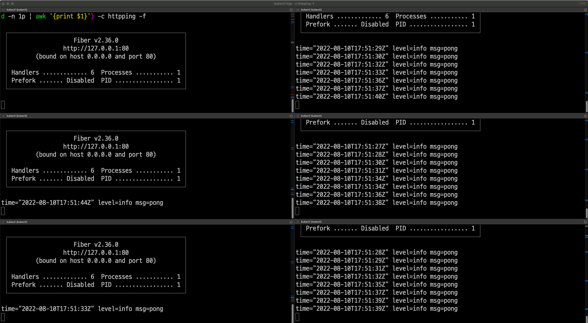
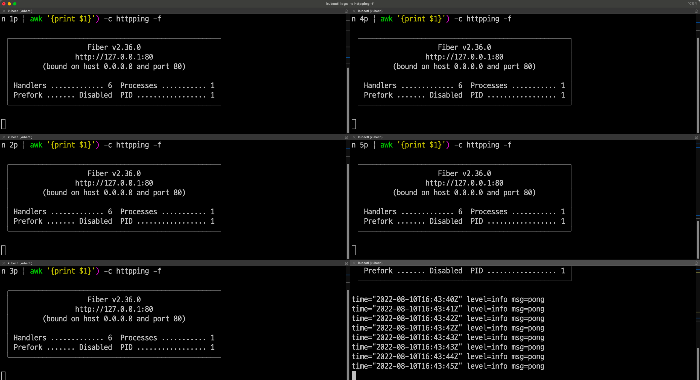

## 시작하며

데브옵스 엔지니어로 입사한 뒤 주로 맡고 있는 작업은 `Istio` 관련 작업이다. 평소 참 관심 있었던 분야이기도 하고 istio 뿐만 아니라 네트워크에 대해 개인적으로 정말 공부해보고싶었는데 덕분에 재미있게 공부하고 성장하며 근무하고 있는 것 같다. 😊

근데 요즘 들어 점점 단순히 ‘어떻게 저떻게 하니까 돌아는가네~ 오.. 나 istio 좀 파악한듯?ㅋㅋ’ 수준의 자세로는 트러블슈팅을 하거나 올바르게 설계하기가 쉽지 않은 경우들이 잦아졌다.

따라서 평소 궁금했던 내용 중 하나를 살짝 파헤쳐볼까한다.

나는 주로 istio `ingress gateway`와 관련된 작업을 많이 했었고 이 경우 Virtual Service는 항상 ingress gateway를 참조하도록 설정해왔다. 근데 istio를 처음 배울 때는 분명 ‘client 측에서 outbound handler 역할을 하는 Envoy 사이드카을 통해 알아서 우리가 의도하는 목적지를 찾아서 요청을 보낸다.’ 이런 식으로 배웠던 것 같은데 ‘왜 나는 Virtual Service를 이용할 때 항상 Gateway를 설정해줘야하는 것이었을까?’하는 궁금증이 생겼다.

- **Virtual Service는 Gateway에 ingress gateway를 설정해주지 않아도 되는 것일까?**
- **Virtual Service에 설정한 내용은 ingress gateway로 들어온 요청뿐만 아니라 mesh 내부에서의 요청에도 적용될 수 있는 것인가?**
- **Destination Rule은 뭐하는 녀석일까? 주로 얘는 Virtual Service와 함께 쓰는 예시가 많이 보이던데 꼭 Virtual Service와 함께 써야하는 걸까?**

따라서 이번 글에서는 위와 같은 궁금증들에 대해 삽질해본 내용을 정리해보려한다. 작업해본 내용은 아래와 같다.

1. **ingress gateway를 통해 들어오는 요청이 아니라 mesh 내부에서 보내는 요청에 대해 적용될 수 있도록 Virtual Service를 정의한 뒤 mesh 내부에서 요청을 보내보기**
2. **Virtual Service 없이 Destination 이용해보기**

(_2022.09.30 - 지금 와서 돌이켜보니 이때 했던 내용들은 사실 Istio의 동작 방식이나 원리를 알면 당연한 내용일 수 있었을 것 같다._)

## Virtual Service와 Destination Rule에 대해 짚고 넘어가보자.

> virtual services as how you route your traffic to a given destination, and then you use destination rules to configure what happens to traffic for that destination. Destination rules are applied after virtual service routing rules are evaluated, so they apply to the traffic’s “real” destination.

[https://istio.io/latest/docs/concepts/traffic-management/#destination-rules](https://istio.io/latest/docs/concepts/traffic-management/#destination-rules)
>

istio를 처음 배울 때에는 (물론 이 글을 쓰기 전까지도.. ㅎㅎ;;) Virtual Service와 Destination Rule이 참 헷갈렸다.

Virtual Service는 Gateway를 통해 `hosts` 설정한 호스트를 이용해 들어온 요청을 어떤 기준으로 어떤 (약간은 가상인) 목적지로 보내줄 것인가를 의미한다. 이 말도 좀 헷갈릴 수 있는데 예를 들면 다음과 같다.

- ingress gateway 를 통해
- Virtual Service의 hosts인 [”[foo.jinsu.me](http://foo.jinsu.me/)”] 중 하나인 foo.jinsu.me를 이용해 들어온 요청을
- subset이나 weight에 따라 foo v1 이나 foo v2 로 보낸다.

위와 같은 설정을 해주는 것이 Virtual Service이다.

그럼 foo v1과 foo v2는 누가 정의해줄까? 귀신 같이 알아서 v1에 대한 endpoint와 v2에 대한 endpoint를 분류할 수는 없을텐데 말이다. 바로 이때 Destination Rule이 등장한다.

Destination Rule은 어떤 기준으로 특정 Service(쿠버의 기본 리소스 타입)에 대한 subset을 나눌지 정의할 수 있다. 혹은 그 외에도 기본적으로 Service가 제공하지 않는 유용한 방식들을 통해 Endpoint가 관리될 수 있도록 해준다. 이때 말하는 Endpoint는 쿠버의 기본 리소스 타입 중 하나인 Endpoint가 아니라 Destination Rule을 통해 실제로 트래픽이 흘려보내진다는 의미의 Endpoint를 의미한다.

근데 뭐,,, 나름대로 두 개념을 정리해보려했는데 시원한 정리는 아닌 것 같다… 쓰다보면 감이오는데 아직 딱 깔끔하게 정리할 수 있는 수준의 이해는 아닌가보다.

## mesh 내부의 통신에서도 virtual service나 destination rule이 동작하는가?

앞서 Virtual Service에 대해 설명할 때 “Gateway를 통해 들어온 요청이 …(생략)” 이라며 설명을 했는데 그렇다면 **Virtual Service는 ingress gateway를 통해 들어온 요청에 대한 설정만 정의가 가능하냐라고하면 그건 당연히 아니다.** 애초에 istio를 통해 우리가 얻고 싶은 것은 ingress에 대한 기능뿐만 아니라 mesh 내부 통신에 대한 기능도 큰 부분일 것이니 말이다.

> The reserved word mesh is used to imply all the sidecars in the mesh. When this field is omitted, the default gateway (mesh) will be used, which would apply the rule to all sidecars in the mesh.

[https://istio.io/latest/docs/reference/config/networking/virtual-service/#VirtualService](https://istio.io/latest/docs/reference/config/networking/virtual-service/#VirtualService)
>

**Virtual Service가 `mesh` 라는 예약된 gateway 이름을 이용하면 그것은 mesh 내의 sidecar들에게 모두 적용되는 rule이 된다.** Virtual Service의 gatewaymesh 내부 통신에 있어 Virtual Service의 역할이 큼에도 불구하고 아이러니하게도 위와 같은 내용을 찾아볼 수 있는 문서가 많지는 않았다.

정리하자면 “mesh 내부의 통신에서도 virtual service나 destination rule이 동작하는가?”에 대한 대답은 아래와 같다.

- **Virtual Service의 gateways에 `mesh` 가 포함되어있거나 `gateways` 가  생략되었고, client 측 envoy sidecar가 outbound handler 역할을 수행한다면 → YES**
- Virtual Service의 gateways를 정의했는데 `mesh` 가 포함되어있지 않다면 → NO
- client 측 envoy sidecar가 존재하지 않거나 outbound handler 역할을 제대로 수행하지 못한다면 → NO

그럼 한 번 실습을 통해 확인해보자.

## mesh 내부 통신에서 Virtual Service + Destination Rule을 통해 Service subset과 weight 이용해보기

`httpping-without-sidecar`라는 이름의 서비스를 배포해두었고, 이는 golang으로 만들어진 요청이 들어올 때 “pong” 로그를 남기는 단순한 웹 애플리케이션이다. 이 서비스의 Pod들은 Envoy 사이드카를 주입받지 않는다.

```bash
$ kubectl get pod -l app=httpping-without-sidecar
NAME                                           READY   STATUS    RESTARTS   AGE
httpping-without-sidecar-v1-7fd6bfdb57-bcpdh   1/1     Running   0          2m54s
httpping-without-sidecar-v1-7fd6bfdb57-s4smn   1/1     Running   0          2m54s
httpping-without-sidecar-v1-7fd6bfdb57-zg8td   1/1     Running   0          2m54s
httpping-without-sidecar-v2-5df8b7f656-n4cvh   1/1     Running   0          2m53s
httpping-without-sidecar-v2-5df8b7f656-nfm6q   1/1     Running   0          2m53s
httpping-without-sidecar-v2-5df8b7f656-vbgpr   1/1     Running   0          2m53s
```

v1 과 v2에 대한 Deployment 각각 배포해두었다.

각 버전별로 3개의 Pod가 배포되어있다.

버전 별로 Pod들은 다음과 같이 라벨이 붙어있다.

```yaml
# v1 Pod의 경우
app: httpping-without-sidecar
version: v1
```

```yaml
# v2 Pod의 경우
app: httpping-without-sidecar
version: v2
```

Service, Destination Rule, Virtual Service는 다음과 같다.

```yaml
apiVersion: v1
kind: Service
metadata:
  namespace: infra-jinsu-lab
  name: httpping-without-sidecar
spec:
  selector:
    app: httpping-without-sidecar
  ports:
    - protocol: TCP
      port: 8080
      targetPort: 80
```

Service는 version을 명시하지 않은 채 app만을 명시하는 수퍼셋으로서 정의했다.

```yaml
apiVersion: networking.istio.io/v1alpha3
kind: DestinationRule
metadata:
  namespace: infra-jinsu-lab
  name: httpping-without-sidecar-destination
spec:
  host: httpping-without-sidecar
  subsets:
  - name: v1
    labels:
      app: httpping-without-sidecar
      version: v1
  - name: v2
    labels:
      app: httpping-without-sidecar
      version: v2
```

Destination Rule은 Service에 해당하는 Endpoint들의 Subset처럼 정의된다.

version 라벨이 추가되었다.

host는 Service를 가리킬 수 있는 이름이어야한다. 같은 네임스페이스일 경우 Short name으로 표현할 수도 있고, 언제는 FQDN(e.g. httpping-with-sidecar.infra-jinsu.lab.svc.cluster.local)으로 표현할 수도 있다.

```yaml
apiVersion: networking.istio.io/v1alpha3
kind: VirtualService
metadata:
  namespace: infra-jinsu-lab
  name: httpping-without-sidecar
spec:
  hosts:
  - "httpping-without-sidecar"
  gateways:
  - mesh
  http:
  - match:
    - uri:
        prefix: /
    route:
    - destination:
        host: httpping-without-sidecar
        subset: v1
        port:
          number: 8080
      weight: 10
    - destination:
        host: httpping-without-sidecar
        subset: v2
        port:
          number: 8080
      weight: 90
```

앞서 말한대로 클러스터 내부 통신에 대해 Virtual Service를 적용하려면 `gateways` 를 생략하거나 `mesh` 라는 예약된 이름의 게이트웨이를 포함시켜준다. 또한 mesh 내부 통신에 대해서는 hosts에 Destination Rule처럼 Service를 참조할 수 있는 이름을 적어준다.

그리고서는 Destination Rule에서 정의한 v1 subset은 weight를 10으로, v2 subset은 weight를 90으로 설정해줬다. 이렇게 되면 **누군가가 서비스를 향해 요청을 보냈을 때 v1과 v2가 1대9의 비율로 로드밸런스가 될 것이다** 🙂

```bash
curl -H 'foo: bar' http://httpping-without-sidecar.infra-jinsu-lab:8080/ping
```



Envoy 사이드카가 삽입된 어떤 Pod에서 위의 커맨드를 통해 `httpping-without-sidecar` 서비스로 요청을 보낸 경우의 모습이다. 좌측 로그는 v1 Pod 3개의 로그이고, 우측 로그는 v2 Pod 3개의 로그이다.

**Virtual Service에서 정의한대로 대부분의 트래픽은 v2로 흘러갔고 Destination Rule에서 정의한 대로 v1, v2에 대한 subset이 잘 분류된 듯하다!**

참고로 당연히도 클라이언트 측에서 Enovy가 outbound handling을 해주지 못한다면(혹은 sidecar가 삽입되지 않았다면) weight 조절도 되지 않고 그냥 라운드로빈으로 부하가 분산될 것이다.

## Virtual Service 없이 Destination Rule만으로 원하는 방식을 통해 부하 분산시키기

이번에는 **Virtual Service 없이 Destination Rule의 기능 중 하나인 consistentHash를 통한 로드밸런스를 해볼 것이다. 이를 이용하면 특정 키에 대한 값을 해싱해서 해당 해시 값을 담당하는 Pod에게 요청을 보낼 것이다!**

```bash
$ kubectl delete virtualservice httpping-without-sidecar
virtualservice.networking.istio.io "httpping-without-sidecar" deleted
```

Virtual Service 없이 동작함을 분명히 하기 위해 삭제해준다.

```yaml
apiVersion: networking.istio.io/v1alpha3
kind: DestinationRule
metadata:
  namespace: infra-jinsu-lab
  name: httpping-without-sidecar-destination
spec:
  host: httpping-without-sidecar
  trafficPolicy:
    loadBalancer:
      consistentHash:
        httpHeaderName: foo
```

이번에는 Destination을 위와 같이 작성해줌으로써 헤더 중 foo라는 키에 대한 값에 따라 부하가 분산되도록 할 것이다. **같은 값으로 요청을 보내면 담당하는 해시 값이 변경되지 않는 한 같은 Pod로만 요청**이 갈 것이다.

```bash
curl -H 'foo: bar' http://httpping-with-sidecar.infra-jinsu-lab:8080/ping
```

Envoy 사이드카가 삽입되어 outbound handler가 잘 동작 중인 다른 Pod에서 위와 같이 요청을 여러 차례 보내봤다.



위와 같이 하나의 Pod로만 요청이 간 것을 확인할 수 있었다!

## 마치며

이번 주에 업무가 정말 많았는데 이래 저래 오갔던 대화 중에 헷갈리는 부분이 있어서 갑자기 야밤에 이렇게 내용을 정리해봤다. 공식 문서를 다시 한 번 정독한 뒤 ‘아~ 얘의 역할은 이거니까 이렇게 하면 이렇게 되겠군!’이라며 살짝쿵 이해를 한 뒤에 실습을 해봤고 결과가 잘 나와서 뿌듯하다. 맘 편히 잘 수 있을 듯.

다만 문서 내용과 컨셉들의 “역할"이나 “의미"에 대한 이해 뿐만 아니라 실제 동작 플로우까지도 알고 싶은 마음은 있는데 너무 조급해하는 것보다는 빠르진 않더라도 꾸준하게 이렇게 하나 하나 공부해나가면 될 것이라고 믿는다!

## 참고

- 각종 istio 문서들
    - Traffic Management 컨셉 [https://istio.io/latest/docs/concepts/traffic-management/](https://istio.io/latest/docs/concepts/traffic-management/)
    - Traffic Management, Networking config 관련 문서 [https://istio.io/latest/docs/reference/config/networking/](https://istio.io/latest/docs/reference/config/networking/)
- Using Istio VirtualService from inside of the cluster - [https://stackoverflow.com/questions/65626962/using-istio-virtualservice-from-inside-of-the-cluster](https://stackoverflow.com/questions/65626962/using-istio-virtualservice-from-inside-of-the-cluster)
