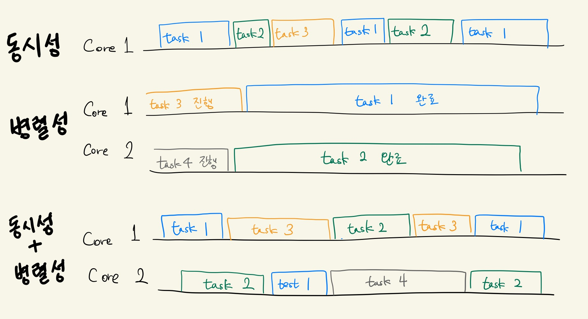

## 시작하며

`Go` 언어를 처음 배울 때 `channel`이나 `goroutine`에 대해 배우면서 `Concurrency` 즉 `동시성`으로 인해 많이 힘들었던 기억이 난다. '*동시성과 병렬성이 도대체 뭐가 다르다는 것이냐..!*' Rob Pike 아저씨가 동시성에 관해 했던 세미나 영상들을 보며 같이 스터디 하던 멤버들과 멘붕에 빠지기도 했고, 이런 저런 의견 교류도 했다가 며칠 지나고 보면 다시 병렬성과 헷갈리고, 제대로 된 한글 자료는 찾기 힘들었다. '*동시성은 사람이 느끼기에 동시처럼 느껴지는 것이고 병렬성은 실제로 동시적인 시점에 대한 것이다.*' 라는 내용이 많았지만 와닿지는 않았다.

그리고 이번에 다뤄볼 동시성은 주로 "**제어**"라는 단어와 함께 언급되는 "**동시성 제어**"에서의 동시성이나 Concurrency와는 조금 다른 의미를 갖는다고 생각한다. 동시성 제어에서의 동시성은 그냥 동시에 무언가에 접근하는 것을 어떻게 제어하거나 막겠냐는 의미일 뿐이지만 동시성-병렬성에서의 동시성은 어떻게 작업들이 동시에 수행되느냐에 초점을 맞추는 느낌이기 때문이다.

* 동시성 제어의 예시 - 여러 client가 하나의 db row에 access할 때 어떻게 제어할 것인가
* 이번에 다룰 동시성의 예시 - 어떤 작업을 동시성을 이용해 수행하는 것이 좋을까 병렬성을 이용해 수행하는 것이 좋을까

`Golang`을 처음 접한 지 벌 써 반년이 넘은 것 같다. 처음 한 4개월 가량은 거의 머릿 속에 아른거리는 물음표 같은 내용이었는데, 꾸준히 공부하다보니 조금 알 것 같다. 이번 글에서는 그러한 내용을 추상적인 말보단 예시와 코드로 명확히 정리해보고자 한다.

## Concurrency is not parallelism

위의 문장은 동시성과 병렬성에 대해 알아보려하면 매번 보게 되는 문장인다. 그렇다. 동시성은 병렬성과 다르다. 이에 대해 설명할 때 영어권에서는 아래의 두 문장이 자주 등장하는 듯 하다.

* *Concurrency is about dealing with lots of things at once.*

* *Parallelism is about doing lots of things at once.*

한 번에 dealing with하는 것과 한 번에 doing하는 것이라고 한다. 하지만 잘 와닿지 않는다... 아마 저 글을 보고 이해할 수 있는 한국인은 극히 드물지 않을까 싶다.

### 예시로 보는 동시성 vs 병렬성

따라서 좀 더 쉽게 예시로 설명해보려 한다. 예를 들어 **사회적 거리 두기로 인해 우리 Gopher(고퍼)가 친구들과 떠나려는 예약했던 여행이 취소되었고, 항공권, 호텔, 렌트카 예약을 모두 취소해야하는 상황**이라고 해보자.

* **동시성**(Concurrent)의 예시 - 만약 모든 취소 작업이 **고객센터 1대1 채팅**으로 이루어지는 경우. Gopher1 **혼자 모든 취소 작업을 동시적으로 수행 가능**
  * Gopher1 혼자 항공권 취소 신청, 호텔, 렌트카의 고객센터 1대1 채팅에 예약 취소 신청을 함
  * 상담사분이 답장을 주는 대로 작업을 진행
  * Gopher1 혼자서 세 개의 취소 작업을 동시에 진행하는 셈이다.
* **병렬성**(Parallelism)의 예시 - 만약 모든 취소 작업이 **고객센터 전화 상담**으로 이루어 지는 경우. Gopher1 **혼자 모든 취소 작업을 동시에 진행할 수는 없고, Gopher 1, 2, 3이 병렬적으로 진행할 순 있음**.

뒤에서 설명하긴 하겠지만 전자의 경우에만 동시성이 일어날 수 있는 이유는 Gopher가 1대1 채팅으로 작업을 진행할 때는 한가한 반면(CPU 점유율이 낮고, 상담사의 메시지를 기다리느라 많은 블락킹이 존재) 전화로 작업을 진행할 때에는 여러 명과 전화할 수 없기 때문이다.(CPU 점유율이 높음.)

항공권 취소 전화 도중 잠시 지연되는 시간에 전화를 끊고 호텔 고객 센터에 전화를 거는 방식으로 Gopher1 혼자 Concurrent하게 작업을 진행할 수 있겠지만 이 경우 **계속해서 전화를 끊고 다시 걸고 상황 설명을 하는 동안에 지연시간이 발생해서 효율이 좋지 않다**. 이 지연 시간을 항공권 취소 전화 => 호텔 예약 취소 전화로의 context switch penalty로 볼 수 있다.

## 프로그램으로 알아보는 Concurrency vs Parallelism

동시성과 병렬성을 비교하는 한글 자료는 찾기 힘든 편이고, 영어로 된 자료는 꽤나 많이 찾아볼 수 있지만, 그래서 "언제", "무엇을", "왜" 써야하는 지에 대한 내용은 잘 찾아보기 힘들다. 게다가 간혹 Concurrent programming의 장점이라면서 parallelism을 설명하는 경우도 있어 혼란스러웠다.




**동시성**이란 한 작업이 완료된 뒤 다음 작업이 수행되는 것이 아니라 계속해서 적절히 switch 되며 동시에 진행되어나가는 것을 의미한다. 그 결과 일정 기간동안 수행한 작업들에 대해 말할 때 그 작업들은 동시에 수행됐다고 할 수 있게 된다. 한 순간에는 엄밀히 따지면 한 작업이 수행된다.

**병렬성**이란 여러 코어에서 작업이 병렬적으로 진행되는 것을 의미한다. 그 결과 일정한 기간이 아닌 순간을 놓고 봤을 때에도 여러 작업이 병렬적으로 동시에 수행되게 된다.

코어 수 보다 많은 스레드가 이용될 경우는 동시성과 병렬성이 함께 이용된다고 볼 수 있다. 즉 여러 스레드에 걸쳐 여러 작업이 완료 되지 않았지만 적절히 switch되며 진행된다는 의미이다.

프로그래밍적으로 봤을 때 같이 동시성은 블락이 많이 걸리는 작업에 유리하고, 병렬성은 CPU bound한 작업에 유리하다고 생각된다. 그럼 좀 더 자세히 동시성과 병렬성이 "**언제**" "**왜**" 유리한지 알아보자.

### Concurrency - Block이 많은 작업에 유리

**예상: 블락이 많은 작업의 경우 Core 숫자에 상관 없이 대체로 많은 thread(혹은 goroutine)을 생성할 수록 작업이 빨라질 것이다.**

block이 많은 작업이 뭐가 있을까? 네트워크 IO 블락이 많이 걸릴 작업으로서 https://example.com 에 요청/응답을 얻는 작업을 64번 수행해보겠다. **core의 숫자를 1개로 제한**하여 concurrency의 효과를 관찰해보기 위해 4개의 코어로 8개의 스레드를 하이퍼스레딩하는 내 랩탑이 아닌 AWS EC2 t2.micro에서 벤치마크를 수행했다.

#### 프로그램 코드

```go
package main

import (
    "fmt"
    "github.com/stretchr/testify/assert"
    "net/http"
    "sync"
    "testing"
)

func Benchmark동시성(b *testing.B) {
    for _, goroutineNum := range []int{1,4,8,16,32,64}{
        b.Run(fmt.Sprintf("%d개의 goroutine", goroutineNum), func(b *testing.B) {
            for i := 0; i < b.N; i++{
                do동시성(b, goroutineNum)
            }
        })
    }
}

func do동시성(b *testing.B, goroutineNum int){
    wg := &sync.WaitGroup{}
    totalRep := 64
    for n := 0; n < goroutineNum; n++{
        wg.Add(1)
        go func(num int) {
            for j := 0; j < totalRep / goroutineNum; j++{
                resp, err := http.Get("https://example.com")
                assert.NoError(b, err)
                assert.Equal(b, 200, resp.StatusCode)
            }
            wg.Done()
        }(n)
    }
    wg.Wait()
}
```

#### Core 1개의 AWS EC2 t2.micro에서의 벤치마킹

```bash
ubuntu@ip-172-31-12-2:~/concurrency$ CGO_ENABLED=0 go test ./concurrency_test.go -bench=. -benchtime=1x
goos: linux
goarch: amd64
Benchmark동시성/1개의_goroutine                                1        9426630119 ns/op
Benchmark동시성/4개의_goroutine                                1        2354737545 ns/op
Benchmark동시성/8개의_goroutine                                1        1192283559 ns/op
Benchmark동시성/16개의_goroutine                               1         604589767 ns/op
Benchmark동시성/32개의_goroutine                               1         313062480 ns/op
Benchmark동시성/64개의_goroutine                               1         182304298 ns/op
PASS
ok      command-line-arguments  28.809s
```

64번 요청/응답 작업을 수행할 때 맨 위의 경우는 1개의 goroutine이 64번, 맨 밑의 경우에는 64개의 goroutine이 각각 1번씩 수행하는 식으로 진행했다. 1개의 코어를 갖는 t2.micro에서도 64개의 goroutine으로 concurrent하게 작업을 진행하는 것이 더 속도가 빨랐다. **네트워크 IO로 CPU가 놀고있는 시간이 많았기 때문에 하나의 코어로도 concurrent하게 수 많은 작업을 효율적으로 진행**할 수 있었다.

### Parallelism - CPU bound한 작업에 유리

**예상: CPU bound한 작업의 경우 코어의 개수까지는 goroutine이 늘어날 수록 성능이 좋을 것이다.**

(*아직 코어와 프로세서, vCPU의 차이는 명확히는 모르겠다*)

CPU Bound한 작업의 경우는 정말 동시성보단 병렬성을 이용할 때 더 좋은 성능을 보일까? 일종의 제곱 연산으로 CPU를 혹사시키는 작업을 정의했다. 병렬성의 경우 어떤 경우까지가 병렬성이고, 어떤 경우까지가 동시성 + 병렬성인지 헷갈릴 수 있기에 정리해본다.

1. 코어 1개에 여러 혹은 goroutine => 당연히 병렬성이 일어날 코어들이 없으니 동시성
2. 코어 N개에 N개 이하의 여러 goroutine => 병렬성
3. 코어 N개에 N개 이상의 여러 goroutine => 동시성 + 병렬성. **하지만 CPU Bound 한 작업의 경우 동시성은 별 이점을 가져다 주지 않는다.**

#### 프로그램 코드

```go
package main

import (
    "fmt"
    "sync"
    "testing"
)

func Benchmark병렬성(b *testing.B) {
    for _, goroutineNum := range []int{1,4,8,16,32,64}{
        b.Run(fmt.Sprintf("%d개의 goroutine", goroutineNum), func(b *testing.B) {
            for i := 0; i < b.N; i++{
                do병렬성(b, goroutineNum)
            }
        })
    }
}

func do병렬성(b *testing.B, goroutineNum int){
    wg := &sync.WaitGroup{}
    totalRep := 1024 * 1024
    dummyNumber := 12345
    for n := 0; n < goroutineNum; n++{
        wg.Add(1)
        go func(num int) {
            for j := 0; j < totalRep / goroutineNum; j++{
                dummyNumber = (dummyNumber * dummyNumber) % 100000
            }
            wg.Done()
        }(n)
    }
    wg.Wait()
}
```

#### Core 1개의 AWS t2.micro에서의 벤치마킹

```bash
ubuntu@ip-172-31-12-2:~/concurrency$ CGO_ENABLED=0 go test ./parallelism_test.go -bench=. -benchtime=10x
goos: linux
goarch: amd64
Benchmark병렬성/1개의_goroutine                               10          15228154 ns/op
Benchmark병렬성/4개의_goroutine                               10          14048765 ns/op
Benchmark병렬성/8개의_goroutine                               10          14038413 ns/op
Benchmark병렬성/16개의_goroutine                              10          13916091 ns/op
Benchmark병렬성/32개의_goroutine                              10          13877358 ns/op
Benchmark병렬성/64개의_goroutine                              10          14082735 ns/op
PASS
ok      command-line-arguments  0.946s
```

t2.micro의 경우 코어가 1개이기 때문에 병렬성이 존재할 것도 없이 동시성만이 존재한다고 했듯이 goroutine이 많아져도 성능이 좋아지지 않는다. 되려 불필요한 goroutine을 관리하기 위한 코스트와 미미하겠지만 존재할 goroutine에 대한 context switch로 인해 작업이 더 더뎌지기도 하는 결과를 볼 수 있다.

#### Core 4개로 8개의 vCPU를 가진 나의 랩탑에서의 벤치마킹

```bash
$ go test ./parallelism_test.go -bench=. -benchtime=10x
goos: linux
goarch: amd64
Benchmark병렬성/1개의_goroutine-8                             10          10263785 ns/op
Benchmark병렬성/4개의_goroutine-8                             10           7342331 ns/op
Benchmark병렬성/8개의_goroutine-8                             10           4872064 ns/op
Benchmark병렬성/16개의_goroutine-8                            10           5000452 ns/op
Benchmark병렬성/32개의_goroutine-8                            10           4830541 ns/op
Benchmark병렬성/64개의_goroutine-8                            10           4968710 ns/op
PASS
ok      command-line-arguments  0.419s
```

내 랩탑은 실제 core는 4개지만 8개의 스레드까지 병렬적으로 처리가 가능하므로 8개라고 볼 수 있다. 

따라서 **8개의 goroutine까지는 병렬성에 의해 성능이 점점 좋아지고, 8개 초과의 goroutine부터는 병렬성과 동시성이 모두 적용되겠지만 현재의 작업은 CPU bound하기 때문에 동시성은 그닥 이점을 가져다주지 못하고 EC2의 경우와 마찬가지로 과잉되는 goroutine으로 인해 오히려 성능을 저하**시킬 수 있다. 코드에 첨부는 하지 않았지만 극단적으로 과잉되는 goroutine은 아래와 같은 성능 저하를 야기하기도 했다.

```text
Benchmark병렬성/8개의_goroutine-8                             10         580169905 ns/op
Benchmark병렬성/16개의_goroutine-8                            10         602391376 ns/op
Benchmark병렬성/1024*1024개의_goroutine-8                     10         879079810 ns/op
```

(*한편으론 1024\*1024개의 goroutine을 관리하는 데에도 성능 저하가 저정도 뿐이라니 대단하단 생각도 든다...!*)

## 마치며

동시성과 병렬성은 Go를 공부하면서 컴퓨터 구조를 공부하면서 너무도 많이 파고들었던 내용이라 술술 적힐 줄 알았는데 시간이 좀 지나서인지 가물가물한 내용도 좀 있었고 내용도 쉽지 않았으며 좋은 예시를 어떻게 들어야할 지 많이 고민이 됐던 것 같다. 이런 저런 생각들로 인해 설명이나 진행이 그렇게 깔끔히 된 것 같진 않지만 그래도 결론이 깔끔하게 나와서 다행이다. 사실 이런 코어나 고루틴, 스레드의 개수에 따라 병렬성이나 동시성을 구분 짓기보다 '*동시성은 주로 구조와 관련되고 병렬성은 실행과 관련된다.*'와 같은 철학적인 내용도 간간히 나오긴 하지만 몇 달 째 그닥 와닿지 않고, 간간히 등장할 뿐 오피셜한 내용은 아닌 듯하여 생략했다.

그리고 이번엔 벤치마크 테스트에 한글 이름을 도입해봤는데 읽기도 편하고 나름 귀여운 것 같다. ㅎㅎ 종종 개발하면서 테스트 코드 짤 때에도 한글 테스트 케이스를 사용해보려한다.

## 참고

Concurrency is not parallelism https://blog.golang.org/waza-talk

Concurrency is not parallelism slide - Rob Pike https://talks.golang.org/2012/waza.slide#1

Back to the Essence - Concurrency vs Parallelism https://homoefficio.github.io/2019/02/02/Back-to-the-Essence-Concurrency-vs-Parallelism/

[ 제 4회 파이썬 격월 세미나 ] 동시성과 병렬성 - 이찬형 https://youtu.be/Iv3e9Dxt9WY