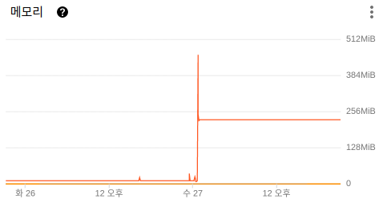
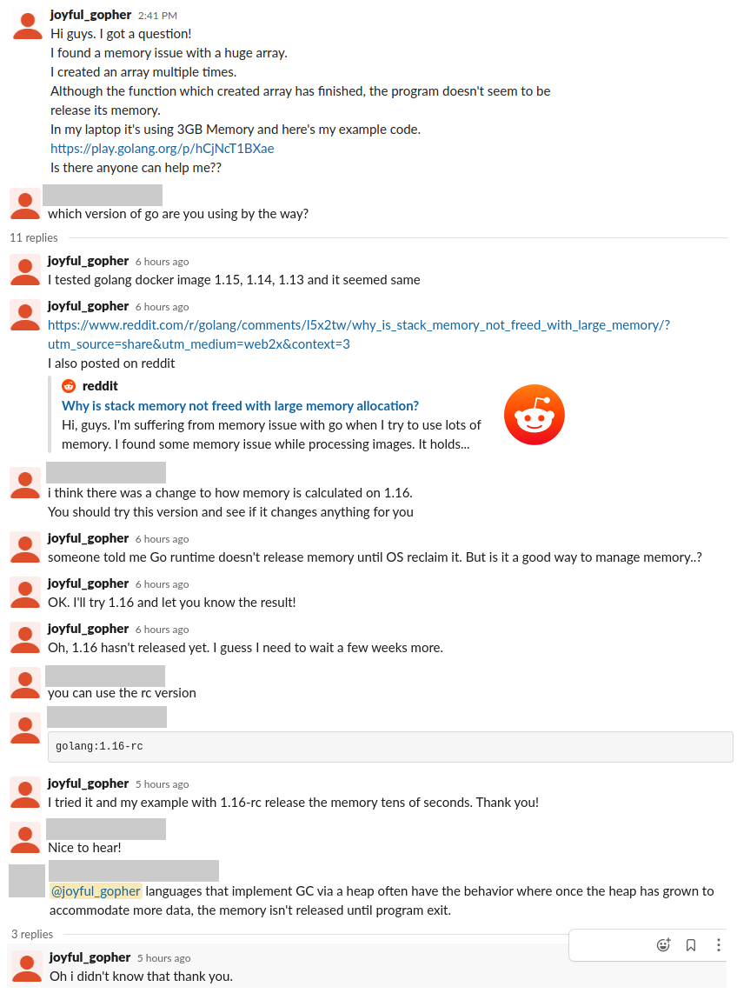
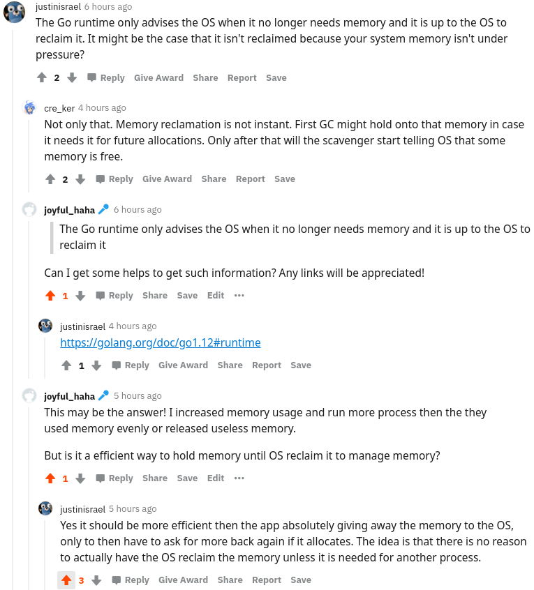
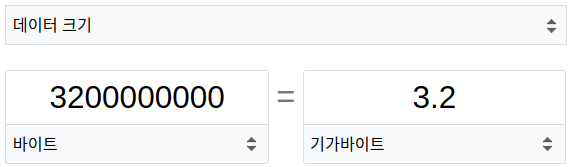
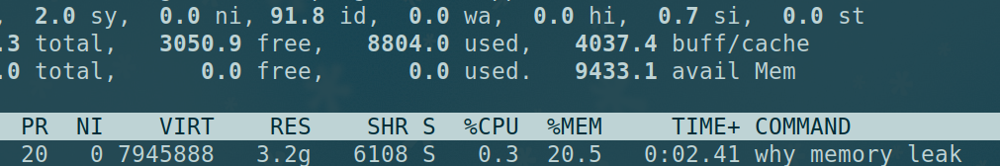
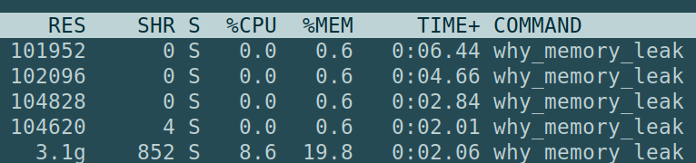
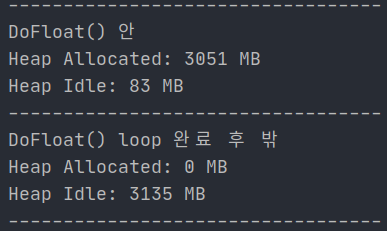
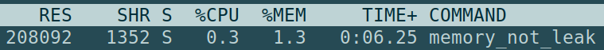

## 시작하며

> 이 글은 Go 1.15 버전을 바탕으로 개발하며 겪은 이슈에 대해 설명하고 있으며 Go 1.16에서는 해당 이슈가 개선될 것이라고 합니다.



진행 중인 [쿠뮤](https://github.com/search?q=topic%3Akhumu+org%3Akhu-dev+fork%3Atrue)라는 프로젝트에서 Go를 이용해 이미지에 대한 url 해싱, 리사이징, 섬네일, 센터 크롭 작업을 하는 이미지 프로세싱 마이크로서비스를 개발하고있었다. 1차적으로 어느 정도 개발이 끝난 뒤 벤치마크 겸 부하 테스트 겸해서 얼마나 해당 마이크로서비스가 잘 버티면서 작업을 수행하는지 확인해보려 했으나 **Memory가 한 번 치솟게되면 어느 정도 이하로 떨어지지 않는 이슈**가 발견되었다. 

허용할 수 있는 양보다 많은 요청을 보낼 경우 애플리케이션 레벨 이전에서 요청을 차단해주지 않으면 애플리케이션 단에서는 터지거나 문제가 생기는 것은 당연하겠지만 사진처럼 **작업을 다 수행한 뒤에도 메모리가 제대로 해제되지 않는 것이 이슈**였다.

## 이슈의 원인을 파헤치기 위해 했던 노력들...

이 이슈를 잡아보려 여러 가지 디버깅 작업을 해봤으나 계속해서 메모리 이슈가 발생했고, 각종 커뮤니티에서 도움을 구해보고자했다. Go 오픈 카톡방, Reddit, Slack 등에서 의견을 구해보았다. 재미있는 경험이었으며 덕분에 원인을 파악할 수 있던 것 같다.



<center>Go Slack에서 사람들에게 의견을 구해본 모습</center>



<center><a href="https://www.reddit.com/r/golang/comments/l5x2tw/why_is_stack_memory_not_freed_with_large_memory/" target="_blank">reddit 커뮤니티</a>에서 사람들에게 의견을 구해본 모습</center>

## 어떤 상황에 Memory Leak이 발생한 것일까?

그럼 자세히 어떤 이슈가 있었고, 어떻게 그 상황을 분석할 수 있었으며 어떻게 해결할 수 있을지 알아보도록하겠다.

**tl;dr - 자세한 묘사보다는 그냥 딱 원인/결과만 궁금하신 분들을 위한 요약**

- 원인 - 힙 메모리에 메모리를 할당받았는데 혹시 **재사용할 수도 있어 OS에게 바로 메모리를 반환하지 않음**.
- 결과 - **OS가 메모리 부족하니 달라고 하면 그때 힙 메모리 사이즈를 실제로 줄인다**. (*하지만 go 1.16 버전부터는 개선될 예정이다.*)
- 정확히 이러한 것을 메모리 누수라고 하는지는 명확하지 않다. Go 런타임이 놀고 있는 메모리를 갖고는 있지만 언제든 OS에게 반환해줄 수는 있기 때문이다. (*하지만 매끄럽게 OS에게 반환해주는 느낌은 아니긴했다.*)

```go
package main

import (
    "time"
)

func main(){
    for routine := 0; routine < 10; routine ++{
        DoFloat()
    }
    for {
        // dummy waiting..
        time.Sleep(3*time.Second)
    }
}

func DoFloat(){
    var tmp [400000000]float64
    tmp[0] = 0 // tmp에 접근하지 않으면 unused variable이 되기 때문에 dummy한 access 작업 수행
}
```

처음엔 이미지 리사이징 시 메모리가 제대로 해제되지않는 것을 보고 이슈를 발견했지만, 사람들에게 도움을 구하고자 할 때, 이슈에 대해 설명할 때 전체 프로그램 코드를 첨부할 수는 없었기에 **문제 상황을 간단하게 표현할 수 있는 코드를 짜보고자**했다. 이리 저리 프로그램을 간소화하면서 **커다란 배열 생성시에도 같은 메모리 이슈**가 발생한다는 것을 알게되었다. 

그래서 아주 간단한 배열 생성 예시를 통해 사람들에게 이 이슈에 대해 설명해보고자했다. 이 예시에서는 `8바이트의 float6`4로 이루어진 `400000000칸의 배열 tmp`를 선언한다. 



8바이트가 400000000칸이면 `400000000 * 8 / 1024(KB) / 1024(MB) / 1024(GB) = 약 2.9GB` 혹은 그대로 1000단위 씩으로 나눠 `3.2GB`을 할당하는 것이다.

원래는 스택 메모리에 할당된 뒤 다른 곳에서 이 녀석을 참조하는 일이 없기 때문에 바로 release되어 스택 메모리에서 점유가 해제되어야한다. 하지만 몇몇 경우에 스택이 아닌 힙에 데이터가 저장될 수 있다고 하는데, 이 경우에는 너무 큰 값을 선언하여 스택이 아닌 힙에 데이터가 저장되었고, 힙이 할당받은 메모리를 해제해주지 않아 생기는 문제였다. 사실 이런 현상도 정확히 메모리 누수 혹은 Memory Leak라고 하는지는 잘 모르겠다. 왜냐하면 **메모리에서 해제할 수 없는 수준으로 그 값의 주소를 잃어버려 실제로 그 공간이 누수가 되는 것이 아니라 아직 딱히 OS가 부담을 느끼지 않기 때문에 Go Runtime의 Heap에서 해당 주소는 비워뒀지만 OS에게 반납은 안 한 상태**인 것이기 때문이다.



실행해보면 10번의 DoFloat() 후에 그냥 for loop에서 time.Sleep 중이기에 **CPU를 거의 사용하지 않고 있는 반면 내 Laptop의 16GB의 Memory 중 20.5%인 3.2GB를 사용 중**인 것을 확인할 수 있었다.

## 해결 해보기

### Go runtime은 OS에게 더 이상 이 메모리가 필요하지 않다고 알려주기만 하지 그 Memory를 실제로 회수할 지 말지는 OS에게 달려있다.

> The Go runtime only advises the OS when it no longer needs memory and it is up to the OS to reclaim it - @justinisrael

내가 Reddit에서 사람들께 여쭤봤던 글에 담긴 한 댓글을 인용해보았다. 과연 저 말이 사실일까? 프로세스를 여러번 띄워보았다.



프로세스를 하나 띄웠을 때에는 아까는 Dummy waiting 중이면서도 **Memory를 20% 가까이 점유하고 있었는데 여러 프로세스를 띄우면서 메모리가 부족해지자 놀고있던 Heap memory를 반환하여 거의 약 0.6%의 메모리만 점유** 중인 것을 볼 수 있다.

마지막 프로세스는 아직 DoFloat() 작업을 진행 중이므로 여전히 19.8%의 메모리를 점유 중이고, 작업이 완료된 뒤에도 OS가 Reclaim(다시 메모리를 가져가는 것)하기 전까지는 약 20%대를 유지하는 것으로 보여졌다.

하지만 좀 더 자세히 기록해보고싶었다. Go의 내장 패키지 `runtime`의 Memory 관련 기능을 이용하면 될 것 같았다. `runtime.ReadMemStats(*runtime.MemStats)`를 이용하면 런타임 도중 자신의 런타임 상황을 알아볼 수 있다. 자세한 사용법은 구글링을 통해 쉽게 얻을 수 있으니 지면 관계상 생략한다.



즉 힙 메모리가 확보간 공간은 거대한 배열을 생성하는 함수인 DoFloat을 진행하는 동안은 실제로 Allocate 할당하여 사용하는 반면 DoFloat을 모두 마친 뒤에는 **힙 메모리는 공간을 확보하고는 있지만 Idle(놀고 있는) 상태로 존재**하는 것이었다. 

나는 이러한 경우를 처음 맞이했지만, **각종 가비지 컬렉터가 있는 언어에서 각각의 가비지 컬렉터나 런타임을 구현하는 방법에 따라 이런 식으로 힙 메모리를 재사용하는 경우를 대비해 한 번 할당받은 메모리를 완전히 OS에게 반환하지 않는 경우가 있다**고 한다.

### Go 1.16 버전부터는 메모리 계산 방식이 바뀔 것이다. (그래서 괜찮을 것이다.)

> "There was a change to how memory is calculated on 1.16" - @gopj

과연 사실일지 확인해보자. 간단히 Docker를 통해 나의 Local 환경에서 별 다른 세팅 없이 Go 버전을 다르게 하여 실행할 수 있었다. 실제로 이 이슈를 커뮤니티에 제기하기 전에도 Docker를 이용해 1.2, 1.3, 1.4 등의 버전에서도 실행해보았다. 나의 랩탑은 1.5 버전을 사용 중이었다. 1.16 버전은 아직 rc는 Release Candidate의 줄임말로 보통 배포 후보 버전을 의미한다.

```docker
# Dockerfile

FROM golang:1.16-rc
WORKDIR /app
COPY main.go main.go
ENTRYPOINT ["go"]
CMD ["run", "./main.go"]
```

```bash
# 이미지 빌드 후 컨테이너 실행
$ docker build . -t tmp && docker run --rm --it tmp
```



`1.16-rc` 버전을 사용하자 결과적으로 다른 메모리 부하가 심한 프로세스를 실행시키지 않았지만 **수십 초 이내에 사용하지 않는 힙 메모리가 OS에게 반환**되었다!!!

> 하지만 여전히 runtime.MemStats에서는 HeapMemory에 Idle한 메모리 크기가 크게 잡혀있었는데, 이 부분은 rc 버전이기 때문에 runtime까지 완전히 기능이 개발되지 않아서인지 이전에도 메모리는 반환했지만 메모리를 표시하기 위한 계산의 문제만 개선이 된 것인지는 확실하진 않지만 여튼 이슈에 대해서는 파악할 수 있었다!

## 마치며

개발이나 운영을 하면서 이런 저런 이슈들이 있었지만 이번 경우처럼 로우 레벨스럽게 들어가서 런타임 동안 메모리 관리가 어떻게 되는지까지 탐구해본 적은 드물었던 것 같다. 도저히 원인을 모르겠어서 '*하 결국 포기하고 이 마이크로서비스는 Lambda로 돌려야하나...*' 싶었다. 하지만 몇 시간을 고생하고 직접 의견을 구하러 다니면서 새로 배우게 된 내용도 많았고, 외국에 계신 몇몇 개발자 분들과도 이렇게 소통할 수 있다는 것이 신기했다. (*그리고 참 세세한 지식까지 겸비한 분들이 많다는 것이 놀라웠다...*)

결과적으로 해당 이슈는 아마 Go의 `1.16` 버전이 패치되면 완전히 해결 가능할 것 같고 그 이전에도 사실 Host에서 메모리 부담을 느끼면 Go runtime이 안 쓰고 있는 힙 메모리를 반환해준다고 하니 큰 문제는 없을 것 같다. 하지만 실제로 Host가 부담을 느끼는 선 이전에 메모리를 반환받고 싶다면 Pod level에서 메모리 리소스를 제한해볼 수는 있을 것 같다.

혹시 다음에도 이런 흔치 않은 고된 이슈를 맞이한다면 그 원인과 해법을 이렇게 또 기록할 수 있기를 바래본다.