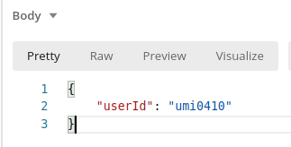
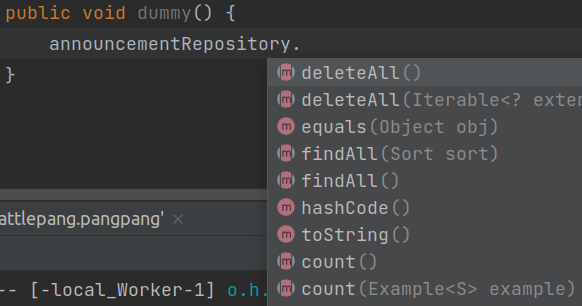
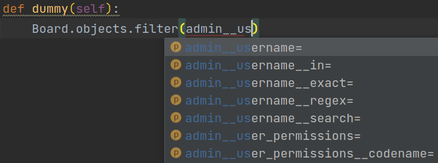
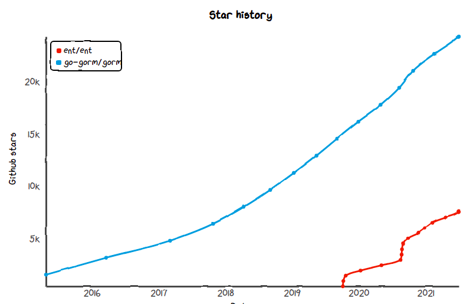
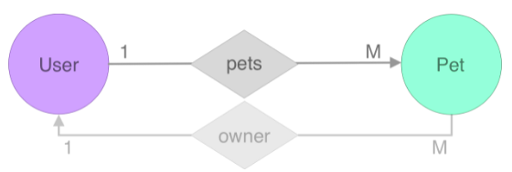

## 시작하며

Go 언어를 처음 시작한 지 벌써 1년이 지났다니 시간이 참 빠른 것 같습니다! Java는 Spring이라고하는 거대한 프레임워크가 자리 잡고 있어 딱히 어떤 프레임워크나 라이브러리를 사용할지에 대한 고민이 별로 필요 없었던 것 같습니다. 반면 Go 언어는 정형화된 아키텍쳐에 대한 내용이 별로 없고 프레임워크나 라이브러리의 대세도 참 빠르게 변하다보니 그게 장점이라면 장점이겠지만 이래저래 고생도 했네요.

게다가 Go 언어는 개발 입문자들이 많이 사용하지 않는 언어라 그런지 아직 웹 백엔드 개발에 익숙하지 않은 (저처럼) 사람들을 위한 자료들은 많이 없었던 것 같습니다. 예를 들면 Java의 스프링이나 Node.js의 express, Python의 django 같은 프레임워크들은 인프런만 가봐도 A to Z로 알려주는 강의가 많죠. 하지만 Go 언어는 보통 언어 입문 내용들이 많고,
_~~"자~! 여러분들은 어차피 개발 초보자들이 아니시잖아요? 이쯤하면 Golang을 맛보셨으니 알아서들 입맛대로 쓰십시오~!"~~_ 식으로 입문 이후의 내용은 보통 동시성 패턴에 대한 내용들일 뿐
백엔드 개발을 위한 아키텍쳐나 Unit test를 어떻게 실제로 적용하는지 같은 예시는 많이 없었습니다. 그래서 이번엔 Golang으로 웹 백엔드 개발을 하는 과정에 대해 좀 적어볼까합니다!

이번 글은 그런 내용을 다룰 시리즈 중 첫 번째로 Golang으로 데이터베이스 작업하는 것과 관련한 내용을 담아봤습니다. 데이터베이스를 어떻게 사용하는지에 대한 세세한 내용보단 어떤 프레임워크를 추천드리고, 그 프레임워크를 사용하는 모습이 어떠한지
가볍게 쓰윽 보시면 좋을 것 같습니다.

## 3 layered architecture에 대해 간단히 짚고 넘어가겠습니다

* `Presentation layer` - 어떻게 데이터가 클라이언트에게 보여줄 지에 대한 작업을 담당. 클라이언트는 이 계층을 통해 상호작용한다.
* `Business/Domain layer` - Presentation layer와 Data access layer의 사이에 위치해 비즈니스 룰과 그 룰을 따르는 비즈니스 로직을 구현. 보통 이 계층에 Service라고 하는 클래스(혹은 타입 등등)가 위치한다.
* `Data Access Layer` - DB에 접근하는 작업을 담당. DAO(Data Access Object, repository)가 위치한다.

대부분의 웹 애플리케이션은 `3 layered architecture`라고하는 구조로 기초로 하여 개발됩니다. 그 속에서 여러 단순 작업이나 개별적으로 개발하긴 번거로운 기능들이 존재할 수 있는데, 우리는 프레임워크나 라이브러리가 제공하는 기능들을 영리하게 가져다 씀으로서 좀 더 유지 보수 하기 쉬운 개발을 할 수 있을 것입니다.

### Presentation layer

```go
app.Get("/users/:id", func(ctx *fiber.Ctx) error {
	userId := ctx.Params("id")
	// ... 기타 작업 생략
	return ctx.JSON(map[string]string{
        "userId": userId,
    })
})
```



_url path variable은 어떻게 인식할 것인지, Golang의 map을 어떻게 JSON으로 직렬화할 지와 같은 로직들이 모두 프레임워크에서 제공됨._

저는 Presentation layer는 대부분 웹 프레임워크 자체나 해당 웹 프레임워크가 제공하는 형태를 따르는 핸들러 단에서 제공이 된다고 생각하고 있습니다. 예를 들어 어떻게 응답을 JSON 형태로 제공할지 HTML, XML, 이진 데이터(gRPC)와 같은 내용들 말이죠. 즉 Presentation layer에서는 우리가 그닥 개발할 것이 많지는 않습니다.

### Business layer

> Domain logic과 Business logic의 차이는 어느 정도 존재하는 걸로 알고 있습니다만 3 tier로 나눴을 때는 동일한 계층으로 보겠습니다.

```go
// Domain/Business layer 코드 예시 - 우리 도메인 특정 코드들이 많아 남(우리 팀 혹은 기업이 아닌 사람들)이 만든 오픈소스로 대체하기 힘듦.
func (svc *UserService) updateProfileImage(requestUser *User, imageFile Image) (*UserResponse, error){
    requestUser가 인증된 유저인가
    	인증된 유저가 아니라면 어떤 에러를 리턴할 것인가
    imageFile이 제대로 된 Image인가
    	제대로 된 Image가 아니라면 어떤 에러를 리턴할 것인가
    imageFile을 업로드
    	업로드 과정 중 에러 발생 시 어떤 에러를 리턴할 것인가
    유저의 친구들에게 새로운 프로필 사진 업로드에 대한 알림 발송
    ... 등등 생략
    return 생략
}
```

반면 `Domain/Business layer`에서는 비즈니스 룰과 로직이라고 하는 우리 애플리케이션의 핵심적인 기능에 대한 구현이나 조합이 이루어지게 되는데 이 부분 타 오픈소스들로 대체되기는 힘든 부분이 많아 당연히 직접 개발하는 경우가 많습니다. 위의 코드를 보면 다양한 우리 서비스의 로직들이 구현되거나 조합되는 것을 볼 수 있습니다.

### Data access layer



_Java의 JPA 프레임워크의 경우 기본적으로 CRUD 메소드를 제공해준다._



_Python의 django의 경우 Join 기능도 기본적으로 제공해준다._

이제 Data Access Layer만이 남았네요. 이 계층 또한 대부분의 객체지향 언어들에선 ORM이라는 개념을 통해 대부분의 프레임워크들이 많은 기능을 제공합니다. 그래서 필요한 경우에만 추가적으로 정의하는 형태로 편리하게 이용할 수 있습니다.

그렇다면 Go에서는 어떻게 Data access layer를 편하게 이용할 수 있을까요? 이번 글에서는 **Golang은 이 Data Access Layer(Repository)에서 어떤 DB framework을 사용하면 좋을지 어떤 식으로 사용해나갈 수 있을지에 대해** 다뤄보려 합니다.

## Golang의 좋은 DB framework 좀 추천해주세요.



*차트 출처: https://star-history.t9t.io/*

Golang에는 Django나 JPA와 같은 강력한 데이터베이스 관리 프레임워크가 몇 년 전까지 존재하지 않았던 것 같습니다. 생 쿼리문을 직접 짤 게 아닌 경우라면 얼마 전까지는 `gorm` 이라고하는 프레임워크가 거의 유일한 선택지였던 것 같습니다. 하지만 요즘 추세를 보면 무섭게 `ent`라는 패키지가 쫓아오고 있는 모습을 보실 수 있습니다.

### 👎 gorm 프레임워크 사용 후기

제가 golang 개발을 막 시작했던 때가 2020년 여름쯤이었기에 저도 `gorm`을 첫 데이터베이스 프레임워크로 사용했었지만 몇 가지 단점들이 존재했습니다.

1. **문서의 내용이 빈약했고, 에러에 대한 설명이나 디버깅이 쉽지 않았다.**

   문서의 내용들이 실질적인 다양한 케이스에 대한 예시나 설명이 부족했다고 느껴졌습니다. 또한 에러가 발생한 경우 왜 에러가 발생한 것인지 정확한 위치나 이유가 제공되지 않아 디버깅하기도 힘들었던 것 같습니다.

2. **불편한 struct tag 기반의 테이블, 컬럼 설정**

   Go가 강력히 type을 강제하면서 높은 안정성과 편의성을 제공하는 반면 gorm은 struct tag를 기반으로 여러 설정들을 관리하도록 개발되었습니다. Go 언어를 좋아하지만 struct tag에 대해서는 가뜩이나 조금의 불만을 갖고 있었는데 이런 저런 컬럼 설정들마저 struct tag로 이용하니 정확히 이 tag가 동작하는 태그인지, 왜 에러가 나거나 적용이 안되는지도 안전하게 확인할 수 없었고 무엇보다 가독성이 너무 너무~! 좋지 않았습니다.

3. **제공되는 메소드가 별로 없다.**

   gorm은 아주 가벼운 느낌이었습니다. 하지만 데이터베이스 프레임워크를 사용함에도 불구하고 너무나 제공되는 메소드가 없다고 느껴졌습니다. JPA나 Django는 조금의 설정만 해주면 CRUD와 Join까지 제공해주는데 gorm은 거의 정말 정말 기본적인 기능을 하는 메소드에 적절한 인자를 전달함으로써 동작시켜야합니다. 예를 들어 메소드가 어떤 매개변수를 왜 필요로 하는지에 내용이 그닥 없고 그냥 통으로 Create메소드에 알아서 적절한 inteface{}인자를 전달해야하는 형태라 Go의 장점인 강력한 type을 바탕으로한 안정성, 편의성을 누릴 수도 없었고 이럴꺼면 파이썬 쓰지... 싶은 생각이 자주 들었습니다.

### 👍 추천하는 프레임워크 - ent

물론 위의 Github star history만 봐도 아실 수 있겠지만 ent는 매우 무섭게 성장 중인 Golang의 데이터베이스 관리 프레임워크입니다. 게다가 아마 Facebook에서 내부적으로 사용하다가 오픈소스화한 프로젝트인 걸로 알고 있는데 따라서 어느 정도의 완성도나 편의성이 보장되겠죠. ㅎㅎ 저는 사이드 프로젝트에서 gorm을 사용하다가 많은 불편을 느꼈고, Go 개발 커뮤니티에서 ent가 그렇게나 핫하다길래 ent로 data access layer를 마이그레이션했고 만족 중입니다. ㅎㅎ

**ent의 사용 후기 및 특징**은 아래와 같습니다.

1. **타입을 바탕으로 안전하고 편리하게 테이블을 설계할 수 있다.**

   테이블, 컬럼 정의들이 모두 ent 패키지의 컬럼 type 혹은 테이블 type, 관계 type 등등을 이용해서 정의할 수 있기 때문에 너무 너무 편리하죠. 게다가 복잡한 struct tag도 안녕~! `ent`는 미리 정의된 타입과 메소드들로 다양한 설정을 할 수 있습니다.

2. **다양한 메소드 제공**

   go generate라고 하는 기능을 통해 우리가 정의한 스키마(테이블 및 필드 설정)을 바탕으로 다양한 타입과 메소드들을 만들어줍니다. 이 부분으로 인해 꽤 빌드 시간이 늘어나는 느낌이긴한데 그래봤자 2초 정도인데 ent가 제공해주는 메소드들로 인해 개발적 편의와 안정성이 훨씬 크다고 느끼기 때문에 만족하고 있습니다.

3. **별 다른 문서가 필요 없다..?**

   그냥 메소드를 기반으로 이용할 수 있다보니 그 사용 방법이 직관적인 편이고, 경우에 따라서는 코드 자체를 까보면 이해되는 별 다른 문서 없이도 이용할 수 있었던 것 같습니다.

4. **참조 관계 설정이 좀 헷갈린다** (몇 안 되는 단점 중 하나)

   뭔가 From이나 To등을 통해 참조 관계를 정의하는데 이 From이 어떤 테이블을 From으로 생각하는건지 뭔가 많이 애매합니다. 커뮤니티를 보면 이로 인해 많은 분들도 혼란을 겪고 있는 현황입니다.

   하지만 너무 걱정은 마세요~! 이번 글에서 정리해드리려하니까요~! ㅎㅎ 

## Ent 패키지를 통해 Database 작업해보기

"**시작하며**"에서도 말씀드렸다시피 사실 Go 언어로 개발하시는 분들 중에 정말 개발 자체가 익숙하지 않은 분들은 정말 적으리라 생각합니다...ㅎㅎ 따라서 너무 디테일한 내용을 직접 알려드리기 보다는 커다란 흐름이나 헷갈리는 요소들을 짚어드리는 방향으로 글을 작성해 보겠습니다.

### 예시 Application - 여행 상품 관리 CRUD 서비스

* 1:N의 여행 상품 담당자 관계 - 담당자(일종의 유저)는 여행 상품과 1:N 관계

위의 관계를 갖는 여행 상품 관리 CRUD 서비스를 만들어보겠습니다. 본 글에서는 코드를 짧게 짧게 잘라서 올릴테니 원본 코드를 보고싶으신 분들은 제 깃헙을 참고해주세요.

원본 코드 - https://github.com/umi0410/how-to-backend-in-go

### 1. ent package 설치

```shell
# 참고: https://entgo.io/docs/tutorial-setup/#installation
$ go get entgo.io/ent/cmd/ent
```

우선 ent는 다양한 명령 기능도 제공하고 저희는 그걸 필요로 하기 때문에 ent를 설치해주어야합니다. 스키마 정의 코드 또한 ent 를 이용해 자동으로 기본 형태를 제공 받을 수 있습니다. ent 패키지를 설치한 이후 저희는 다음과 같은 명령을 수행하게 될 것입니다.

1. `$ go run entgo.io/ent/cmd/ent init {{엔티티 이름}}` - 엔티티 이름을 바탕으로한 초기 스키마 코드 생성
2. `$ go generate ./ent` - 정의했던 스키마를 바탕으로 한 많은 boilerplate 코드를 자동으로 생성

### 2. 스키마 설정

```shell
$ go run entgo.io/ent/cmd/ent init User # or shortly $ ent init User
$ go run entgo.io/ent/cmd/ent init TourProduct # or shortly $ ent init TourProduct
```

위의 명령어들을 통해 User와 User가 관리하는 TourProduct라는 엔티티들의 스키마를 작성할 것입니다. 정확한 스키마 작성에 대한 설명은 생략하겠습니다. [ent 공식 문서](https://entgo.io/docs/schema-def)에 매우 잘 설명되어있고, [examples in ent github](https://github.com/ent/ent/tree/master/examples)에서 대부분의 예시 코드도 확인해볼 수 있기 때문입니다.

#### ⭐ 참조 관계 설정 시의 From과 To

다만 한 가지. Edge를 이용해 **참조 관계를 설정할 때 `From`과 `To`의 사용에 대해** 한 가지만 짚고 넘어가려 합니다. 저를 포함해 많은 ent 사용자분들께서 Edge 설정 시에 많은 혼란을 겪습니다. 그 이유는 일반적으로 우리는 **1:N 관계에서 N쪽이 From, 1쪽이 To가 되며 N쪽 테이블에서 1을 참조하는 내용을 정의하는 반면 ent는 그 반대로 동작**하기 때문입니다.

*(ent에서의 참조 관계 정의 방식에 대해 궁금하지 않으신 분들은 넘어가셔도 됩니다.)*



*출처: https://entgo.io/docs/schema-edges*

위와 같은 경우 데이터베이스상으로는 `Pet` 테이블이 자신의 `owner_id` 컬럼을 통해 `User`을 참조하므로 `Pet`이 `From`, `User`가 `To`가 되며 이를 통해 owner라는 관계를 나타낼 수 있습니다.
하지만 `ent`는 그 반대로 `User`가 `Pet`을 관리(참조)한다는 의미로 `User`가 `From`, `Pet`이 `To`가 되어 `pets`라는 관계를 나타내는 식으로 정의하는 것 같습니다.
이렇게 기존의 테이블 설계 방식과는 대조되는 방식으로 인해 많은 사람들이 혼란을 겪는 것 같아요.

이렇게 테이블을 정의하도록 ent를 개발한 개발자들의 의도나 철학은 뭔지 잘 모르겠습니다. 혹시 아시는 분이 있다면 알려주시면 좀 더 entf를 이해하는 데에 도움이 될 것 같아요!

아무튼 ent에서는 **1:N 방식에서 1이 연관 관계의 주인처럼 동작/정의한다**고 생각하고 작업하고 있습니다.(실제 문서에서도 From쪽. 즉 1 혹은 User 쪽이 연관 관계의 주인이라고 기술되어있는데, 이 부분은 JPA와는 거의 반대라고 볼 수 있죠.) 
저는 그냥 **예시를 참고하면서 실제 테이블의 참조 관계랑 반대라고 외웠어요.**(ㅎㅎ....;;)

#### 스키마 정의 및 적용

```go
// ent/schema/user.go
package schema

import (
	"entgo.io/ent"
	"entgo.io/ent/schema/edge"
	"entgo.io/ent/schema/field"
)

// User holds the schema definition for the User entity.
type User struct {
	ent.Schema
}

// Fields of the User.
func (User) Fields() []ent.Field {
	return []ent.Field{
		// 타입을 기반으로 안전하고 편리하게 컬럼을 정의할 수 있습니다.
		field.String("id"),
		field.String("name"),
		field.Bool("isActivated").Default(true),
	}
}

// Edges of the User.
func (User) Edges() []ent.Edge {
	return []ent.Edge{
		// ent에서는 To를 정의하는 스키마, 즉 여기선 User
		// 가 참조 관계의 주인이라고 정의합니다.
		// 일반적인 JPA의 방식과는 반대입니다.
		edge.To("products", TourProduct.Type),
	}
}

```

```shell
$ go generate ./ent
```

아무튼 저는 User 스키마를 이렇게 설정했고 이 스키마들을 적용해 ent가 generate해준 코드들을 이용해보겠습니다.

(TourProduct 스키마는 생략했습니다. 원본 코드를 참고해주세요.)

### 3. repository 정의

ent가 데이터베이스 관련 작업을 위한 다양한 메소드를 지원해줍니다. 하지만 ent는 간단 간단한 메소드들을 조합해서 사용해야하기 때문에 비즈니스 로직을 구현하는 계층에서 매번 ent의 메소드를 조합하며 사용하는 것은 계층의 관심사와 책임을 흐리게 할 수 있습니다. 따라서 몇 가지 메소드들을 `data access layer`인 `repository`에 정의하겠습니다.

예를 들면 특정 user가 관리하는 여행 상품을 모두 조회하는 `FindAllByManager(managerID string)`와 같은 메소드 말이죠. 이 작업을 위해서는 User 테이블과 TourProduct 테이블을 조인해야하는데 ent가 역시 이 기능을 제공합니다.

```go
// repository.go
...
type TourProductRepository struct{
    Client *ent.TourProductClient
}

func (repo *TourProductRepository) FindAllByManager(managerID string) []*ent.TourProduct{
    result := repo.Client.Query().
    	// 특정 manager_id의 TourProduct를 조회하도록 조인
        Where(tourproduct.HasManagerWith(user.ID(managerID))).
        WithManager().
        AllX(context.TODO())

    return result
}
```

### 4. 실행

```go
// main.go
func main(){
	...
    fmt.Println("전체 유저 조회")
    for _, user := range userRepository.FindAll() {
        fmt.Printf("User(id=%s, name=%s)\n", user.ID, user.Name)
    }
    fmt.Println("--------------------------------------------------------------------------")

    fmt.Println("전체 여행 상품 조회")
    for _, tour := range tourProductRepository.FindAll() {
        fmt.Printf("TourProduct(id=%d, name=%s, manager=%s)\n", tour.ID, tour.Name, tour.Edges.Manager.ID)
    }
    fmt.Println("--------------------------------------------------------------------------")

    fmt.Println(user1.ID + "가 관리하는 전체 여행 상품 조회")
    for _, tour := range tourProductRepository.FindAllByManager(user1.ID) {
        fmt.Printf("TourProduct(id=%d, name=%s, manager=%s)\n", tour.ID, tour.Name, tour.Edges.Manager.ID)
    }    
}
```

```
전체 유저 조회
User(id=umi0410, name=박진수)
User(id=devumi, name=개발자)
--------------------------------------------------------------------------
전체 여행 상품 조회
TourProduct(id=1, name=미국 뉴욕 여행, manager=umi0410)
TourProduct(id=2, name=유럽 여행, manager=devumi)
--------------------------------------------------------------------------
umi0410가 관리하는 전체 여행 상품 조회
TourProduct(id=1, name=미국 뉴욕 여행, manager=umi0410)
```

간단한 테스트용으로 2명의 유저를 만들었고, 각각의 유저가 관리하는 2개의 여행 상품을 만들어서 조회하는 프로그램을 만들어보았습니다. repository 계층에서 만든 FindAll()이나 FindAllByManager()와 같은 메소드들을 통해 편리하게 작업할 수 있네요!

## 마치며

글을 쓰다보니 백엔드 개발에서 데이터베이스가 왜 필요하고 어떤 식으로 사용되는지를 다루는 글도 아니고, Golang에서 ent 프레임워크를 사용하는 방법을 자세히 알려주는 글도 아닌 이도 저도 아닌 글이 된 건 아닌가 싶기도 합니다.

그래도 앞으로 Golang으로 백엔드 개발하는 것에 대해 천천히 한 5~6편 정도의 글을 써나가볼까하는데 이때 DB 관련된 내용을 우선 짚고는 넘어가야할 것 같기도 했고, 무엇보다 한글로 된 ent 자료를 하나도 찾을 수 없다는 점에서 데이터베이스 관련 프레임워크인 ent를 소개해보고자 했습니다! ㅎㅎ

지면 사정 상 코드들을 잘라서 올렸는데 원본 코드는 https://github.com/umi0410/how-to-backend-in-go 에 올려놓을테니 참고해주시면 감사하겠습니다.

## 참고

* https://entgo.io/
* https://github.com/ent/ent
