## 시작하며

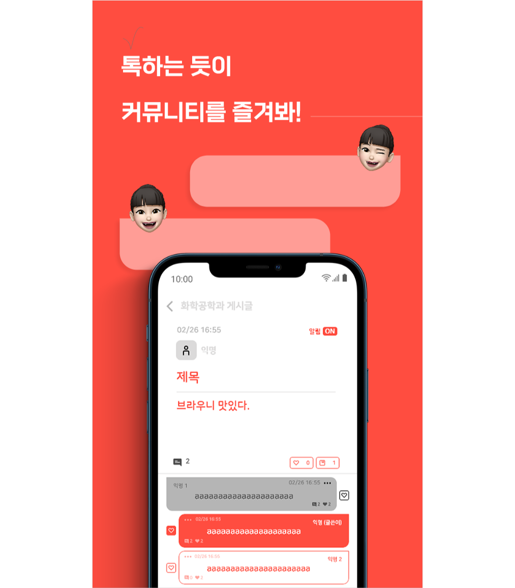
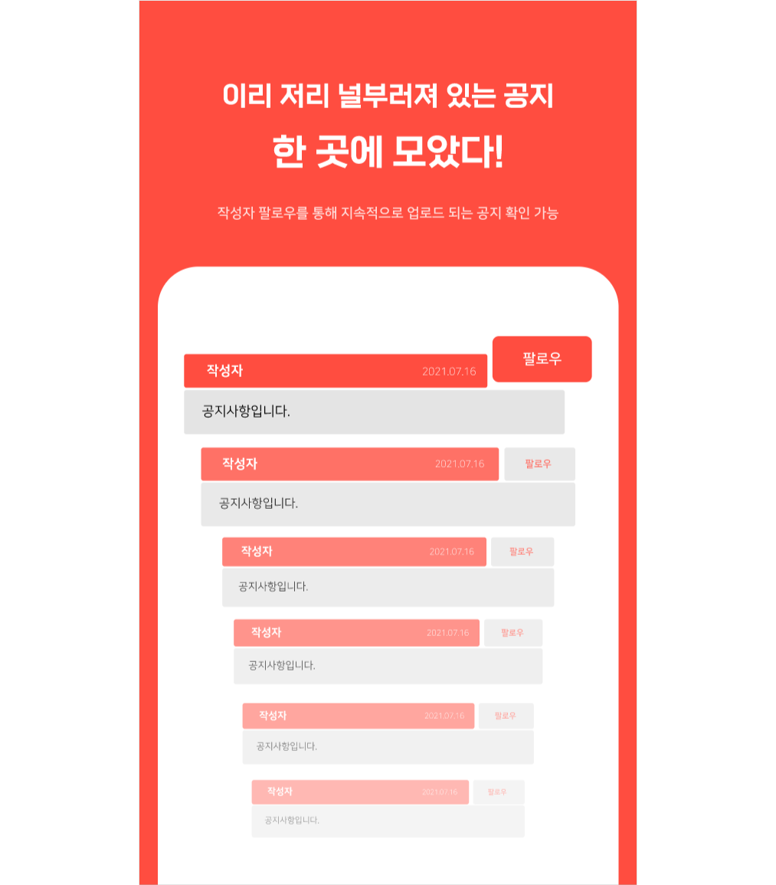

* [Github](https://github.com/khu-dev)
* [PlayStore 출시](https://play.google.com/store/apps/details?id=com.khumu.android)
* [프로젝트 및 팀 소개 페이지](https://khumu.oopy.io/)

학교 수업을 듣다보니 한 학기에 2개 3개의 프로젝트를 개발해야하는 경우가 있었습니다. 완전 개발이 처음이었던 시기에는 이러한
양적인 개발 속에서도 배울 점이 많았지만 어느 정도 지나고 나니 양적인 개발 속에서는 크게 배울 점이 느껴지지 않았고, 머리가 아닌
손으로 개발을 하고 있는 느낌을 받게 되었습니다.

따라서 저는 단순히 찍어내기 식의 개발을 반복하기 보다는 **한 서비스를 꾸준히 개발해나가며 그 속에 많은 생각을 담아내고자** 했습니다.
처음에는 가볍게 관심있던 기술들을 자유롭게 적용해볼 수 있는 **개발 놀이터**를 만들고자 하는 마음에 시작했고 제가 관심있던 기술들은 다음과 같았습니다.

* `Kubernetes`
* `Golang`을 이용한 서버 개발
* `TDD`
* `MSA`, `DDD`(Domain Driven Design)
* `ArgoCD`를 이용한 CD(Continuous deploy & delivery)

베프 하나와 함께 시작했던 서비스에서 기존에 친분이 없던 디자이너님, 개발자님들이 추가되면서 **리더로서 책임감이 조금 생겨나기도 했고,
기간이 길어지다보니 단순히 개발 놀이터보다는 출시를 해보자는 목표**를 갖게 되었습니다.

그리고 대부분의 코드를 오픈소스로 관리하고 있는데 개인적으로는 학생들이 실제 프로덕션 수준의 작업에 참여해볼 수 있는 경험이
많지 않은데 우리 **학교 학생들은 자신이 사용하는 오픈소스 서비스인 쿠뮤에 자유롭게 기여함으로써 실제 개발에 참여해볼 수 있는 기회의 장이 되었으면** 하는
꿈이 있습니다. 아무래도 학생들이 각자 다른 개발 언어와 관심사를 갖다보니 MSA를 선택한 것이 이 부분에 있어서는 좋게 작용할 수 있을 것 같네요. 

## 쿠뮤? 뭐하는 서비스지?

**쿠뮤는 공지사항 푸시 알림과 교내 커뮤니티를 주로 제공하는 서비스**에요!
경희대학교의 흩뿌려진 공지사항을 한 곳에서 조회할 수 있고, 새로운 공지사항은 선택적으로 푸시알림을 받아볼 수 있답니다.
또한 교내 커뮤니티로서 학교 인증이 학교 사이트와 연동되어 간편하고 다양한 주제에 걸쳐 학생들의 의견이 적극 반영될 수 있습니다.
보통의 커뮤니티는 게시판 형태로 구현되어 게시판을 하나 하나 찾아다녀야 하지만 **쿠뮤는 마치 인스타에서 해시태그들을 팔로우하듯
게시판을 팔로우 해두면 피드에서 자신이 팔로우 해둔 게시글을 모두 모아볼 수 있어요**.

## 내가 좋아하는 생각이 담긴 개발

저는 ~~단순하게 손으로 하는 개발~~보단 이런 저런 **생각들이 담겨있는 개발을 좋아하고 그에 대해 자유롭게 얘기나누는 시간을 사랑**합니다.
제가 쿠뮤를 개발하면서 했던 고민들과 그런 생각들을 어떻게 녹여냈는지 간단히 정리해보겠습니다.

#### 'RESTful하게 API를 개발해나가려면 어떻게 해야할까?'
`RESTful하다`는 말의 정의는 이곳 저곳 다들 다르게 표현하고들 있는 것 같지만 **HTTP method로 동작**을, **URL로 리스소**를 나타내는 점은 공통적으로 표현되는 특징인 것 같습니다.
그래서 `CRUD`는 Post, Get, Patch, Delete 등의 메소드와 연결되죠. 근데 분명 **CRUD와 깔끔히 맞아떨어지지 않는 작업들이 존재합니다!**

  관련 글
  * [How to design a REST API to handle non-CRUD operations?](https://softwareengineering.stackexchange.com/questions/323415/how-to-design-a-rest-api-to-handle-non-crud-operations) - Stack exchange
  * [REST API design for non-CRUD actions, e.g. save, deploy, execute code](https://stackoverflow.com/questions/41742926/rest-api-design-for-non-crud-actions-e-g-save-deploy-execute-code) - Stackoverflow

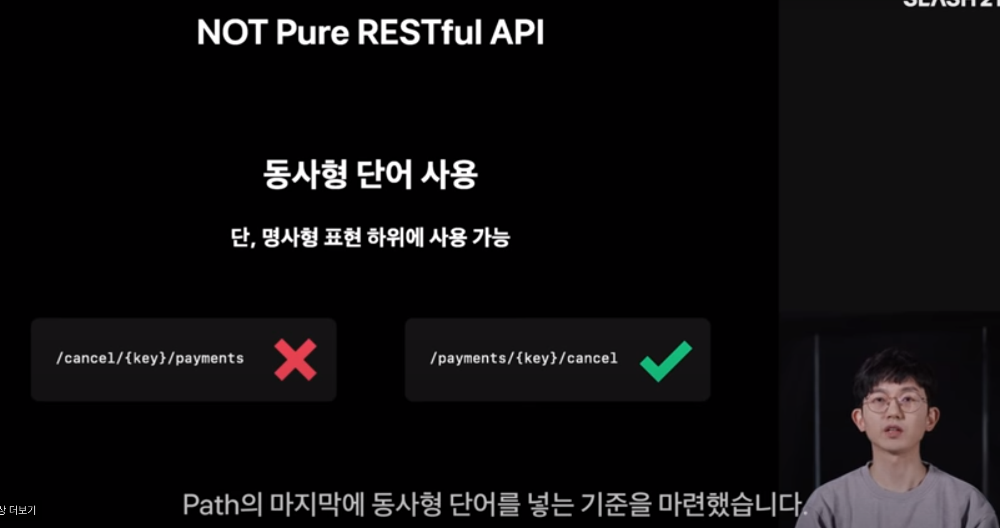
출처 - https://toss.im/slash-21/sessions/1-7

위와 같이 **토스에서도 RESTful하지 않은 API들에 대해 고민**을 많이 했던 것 같고 이 경우 다음과 같은 컨벤션들을 적용한 것 같습니다.

1. Path의 마지막에 동작을 나타내는 동사를 적용
2. 이런 API들은 POST 메소드를 이용

```
# 기존 방식
좋아요 생성 POST /likes {article: 1}
좋아요 삭제 DELETE /likes/{{like_id}}

# 개선한 방식
좋아요 POST /articles/1/like
좋아요 취소 POST /articles/1/unlike
```

실제 쿠뮤 작업을 예로 들자면 게시글에 대한 좋아요 작업 수행 시 위와 같이 API를 좀 더 직관적으로 개선했습니다.
기존에는 좋아요 기능을 구현하기 위해 like라는 리소스로 이용하면서 like 리소스에 대한 생성, 삭제에 맵핑시켰습니다.

하지만 이는 다소 기계적이고 API를 사용하여 개발하는 클라이언트(사람)입장에서는 와닿지 않을 수 있습니다. 
또한 클라이언트는 좋아요를 취소하려면 자신이 취소하고자 하는 좋아요 내역의 ID를 알아야하므로 불편하죠.

그래서 아래와 같이 API 형태를 개선했고, 클라이언트는 좀 더 편리하게 API를 이용할 수 있어졌습니다~!

#### 'API의 Latency를 줄이기 위해서는 어떻게 해야할까?'

개발을 하다보니 데이터가 그렇게 많은 것도 아닌데 어느 순간부터 **latency가 길다**는 느낌을 받게 되었습니다.
그래서 어떻게 latency를 줄일 수 있을까를 알아보게 됐죠.
주된 원인은 `N+1` 문제라고 불리는 DB Query가 이슈였던 것 같습니다. 
게시글을 여러 개 조회한 뒤 맵핑을 할 때 **게시글 하나 하나마다의 댓글 개수, 좋아요 개수, 북마크 개수 등을 순차적으로 조회하다보니
이 부분에서 병목이 발생**한 것이었어요!

저는 이 부분에서 `redis`를 적용해보았고 redis를 적용하자 상황마다 다르겠지만 대체로 **latency가 약 1/5로 줄어드는 효과**를 얻을 수 있었습니다.
redis를 적용하던 당시엔 N+1 문제와 그것을 Fetch join(혹은 Eager loading)로 해결하는 방법에 대한 인지 자체가 없었어서
redis를 적용했던 것 같은데 Fetch join으로도 글을 쓰면서 생각해보니 간단히 해결할 수 있었을 것 같긴하네요.

시간이 된다면 redis 뿐만 아니라 fetch join도 적용해서 더 최적화해볼 수 있으면 좋을 것 같아요. 그래도 redis를 써보면서
많은 것들을 배워볼 수 있었던 것 같아 재미있었습니다! ㅎㅎ

#### 'MSA에서 관심사/책임 분리를 어떻게 할 수 있을까?'

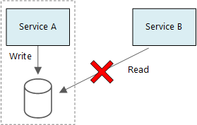

출처: [마이크로 서비스에 대한 데이터 고려 사항 - 마이크로소프트 블로그](https://docs.microsoft.com/ko-kr/azure/architecture/microservices/design/data-considerations)

처음 쿠뮤를 설계하면서 MSA를 도입하고자 했을 때는 어떻게 마이크로서비스를 나눠야할까에 대한 고려가 거의 없었던 것 같습니다.
지금은 DDD를 공부하며 높은 응집도와 독립성을 취하면서 서비스를 나누는 게 좋겠다는 생각이 들지만 당시엔 그냥 나누고 싶은 대로 나눠버렸던 것 같습니다.
약간 오버 엔지니어링이 될 수 있는 설계를 한 것은 그렇다치고 그 속에서 서비스들을 구현해 나갈 때에도 실수했던 것이 하나 있습니다. 바로 위의 사진처럼 다른 서비스가 하나의 DB를
바라보면 안된다는 원칙을 어긴 것인데요.

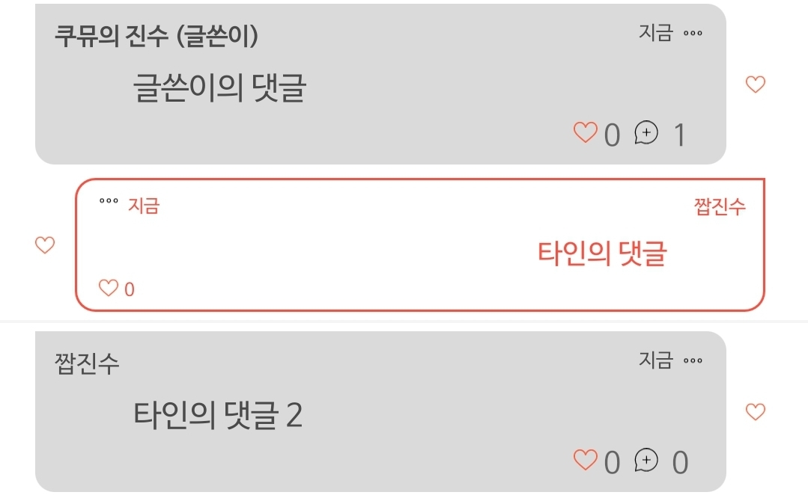

예를 들어 **게시글 서비스와 댓글 서비스가 분리되어 있을 때 위의 이미지와 같이 어떤 댓글의 작성자가 해당 게시글의 작성자와 일치하는지에 대한 정보가 필요하다**고 가정해봅시다.
기존에는 댓글 서비스가 게시글 DB를 직접 조회해서 `article.author`와 `comment.author`를 비교했습니다. 하지만 이렇게 **분리된 서로 다른 서비스가
같은 데이터에 접근하는 형태는 MSA에서는 매우 안 좋게 평가되는 안티 패턴**입니다.

따라서 저는 댓글을 조회할 때 게시글 서비스에게 게시글 정보를 조회해 `article.author`와 `comment.author`를 비교할 수 있도록 했습니다.
만약 **게시글 서비스가 비정상으로 동작하더라도 댓글 서비스에는 큰 타격 없이 댓글 작성자가 게시글 작성자와 일치하는지 정보만 false로 처리**될 뿐입니다.

아마 더 고도화된 형태는 댓글 서비스에서 자기 서비스만이 이용할 게시글 작성자 정보 테이블을 설계하거나 덜 정규화한다면 댓글마다 게시글의 작성자 id도 기입하는 방식을 이용할 수 있을 것 같아요.
하지만 그런 형태를 적용하기 이전에 우선은 좀 더 latency가 길 수는 있지만 간단히 마이크로서비스간에 동기적으로 통신(게시글 작성자 정보를 댓글 서비스가 API로 직접 호출)하는 방식을 적용해봤습니다.

#### '어떤 서비스를 이용해 빌드/배포를 자동화할까?'

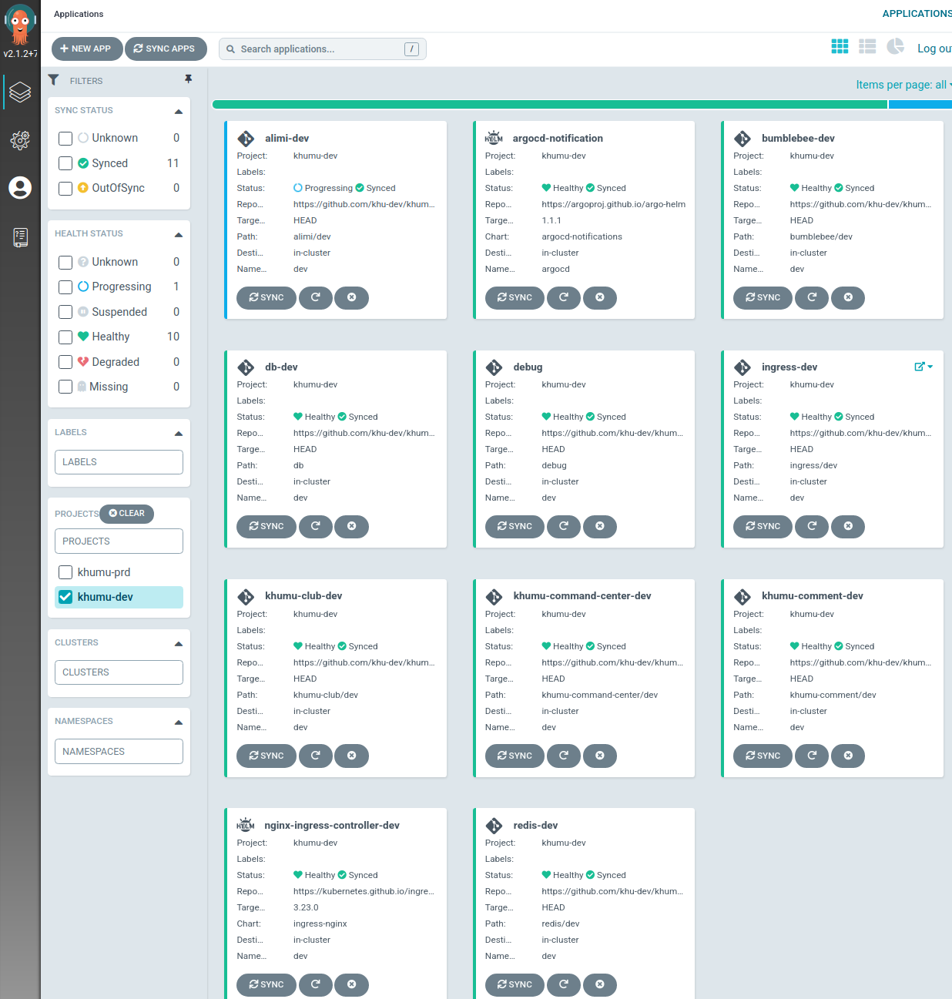

과거에는 배포 도구로서 `Spinnaker`를 주로 사용했지만 Spinnaker는 그 관리 리소스가 만만치 않게 든다는 생각이 들었습니다. `Jenkins`나 그 외의 서비스들과 연동시켜 하나의 Pipeline을
만드는 데에는 Spinnaker가 적합했지만 꼭 그런 연동 작업이 필요가 없다면 굳이 Spinnaker를 사용할 필요가 없을 것 같았습니다.

* [실용주의 데브옵스 for MSA - 카카오테크](https://tech.kakao.com/2021/07/16/devops-for-msa/)
* [CI/CD 도구 및 방법론 도입기 - 메쉬코리아, VROONG](https://mesh.dev/20210208-dev-notes-002-ci-cd/)
 
그래서 위의 글들에도 소개되는 평소 관심 있던 **`ArgoCD`를 배포 도구로 선택**했고, 오픈소스로서 관리되는 프로젝트이다보니 Github 내에서 많은 작업이 이루어지므로
**CI는 `Github Action`을 이용**하기로 결정했습니다.

그리고 Spinnaker를 사용했을 땐 Helm 차트를 통한 배포가 막 지원되던 시기였어서 버전 문제인지 버그인지 Helm 차트가 잘 적용이 안됐던 이슈가 있어
정말 아쉬웠는데요. **`ArgoCD`는 kustomize나 Helm을 적극적으로 지원하고 있는 것 같아 Helm으로 배포하는 것도 너무나 편리**했어요.
지금은 Kubernetes의 `Nginx Ingress Controller`나 `ArgoCD Notification` 같은 서비스들은 Helm으로 배포/관리하고 있답니다. 


## 프로젝트 리드와 팀원들간의 의사소통

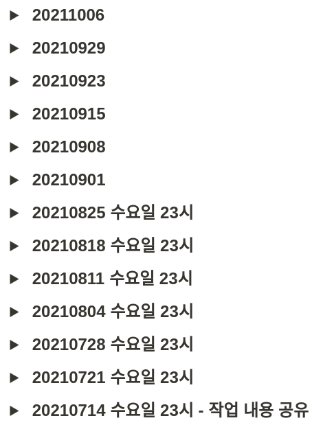
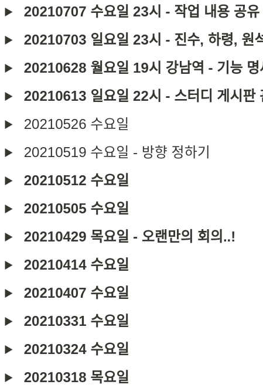
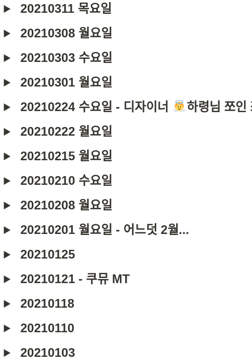
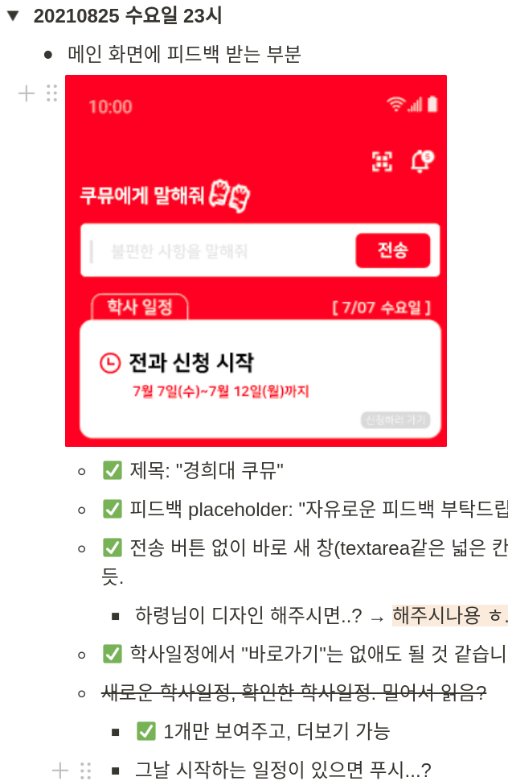

저희 팀은 주로 노션을 통해 회의 내용 기록 및 진행 사항 공유를 하고, 회의는 디스코드로 진행했습니다.
이렇게 보니 해당 페이지에 기록하기 전까지 합하면 딱 **1년** 정도 된 것 같네요 벌써..! 시간이 참 빠른 것 같아요 ㅎㅎ

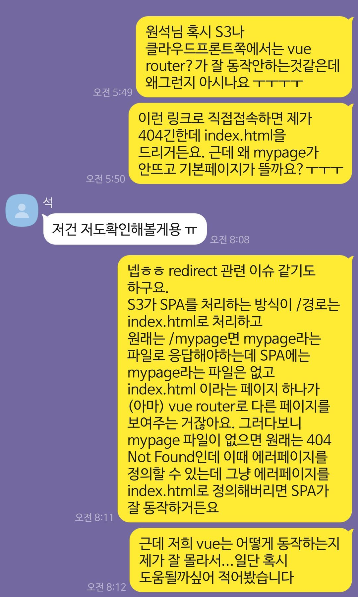
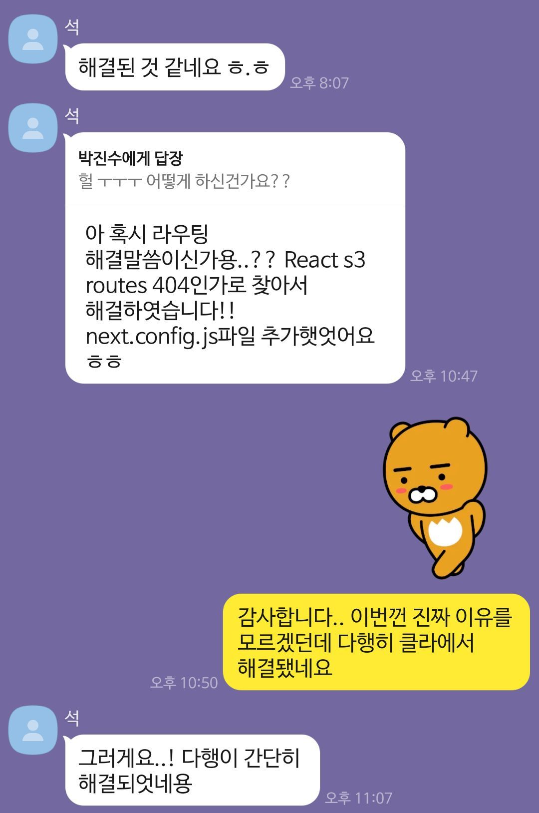

디스코드로 회의하기 힘든 상황엔 자유롭게 카톡으로 이슈를 공유하기도 합니다. 얼마 전에 운영 환경을 구축하면서 `S3` + `CloudFront`를 구축할 때
겪은 이슈 관련 톡을 가져와 봤습니다. 특히 서로 포지션이 다른 경우 **이슈에 대해 자세히 묘사**하려 노력하고 **팀원의 작업에 항상 감사**를 표하는 걸 잊지 않으려
노력하고 있어요. 코로나와 거리 상의 문제로 한 번도 뵙지 못한 팀원들도 계시지만 나름 내적 친밀감이 많이 쌓인 것 같아요 ㅎㅎ
꼭 쿠뮤가 아니라도 기회가 된다면 앞으로도 같이 작업하거나 만나뵙고 싶기도 합니다.

## 앞으로의 미래..?

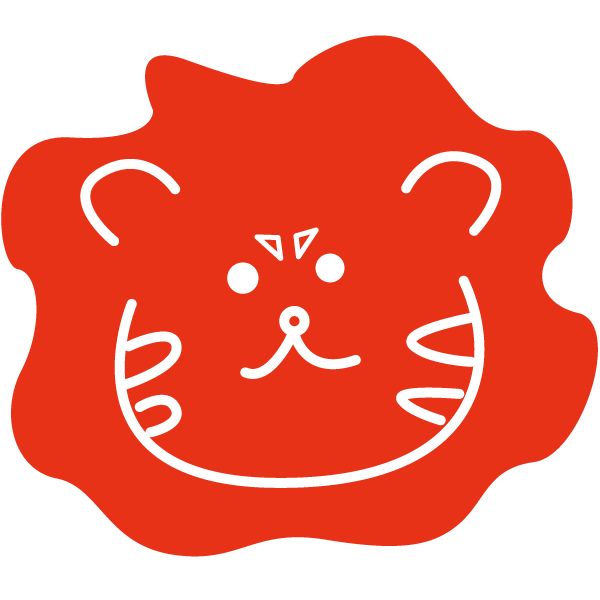

사실 개발 놀이터로 시작한 주제라서 그렇게 참신하지도 않고, 대학생 커뮤니티에는 에브리타임이라는 큰 장벽이 있어서 우리 서비스의 미래가 어떻게 될 지는 모르겠습니다.
처음엔 커뮤니티 기능을 주기능으로 밀어붙여 개발했던 반면 활성 유저가 별로 없을 경우를 고려하니 커뮤니티보다는 공지사항과 학사일정을 편리하게 전달할 수 있는 기능이
더 우선시 되어야할 것 같았어요. 그래서 그 부분들을 보완하여 MVP를 출시 준비 중이고 이후 다양한 피드백을 받아보면서
계속해서 디벨롭해나갈지 유지만 할 지 팀원들과 상의해봐야할 것 같긴 합니다.

그래도 대학교를 졸업하기 전에 이렇게 길게 한 프로젝트를 진행해볼 수 있었던 것도 뿌듯하고 팀원들과 꾸준히 협업해나가는
경험을 할 수 있었던 점, 다양한 이슈를 맞이하고 해결할 수 있었던 점에서 서비스의 미래가 어떻게 되든 소중한 경험을 한 것 같습니다.

쿠뮤 팀원들 모두 꽃길 걷고 행복했으면 좋겠습니다~! 화이팅!!!