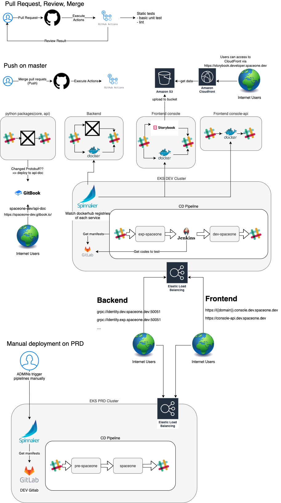

## Github Action을 사용하게 된 배경

저희 팀은 원래 CI용으로 `Jenkins`를 사용했습니다만 팀이 개발 중이던 서비스가
오픈소스가 목표인 프로젝트였고, Github Action이 빠르게 발전해나가면서
비용도 무료가 되었고, 좋은 Action들이 많이 생겨나고 있었기에
어느 정도 프로젝트 구조가 잡힌 뒤에는 Github의 Public Repository로 프로젝트를 관리하고
Github Action을 CI 도구로 채택하게되었습니다. Integration Test를
제외한 모든 빌드 및 일부 배포를 Github Action을 이용하게되었고, 대부분의 배포에는 사용하던대로
Spinnaker을 이용했습니다.

## Github Action vs Jenkins

이 부분 역시 느낀 점 위주로 요약해보겠습니다.

| Github Action   | Jenkins |
| --- |--- |
| 내가 서버를 관리할 필요가 없다.   | 내가 직접 master을 띄우고, slave를 띄워우고, 관리해줘야한다. |
| VM이 배치되어 제공되는 데에 좀 시간이 든다. 내 커스텀 이미지를 사용할 수가 없다보니 반복되는 패키지 설치나 환경 설정을 매번 해야해서 좀 느리다.| 내가 필요한 Plugin을 설치해놓거나 설정을 입력해 놓으면 매번 빌드할 때 따로 제공할 필요 없다. |
| Code로 관리가 가능하다! 처음엔 조금 어려울 수 있지만, 알고 나면 쓰기 너무 쉽다. | 처음 접한 사람이 사용하기에는 Github Action보다 편리할 수 있지만, 그렇다고 훌륭한 UI/UX는 아닌 듯 하다. |
| 요즘 핫하고, 빠르게 발전 중이다. | 구식이다. |

비용이 저렴하게 풀리고 있고(퍼블릭의 경우 아마 무조건 무제한 공짜),
원래 지원하지 않던 매뉴얼 트리거가 2020.07부터 제공되기 시작했다는 점,
누구든 오픈소스로 Github Action에서 남들이 사용할 수 있는 action 을 만들 수 있다는 점등을
보고 Github Action이 빠르게 발전 중이라는 생각이 들었습니다.

## 그래서 어떤 CI/CD를 자동화하였나요?

chart by Jinsu Park

세로로 길어서 좀 보기 불편하실 수도 있는데, 위의 차트가 저희의 깃헙액션에 대한 차트입니다.
레포지토리마다 조금씩 다른 부분이 있고, 프론트엔드의 경우 파이프라인이 다양했는데, 우선 백엔드의
깃헙액션 및 CI/CD 진행 방식에 대해 요약해보겠습니다. (Chart를 작성한 지가 좀 돼서 설명과 조금
다른 부분이 있을 수도 있습니다.)

개발 스프린트 진행 시에는 아래와 같이 진행되었습니다. (\<상황 설명\> => \<Github Action 수행 내용\> 형식으로 나했습니다.)

1. 개별 Fork 후 Master Branch에 Pull Request => lint, basic unit test 진행. 통과된 PR만 Merge열
2. Master에 Merge 혹은 Commit이 Push됨 => CI Action이 실행됩니다.
3. 개발용 docker registry 에 업로드
4. 해당 registry에 업로드 된 것을 감지하고 `Spinnaker`가 Experiment 환경에 배포
5. Experimental 환경을 이용해 `Jenkins`가 Integration Test를 진행
6. Integration Test 성공 시에 Dev 환경에 배포.

이후 스프린트 막바지 QA 기간에는 Experiment, Dev 환경이 주로 QA 환경으로 사용되었고,
파이프라인은 다음과 같았습니다.

1. 검증이 어느 정도 끝난 커밋에 대해 Git Tag를 `{{VERSION}}-rc{{RC_NUMBER}}` 형태로 달아 푸시 - Github Release가 생김
=> 도커 이미지 빌드 후 Production Docker Registry에 이미지 업로드
=> tag가 달린 커밋을 기점으로 자동으로 버전 명의 브랜치를 만듦.
2. Production Docker Registry의 업로드를 감지하고 Dev에서 손수 QA 진행
3. 문제가 있을 경우 rc number를 올려서 다시 태그를 달고 업로드 후 재차 QA
4. 문제가 없을 경우 해당 태그를 바탕으로 rc를 지우고 실제 버전으로서 태그를 달아 푸시 => 다시 업로드
5. Production은 매뉴얼 배포.

## Github Action을 다뤄보면서 느낀 점

처음에는 Github Action에 그렇게 만족을 하지 못했습니다. 초기에는 Manual Trigger가 지원되지
않았던 데다가, 가뜩이나 Github Action을 잘 몰랐기에 한 번 Github Action을 수정하여
테스트 하고싶을 때 마다 커밋을 하나씩 날려야했던 게 불편했고, 브랜치를 따로 만들거나 fork를 떠서 Github Action 테스트 후
해당 `workflow`만 마스터에 머지하는 방식 등등 다양한 방식을 사용했었는데, 어느 정도 익숙해지고 Github Action에
Manual Trigger도 등장하게 되면서 꽤나 만족도가 높아졌습니다.

`Jenkins`와 달리 제가 서버를 이용하지 않아도 된다는 점도 맘에 들긴했는데, 종종 Github 서버가 죽는 일이
발생해서 난감했던 적이 있긴합니다.

하나 재미있었던 점은 Github Action을 이용하면서 저희의 `CI/CD` 전략이 꽤나 고도화되었는데,
그 과정에서 팀원들과 자유롭게 의사소통하는 과정이 재미있었고, 저 또한 자유롭게 의견을 나눌 수 있었던 경험을 할 수 있었다는 것입니다.

후에 저희 `SpaceONE`의 CLI API 클라이언트인 `spacectl`의 설계에도 `Github Action`의 구조를 모티브삼았는데
이때에도 Github Action에 대한 지식이 많은 도움이 되었고, 퇴사 후에도
개인적인 Github 활동을 하면서 자유롭게 Github Action을 사용할 수 있었기에
든든한 개발 도구를 얻은 느낌입니다. 코드로 제가 하고싶은 것을 뭐든 정의할 수 있고,
만들어져 있는 작업은 편하게 가져다 쓰면 되기 때문에
빌드나 배포에 관해 재미있는 번뜩이는 아이디어가 있을 때 바로 바로 적용할 수 있고, 실제로 현재의 `Github Page`도
`Github Action`을 통해 다양한 트릭을 이용할 수도 있었고,
빌드 후 배포 또한 자동화 되어있습니다!