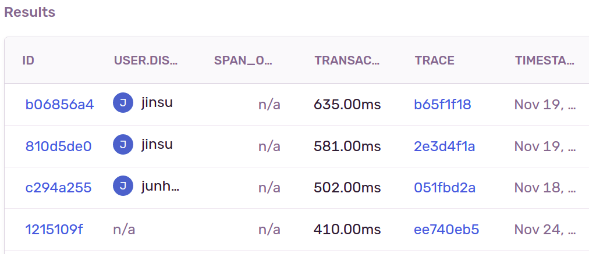
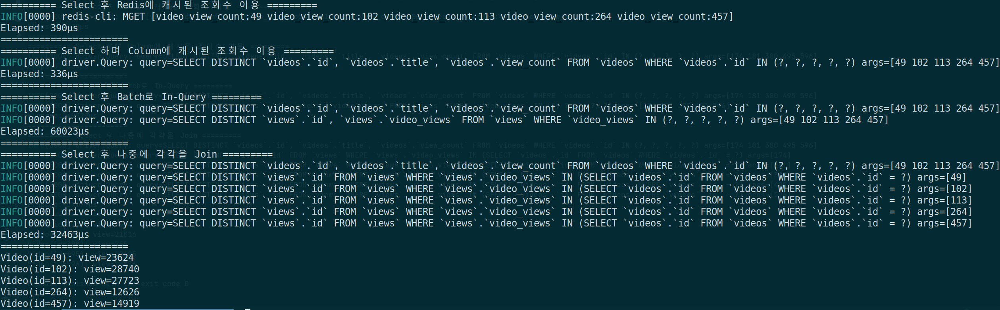
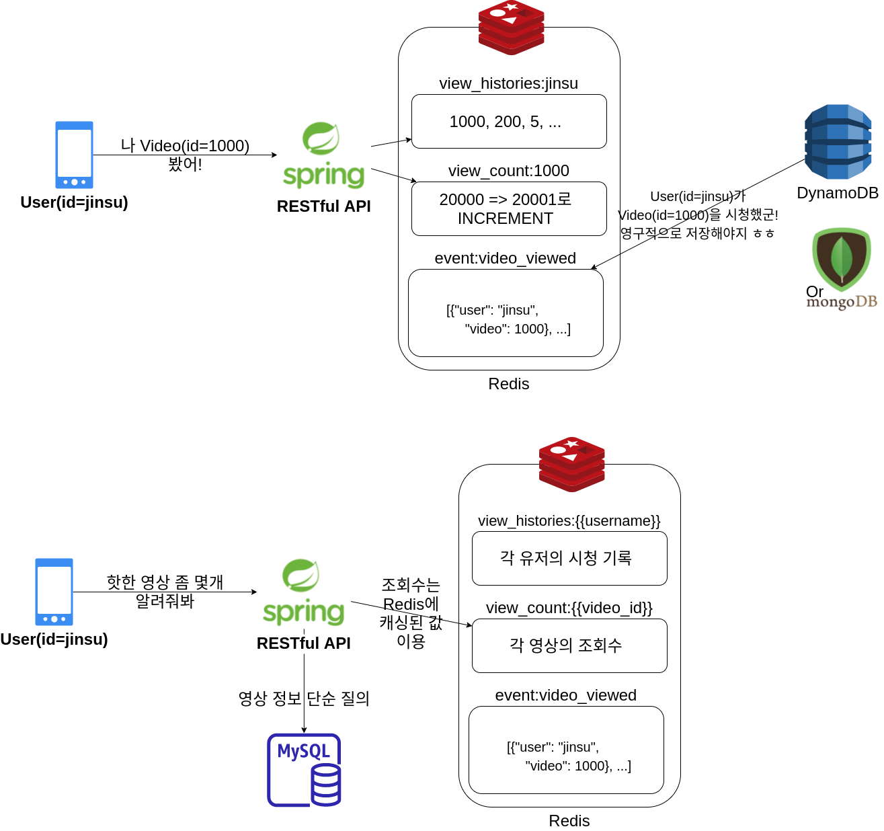

## 시작하며

**짧은 영상을 바탕으로 배틀을 할 수 있는 서비스를 `Spring Boot MVC` + `JPA`로 개발**하던 중 위와 같이 API **Latency가 처참하게도 느린 요청**들이 감지되기 시작했습니다. 그동안은 쿼리 최적화보다는 로직 개발이 더 우선시하다보니 쿼리 최적화를 미뤄왔는데,
이번 기회에 이에 대해 다뤄보려합니다. 간단하게 코드를 짜서 테스트해보느라 Go 언어를 이용했지만 **JPA를 이용하든 뭘 이용하든 문제와 그에 대한 해결책의 요지는 동일할 것**입니다. 

아무래도 백엔드에서 API를 개발하면서 파일 데이터를 주고 받는 게 아니라면 주로 Latency가 늘어나는 이유는 다음과 같을 것입니다.

* 너무 많은 Write
* 불필요한 Column(필드) 혹은 관계를 Eager Loading. 추가적으로 경우에 따라 **N+1 쿼리 문제** 발생
* 필요한 Column(필드) 혹은 관계를 뒤늦게 Lazy Loading. 추가적으로 경우에 따라 **N+1 쿼리 문제** 발생
* **요청마다 매번 수행되는 Join이나 일종의 연산들**

> `N+1` 쿼리 문제? - N개의 데이터를 조회한 경우, 각 데이터들의 연관 관계를 추가적으로 조회하기 위해 한 번씩 더 조회해야하는 문제... 아주 악명 높은 문제로 자료를 쉽게 찾아볼 수 있다.

사실 어떻게 보면 N+1 쿼리 문제가 워낙 악명이 높아 그에 대한 해결책들도 간단하게는 많이 소개되는 것 같기도 합니다. 따라서 이번 글에서는 조금은 특이하게 **조회수나 댓글 개수처럼 일종의 Count 기능이 필요한 경우의 N+1 쿼리 문제나 요청마다 매번 수행되는 Join이나 연산들로 인한
오버헤드들을 줄여 최적화**하는 방법은 어떤 것들이 있을지에 대한 제 고민을 소개해보려 합니다.

**_(이 글은 RDB를 메인 DB로 사용하는 경우를 기준으로 작성했습니다.)_**

## 영상 조회수 같은 Count 성격의 값에 대한 작업을 최적화하지 않으면?!

* 쏟아지는 영상 조회 이벤트마다 RDB에 데이터를 Write => RDB에 너무 큰 부하
* 매번 특정 영상과 관련된 조회 내역을 RDB에서 Join 후 그 개수를 계산 => RDB에 부하, 느린 작업
* RDB에 영상 조회 이벤트를 Write할 때 영상 정보 테이블에 view_count 컬럼을 추가한 뒤 view_count 컬럼에 조회수를 캐시 => 캐시 정확도 문제, 테이블 정의 변경 필요

영상 조회수 같은 Count 성격의 값을 최적화해주지 않으면 위와 같은 문제들이 발생할 수 있다고 봅니다.

따라서 영상 조회 이벤트처럼 쏟아지는 데이터는 너무 많은 Write 요청은 RDB가 아닌 NoSQL을 사용하는 게 좋을 수 있을 것입니다.

하지만 NoSQL에 영상 조회 이벤트를 저장한다 해도 매번 영상 조회 내역을 가져온 뒤 그 개수를 계산하는 방식은 어떤 DB를 사용하던 불필요한 Read도 많이 발생할 것이고, 당연히 느리겠죠. 만약 어떤 영상의 조회수가 10만인 경우 10만개의 이벤트들을 조회한 뒤 그 개수를 이용해야할테니 말입니다.
경우에 따라서는 영상 조회 시 각 영상에 대한 조회 내역을 추가적으로 조회하게 되는 N+1 쿼리 문제를 겪을 수도 있습니다.

따라서 **`view_count` 같은 column을 추가적으로 두는 건 어떨까**싶기도 합니다만 일반적으로는 **동시성 이슈로 인해 view_count의 정확도가 떨어지게 될 것**입니다. 또한 **스키마가 강요되는 RDB의 특성에 의해 테이블 정의가 변경되어야할 수도 있습니다**.

> 동시성 이슈 - 만약 100명의 유저에 대한 영상 조회를 동시에 처리하는 경우 100개의 스레드는 모두 view_count=0 으로 조회를 한 뒤 자신의 조회 이벤트로 인한 +1을 더해 view_count=1로 업데이트 커맨드를 날리겠지만 사실 view_count는 1이 아닌 100이 되어야 정확한 것이다.

## Redis를 도입해보면 어떨까

`Redis`는 메모리를 기반으로하는 Key-Value 형태의 NoSQL라서 일반적인 RDB에 비해 아주 빠르면서 싱글 스레드 기반이기 때문에 정확한 Count와 Increment가 가능합니다. 따라서 아까 발생했던 문제들을 다음과 같이 해결할 수 있을 것입니다.

* 쏟아지는 영상 조회 이벤트마다 RDB에 데이터를 Write 

  => ~~RDB에 너무 큰 부하~~ (X), **빠른 Write** (O) 
* 매번 특정 영상과 관련된 조회 내역을 RDB에서 Join 후 그 개수를 계산
  
  => ~~RDB에 부하, 느린 작업~~ (X), **Redis에 최근 조회 내역을 저장**, 상황에 따라 NoSQL에서 Replicate해서 영구화하는 것도 좋음 (O)
* RDB에 영상 조회 이벤트를 Write할 때 영상 정보 테이블에 view_count 컬럼을 추가한 뒤 view_count 컬럼에 조회수를 캐시
  
  => ~~캐시 정확도 문제~~ (X), **Redis의 싱글스레드 기반의 정확한 계산**
  
  => ~~테이블 정의 변경 필요~~ (X), **NoSQL의 유연함** (O)

이런 이유로 인해 추후에 **조회수나 댓글 수, 팔로워 수 등등에 대해 Redis를 이용하면 어떨까 싶은 생각이 드네요~!** 그럼 실제로 앞서 소개했던 문제 상황이나 해결 방법들이 각각 성능이 어떨지 직접 데이터와 쿼리를 이용해 실험해보겠습니다.

## 실제 실험을 통해 각각의 방식 성능 비교

### 상황 소개

* Local에서 Redis container, MySQL container을 이용. Go언어로 가볍게 애플리케이션 작성
* MySQL의 Video 테이블에 1000개의 영상 데이터 존재. 조회수를 캐시해놓은 view_count 컬럼 존재.
* MySQL의 View 테이블에 약 2천만 개의 조회 내역 존재.(즉 영상 당 수천개의 조회 내역 존재) 인덱스는 잘 걸어놓음.
* Redis에 `key=video_view_count:{{video_id}}`, `value={{view_count}}` 형태로 view_count 캐시
* **랜덤하게 5개의 영상에 대한 정보를 제공할 것인데 이때 조회수도 포함되어야한다.**

### 비교할 방식들 소개

* **Select 후 Redis에 캐시된 조회수 이용**
  * 영상에 대한 정보 자체는 Video 테이블을 이용해 Read
  * 조회수는 Redis에 캐시된 값을 MGET을 통해 배치(벌크)로 조회해와서 이용
* **Select 하며 Column에 캐시된 조회수 이용**
  * 영상 정보와 조회수 모두 Video 테이블을 통해 바로 Read 
* **Select 후 Batch로 In-Query**
  * JPA를 이용하면서 흔히 발생했던 N+1 쿼리를 Batch로 해결할 때와 동일하게 Video 테이블 조회 후 View 테이블에서 view.id in (?,?,...) 의 형태로 In-Query를 이용 
* **Select 후 나중에 각각을 Join**
  * N+1 쿼리 문제 그 자체..!

### 실험 결과

1. 🥇 **Select 하며 Column에 캐시된 조회수 이용**
2. 🥈 **Select 후 Redis에 캐시된 조회수 이용**
3. 🥉 **Select 후 나중에 각각을 Join**
4. **Select 후 Batch로 In-Query**

우선은 어떤 쪽으로든 캐싱을 이용하는 게 참 빠르구나 싶었습니다. 하지만 조금 의아할 수 있는 부분들도 존재하는데요.

1. **Redis에 조회수를 캐싱한 경우보다 MySQL에 캐싱한 경우가 더 빠르네..?**

어떻게보면 당연하겠지만 **MySQL에서 Join 없이 view_count를 조회할 수만 있다면 Redis를 거치는 것보다 MySQL만으로 처리하는 것이 더 빠를 것**입니다.

하지만 Redis를 사용하는 이유가 Read 속도때문만은 아닐 것입니다. 앞서 말씀드린 대로 **싱글 스레드 기반의 정확한 count**가 가능할 것이고, RDB의 **테이블 스키마를 변경할 필요도 없죠**.

그리고 무엇보다 영상 조회 이벤트 발생마다 RDB의 특정 row의 조회수를 +1 하여 update 하는 것보다는 redis에서 increment하는 것이 빠를 것입니다! 즉, **write까지 고려하면 속도 측면에서도 redis가 빠를 것**입니다.

2. **N+1 쿼리 문제를 야기하는 방식이 Batch로 In-Query하는 방식보다 빠르네..?**

이 부분은 정확한 원인은 모르겠지만 아마 추측컨대 Batch 방식으로 한 번에 몇 만개 수준의 너무나 많은 데이터를 카티션 곱으로 조회한 뒤 각 video의 조회수 내역으로 넣어주려다보니 조회 후 연산이 많은 시간을 잡아먹은 게 아닐까 싶습니다.
반면 N+1 쿼리 방식은 각 video에 대해 한 번씩 쿼리한 뒤 바로 그 결과 count 할 수 있으니 이런 특수한 경우(데이터가 엄~청 많은 경우)에는 오히려 Batch 방식이 느릴 수 있는 게 아닐까 싶습니다.

실제로 조회수가 약 10개 정도인 영상을 똑같이 5개 조회해보니 우리의 일반적인 예상대로 Batch 방식이 N+1 쿼리보다 빨랐는데요! 아마 카티션 곱이 일어났지만 양 자체가 적은 쿼리 결과를 처리하는 것이 redis와의 N번의 통신이 더 느리기 때문이 아닐까 싶습니다.

## 조회수를 위해 가장 이상적인 아키텍쳐는?!

실험 결과에서도 Redis를 사용하는 것이 나쁘지 않은 것으로 보여집니다. 그래서 저라면 정말 이런 식으로 **최적화를 해볼 수 있는 기회가 있다면 Redis를 도입**해볼 것 같습니다. 그 동안 수없이 고통받아왔던 N+1 쿼리 문제도 어느 정도 해결할 수 있겠죠?!
**불필요한 양방향 연관 관계는 최대한 단방향 연관 관계로 제한하고, Count가 필요할 때 각 엔티티마다의 특정 Count 값을 위해 N번의 쿼리를 수행할 필요도 없어질 것**입니다.

하지만 Redis를 도입한다고 만사가 해결되는 것은 아닐 것입니다. Redis는 영속성이 보장되지 않으므로 영상 조회 내역이 증발해버릴 수도 있고, 양이 한정적일 수 있죠. 그래서 저는 단순 Redis 뿐만 아니라 다음과 같은 방식은 어떨까 생각해보고 있습니다.

* **최근 영상 조회 내역**은 `view_histories:{{username}}` 형태의 key, `{{video_id}}` 형태의 value로 1차적으로 Redis에 저장한다. **조회수**는 `view_count:{{vide_id}}` 형태의 key, `{{view_count}}` 형태의 value로 Redis에 캐시한다.
  * 최근 영상 조회 내역을 redis를 통해 빠르게 읽고 쓸 수 있다.
  * 영상 조회수를 Redis의 Increment로 비교적 정확하게 계산할 수 있다.
  * 유저의 최근 영상 조회 내역을 각 유저별로 TTL을 걸 수 있다. => Redis 메모리 절약
  * 영상의 조회수를 영상별로 TTL 걸 수 있다 => Redis 메모리 절약
* 영상 조회 이벤트 저장 시 Redis의 `event:video_viewed` 라는 key의 List에 앞서 언급한 조회 내역과 동일한 조회 내역을 저장한다.(메시지 큐에 Enqueue하는 느낌)
  * SQS 같은 Message queue는 조회수 이벤트가 쏟아지는 것에 비해 latency가 느림. 따라서 Redis를 큐로 사용하는 것도 괜찮아보임. 
* Redis `event:video_viewed` 라는 List에서 조회 이벤트를 뽑아 서버리스한 NoSQL인 DynamoDB에 유저의 조회 내역을 영구적으로 저장한다.
  * 영상 조회 내역을 redis에 캐시할 뿐만 아니라 영구적으로 저장하기 위함.
  * 마치 Redis를 버퍼, Write-back cache로 이용하는 느낌인데 NoSQL이라해도 주기적인 Bulk write은 주기때마다 부담될 수 있음. 그리고 조회 이벤트는 계속 계속 빠르게 확장될 수 있기 때문에 NoSQL 중에도 서버리스인 DynamoDB를 사용하면 어떨까 싶음. (주의: DynamoDB 안써봄...) 

(단 위의 아키텍쳐는 제 개인적인 생각일 뿐, 실제로는 어떻게들 사용하시는지 궁금하네요..! 이렇게 직접 한 필드에 대해 복잡한 방식을 이용하기보단 좀 더 단순히 캐싱 프레임워크를 이용하는 것도 좋은 선택지일 수도 있을 것 같구요.)

## 마치며

이렇게 Count 성향의 작업을 어떻게 최적화할 수 있을지 상상과 실험을 통해 정리해봤습니다. 중요한 것은 하나의 정답이 존재하는 것이 아니고, 처한 상황마다 천차만별의 솔루션들이 있을테니 각각을 잘 비교해보고 잘 PoC 한 뒤 사용하는 것인 듯합니다.

캐시나 Redis에 대해 관심이 많은 편이지만, 아직 많이 부족하다보니 좋은 말씀 댓글로 달아주시면 감사히 배워나가겠습니다~! 감사합니다.

