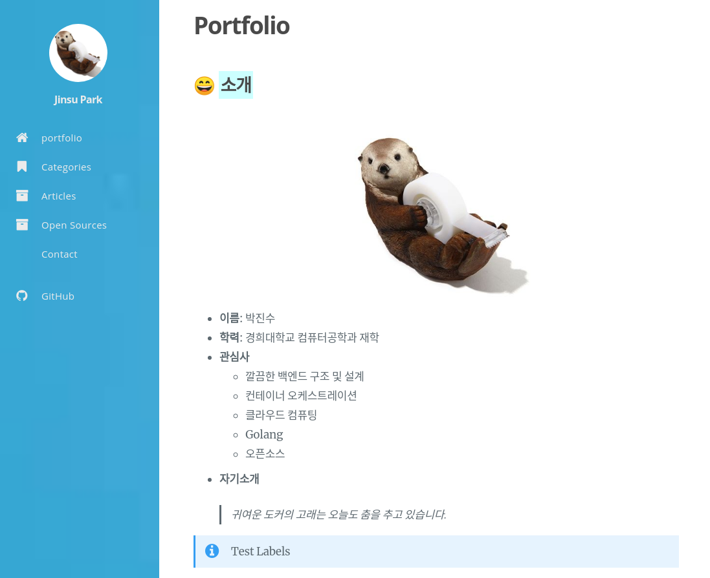

# [umi0410.github.io](https://umi0410.github.io)

* themes/hugo-tranquilpeak-theme에서 landing page가 블로그 형식으로 되어있어서 이 부분을 따로 수정했음
  * `themes/hugo-tranquilpeak-theme/layouts/index.html`
    ```html
    {{ $paginator := .Paginate (where .Site.RegularPages "Title" "Portfolio") }}
    {{ range $paginator.Pages }}
        {{ .Render "single" }}
    {{ end }}
    ```
  * submodule을 통해 theme을 깔끔하게 이용하고 싶었지만, 수정사항을 적용하려다보니 단순 clone을 이용하게됨.

* 개발은 dev 브랜치에서
* 배포 자동화
  * branch:dev에서 게시글 작성
  * branch:dev에 push할 경우 Github Action을 통해 빌드
  * 빌드된 파일은 branch:master에 배포~!
* 재미삼아 개발 중~!

## Refs

* [Docs: kakawait/hugo-tranquilpeak-theme](https://github.com/kakawait/hugo-tranquilpeak-theme/blob/master/docs/user.md)
* [Docs: Hosting hugo on github](https://gohugo.io/hosting-and-deployment/hosting-on-github/)